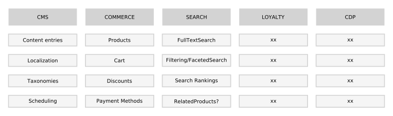
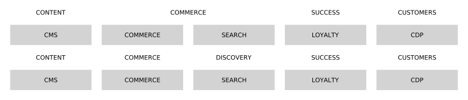
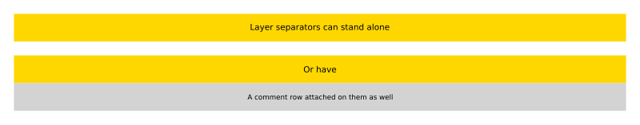
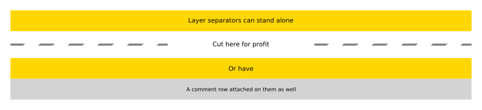

# Tooling for Diagrams

Building and maintaining diagrams is hard. People tend to spend a considerable amount of time on creating shapes, aligning and re-aligning so that the output looks great; in a lot of cases using tools like presentation tools that are not a good fit for this kind of task.

Recognizing this, we've decided to try an approach where some specific kinds of diagrams are described as data and the visualization is generated, pixel-perfect aligned and easily used and reused further.

This approach has several benefits, including:
- saving significant time on creating the visuals
- having a standard look'n'feel to these diagrams
- making it possible to treat diagram data in exactly the same way as code, store in a repo, version control, branch, merge, diff, etc.
- opening the possibility to generate diagram data from other data sources: the input is just a json that can be generated even

## Approaches to diagramming

There are two main schools of though when talking about turning data into diagrams:
- the "semantic" approach involves creating a semantic model of the information we'd like to display and the role of the generator is to find the right layout, visual elements and rendering to best represent the information in a visual way. Most charting tools fall into this category, as well as software class-hierarchy visualization generators
- the "layout-centered" approach is much simpler, the diagram data does not represent any full or consistent model of some reality, instead it simply serves as a set of instructions to a smart "drawing machine". In this case, one does not need to model, just imagine the desired visual outcome and describe it directly


While both approaches have clear benefits, we've decided to implement at tool that is strictly "layout-centered": the diagram data will not try to model the meaning of the different boxes, layers and groupings, it will simply describe a layout.

## The Mach diagrammer DSL

Creating a data-driven tool start with defining what the input data could look like and mean, in practice, defining a DSL (domain-specific language) that is capable of representing the data that the tool will digest.
In this case, the DSL is pretty simple, and is a very limited subset of JSON, making it familiar and easy to work with in most developer tools.

In this DSL all diagrams are described as JSON objects, with a single top-level property called `rows`.
The `rows` property must have an array as a value, the items of which also being arrays of a specific shape.\
All items in the `rows` array will themselves be arrays, where
- the first item is a `string` that describes the type of the row being specified
- the second item is an `object` that has a shape specific to the type of the row itself, and describes the data to be represented in the given row, as well as additional layout data.

For example:

```
{
    "rows": [
        ["boxes-row", {"labels": ["one", "two", "three", "four", "five"]}]
    ]
}
```


In this example we specify one single row of type `boxes-row` that will render five boxes with the labels given in the object in item 2.

The rows of the desired diagram are simply specified after each other in this same structure. Here's an example with two rows:
```
{
    "rows": [
        ["boxes-row", {"labels": ["one", "two", "three", "four", "five"]}],
        ["boxes-row", {"labels": ["six", "seven", "eight", "nine", "ten"]}]
    ]
}
```


### Laying constraints

In this current version, the tool is expecting a diagram that has 5 rows. In practice this means that all fixed-width row types will span 5 rows as you'll see in later examples. If this becomes a significant limitation, this can be made more flexible in the future.

## Row types

The following section is a description of the currently defined row types in the DSL

### boxes-row

This row type will render a set of boxes with labels on a gray background. This is used for representing the platforms combined in the solution that is being represented.
`boxes-row` expects an object with a `labels` property, which holds an array of strings, which are the labels themselves. Note that the labels will be rendered as given, no automatic upper-casing, line-breaking or similar will happen.

A special capability of a `boxes-row` is skipping boxes in the row. If a label is defined as a zero-length string (`""`), the box will not be rendered, making it possible to create gaps in the diagram as needed.

Also, while in the typical case, this `labels` array will be 5 items long, it can be shorter or even longer, but this might lead to weird layout, so be careful and always check the results rigorously.

```
{
    "rows": [
        ["boxes-row", {"labels": ["one", "two", "three", "four", "five"]}],
        ["boxes-row", {"labels": ["six", "", "", "nine", "ten"]}],
        ["boxes-row", {"labels": ["pyramid"]}],
        ["boxes-row", {"labels": ["eleven", "twelve"]}],
        ["boxes-row", {"labels": ["cat", "dog", "mouse"]}],
        ["boxes-row", {"labels": ["abe", "bill", "claudia", "david", "eliah", "fancis"]}]
    ]
}
```


### details-boxes-row

This row type behaves exactly the same as `boxes-row` but displays differently.\
The typical use of this row type will be to describe features or capabilities of a set of platforms.
Remember, the DSL and tool are layout oriented, so features in a given row will typically be features of different platforms! Layout is king, we don't model semantics.

```
{
    "rows": [
        ["boxes-row", {"labels": ["CMS", "COMMERCE", "SEARCH", "LOYALTY", "CDP"]}],
        ["details-boxes-row", {"labels": ["Content entries", "Products", "FullTextSearch", "xx", "xx"]}],
        ["details-boxes-row", {"labels": ["Localization", "Cart", "Filtering/FacetedSearch", "xx", "xx"]}],
        ["details-boxes-row", {"labels": ["Taxonomies", "Discounts", "Search Rankings", "xx", "xx"]}],
        ["details-boxes-row", {"labels": ["Scheduling", "Payment Methods", "RelatedProducts?", "xx", "xx"]}]
    ]
}
```



### explainer-row

In some situations, a concept such as grouping will be added to convey some information about columns or sets of columns. `explainer-row` will render a set of labels on a neutral background to achieve this.

`explainer-row` also has the capability of column spanning to make it possible to position a label on top of multiple columns. To accommodate for this, the data object is expected to have a `labels` top-level property, but instead of an array of strings, it's an array of objects, all of which will have a `label` property with a string value and optionally a `column-span` property with an integer value  

```
{
    "rows": [
    ["explainer-row", {"labels": [{"label": "CONTENT"}, {"label": "COMMERCE", "column-span": 2}, {"label": "SUCCESS"}, {"label": "CUSTOMERS"}]}],
    ["boxes-row", {"labels": ["CMS", "COMMERCE", "SEARCH", "LOYALTY", "CDP"]}],
    ["explainer-row", {"labels": [{"label": "CONTENT"}, {"label": "COMMERCE"}, {"label": "DISCOVERY"}, {"label": "SUCCESS"}, {"label": "CUSTOMERS"}]}],
    ["boxes-row", {"labels": ["CMS", "COMMERCE", "SEARCH", "LOYALTY", "CDP"]}]
    ]
}
```



### layers-separator

This row type will render a 5-columns wide box that is typically used to describe a "bus" or "integration layer" but might also have other uses.

`layers-separator` rows will take an object as the second item, having a `label` property and and optional `comment`. If a `comment` is given, it will render a second 5-wide box with the comment content with a less prominent appearance.

```
{
    "rows": [
    ["layers-separator", {"label": "Layer separators can stand alone"}],
    ["layers-separator", {"label": "Or have", "comment": "A comment row attached on them as well"}]
    ]
}
```




### layers-cutline


The last row type currently defined is the `layers-cutline` which serves as a kind of separator between "above" and "below" with a short label. It expects a simple object with a single `label` property that holds a `string`.
Rendering of cutlines is not very flexible, keep your labels short for now.

```
{
    "rows": [
    ["layers-separator", {"label": "Layer separators can stand alone"}],
    ["layers-cutline", {"label": "Cut here for profit"}],
    ["layers-separator", {"label": "Or have", "comment": "A comment row attached on them as well"}]
    ]
}
```



## Using the generator

Once you have the diagram data defined as described above, you need to use a generator to turn it into an actual graphical representation.
The generator for now is available as a simple microservice that will turn a diagram JSON into either SVG or PNG output.

The service endpoint is at ```http://mach-diagrammer.azurewebsites.net/mach-diagram``` and it expects a `POST` request where the request body is the JSON file itself.
The HTTP request's `Accept` header defines the type of output you'd like to have generated, either `image/png` or `image/svg+xml`.
Optionally you can define a `width` query parameter that will define the desired image width for the PNG rendering. It has no impact on SVG, as SVG-s are infinitely scalable anyways.

An example curl call might be
```
curl --location 'http://mach-diagrammer.azurewebsites.net/mach-diagram' \
--header 'Accept: image/svg+xml' \
--header 'Content-Type: application/json' \
--data '{"rows": [
    ["explainer-row", {"labels": [{"label": "DIGITAL CHANNELS", "column-span": 5}]}],
        ["boxes-row", {"labels": ["WEBSITES", "ECOMMERCE", "CHANNELS", "", ""]}],
        ["layers-separator", {"label": "DIGITAL EXPERIENCE COMPOSITION & FRONTEND"}],
        ["layers-separator", {"label": "DATA ORCHESTRATION LAYER"}],
        ["boxes-row", {"labels": ["CONTENT", "COMMERCE", "SEARCH", "LOYALTY", "ENGAGEMENT"]}],
        ["layers-separator", {"label": "DATA INTEGRATION LAYER"}],
        ["boxes-row", {"labels": ["PIM", "ERP", "OMS", "CRM", "BI"]}]]}
'
```

or, if you have a JSON file with the input,  you could use

```
curl -X POST http://mach-diagrammer.azurewebsites.net/mach-diagram --data-binary "@demo.json" --output demo.svg
```

or, the same for PNG output:

```
curl -v --location 'http://mach-diagrammer.azurewebsites.net/mach-diagram' \
--header 'Accept: image/png' \
--data '@stack.json' --output out.png
```

Alternatively, use the [demo postman collection](demos/Mach-diagram.postman_collection.json) and play around with it in the HTTP client tool of your choice.

## Future developments

Please reach out with bug reports and feature requests as they come up.
Items on the backlog:
- better error handling and reporting
- describe the DSL in JSON Schema for better editor support
- interactive web-based diagram playground
- support for custom number of columns, auto-adjust column number based on data
- more intelligent long label truncation
