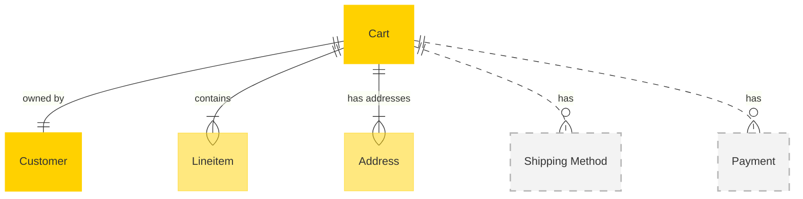

# MACH Alliance • Open Data Model Entity: `Cart`

## Table of contents

- [MACH Alliance • Open Data Model Entity: `Cart`](#mach-alliance--open-data-model-entity-cart)
  - [Table of contents](#table-of-contents)
  - [Purpose](#purpose)
  - [Object: Cart](#object-cart)
  - [Sample Object: Cart B2C](#sample-object-cart-b2c)
  - [Sample Object: Cart B2B](#sample-object-cart-b2b)
  - [Inline Objects](#inline-objects)
    - [CartItem Object](#cartitem-object)
      - [Sample CartItem Object](#sample-cartitem-object)
    - [CartTotals Object](#carttotals-object)
      - [Sample CartTotals Object](#sample-carttotals-object)
    - [AppliedPromotion Object](#appliedpromotion-object)
      - [Sample AppliedPromotion Object](#sample-appliedpromotion-object)
  - [Core Components \& Relationships](#core-components--relationships)
    - [Components](#components)
    - [Typical Relationships](#typical-relationships)
    - [Typical pitfalls](#typical-pitfalls)

---

## Purpose

A unified cart model that supports shopping session management across both B2B and B2C commerce scenarios. It resides within Commerce Engines, Order Management Systems (OMS), and Customer Experience Platforms (CXP). The cart model supports real-time shopping sessions, multi-channel experiences, approval workflows, and flexible pricing structures. It serves as the foundational data structure driving the shopping experience, order conversion, and customer journey optimization.

The Entity describes:
- Real-time shopping session management with concurrent updates
- Individual and business customer scenarios
- Multi-channel shopping experiences with proper approval workflows
- Flexible pricing structures and promotion tracking
- Multiple shipping and billing addresses
- Cart lifecycle and status management
- Line item management and totals calculation
- Payment and shipping method selection

---

## Object: Cart

| Field                 | Description                                                                                                          | Practice    |
| --------------------- | -------------------------------------------------------------------------------------------------------------------- | ----------- |
| `id`                  | Unique cart identifier in given context (e.g., UUID, slug).                                                          | SHOULD      |
| `type`                | Indicates `b2c` or `b2b` cart type.                                                                                  | SHOULD      |
| `status`              | Cart lifecycle status (`active`, `completed`, `abandoned`, `pending_approval`, `approved`, `rejected`).              | SHOULD      |
| `external_references` | Dictionary of cross-system IDs to ease orchestration logic                                                           | SHOULD      |
| `created_at`          | Creation timestamp using [timestamp](../utilities/timestamp.md) utility object.                                      | SHOULD      |
| `updated_at`          | Update timestamp using [timestamp](../utilities/timestamp.md) utility object.                                        | SHOULD      |
| `expires_at`          | Expiration timestamp using [timestamp](../utilities/timestamp.md) utility object for cart cleanup.                   | COULD       |
| `customer_id`         | Reference to the customer owning this cart.                                                                          | SHOULD      |
| `line_items`          | Array of items purchased using CartItem objects. Uses [money](../utilities/money.md) utility object for prices.      | SHOULD      |
| `totals`              | Cart totals including subtotal, tax, discounts, and grand total using CartTotals object.                             | SHOULD      |
| `addresses`           | List of typed addresses for shipping and billing. Uses the shared [address](../utilities/address.md) utility object. | RECOMMENDED |
| `shipping_methods`    | Available shipping methods and selected options.                                                                     | COULD       |
| `payment_methods`     | Available payment methods and selected options.                                                                      | COULD       |
| `applied_promotions`  | Array of promotions applied to this cart using AppliedPromotion objects.                                             | RECOMMENDED |
| `extensions`          | Namespaced dictionary for extension data grouped by concern (e.g., `analytics`, `personalization`, `approval`).      | RECOMMENDED |


---

## Sample Object: Cart B2C

```jsonc
{
  "id": "cart_b2c_001",
  "type": "b2c",
  "status": "active",
  "external_references": {
    "commercetools": "cart-98765",
    "analytics": "session-12345"
  },
  "created_at": "2025-06-01T12:00:00Z",
  "updated_at": "2025-06-17T10:15:00Z",
  "expires_at": "2025-06-24T12:00:00Z",
  "customer_id": "cus_001",
  "line_items": [
    {
      "id": "item_001",
      "sku": "TSHIRT-001-BLK-M",
      "product_id": "PROD-001",
      "name": "Organic Cotton T-Shirt - Black M",
      "quantity": 2,
      "price": {
        "amount": 34.95,
        "currency": "EUR",
        "type": "retail"
      }
  ],
  "applied_promotions": [
    {
      "id": "PROMO-SUMMER-001",
      "code": "SUMMER2024",
      "name": "Summer Sale",
      "type": "cart",
      "discount": {
        "amount": 5.00,
        "currency": "EUR"
      },
      "applied_at": "2025-06-17T10:10:00Z"
    }
  ],
  "totals": {
    "subtotal": 69.90,
    "discount": 5.00,
    "shipping": 5.00,
    "tax": 12.00,
    "grand_total": 81.90,
    "currency": "EUR"
  },
  "addresses": [
    {
      "type": "shipping",
      "address": {
        "line1": "123 Eco Street",
        "line2": "Apt 4B",
        "city": "Eco City",
        "region": "EcoState",
        "postal_code": "12345",
        "country": "US"
      },
      "contact": {
        "first_name": "John",
        "last_name": "Doe",
        "phone": "+123456789"
      }
    },
    {
      "type": "billing",
      "address": {
        "line1": "123 Eco Street",
        "line2": "Apt 4B",
        "city": "Eco City",
        "region": "EcoState",
        "postal_code": "12345",
        "country": "US"
      },
      "contact": {
        "first_name": "John",
        "last_name": "Doe",
        "phone": "+123456789"
      }
    }
  ],
  "shipping_methods": [
    {
      "id": "standard",
      "name": "Standard Shipping",
      "type": "standard",
      "price": {
        "amount": 5.00,
        "currency": "EUR"
      },
      "selected": true
    }
  ],
  "extensions": {
    "analytics": {
      "session_id": "sess_abc123",
      "channel": "web",
      "source": "google_ads",
      "conversion_goal": "purchase",
      "source": "analytics_platform"
    },
    "personalization": {
      "recommendation_engine": "enabled",
      "last_recommendation": "2025-06-17T10:10:00Z",
      "source": "personalization_engine"
    }
  }
}
```

---

## Sample Object: Cart B2B

```jsonc
{
  "id": "cart_b2b_001",
  "type": "b2b",
  "status": "pending_approval",
  "external_references": {
    "commercetools": "cart-b2b-98765",
    "erp": "order-draft-12345"
  },
  "created_at": "2025-06-01T12:00:00Z",
  "updated_at": "2025-06-17T10:15:00Z",
  "expires_at": "2025-06-24T12:00:00Z",
  "customer_id": "cus_b2b_001",
  "line_items": [
    {
      "id": "item_b2b_001",
      "sku": "TSHIRT-001-BLK-M",
      "product_id": "PROD-001",
      "name": "Organic Cotton T-Shirt - Black M",
      "quantity": 200,
      "price": {
        "amount": 24.95,
        "currency": "EUR",
        "type": "bulk",
        "tier": "enterprise"
      }
  ],
  "applied_promotions": [
    {
      "id": "PROMO-ENTERPRISE-001",
      "code": "ENTERPRISE2024",
      "name": "Enterprise Contract Discount",
      "type": "product",
      "discount": {
        "amount": 400.00,
        "currency": "EUR"
      },
      "applied_to": ["item_b2b_001"],
      "applied_at": "2025-06-17T10:15:00Z"
    }
  ],
  "totals": {
    "subtotal": 4990.00,
    "discount": 400.00,
    "shipping": 500.00,
    "tax": 0.00,
    "grand_total": 5090.00,
    "currency": "EUR",
    "tax_exemption": {
      "status": "full",
      "documentation": "TAX-EXEMPT-123"
    }
  },
  "addresses": [
    {
      "type": "shipping",
      "address": {
        "line1": "123 Business Blvd",
        "line2": "Suite 5A",
        "city": "Business City",
        "region": "BusinessState",
        "postal_code": "54321",
        "country": "US"
      },
      "contact": {
        "companyName": "Business Corp",
        "phone": "+123456789"
      }
    }
  ],
  "shipping_methods": [
    {
      "id": "freight",
      "name": "Freight Shipping",
      "type": "freight",
      "price": {
        "amount": 500.00,
        "currency": "EUR"
      },
      "selected": true
    }
  ],
  "extensions": {
    "approval": {
      "required": true,
      "level": 2,
      "currentLevel": 1,
      "approvers": [
        {
          "id": "APPROVER-001",
          "name": "Finance Manager",
          "email": "finance@business.com",
          "status": "pending"
        }
      ],
      "source": "approval_system"
    },
    "business": {
      "purchaseorder_number": "PO-98765",
      "tax_exemptionStatus": "exempt",
      "tax_id": "TAX-123456",
      "source": "erp_system"
    }
  }
}
```

---

## Inline Objects

### CartItem Object

Cart items represent individual products in the cart with their quantities, pricing, and discounts.

| Field        | Description                                                                             | Practice |
| ------------ | --------------------------------------------------------------------------------------- | -------- |
| `id`         | Unique identifier for the cart item                                                     | SHOULD   |
| `sku`        | Stock keeping unit for the product variant                                              | SHOULD   |
| `product_id` | Reference to the product                                                                | SHOULD   |
| `variant_id` | Reference to the specific product variant (optional)                                    | COULD    |
| `name`       | Human-readable product name                                                             | SHOULD   |
| `quantity`   | Number of items in cart                                                                 | SHOULD   |
| `price`      | Item price using [money](../utilities/money.md) utility object                          | SHOULD   |
| `added_at`   | When item was added to cart using [timestamp](../utilities/timestamp.md) utility object | COULD    |
| `updated_at` | When item was last updated using [timestamp](../utilities/timestamp.md) utility object  | COULD    |

#### Sample CartItem Object

```jsonc
{
  "id": "item_001",
  "sku": "TSHIRT-001-BLK-M",
  "product_id": "PROD-001",
  "variant_id": "VAR-001",
  "name": "Organic Cotton T-Shirt - Black M",
  "quantity": 2,
  "price": {
    "amount": 34.95,
    "currency": "EUR",
    "type": "retail",
    "tier": "standard"
  },
  "added_at": "2025-06-17T10:00:00Z",
  "updated_at": "2025-06-17T10:15:00Z"
}
```

### CartTotals Object

Cart totals represent the calculated totals for the entire cart including subtotal, discounts, shipping, tax, and grand total.

| Field           | Description                            | Practice |
| --------------- | -------------------------------------- | -------- |
| `subtotal`      | Sum of all line items before discounts | SHOULD   |
| `discount`      | Total discount amount                  | COULD    |
| `shipping`      | Shipping cost                          | COULD    |
| `tax`           | Tax amount                             | COULD    |
| `grand_total`   | Final total after all calculations     | SHOULD   |
| `currency`      | Currency code for all amounts          | SHOULD   |
| `tax_exemption` | Tax exemption information (optional)   | COULD    |

#### Sample CartTotals Object

```jsonc
{
  "subtotal": 69.90,
  "discount": 5.00,
  "shipping": 5.00,
  "tax": 12.00,
  "grand_total": 81.90,
  "currency": "EUR",
  "tax_exemption": {
    "status": "none",
    "documentation": null
  }
}
```

### AppliedPromotion Object

Applied promotions represent promotional discounts that have been applied to the cart.

| Field        | Description                                                                            | Practice |
| ------------ | -------------------------------------------------------------------------------------- | -------- |
| `id`         | Reference to the [promotion](../promotion/promotion.md) entity                         | SHOULD   |
| `code`       | Coupon code used to activate promotion (if applicable)                                 | COULD    |
| `name`       | Human-readable promotion name for display                                              | SHOULD   |
| `type`       | Type of promotion (`cart`, `product`, `shipping`)                                      | SHOULD   |
| `discount`   | Calculated discount amount using [money](../utilities/money.md) utility object         | SHOULD   |
| `applied_to` | Array of line item IDs affected by this promotion (for product type)                   | COULD    |
| `applied_at` | When promotion was applied using [timestamp](../utilities/timestamp.md) utility object | COULD    |

#### Sample AppliedPromotion Object

```jsonc
{
  "id": "PROMO-SUMMER-001",
  "code": "SUMMER2024",
  "name": "Summer Sale",
  "type": "cart",
  "discount": {
    "amount": 25.00,
    "currency": "EUR"
  },
  "applied_to": ["item_001", "item_002"],
  "applied_at": "2025-06-17T10:15:00Z"
}
```

---

## Core Components & Relationships

### Components

| Concept          | Description                             | Typical Source of Truth    |
| ---------------- | --------------------------------------- | -------------------------- |
| Cart ID          | Unique cart identifier                  | Commerce Engine            |
| Cart Type        | B2C or B2B cart classification          | Commerce Engine            |
| Cart Status      | Current status in cart lifecycle        | Commerce Engine            |
| Customer         | Customer owning the cart                | Customer Management System |
| Line Items       | Products and quantities in cart         | Commerce Engine            |
| Totals           | Cart totals and calculations            | Commerce Engine            |
| Addresses        | Shipping and billing addresses          | Address Management System  |
| Shipping Methods | Available and selected shipping options | Shipping Management System |
| Payment Methods  | Available and selected payment options  | Payment Management System  |
| Analytics        | Session tracking and conversion data    | Analytics Platform         |
| Approval         | B2B approval workflow management        | Approval Management System |
| Personalization  | Recommendation and personalization data | Personalization Engine     |
| Extensions       | Optional and scoped extensions          | Various domain systems     |
| Reference Ids    | Cross-system identifiers                | Integration Layer          |

`Cart` typically resides in many systems, including:

- Commerce Platform
- Order Management System (OMS)
- Customer Experience Platform (CXP)
- Analytics Platform
- Approval Management System
- Personalization Engine

### Typical Relationships



---

### Typical pitfalls

- Not using utility objects for common patterns like Address and Money - Leads to inconsistent data structures and increased complexity across systems.
- Overloading the core schema with domain-specific logic instead of using extensions - Makes the model rigid and difficult to extend for new use cases.
- Missing source system declarations in extensions - Creates traceability issues and makes conflict resolution difficult across MACH services.
- Not handling cart concurrency properly - Leads to lost updates and data inconsistencies when multiple users modify the same cart.
- Missing proper cart expiration and cleanup mechanisms - Results in stale cart data and storage bloat.
- Not implementing proper approval workflows for B2B scenarios - Creates compliance and governance risks.
- Poor handling of tax exemptions and business-specific pricing - Results in incorrect calculations and compliance issues.
- Not using proper currency handling for international scenarios - Causes conversion errors and customer confusion.
- Missing validation for minimum/maximum order quantities - Leads to invalid orders and customer frustration.
- Not implementing proper cart sharing capabilities for B2B scenarios - Limits collaboration and approval workflows.
- Using unstructured meta fields instead of namespaced extensions - Makes data difficult to query, validate, and reason about.
- Forgetting to include standard audit fields (created_at, updated_at, external_references) - Creates challenges in data orchestration and compliance tracking.

---

>  This MACH Alliance Canonical Data Model is intentionally __vendor-neutral__ and serves as a foundation for interoperability across composable architectures. It is __continually evolving__ through community contributions, which are reviewed and approved collaboratively.
>
>  All contributions are made under the __Creative Commons Attribution 4.0 International License (CC BY 4.0)__. By submitting a contribution, you agree to license your content under <a href="https://creativecommons.org/licenses/by/4.0/deed.en">CC BY 4.0</a>, allowing others to share and adapt the material with proper attribution.
>
>  We welcome and encourage continued improvements through community input. For more information and guidance on how to contribute, please refer to the <a href="https://github.com/machalliance/common-data-model/blob/main/contributing.md">Contributor Guide</a>.
