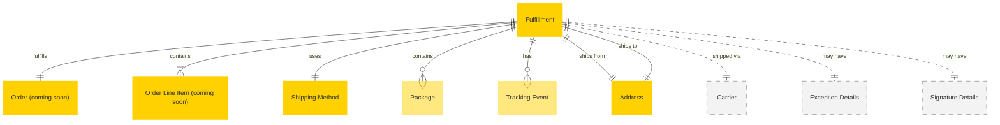

# MACH Alliance, Open Data Model Entity: `Fulfillment`

## Table of contents

- [MACH Alliance, Open Data Model Entity: `Fulfillment`](#mach-alliance-open-data-model-entity-fulfillment)
  - [Table of contents](#table-of-contents)
  - [Entity purpose](#entity-purpose)
  - [Object: Fulfillment](#object-fulfillment)
  - [YAML Schema Definition](#yaml-schema-definition)
    - [Fulfillment Schema](#fulfillment-schema)
    - [Supporting Type Definitions](#supporting-type-definitions)
  - [Sample Object: Minimal Fulfillment](#sample-object-minimal-fulfillment)
  - [Sample Object: Standard Shipment in Transit](#sample-object-standard-shipment-in-transit)
  - [Sample Object: Multi-Package Fulfillment](#sample-object-multi-package-fulfillment)
  - [Sample Object: Store Pickup Fulfillment](#sample-object-store-pickup-fulfillment)
  - [Sample Object: Partial Fulfillment with Backorder](#sample-object-partial-fulfillment-with-backorder)
  - [Sample Object: Failed Delivery Attempt](#sample-object-failed-delivery-attempt)
  - [Sample Object: International Shipment with Customs](#sample-object-international-shipment-with-customs)
  - [Localization Pattern](#localization-pattern)
    - [Fields Supporting Localization](#fields-supporting-localization)
  - [Core Components \& Relationships](#core-components--relationships)
    - [Components](#components)
    - [Typical Relationships](#typical-relationships)
  - [Typical pitfalls](#typical-pitfalls)
    - [Status and State Management Issues](#status-and-state-management-issues)
    - [Tracking and Visibility Problems](#tracking-and-visibility-problems)
    - [Date and Time Estimation Failures](#date-and-time-estimation-failures)
    - [Multi-Package and Partial Fulfillment Issues](#multi-package-and-partial-fulfillment-issues)
    - [Integration and System Sync Problems](#integration-and-system-sync-problems)
    - [Customer Communication Failures](#customer-communication-failures)

---

## Entity purpose

Represents the actual execution of shipping and delivery for order line items. While [Shipping Method](shipping-method.md) defines potential delivery options, Fulfillment tracks the real-time progress of physical goods from warehouse to customer. This entity resides within Order Management Systems (OMS), Warehouse Management Systems (WMS), and Fulfillment platforms, providing visibility into the active delivery process.

The model supports:
- **Real-time tracking**: Current location and status of shipments
- **Expected delivery dates**: Actual calculated delivery dates (not estimates)
- **Multi-package shipments**: Splitting orders across multiple packages
- **Partial fulfillment**: Handling split shipments and backorders
- **Carrier integration**: Live tracking data from shipping carriers
- **Exception handling**: Failed deliveries, delays, and re-routing
- **Proof of delivery**: Signatures, photos, and delivery confirmation

---

## Object: Fulfillment

| Field                   | Description                                                            | Practice    |
| ----------------------- | ---------------------------------------------------------------------- | ----------- |
| `id`                    | Unique identifier for the fulfillment record                           | MUST        |
| `order_id`              | Reference to the parent order                                          | MUST        |
| `status`                | Current fulfillment status                                             | MUST        |
| `external_references`   | Dictionary of cross-system IDs (e.g., WMS, carrier, tracking)         | SHOULD      |
| `created_at`            | ISO 8601 creation timestamp                                            | SHOULD      |
| `updated_at`            | ISO 8601 update timestamp                                              | SHOULD      |
| `fulfillment_type`      | Type of fulfillment (`shipment`, `pickup`, `digital_delivery`)         | SHOULD      |
| `line_items`            | Array of order line items being fulfilled                              | MUST        |
| `shipping_method_id`    | Reference to the shipping method used                                  | RECOMMENDED |
| `carrier_id`            | Carrier handling the shipment                                          | SHOULD      |
| `carrier_name`          | Carrier display name                                                   | SHOULD      |
| `service_level`         | Actual carrier service level used                                      | SHOULD      |
| `tracking_number`       | Carrier tracking number                                                | RECOMMENDED |
| `tracking_url`          | Direct link to carrier tracking page                                   | RECOMMENDED |
| `tracking_events`       | Array of tracking events from carrier                                  | COULD       |
| `shipped_at`            | ISO 8601 timestamp when shipment left facility                         | RECOMMENDED |
| `expected_delivery_date` | ISO 8601 calculated expected delivery date                            | RECOMMENDED |
| `delivered_at`          | ISO 8601 timestamp of actual delivery                                  | SHOULD      |
| `origin_address`        | Shipping origin address                                                | RECOMMENDED |
| `destination_address`   | Shipping destination address                                           | MUST        |
| `packages`              | Array of physical packages in this fulfillment                         | RECOMMENDED |
| `label_url`             | URL to shipping label document                                         | COULD       |
| `commercial_invoice_url` | URL to commercial invoice (for international)                         | COULD       |
| `signature_required`    | Whether signature is required                                          | SHOULD      |
| `signature_obtained`    | Details of signature if obtained                                       | COULD       |
| `delivery_instructions` | Special delivery instructions                                          | COULD       |
| `delivery_photo_url`    | Photo of delivered package                                             | COULD       |
| `exception_details`     | Information about delivery exceptions                                  | COULD       |
| `return_initiated`      | Whether return has been started                                        | SHOULD      |
| `extensions`            | Namespaced dictionary for extension data                               | RECOMMENDED |

---

## YAML Schema Definition

### Fulfillment Schema

```yaml
Fulfillment:
  type: object
  required:
    - id
    - order_id
    - status
    - line_items
    - destination_address
  properties:
    # Core identification
    id:
      type: string
      description: Unique identifier for the fulfillment record
      # example: "FULFILL-001"

    order_id:
      type: string
      description: Reference to the parent order
      # example: "ORDER-12345"

    status:
      type: string
      enum: [
        "pending",
        "processing",
        "picked",
        "packed",
        "labeled",
        "shipped",
        "in_transit",
        "out_for_delivery",
        "delivered",
        "failed",
        "returned",
        "cancelled"
      ]
      description: Current fulfillment status
      default: "pending"

    # External references
    external_references:
      type: object
      description: Dictionary of cross-system IDs
      additionalProperties:
        type: string
      # example:
      #   wms_shipment_id: "WMS-SHIP-789"
      #   carrier_shipment_id: "1Z999AA10123456784"
      #   oms_fulfillment_id: "OMS-FULFILL-456"

    # Timestamps
    created_at:
      type: string
      format: date-time
      description: ISO 8601 creation timestamp

    updated_at:
      type: string
      format: date-time
      description: ISO 8601 update timestamp

    # Fulfillment type
    fulfillment_type:
      type: string
      enum: ["shipment", "pickup", "digital_delivery", "local_delivery"]
      description: Type of fulfillment
      default: "shipment"

    # Line items
    line_items:
      type: array
      items:
        $ref: "#/components/schemas/FulfillmentLineItem"
      description: Array of order line items being fulfilled
      minItems: 1

    # Shipping method reference
    shipping_method_id:
      type: string
      description: Reference to the shipping method used
      # example: "SHIP-STANDARD-001"

    # Carrier information
    carrier_id:
      type: string
      description: Carrier handling the shipment
      # example: "CARRIER-UPS"

    carrier_name:
      type: string
      description: Carrier display name
      # example: "UPS", "FedEx", "USPS"

    service_level:
      type: string
      description: Actual carrier service level used
      # example: "ground", "express", "priority"

    # Tracking information
    tracking_number:
      type: string
      description: Carrier tracking number
      # example: "1Z999AA10123456784"

    tracking_url:
      type: string
      format: uri
      description: Direct link to carrier tracking page
      # example: "https://www.ups.com/track?tracknum=1Z999AA10123456784"

    tracking_events:
      type: array
      items:
        $ref: "#/components/schemas/TrackingEvent"
      description: Array of tracking events from carrier

    # Key timestamps
    shipped_at:
      type: string
      format: date-time
      description: ISO 8601 timestamp when shipment left facility
      # example: "2024-07-15T14:30:00Z"

    expected_delivery_date:
      type: string
      format: date-time
      description: ISO 8601 calculated expected delivery date
      # example: "2024-07-20T23:59:59Z"

    delivered_at:
      type: string
      format: date-time
      description: ISO 8601 timestamp of actual delivery
      # example: "2024-07-19T15:45:00Z"

    # Addresses
    origin_address:
      $ref: "../utilities/address.yaml#/Address"
      description: Shipping origin address

    destination_address:
      $ref: "../utilities/address.yaml#/Address"
      description: Shipping destination address

    # Package information
    packages:
      type: array
      items:
        $ref: "#/components/schemas/Package"
      description: Array of physical packages in this fulfillment

    # Documentation
    label_url:
      type: string
      format: uri
      description: URL to shipping label document

    commercial_invoice_url:
      type: string
      format: uri
      description: URL to commercial invoice for international shipments

    # Delivery requirements
    signature_required:
      type: boolean
      description: Whether signature is required
      default: false

    signature_obtained:
      $ref: "#/components/schemas/SignatureDetails"
      description: Details of signature if obtained

    delivery_instructions:
      type: string
      description: Special delivery instructions
      # example: "Leave at back door if no answer"

    delivery_photo_url:
      type: string
      format: uri
      description: Photo of delivered package

    # Exception handling
    exception_details:
      $ref: "#/components/schemas/ExceptionDetails"
      description: Information about delivery exceptions

    # Returns
    return_initiated:
      type: boolean
      description: Whether return has been started
      default: false

    # Extensibility
    extensions:
      type: object
      description: Namespaced dictionary for extension data
      additionalProperties: true
      # example:
      #   insurance:
      #     insured_value:
      #       amount: 500.00
      #       currency: "USD"
      #     insurance_provider: "UPS Capital"
      #   carbon_offset:
      #     offset_purchased: true
      #     co2_offset_kg: 2.5
```

### Supporting Type Definitions

```yaml
FulfillmentLineItem:
  type: object
  required:
    - order_line_item_id
    - quantity
  properties:
    order_line_item_id:
      type: string
      description: Reference to order line item
      # example: "ORDER-LINE-001"

    product_id:
      type: string
      description: Product identifier
      # example: "PROD-001"

    variant_id:
      type: string
      description: Product variant identifier
      # example: "VAR-001"

    sku:
      type: string
      description: Stock keeping unit
      # example: "TSHIRT-RED-M"

    quantity:
      type: integer
      description: Quantity being fulfilled
      minimum: 1
      # example: 2

    serial_numbers:
      type: array
      items:
        type: string
      description: Serial numbers for serialized items

Package:
  type: object
  required:
    - package_id
  properties:
    package_id:
      type: string
      description: Unique package identifier
      # example: "PKG-001"

    tracking_number:
      type: string
      description: Tracking number specific to this package
      # example: "1Z999AA10123456784"

    weight:
      type: object
      properties:
        value:
          type: number
          description: Package weight value
        unit:
          type: string
          enum: ["kg", "lb", "g", "oz"]
          description: Weight unit
      description: Package weight

    dimensions:
      type: object
      properties:
        length:
          type: number
        width:
          type: number
        height:
          type: number
        unit:
          type: string
          enum: ["cm", "in"]
      description: Package dimensions

    items:
      type: array
      items:
        type: object
        properties:
          order_line_item_id:
            type: string
          quantity:
            type: integer
      description: Items contained in this package

    label_url:
      type: string
      format: uri
      description: Shipping label for this package

TrackingEvent:
  type: object
  required:
    - timestamp
    - status
  properties:
    timestamp:
      type: string
      format: date-time
      description: Event timestamp
      # example: "2024-07-15T16:45:00Z"

    status:
      type: string
      description: Event status code
      # example: "in_transit", "out_for_delivery", "delivered"

    location:
      type: object
      properties:
        city:
          type: string
        region:
          type: string
        country:
          type: string
        postal_code:
          type: string
      description: Event location

    description:
      type: string
      description: Human-readable event description
      # example: "Package departed facility"

    exception:
      type: boolean
      description: Whether this is an exception event
      default: false

SignatureDetails:
  type: object
  properties:
    signed_by:
      type: string
      description: Name of person who signed
      # example: "J. Smith"

    signature_image_url:
      type: string
      format: uri
      description: URL to signature image

    signed_at:
      type: string
      format: date-time
      description: Timestamp of signature

    signature_type:
      type: string
      enum: ["physical", "electronic", "contactless"]
      description: Type of signature obtained

ExceptionDetails:
  type: object
  properties:
    exception_type:
      type: string
      enum: [
        "delivery_failed",
        "address_invalid",
        "recipient_unavailable",
        "damaged_in_transit",
        "lost_in_transit",
        "refused_by_recipient",
        "customs_delay",
        "weather_delay",
        "carrier_delay"
      ]
      description: Type of exception

    exception_date:
      type: string
      format: date-time
      description: When exception occurred

    description:
      type: string
      description: Detailed exception description

    resolution_status:
      type: string
      enum: ["unresolved", "rescheduled", "returned_to_sender", "refunded", "replaced"]
      description: How exception was resolved

    resolution_notes:
      type: string
      description: Notes on exception resolution

    attempt_number:
      type: integer
      description: Delivery attempt number
      minimum: 1
```

---

## Sample Object: Minimal Fulfillment

Basic fulfillment with only required fields.

```json
{
  "id": "FULFILL-001",
  "order_id": "ORDER-12345",
  "status": "pending",
  "line_items": [
    {
      "order_line_item_id": "ORDER-LINE-001",
      "sku": "TSHIRT-RED-M",
      "quantity": 2
    }
  ],
  "destination_address": {
    "line1": "123 Main St",
    "city": "Seattle",
    "region": "WA",
    "postal_code": "98101",
    "country": "US"
  }
}
```

## Sample Object: Standard Shipment in Transit

Complete fulfillment record for a shipment currently in transit.

```json
{
  "id": "FULFILL-STD-001",
  "order_id": "ORDER-12345",
  "status": "in_transit",
  "external_references": {
    "wms_shipment_id": "WMS-SHIP-789",
    "carrier_shipment_id": "1Z999AA10123456784",
    "oms_fulfillment_id": "OMS-FULFILL-456"
  },
  "created_at": "2024-07-14T10:00:00Z",
  "updated_at": "2024-07-16T14:30:00Z",
  "fulfillment_type": "shipment",
  "line_items": [
    {
      "order_line_item_id": "ORDER-LINE-001",
      "product_id": "PROD-001",
      "variant_id": "VAR-001",
      "sku": "TSHIRT-RED-M",
      "quantity": 2
    }
  ],
  "shipping_method_id": "SHIP-STANDARD-001",
  "carrier_id": "CARRIER-UPS",
  "carrier_name": "UPS",
  "service_level": "ground",
  "tracking_number": "1Z999AA10123456784",
  "tracking_url": "https://www.ups.com/track?tracknum=1Z999AA10123456784",
  "tracking_events": [
    {
      "timestamp": "2024-07-15T08:00:00Z",
      "status": "picked_up",
      "location": {
        "city": "Los Angeles",
        "region": "CA",
        "country": "US"
      },
      "description": "Package picked up by UPS",
      "exception": false
    },
    {
      "timestamp": "2024-07-15T14:30:00Z",
      "status": "departed_facility",
      "location": {
        "city": "Los Angeles",
        "region": "CA",
        "country": "US"
      },
      "description": "Departed from facility",
      "exception": false
    },
    {
      "timestamp": "2024-07-16T09:15:00Z",
      "status": "in_transit",
      "location": {
        "city": "Portland",
        "region": "OR",
        "country": "US"
      },
      "description": "In transit",
      "exception": false
    }
  ],
  "shipped_at": "2024-07-15T08:00:00Z",
  "expected_delivery_date": "2024-07-19T20:00:00Z",
  "origin_address": {
    "line1": "500 Warehouse Blvd",
    "city": "Los Angeles",
    "region": "CA",
    "postal_code": "90001",
    "country": "US"
  },
  "destination_address": {
    "line1": "123 Main St",
    "city": "Seattle",
    "region": "WA",
    "postal_code": "98101",
    "country": "US"
  },
  "packages": [
    {
      "package_id": "PKG-001",
      "tracking_number": "1Z999AA10123456784",
      "weight": {
        "value": 1.2,
        "unit": "kg"
      },
      "dimensions": {
        "length": 30,
        "width": 25,
        "height": 5,
        "unit": "cm"
      },
      "items": [
        {
          "order_line_item_id": "ORDER-LINE-001",
          "quantity": 2
        }
      ]
    }
  ],
  "signature_required": false,
  "return_initiated": false,
  "extensions": {
    "shipping_cost": {
      "amount": 8.99,
      "currency": "USD"
    },
    "estimated_arrival": {
      "date_range": "July 18-19",
      "confidence": "high"
    }
  }
}
```

## Sample Object: Multi-Package Fulfillment

Fulfillment split across multiple packages.

```json
{
  "id": "FULFILL-MULTI-001",
  "order_id": "ORDER-67890",
  "status": "shipped",
  "created_at": "2024-07-15T09:00:00Z",
  "updated_at": "2024-07-15T15:00:00Z",
  "fulfillment_type": "shipment",
  "line_items": [
    {
      "order_line_item_id": "ORDER-LINE-001",
      "sku": "LAPTOP-001",
      "quantity": 1
    },
    {
      "order_line_item_id": "ORDER-LINE-002",
      "sku": "MOUSE-001",
      "quantity": 2
    },
    {
      "order_line_item_id": "ORDER-LINE-003",
      "sku": "KEYBOARD-001",
      "quantity": 1
    }
  ],
  "shipping_method_id": "SHIP-EXPRESS-001",
  "carrier_id": "CARRIER-FEDEX",
  "carrier_name": "FedEx",
  "service_level": "express",
  "shipped_at": "2024-07-15T15:00:00Z",
  "expected_delivery_date": "2024-07-17T10:30:00Z",
  "destination_address": {
    "line1": "456 Office Park Dr",
    "city": "New York",
    "region": "NY",
    "postal_code": "10001",
    "country": "US"
  },
  "packages": [
    {
      "package_id": "PKG-001",
      "tracking_number": "1234567890",
      "weight": {
        "value": 5.5,
        "unit": "lb"
      },
      "dimensions": {
        "length": 18,
        "width": 14,
        "height": 6,
        "unit": "in"
      },
      "items": [
        {
          "order_line_item_id": "ORDER-LINE-001",
          "quantity": 1
        }
      ],
      "label_url": "https://cdn.example.com/labels/pkg-001.pdf"
    },
    {
      "package_id": "PKG-002",
      "tracking_number": "0987654321",
      "weight": {
        "value": 2.0,
        "unit": "lb"
      },
      "dimensions": {
        "length": 12,
        "width": 10,
        "height": 4,
        "unit": "in"
      },
      "items": [
        {
          "order_line_item_id": "ORDER-LINE-002",
          "quantity": 2
        },
        {
          "order_line_item_id": "ORDER-LINE-003",
          "quantity": 1
        }
      ],
      "label_url": "https://cdn.example.com/labels/pkg-002.pdf"
    }
  ],
  "signature_required": true,
  "extensions": {
    "split_reason": "size_constraints",
    "total_packages": 2
  }
}
```

## Sample Object: Store Pickup Fulfillment

Click-and-collect fulfillment ready for customer pickup.

```json
{
  "id": "FULFILL-PICKUP-001",
  "order_id": "ORDER-11111",
  "status": "delivered",
  "created_at": "2024-07-16T10:00:00Z",
  "updated_at": "2024-07-17T14:30:00Z",
  "fulfillment_type": "pickup",
  "line_items": [
    {
      "order_line_item_id": "ORDER-LINE-001",
      "sku": "BOOK-001",
      "quantity": 3
    }
  ],
  "shipping_method_id": "SHIP-PICKUP-001",
  "shipped_at": "2024-07-17T09:00:00Z",
  "expected_delivery_date": "2024-07-17T09:00:00Z",
  "delivered_at": "2024-07-17T14:30:00Z",
  "origin_address": {
    "line1": "789 Retail Plaza",
    "line2": "Store #42",
    "city": "San Francisco",
    "region": "CA",
    "postal_code": "94102",
    "country": "US"
  },
  "destination_address": {
    "line1": "789 Retail Plaza",
    "line2": "Store #42",
    "city": "San Francisco",
    "region": "CA",
    "postal_code": "94102",
    "country": "US"
  },
  "signature_required": true,
  "signature_obtained": {
    "signed_by": "Jane Doe",
    "signed_at": "2024-07-17T14:30:00Z",
    "signature_type": "electronic"
  },
  "delivery_instructions": "Customer must show order confirmation and valid ID",
  "extensions": {
    "pickup_location": {
      "store_id": "STORE-042",
      "pickup_counter": "Customer Service Desk",
      "hold_until": "2024-07-24T20:00:00Z"
    },
    "notification": {
      "ready_notification_sent": "2024-07-17T09:15:00Z",
      "reminder_sent": "2024-07-17T12:00:00Z"
    }
  }
}
```

## Sample Object: Partial Fulfillment with Backorder

Partial shipment with remaining items on backorder.

```json
{
  "id": "FULFILL-PARTIAL-001",
  "order_id": "ORDER-22222",
  "status": "shipped",
  "created_at": "2024-07-18T08:00:00Z",

```json
  "updated_at": "2024-07-18T12:00:00Z",
  "fulfillment_type": "shipment",
  "line_items": [
    {
      "order_line_item_id": "ORDER-LINE-001",
      "sku": "WIDGET-A",
      "quantity": 5
    }
  ],
  "shipping_method_id": "SHIP-STANDARD-001",
  "carrier_id": "CARRIER-USPS",
  "carrier_name": "USPS",
  "service_level": "priority",
  "tracking_number": "9400111899562894172945",
  "tracking_url": "https://tools.usps.com/go/TrackConfirmAction?tLabels=9400111899562894172945",
  "shipped_at": "2024-07-18T12:00:00Z",
  "expected_delivery_date": "2024-07-22T20:00:00Z",
  "destination_address": {
    "line1": "321 Business St",
    "city": "Chicago",
    "region": "IL",
    "postal_code": "60601",
    "country": "US"
  },
  "packages": [
    {
      "package_id": "PKG-001",
      "tracking_number": "9400111899562894172945",
      "weight": {
        "value": 3.0,
        "unit": "lb"
      },
      "items": [
        {
          "order_line_item_id": "ORDER-LINE-001",
          "quantity": 5
        }
      ]
    }
  ],
  "extensions": {
    "partial_fulfillment": {
      "is_partial": true,
      "total_order_quantity": 10,
      "fulfilled_quantity": 5,
      "remaining_quantity": 5,
      "backorder_expected": "2024-08-01T00:00:00Z",
      "backorder_fulfillment_id": "FULFILL-BACKORDER-001"
    },
    "notifications": {
      "partial_ship_notification_sent": true,
      "backorder_notification_sent": true
    }
  }
}
```

## Sample Object: Failed Delivery Attempt

Fulfillment with failed delivery and exception details.

```json
{
  "id": "FULFILL-FAILED-001",
  "order_id": "ORDER-33333",
  "status": "failed",
  "created_at": "2024-07-10T09:00:00Z",
  "updated_at": "2024-07-17T16:45:00Z",
  "fulfillment_type": "shipment",
  "line_items": [
    {
      "order_line_item_id": "ORDER-LINE-001",
      "sku": "ELECTRONICS-001",
      "quantity": 1
    }
  ],
  "shipping_method_id": "SHIP-EXPRESS-001",
  "carrier_id": "CARRIER-FEDEX",
  "carrier_name": "FedEx",
  "service_level": "express",
  "tracking_number": "7890123456789",
  "tracking_url": "https://www.fedex.com/fedextrack/?tracknumbers=7890123456789",
  "tracking_events": [
    {
      "timestamp": "2024-07-15T08:00:00Z",
      "status": "in_transit",
      "location": {
        "city": "Memphis",
        "region": "TN",
        "country": "US"
      },
      "description": "In transit",
      "exception": false
    },
    {
      "timestamp": "2024-07-16T14:00:00Z",
      "status": "out_for_delivery",
      "location": {
        "city": "Boston",
        "region": "MA",
        "country": "US"
      },
      "description": "Out for delivery",
      "exception": false
    },
    {
      "timestamp": "2024-07-16T18:30:00Z",
      "status": "delivery_failed",
      "location": {
        "city": "Boston",
        "region": "MA",
        "country": "US"
      },
      "description": "Delivery attempt failed - recipient not available",
      "exception": true
    },
    {
      "timestamp": "2024-07-17T16:45:00Z",
      "status": "return_to_sender",
      "location": {
        "city": "Boston",
        "region": "MA",
        "country": "US"
      },
      "description": "Returning to sender after 3 failed attempts",
      "exception": true
    }
  ],
  "shipped_at": "2024-07-15T08:00:00Z",
  "expected_delivery_date": "2024-07-16T20:00:00Z",
  "destination_address": {
    "line1": "100 Main Street",
    "line2": "Apt 5B",
    "city": "Boston",
    "region": "MA",
    "postal_code": "02101",
    "country": "US"
  },
  "packages": [
    {
      "package_id": "PKG-001",
      "tracking_number": "7890123456789",
      "weight": {
        "value": 4.5,
        "unit": "lb"
      }
    }
  ],
  "signature_required": true,
  "exception_details": {
    "exception_type": "recipient_unavailable",
    "exception_date": "2024-07-16T18:30:00Z",
    "description": "Three delivery attempts made. Recipient was not available to sign. Package being returned to sender.",
    "resolution_status": "returned_to_sender",
    "resolution_notes": "Customer to be contacted for reshipment with updated delivery instructions",
    "attempt_number": 3
  },
  "extensions": {
    "delivery_attempts": [
      {
        "attempt": 1,
        "date": "2024-07-16T18:30:00Z",
        "result": "no_answer"
      },
      {
        "attempt": 2,
        "date": "2024-07-17T11:15:00Z",
        "result": "no_answer"
      },
      {
        "attempt": 3,
        "date": "2024-07-17T16:45:00Z",
        "result": "no_answer"
      }
    ],
    "customer_contacted": true,
    "reshipment_scheduled": false
  }
}
```

## Sample Object: International Shipment with Customs

International fulfillment with customs documentation and tracking.

```json
{
  "id": "FULFILL-INTL-001",
  "order_id": "ORDER-44444",
  "status": "in_transit",
  "created_at": "2024-07-12T10:00:00Z",
  "updated_at": "2024-07-20T09:30:00Z",
  "fulfillment_type": "shipment",
  "line_items": [
    {
      "order_line_item_id": "ORDER-LINE-001",
      "sku": "APPAREL-001",
      "quantity": 3
    },
    {
      "order_line_item_id": "ORDER-LINE-002",
      "sku": "ACCESSORY-001",
      "quantity": 2
    }
  ],
  "shipping_method_id": "SHIP-INTL-001",
  "carrier_id": "CARRIER-DHL",
  "carrier_name": "DHL Express",
  "service_level": "express",
  "tracking_number": "1234567890",
  "tracking_url": "https://www.dhl.com/en/express/tracking.html?AWB=1234567890",
  "tracking_events": [
    {
      "timestamp": "2024-07-15T14:00:00Z",
      "status": "picked_up",
      "location": {
        "city": "New York",
        "region": "NY",
        "country": "US"
      },
      "description": "Shipment picked up",
      "exception": false
    },
    {
      "timestamp": "2024-07-16T08:00:00Z",
      "status": "departed_facility",
      "location": {
        "city": "Cincinnati",
        "region": "OH",
        "country": "US"
      },
      "description": "Departed from sort facility",
      "exception": false
    },
    {
      "timestamp": "2024-07-18T06:00:00Z",
      "status": "arrived_at_destination_country",
      "location": {
        "city": "London",
        "country": "GB"
      },
      "description": "Arrived at destination country",
      "exception": false
    },
    {
      "timestamp": "2024-07-19T10:00:00Z",
      "status": "customs_clearance",
      "location": {
        "city": "London",
        "country": "GB"
      },
      "description": "Shipment is being processed through customs",
      "exception": false
    },
    {
      "timestamp": "2024-07-20T09:30:00Z",
      "status": "cleared_customs",
      "location": {
        "city": "London",
        "country": "GB"
      },
      "description": "Customs clearance completed",
      "exception": false
    }
  ],
  "shipped_at": "2024-07-15T14:00:00Z",
  "expected_delivery_date": "2024-07-23T20:00:00Z",
  "origin_address": {
    "line1": "123 Export Way",
    "city": "New York",
    "region": "NY",
    "postal_code": "10001",
    "country": "US"
  },
  "destination_address": {
    "line1": "45 High Street",
    "city": "London",
    "postal_code": "SW1A 1AA",
    "country": "GB"
  },
  "packages": [
    {
      "package_id": "PKG-001",
      "tracking_number": "1234567890",
      "weight": {
        "value": 2.5,
        "unit": "kg"
      },
      "dimensions": {
        "length": 40,
        "width": 30,
        "height": 10,
        "unit": "cm"
      }
    }
  ],
  "commercial_invoice_url": "https://cdn.example.com/invoices/commercial-inv-001.pdf",
  "signature_required": true,
  "extensions": {
    "customs": {
      "customs_number": "GB123456789",
      "customs_value": {
        "amount": 250.00,
        "currency": "USD"
      },
      "harmonized_code": "6109.10.00",
      "duties_paid": {
        "amount": 35.50,
        "currency": "GBP"
      },
      "vat_paid": {
        "amount": 42.00,
        "currency": "GBP"
      },
      "duties_paid_by": "recipient",
      "clearance_completed": true,
      "clearance_date": "2024-07-20T09:30:00Z"
    },
    "insurance": {
      "insured": true,
      "insured_value": {
        "amount": 250.00,
        "currency": "USD"
      }
    }
  }
}
```

---

## Localization Pattern

Since Fulfillment is primarily operational data, most fields are not localized. However, certain fields may support localization for customer communications:

### Fields Supporting Localization
- `exception_details.description` - Exception messages shown to customers
- `delivery_instructions` - Custom delivery instructions
- Status descriptions in customer notifications (handled in extensions)

Example:
```json
{
  "exception_details": {
    "exception_type": "weather_delay",
    "description": {
      "en-US": "Delivery delayed due to severe weather conditions",
      "es-ES": "Entrega retrasada debido a condiciones climáticas severas",
      "fr-FR": "Livraison retardée en raison de conditions météorologiques sévères"
    }
  }
}
```

---

## Core Components & Relationships

### Components

| Concept                  | Description                                  | Typical Source of Truth       |
| ------------------------ | -------------------------------------------- | ----------------------------- |
| Fulfillment              | Active shipment or delivery record           | OMS / WMS                     |
| Tracking Events          | Real-time carrier tracking updates           | Carrier API                   |
| Package                  | Physical package with dimensions and weight  | WMS / Shipping System         |
| Fulfillment Line Items   | Order items being fulfilled                  | OMS                           |
| Delivery Address         | Destination for shipment                     | Order / Customer Data         |
| Signature                | Proof of delivery                            | Carrier / Delivery Service    |
| Exception Details        | Delivery problems and resolutions            | Carrier / Customer Service    |

`Fulfillment` typically resides in:
- Order Management System (OMS)
- Warehouse Management System (WMS)
- Shipping Management Platform
- Fulfillment Service Provider

### Typical Relationships



---

## Typical pitfalls

### Status and State Management Issues
- **Status not updated in real-time** - Customers see "processing" when package is already delivered
- **Missing intermediate statuses** - Jumping from "shipped" to "delivered" without "in_transit" or "out_for_delivery"
- **No status history** - Can't see progression of fulfillment over time
- **Status conflicts between systems** - OMS says "shipped", WMS says "packed", carrier says "delivered"
- **No rollback handling** - Can't revert status if label is cancelled before pickup

### Tracking and Visibility Problems
- **Tracking numbers not immediately available** - Customers get "shipped" notification without tracking
- **No carrier API integration** - Manual tracking updates cause delays and errors
- **Missing tracking events** - Only showing "shipped" and "delivered" without intermediate scans
- **Broken tracking URLs** - Links don't work or go to generic carrier homepage
- **No proactive exception alerts** - Customers find out about delays by checking tracking themselves

### Date and Time Estimation Failures
- **Showing estimates instead of actual dates** - `expected_delivery_date` should be carrier's calculated date, not original estimate
- **Not updating delivery dates** - Expected date doesn't change when delays occur
- **Timezone confusion** - Showing delivery dates in wrong timezone
- **Missing `shipped_at` timestamp** - Can't calculate accurate "days in transit"
- **No business day calculation** - Expected date includes weekends/holidays when carrier doesn't deliver

### Multi-Package and Partial Fulfillment Issues
- **Poor partial fulfillment handling** - Customers confused when only some items ship
- **No linkage between related fulfillments** - Can't see that order is split across multiple shipments
- **Missing backorder information** - No indication when remaining items will ship
- **Package-level tracking missing** - Multi-package shipment only shows one tracking number
- **Items not mapped to packages** - Can't tell which items are in which package

### Integration and System Sync Problems
- **Carrier webhook failures not handled** - Tracking updates stop coming, fulfillment appears frozen
- **No retry mechanism** - Failed carrier API calls don't retry automatically
- **Missing external references** - Can't correlate fulfillment across WMS, OMS, and carrier systems
- **Label generation failures** - Fulfillment created but shipping label doesn't generate
- **Inventory not reserved** - Items fulfilled but inventory not decremented

### Customer Communication Failures
- **No delivery notifications** - Customers don't know package was delivered
- **Missing exception communications** - Failed delivery attempts not communicated proactively
- **Poor delivery instruction handling** - Special instructions not visible to carrier or driver
- **No photo of delivery** - Can't confirm where package was left
- **Return process unclear** - When delivery fails, customer doesn't know how to get reshipment

---

>  This MACH Alliance Canonical Data Model is intentionally __vendor-neutral__ and serves as a foundation for interoperability across composable architectures. It is __continually evolving__ through community contributions, which are reviewed and approved collaboratively.
>
>  All contributions are made under the __Creative Commons Attribution 4.0 International License (CC BY 4.0)__. By submitting a contribution, you agree to license your content under <a href="https://creativecommons.org/licenses/by/4.0/deed.en">CC BY 4.0</a>, allowing others to share and adapt the material with proper attribution.
>
>  We welcome and encourage continued improvements through community input. For more information and guidance on how to contribute, please refer to the <a href="../../CONTRIBUTING.md">Contributor Guide</a>.