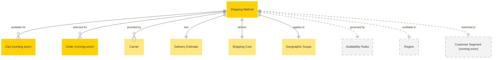

# MACH Alliance, Open Data Model Entity: `Shipping Method`

## Table of contents

- [MACH Alliance, Open Data Model Entity: `Shipping Method`](#mach-alliance-open-data-model-entity-shipping-method)
  - [Table of contents](#table-of-contents)
  - [Entity purpose](#entity-purpose)
  - [Object: Shipping Method](#object-shipping-method)
  - [YAML Schema Definition](#yaml-schema-definition)
    - [Shipping Method Schema](#shipping-method-schema)
    - [Supporting Type Definitions](#supporting-type-definitions)
  - [Sample Object: Minimal Shipping Method](#sample-object-minimal-shipping-method)
  - [Sample Object: Standard Ground Shipping](#sample-object-standard-ground-shipping)
  - [Sample Object: Express Shipping with Time Windows](#sample-object-express-shipping-with-time-windows)
  - [Sample Object: Free Shipping Promotion](#sample-object-free-shipping-promotion)
  - [Sample Object: International Shipping](#sample-object-international-shipping)
  - [Sample Object: Same-Day Delivery](#sample-object-same-day-delivery)
  - [Sample Object: Click and Collect](#sample-object-click-and-collect)
  - [Localization Pattern](#localization-pattern)
    - [Single Language (Simple String)](#single-language-simple-string)
    - [Multi-Language (Localized Object)](#multi-language-localized-object)
    - [Localizable Fields](#localizable-fields)
  - [Core Components \& Relationships](#core-components--relationships)
    - [Components](#components)
    - [Typical Relationships](#typical-relationships)
  - [Typical pitfalls](#typical-pitfalls)
    - [Configuration and Setup Issues](#configuration-and-setup-issues)
    - [Pricing and Cost Problems](#pricing-and-cost-problems)
    - [Delivery Estimation Failures](#delivery-estimation-failures)
    - [Geographic and Regional Issues](#geographic-and-regional-issues)
    - [Integration Challenges](#integration-challenges)
    - [User Experience Problems](#user-experience-problems)

---

## Entity purpose

Defines the available shipping and delivery options that customers can choose during checkout. This entity represents the _potential_ means of shipping products, including cost structure, delivery timeframes, geographic availability, and carrier details. Shipping Methods reside within Order Management Systems (OMS), Commerce Engines, and Shipping Management platforms, serving as the configuration layer for delivery options before actual shipment occurs.

This entity shares many fields with [Fulfillment](fulfillment.md) which represents an _actual_ order fulfillment in progress.

The model supports:
- **Delivery estimation**: Min/max days for delivery timeframe communication
- **Cost calculation**: Base rates, weight-based pricing, and promotional adjustments
- **Geographic scoping**: Region, country, and zone-based availability
- **Carrier integration**: Links to shipping carriers and their service levels
- **Conditional availability**: Rules for when methods are available (cart value, product type, customer segment)
- **Multi-channel support**: Different methods for web, mobile, store pickup, etc.

---

## Object: Shipping Method

| Field                   | Description                                                          | Practice    |
| ----------------------- | -------------------------------------------------------------------- | ----------- |
| `id`                    | Unique identifier for the shipping method                            | MUST        |
| `name`                  | Display name of the shipping method (string or localized object)     | MUST        |
| `status`                | Lifecycle status (`active`, `inactive`, `archived`)                  | SHOULD      |
| `external_references`   | Dictionary of cross-system IDs (e.g., carrier IDs, OMS IDs)         | SHOULD      |
| `created_at`            | ISO 8601 creation timestamp                                          | SHOULD      |
| `updated_at`            | ISO 8601 update timestamp                                            | SHOULD      |
| `description`           | Detailed description of the method (string or localized object)      | SHOULD      |
| `carrier_id`            | Reference to the shipping carrier                                    | RECOMMENDED |
| `carrier_name`          | Carrier display name (e.g., "UPS", "FedEx", "USPS")                 | SHOULD      |
| `service_level`         | Carrier's service level code (e.g., "ground", "express", "priority") | SHOULD      |
| `delivery_estimate`     | Estimated delivery timeframe                                         | MUST        |
| `cost`                  | Shipping cost configuration using [money](../utilities/money.md) utility object | RECOMMENDED |
| `free_shipping_threshold` | Cart value threshold for free shipping using [money](../utilities/money.md) | COULD       |
| `fulfillment_type`      | Type of fulfillment (`ship_to_address`, `pickup`, `digital`)         | SHOULD      |
| `geographic_scope`      | Geographic availability configuration                                | RECOMMENDED |
| `availability_rules`    | Conditions for method availability                                   | COULD       |
| `handling_time`         | Processing time before shipment (in days)                            | RECOMMENDED |
| `cutoff_time`           | Daily order cutoff time for same-day processing                      | COULD       |
| `tracking_available`    | Whether tracking is provided                                         | SHOULD      |
| `signature_required`    | Whether signature is required on delivery                            | COULD       |
| `insurance_available`   | Whether shipping insurance is available                              | COULD       |
| `restrictions`          | Product or order restrictions                                        | COULD       |
| `display_priority`      | Sort order for displaying methods to customers                       | SHOULD      |
| `extensions`            | Namespaced dictionary for extension data                             | RECOMMENDED |

---

## YAML Schema Definition

### Shipping Method Schema

```yaml
ShippingMethod:
  type: object
  required:
    - id
    - name
    - delivery_estimate
  properties:
    # Core identification
    id:
      type: string
      description: Unique identifier for the shipping method
      # example: "SHIP-STANDARD-001"

    name:
      oneOf:
        - type: string  # Single language
        - type: object  # Multi-language
          additionalProperties:
            type: string
      description: Display name of the shipping method
      # example: "Standard Ground Shipping" or {"en-US": "Standard Ground", "es-ES": "Envío Estándar"}

    status:
      type: string
      enum: ["active", "inactive", "archived"]
      description: Lifecycle status of the shipping method
      default: "active"

    # External references
    external_references:
      type: object
      description: Dictionary of cross-system IDs
      additionalProperties:
        type: string
      # example:
      #   carrier_service_code: "UPS_GROUND"
      #   oms_id: "shipping-method-123"
      #   erp_id: "SHIP-STD"

    # Timestamps
    created_at:
      type: string
      format: date-time
      description: ISO 8601 creation timestamp

    updated_at:
      type: string
      format: date-time
      description: ISO 8601 update timestamp

    # Display information (localizable)
    description:
      oneOf:
        - type: string  # Single language
        - type: object  # Multi-language
          additionalProperties:
            type: string
      description: Detailed description of the shipping method

    # Carrier information
    carrier_id:
      type: string
      description: Reference to the shipping carrier
      # example: "CARRIER-UPS"

    carrier_name:
      type: string
      description: Carrier display name
      # example: "UPS", "FedEx", "USPS"

    service_level:
      type: string
      enum: ["economy", "standard", "expedited", "express", "overnight", "same_day"]
      description: Carrier's service level
      default: "standard"

    # Delivery estimation
    delivery_estimate:
      $ref: "#/components/schemas/DeliveryEstimate"
      description: Estimated delivery timeframe

    # Pricing
    cost:
      $ref: "#/components/schemas/ShippingCost"
      description: Shipping cost configuration

    free_shipping_threshold:
      $ref: "../utilities/money.yaml#/Money"
      description: Cart value threshold for free shipping

    # Fulfillment type
    fulfillment_type:
      type: string
      enum: ["ship_to_address", "pickup", "digital", "local_delivery"]
      description: Type of fulfillment
      default: "ship_to_address"

    # Geographic scope
    geographic_scope:
      $ref: "#/components/schemas/GeographicScope"
      description: Geographic availability configuration

    # Availability rules
    availability_rules:
      $ref: "#/components/schemas/AvailabilityRules"
      description: Conditions for method availability

    # Processing and timing
    handling_time:
      type: object
      properties:
        min_days:
          type: integer
          description: Minimum handling days before shipment
          minimum: 0
        max_days:
          type: integer
          description: Maximum handling days before shipment
          minimum: 0
      description: Processing time before shipment

    cutoff_time:
      type: string
      pattern: "^([01]?[0-9]|2[0-3]):[0-5][0-9]$"
      description: Daily order cutoff time (HH:MM format in local timezone)
      # example: "15:00"

    # Additional features
    tracking_available:
      type: boolean
      description: Whether tracking is provided
      default: true

    signature_required:
      type: boolean
      description: Whether signature is required on delivery
      default: false

    insurance_available:
      type: boolean
      description: Whether shipping insurance is available
      default: false

    # Restrictions
    restrictions:
      $ref: "#/components/schemas/ShippingRestrictions"
      description: Product or order restrictions

    # Display
    display_priority:
      type: integer
      description: Sort order for displaying methods to customers
      minimum: 0
      # example: 1

    # Extensibility
    extensions:
      type: object
      description: Namespaced dictionary for extension data
      additionalProperties: true
      # example:
      #   carbon_neutral:
      #     offset_program: "carbonfund"
      #     estimated_co2_kg: 2.5
      #   promotional:
      #     badge: "FREE SHIPPING"
      #     highlight: true
```

### Supporting Type Definitions

```yaml
DeliveryEstimate:
  type: object
  required:
    - min_days
    - max_days
  properties:
    min_days:
      type: integer
      description: Minimum estimated delivery days
      minimum: 0
      # example: 3

    max_days:
      type: integer
      description: Maximum estimated delivery days
      minimum: 0
      # example: 5

    business_days_only:
      type: boolean
      description: Whether estimate is in business days only
      default: true

    description:
      oneOf:
        - type: string
        - type: object
          additionalProperties:
            type: string
      description: Human-readable delivery estimate
      # example: "3-5 business days"

ShippingCost:
  type: object
  properties:
    base_cost:
      $ref: "../utilities/money.yaml#/Money"
      description: Base shipping cost

    calculation_method:
      type: string
      enum: ["flat_rate", "weight_based", "price_based", "real_time", "free"]
      description: Method for calculating shipping cost
      default: "flat_rate"

    weight_tiers:
      type: array
      items:
        $ref: "#/components/schemas/WeightTier"
      description: Weight-based pricing tiers

    price_tiers:
      type: array
      items:
        $ref: "#/components/schemas/PriceTier"
      description: Order value-based pricing tiers

    additional_item_cost:
      $ref: "../utilities/money.yaml#/Money"
      description: Cost per additional item

WeightTier:
  type: object
  required:
    - max_weight
    - cost
  properties:
    max_weight:
      type: number
      description: Maximum weight for this tier
      # example: 5.0

    weight_unit:
      type: string
      enum: ["kg", "lb", "g", "oz"]
      description: Unit of weight measurement
      default: "kg"

    cost:
      $ref: "../utilities/money.yaml#/Money"
      description: Shipping cost for this weight tier

PriceTier:
  type: object
  required:
    - max_price
    - cost
  properties:
    max_price:
      $ref: "../utilities/money.yaml#/Money"
      description: Maximum order value for this tier

    cost:
      $ref: "../utilities/money.yaml#/Money"
      description: Shipping cost for this price tier

GeographicScope:
  type: object
  properties:
    countries:
      type: array
      items:
        type: string
        pattern: "^[A-Z]{2}$"
      description: ISO 3166-1 alpha-2 country codes
      # example: ["US", "CA"]

    regions:
      type: array
      items:
        type: string
      description: State/province codes
      # example: ["CA", "NY", "TX"]

    postal_codes:
      type: array
      items:
        type: string
      description: Specific postal codes or ranges
      # example: ["10001", "90001-90099"]

    exclude_regions:
      type: array
      items:
        type: string
      description: Excluded regions within scope
      # example: ["AK", "HI"]

    international:
      type: boolean
      description: Whether method is available internationally
      default: false

AvailabilityRules:
  type: object
  properties:
    min_cart_value:
      $ref: "../utilities/money.yaml#/Money"
      description: Minimum cart value required

    max_cart_value:
      $ref: "../utilities/money.yaml#/Money"
      description: Maximum cart value allowed

    min_items:
      type: integer
      description: Minimum number of items required
      minimum: 1

    max_items:
      type: integer
      description: Maximum number of items allowed
      minimum: 1

    allowed_product_types:
      type: array
      items:
        type: string
      description: Product types eligible for this method

    excluded_product_types:
      type: array
      items:
        type: string
      description: Product types excluded from this method

    customer_segments:
      type: array
      items:
        type: string
      description: Customer segments eligible for this method

    channels:
      type: array
      items:
        type: string
      description: Sales channels where method is available
      # example: ["web", "mobile", "pos"]

ShippingRestrictions:
  type: object
  properties:
    hazmat_prohibited:
      type: boolean
      description: Whether hazardous materials are prohibited
      default: false

    max_dimensions:
      type: object
      properties:
        length:
          type: number
        width:
          type: number
        height:
          type: number
        unit:
          type: string
          enum: ["cm", "in"]
      description: Maximum package dimensions

    max_weight:
      type: object
      properties:
        value:
          type: number
        unit:
          type: string
          enum: ["kg", "lb"]
      description: Maximum package weight

    excluded_product_attributes:
      type: array
      items:
        type: string
      description: Product attributes that exclude this method
      # example: ["fragile", "perishable", "oversized"]

    requires_adult_signature:
      type: boolean
      description: Whether adult signature is required
      default: false
```

---

## Sample Object: Minimal Shipping Method

Basic shipping method with only required fields.

```json
{
  "id": "SHIP-MIN-001",
  "name": "Standard Shipping",
  "delivery_estimate": {
    "min_days": 3,
    "max_days": 5
  }
}
```

## Sample Object: Standard Ground Shipping

Complete standard shipping method with comprehensive configuration.

```json
{
  "id": "SHIP-STANDARD-001",
  "name": {
    "en-US": "Standard Ground Shipping",
    "es-ES": "Envío Estándar Terrestre",
    "fr-FR": "Livraison Standard au Sol"
  },
  "status": "active",
  "external_references": {
    "carrier_service_code": "UPS_GROUND",
    "oms_id": "shipping-method-123",
    "erp_id": "SHIP-STD-001"
  },
  "created_at": "2024-01-01T00:00:00Z",
  "updated_at": "2024-07-15T10:30:00Z",
  "description": {
    "en-US": "Reliable ground shipping delivered within 3-5 business days",
    "es-ES": "Envío terrestre confiable entregado en 3-5 días hábiles",
    "fr-FR": "Livraison au sol fiable dans les 3 Ă  5 jours ouvrables"
  },
  "carrier_id": "CARRIER-UPS",
  "carrier_name": "UPS",
  "service_level": "standard",
  "delivery_estimate": {
    "min_days": 3,
    "max_days": 5,
    "business_days_only": true,
    "description": {
      "en-US": "3-5 business days",
      "es-ES": "3-5 días hábiles"
    }
  },
  "cost": {
    "base_cost": {
      "amount": 8.99,
      "currency": "USD"
    },
    "calculation_method": "weight_based",
    "weight_tiers": [
      {
        "max_weight": 2.0,
        "weight_unit": "kg",
        "cost": {
          "amount": 8.99,
          "currency": "USD"
        }
      },
      {
        "max_weight": 5.0,
        "weight_unit": "kg",
        "cost": {
          "amount": 12.99,
          "currency": "USD"
        }
      },
      {
        "max_weight": 10.0,
        "weight_unit": "kg",
        "cost": {
          "amount": 18.99,
          "currency": "USD"
        }
      }
    ]
  },
  "free_shipping_threshold": {
    "amount": 75.00,
    "currency": "USD"
  },
  "fulfillment_type": "ship_to_address",
  "geographic_scope": {
    "countries": ["US"],
    "exclude_regions": ["AK", "HI", "PR"],
    "international": false
  },
  "availability_rules": {
    "min_cart_value": {
      "amount": 10.00,
      "currency": "USD"
    },
    "channels": ["web", "mobile", "pos"]
  },
  "handling_time": {
    "min_days": 1,
    "max_days": 2
  },
  "cutoff_time": "15:00",
  "tracking_available": true,
  "signature_required": false,
  "insurance_available": true,
  "restrictions": {
    "hazmat_prohibited": false,
    "max_weight": {
      "value": 70,
      "unit": "lb"
    },
    "max_dimensions": {
      "length": 108,
      "width": 70,
      "height": 70,
      "unit": "in"
    }
  },
  "display_priority": 2,
  "extensions": {
    "sustainability": {
      "carbon_neutral": false,
      "estimated_co2_kg": 2.5
    },
    "promotional": {
      "badge": "Most Popular",
      "highlight": false
    }
  }
}
```

## Sample Object: Express Shipping with Time Windows

Express shipping method with specific delivery time windows.

```json
{
  "id": "SHIP-EXPRESS-001",
  "name": "Express Overnight",
  "status": "active",
  "description": "Guaranteed next-business-day delivery by 10:30 AM",
  "carrier_id": "CARRIER-FEDEX",
  "carrier_name": "FedEx",
  "service_level": "overnight",
  "delivery_estimate": {
    "min_days": 1,
    "max_days": 1,
    "business_days_only": true,
    "description": "Next business day by 10:30 AM"
  },
  "cost": {
    "base_cost": {
      "amount": 29.99,
      "currency": "USD"
    },
    "calculation_method": "flat_rate"
  },
  "fulfillment_type": "ship_to_address",
  "geographic_scope": {
    "countries": ["US"],
    "exclude_regions": ["AK", "HI"],
    "international": false
  },
  "handling_time": {
    "min_days": 0,
    "max_days": 0
  },
  "cutoff_time": "14:00",
  "tracking_available": true,
  "signature_required": true,
  "insurance_available": true,
  "restrictions": {
    "max_weight": {
      "value": 50,
      "unit": "lb"
    }
  },
  "display_priority": 1,
  "extensions": {
    "delivery_window": {
      "start_time": "08:00",
      "end_time": "10:30",
      "guaranteed": true
    },
    "sla": {
      "refund_policy": "full_refund_if_late",
      "terms_url": "https://example.com/shipping-guarantee"
    }
  }
}
```

## Sample Object: Free Shipping Promotion

Promotional free shipping method with conditional availability.

```json
{
  "id": "SHIP-FREE-PROMO-001",
  "name": "Free Standard Shipping",
  "status": "active",
  "description": "Free shipping on orders over $50",
  "carrier_id": "CARRIER-USPS",
  "carrier_name": "USPS",
  "service_level": "standard",
  "delivery_estimate": {
    "min_days": 5,
    "max_days": 7,
    "business_days_only": true,
    "description": "5-7 business days"
  },
  "cost": {
    "base_cost": {
      "amount": 0.00,
      "currency": "USD"
    },
    "calculation_method": "free"
  },
  "fulfillment_type": "ship_to_address",
  "geographic_scope": {
    "countries": ["US"],
    "international": false
  },
  "availability_rules": {
    "min_cart_value": {
      "amount": 50.00,
      "currency": "USD"
    },
    "channels": ["web", "mobile"]
  },
  "handling_time": {
    "min_days": 1,
    "max_days": 3
  },
  "tracking_available": true,
  "signature_required": false,
  "display_priority": 1,
  "extensions": {
    "promotional": {
      "badge": "FREE SHIPPING",
      "highlight": true,
      "campaign_id": "SUMMER-FREE-SHIP-2024",
      "valid_from": "2024-06-01T00:00:00Z",
      "valid_to": "2024-08-31T23:59:59Z"
    }
  }
}
```

## Sample Object: International Shipping

International shipping method with customs considerations.

```json
{
  "id": "SHIP-INTL-001",
  "name": "International Standard",
  "status": "active",
  "description": "International shipping with customs clearance",
  "carrier_id": "CARRIER-DHL",
  "carrier_name": "DHL Express",
  "service_level": "standard",
  "delivery_estimate": {
    "min_days": 7,
    "max_days": 14,
    "business_days_only": true,
    "description": "7-14 business days (plus customs)"
  },
  "cost": {
    "base_cost": {
      "amount": 45.00,
      "currency": "USD"
    },
    "calculation_method": "weight_based",
    "weight_tiers": [
      {
        "max_weight": 1.0,
        "weight_unit": "kg",
        "cost": {
          "amount": 45.00,
          "currency": "USD"
        }
      },
      {
        "max_weight": 5.0,
        "weight_unit": "kg",
        "cost": {
          "amount": 75.00,
          "currency": "USD"
        }
      }
    ]
  },
  "fulfillment_type": "ship_to_address",
  "geographic_scope": {
    "countries": ["CA", "MX", "GB", "FR", "DE", "AU", "JP"],
    "international": true
  },
  "handling_time": {
    "min_days": 2,
    "max_days": 3
  },
  "tracking_available": true,
  "signature_required": true,
  "insurance_available": true,
  "restrictions": {
    "hazmat_prohibited": true,
    "excluded_product_attributes": ["perishable", "restricted"]
  },
  "display_priority": 10,
  "extensions": {
    "customs": {
      "duties_included": false,
      "vat_included": false,
      "customer_responsible_for_duties": true,
      "requires_commercial_invoice": true
    },
    "documentation": {
      "customs_forms_required": ["CN22", "CN23"],
      "restricted_items_url": "https://example.com/international-restrictions"
    }
  }
}
```

## Sample Object: Same-Day Delivery

Same-day delivery for urban areas with tight delivery windows.

```json
{
  "id": "SHIP-SAME-DAY-001",
  "name": "Same-Day Delivery",
  "status": "active",
  "description": "Order by 2 PM for same-day delivery",
  "carrier_id": "CARRIER-LOCAL-001",
  "carrier_name": "Local Courier Service",
  "service_level": "same_day",
  "delivery_estimate": {
    "min_days": 0,
    "max_days": 0,
    "business_days_only": false,
    "description": "Same day (4-8 hour window)"
  },
  "cost": {
    "base_cost": {
      "amount": 15.99,
      "currency": "USD"
    },
    "calculation_method": "flat_rate"
  },
  "fulfillment_type": "ship_to_address",
  "geographic_scope": {
    "countries": ["US"],
    "postal_codes": ["10001", "10002", "10003", "90001", "90002"],
    "international": false
  },
  "availability_rules": {
    "max_cart_value": {
      "amount": 500.00,
      "currency": "USD"
    },
    "channels": ["web", "mobile"]
  },
  "handling_time": {
    "min_days": 0,
    "max_days": 0
  },
  "cutoff_time": "14:00",
  "tracking_available": true,
  "signature_required": false,
  "restrictions": {
    "max_weight": {
      "value": 25,
      "unit": "lb"
    },
    "excluded_product_attributes": ["oversized", "refrigerated"]
  },
  "display_priority": 1,
  "extensions": {
    "delivery_window": {
      "type": "dynamic",
      "window_hours": 4,
      "real_time_tracking": true
    },
    "availability": {
      "days_of_week": [1, 2, 3, 4, 5, 6],
      "holiday_schedule_applies": true
    }
  }
}
```

## Sample Object: Click and Collect

Store pickup / click-and-collect shipping method.

```json
{
  "id": "SHIP-PICKUP-001",
  "name": "Store Pickup",
  "status": "active",
  "description": "Free pickup at your nearest store",
  "carrier_id": null,
  "carrier_name": "In-Store Pickup",
  "service_level": "standard",
  "delivery_estimate": {
    "min_days": 0,
    "max_days": 2,
    "business_days_only": true,
    "description": "Ready in 2 hours - 2 days"
  },
  "cost": {
    "base_cost": {
      "amount": 0.00,
      "currency": "USD"
    },
    "calculation_method": "free"
  },
  "fulfillment_type": "pickup",
  "geographic_scope": {
    "countries": ["US"],
    "regions": ["CA", "NY", "TX", "FL"],
    "international": false
  },
  "availability_rules": {
    "channels": ["web", "mobile"]
  },
  "handling_time": {
    "min_days": 0,
    "max_days": 2
  },
  "tracking_available": false,
  "signature_required": false,
  "restrictions": {
    "excluded_product_attributes": ["oversized", "hazmat", "digital"]
  },
  "display_priority": 1,
  "extensions": {
    "pickup": {
      "requires_id_verification": true,
      "pickup_instructions": "Bring your order confirmation and valid ID to the customer service desk",
      "hold_period_days": 7,
      "store_hours": {
        "monday": "09:00-21:00",
        "tuesday": "09:00-21:00",
        "wednesday": "09:00-21:00",
        "thursday": "09:00-21:00",
        "friday": "09:00-21:00",
        "saturday": "10:00-20:00",
        "sunday": "11:00-18:00"
      }
    },
    "inventory": {
      "check_store_availability": true,
      "reserve_inventory": true
    }
  }
}
```

---

## Localization Pattern

All fields that are displayed to end users support flexible localization. Fields can accept either a simple string (for single-language stores) or a localized object (for multi-language stores).

### Single Language (Simple String)
```json
{
  "name": "Standard Shipping",
  "description": "Reliable delivery within 3-5 business days"
}
```

### Multi-Language (Localized Object)
```json
{
  "name": {
    "en-US": "Standard Shipping",
    "es-ES": "Envío Estándar",
    "fr-FR": "Livraison Standard"
  },
  "description": {
    "en-US": "Reliable delivery within 3-5 business days",
    "es-ES": "Entrega confiable en 3-5 días hábiles",
    "fr-FR": "Livraison fiable sous 3 Ă  5 jours ouvrables"
  }
}
```

### Localizable Fields
- `name` - Shipping method display name
- `description` - Method description
- `delivery_estimate.description` - Human-readable delivery timeframe

---

## Core Components & Relationships

### Components

| Concept                 | Description                                    | Typical Source of Truth     |
| ----------------------- | ---------------------------------------------- | --------------------------- |
| Shipping Method         | Configuration for delivery option              | OMS / Commerce Engine       |
| Delivery Estimate       | Expected timeframe for delivery                | Carrier API / Configuration |
| Shipping Cost           | Pricing structure for method                   | Pricing Engine / OMS        |
| Geographic Scope        | Where method is available                      | Commerce Engine / OMS       |
| Availability Rules      | Conditional availability logic                 | Business Rules Engine       |
| Carrier Integration     | Connection to shipping provider                | Shipping Management System  |
| Fulfillment Type        | How products are delivered                     | OMS                         |

`Shipping Method` typically resides in:
- Order Management System (OMS)
- Commerce Engine
- Shipping Management Platform
- Carrier Integration Layer

### Typical Relationships



---

## Typical pitfalls

### Configuration and Setup Issues
- **Not configuring handling time** - Leads to unrealistic delivery promises when processing time isn't accounted for
- **Missing cutoff times** - Customers order late expecting same-day processing, causing fulfillment delays
- **Overpromising delivery speed** - Setting estimates too optimistically results in missed expectations and complaints
- **Ignoring business days vs. calendar days** - Creates confusion about actual delivery dates, especially around weekends and holidays
- **No carrier service level mapping** - Can't properly integrate with carrier APIs for rate shopping or label generation

### Pricing and Cost Problems
- **Static pricing for all scenarios** - Doesn't account for dimensional weight, remote areas, or fuel surcharges
- **Missing free shipping threshold logic** - Can't automatically apply free shipping promotions based on cart value
- **No weight-based tier configuration** - Flat rates become unprofitable for heavy items
- **Ignoring additional item costs** - Multi-item orders aren't priced accurately
- **Currency mismatch with cart** - Showing shipping costs in different currency than cart total

### Delivery Estimation Failures
- **Too narrow time windows** - Min and max days too close together don't account for carrier variability
- **Not considering holidays** - Estimates don't adjust for non-business days
- **Missing regional variations** - Rural areas take longer but show same estimate as urban
- **No real-time carrier integration** - Static estimates diverge from actual carrier capabilities
- **Ignoring handling time in estimates** - Total delivery time underestimated

### Geographic and Regional Issues
- **Inadequate geographic scoping** - Methods available in regions where carrier doesn't actually serve
- **Missing exclusion zones** - Showing methods for Alaska/Hawaii/territories when carrier restricts them
- **Poor postal code validation** - Can't handle postal code ranges or patterns
- **No international customs consideration** - International methods don't account for clearance time
- **Ignoring carrier coverage maps** - Offering services in areas with poor carrier coverage

### Integration Challenges
- **No carrier API integration** - Can't get real-time rates or tracking
- **Missing external reference IDs** - Can't map to carrier service codes for label generation
- **Hardcoded carrier logic** - Switching carriers requires code changes
- **No rate shopping capability** - Can't compare costs across multiple carriers
- **Poor error handling** - Carrier API failures break checkout completely

### User Experience Problems
- **Poor method sorting** - Most relevant options buried below expensive or slow methods
- **Missing delivery date display** - Only showing "3-5 days" instead of actual expected delivery date
- **No visual distinction** - All methods look identical, can't highlight fastest or most popular
- **Missing restriction messaging** - Cart contains restricted items but method appears available
- **No promotional badges** - Free shipping or special offers not clearly highlighted

---

>  This MACH Alliance Canonical Data Model is intentionally __vendor-neutral__ and serves as a foundation for interoperability across composable architectures. It is __continually evolving__ through community contributions, which are reviewed and approved collaboratively.
>
>  All contributions are made under the __Creative Commons Attribution 4.0 International License (CC BY 4.0)__. By submitting a contribution, you agree to license your content under <a href="https://creativecommons.org/licenses/by/4.0/deed.en">CC BY 4.0</a>, allowing others to share and adapt the material with proper attribution.
>
>  We welcome and encourage continued improvements through community input. For more information and guidance on how to contribute, please refer to the <a href="../../CONTRIBUTING.md">Contributor Guide</a>.