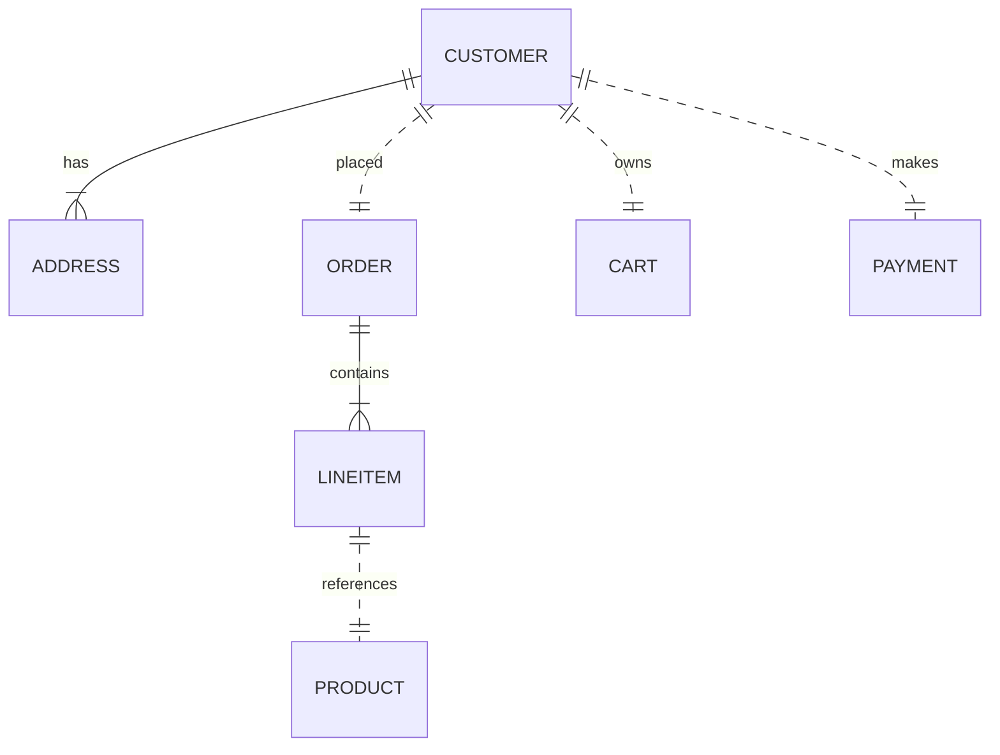

# MACH Alliance • Open Data Model Entity: `Customer`

## Table of contents

- [Entity: Customer](#entity-customer)
- [Purpose](#purpose)
- [Object: Customer](#object-customer)
- [Sample Object: B2C Customer](#sample-object-b2c-customer)
- [Sample Object: B2B Customer with multiple contacts](#sample-object-b2b-customer-with-multiple-contacts)
- [Core Components & Relationships](#core-components--relationships)
- [Typical Pitfalls](#typical-pitfalls)
 
---

## Purpose

A unified customer model that supports both B2B (company) and B2C (individual) use cases. The model is compatible with CDP and CRM-like systems and includes flexible metadata, contact structure, international-ready address support, and cross-platform referenceIds. This entity can in underlying MDM be referred to as `party` that then extends to a person or organization - but we try to keep it simple here.

The Entity describes:
- Customer identity and classification (person vs company)
- Contact information and communication preferences
- Address management for billing and shipping
- Cross-system integration and reference management
- Customer lifecycle and status tracking
- Extensible metadata and business-specific attributes

** Profiles & separation **
Profiles and customer data can be separated and stored in many ways. This sample is intended for transactional commerce. When separating concerns of identity, customer, profile etc. this guide might be useful:

Separation of concerns:
- Who is it? → Party, Identity, Profile
- How do we reach them? → Contact, Address
- What do they do or own? → Account, Transaction, Services or RoleAssignment
- What describes them in contect? → Traits.CommunicationPreference, traits.demographics
- What can we do with their data? → Traits.Consent

---
## Object: Customer

| Field         | Description | Practice |
|---------------|-------------|----------|
| `id`          | Unique identifier in given context (e.g., UUID, slug). | SHOULD |
| `type`        | Indicates `person` or `company`. | SHOULD |
| `status`      | Lifecycle status (`active`, `inactive`, `archived`). | SHOULD |
| `referenceIds`| Dictionary of cross-system IDs (e.g., CRM, ERP, Commerce Engine) to ease orchestration logic | SHOULD |
| `createdAt`   | Creation timestamp using [Timestamp](../utilities/timestamp.md) utility object. | SHOULD |
| `updatedAt`   | Update timestamp using [Timestamp](../utilities/timestamp.md) utility object. | SHOULD |
| `person`      | Object for person data. Only present if `type = person`. | COULD |
| `company`     | Object for company data. Only present if `type = company`. | COULD |
| `contacts`    | List of contact persons (only for `type = company`). | RECOMMENDED |
| `addresses`   | List of addresses (e.g., billing, shipping) using [Address](../utilities/address.md) utility object. | RECOMMENDED |
| `traits`      | Namespaced dictionary for extension data grouped by concern (e.g., `marketing`, `loyalty`, `preferences`). | RECOMMENDED |

---

## Sample Object: B2C Customer

```json
{
  "id": "cus_001",
  "type": "person",
  "status": "active",
  "referenceIds": {
    "crmContactId": "123456",
    "commerceEngine": "customer-98765",
    "loyaltySystem": "LOY123456"
  },
  "createdAt": "2025-06-01T12:00:00Z",
  "updatedAt": "2025-06-10T12:30:00Z",
  "person": {
    "firstName": "Emma",
    "lastName": "Larsen",
    "email": "emma@example.com",
    "phone": "+45 12345678",
    "jobTitle": "Marketing Manager"
  },
  "addresses": [
    {
      "type": "billing",
      "address": {
        "line1": "Strandvejen 100",
        "city": "Aarhus",
        "region": "Midtjylland",
        "postalCode": "8000",
        "country": "DK"
      }
    }
  ],
  "traits": {
    "marketing": {
      "consent": "optedIn",
      "preferences": ["email", "sms"],
      "source": "website"
    },
    "loyalty": {
      "points": 220,
      "tier": "silver",
      "source": "loyaltyEngine"
    },
    "preferences": {
      "language": "da-DK",
      "currency": "DKK",
      "timezone": "Europe/Copenhagen",
      "source": "IdentityProvider"
    }
  }
}
```

## Sample Object: B2B Customer with multiple contacts

B2B customer with company information and contacts.

```json
{
  "id": "cus_002",
  "type": "company",
  "status": "active",
  "referenceIds": {
    "crmAccountId": "CRM9012",
    "erpCustomerId": "ERP443322",
    "commerceEngine": "company-654321"
  },
  "createdAt": "2025-01-15T09:00:00Z",
  "updatedAt": "2025-06-15T14:20:00Z",
  "company": {
    "name": "ExampleTech Inc.",
    "vatNumber": "DK98765432",
    "registrationNumber": "DK12345678"
  },
  "contacts": [
    {
      "id": "CRMC90210",
      "firstName": "Thomas",
      "lastName": "Madsen",
      "email": "tm@example.com",
      "phone": "+45 87654321",
      "jobTitle": "Procurement Manager",
      "role": "primary",
      "source":"CRM"
    },
    {
      "id": "CRMC90212",
      "firstName": "Sophy",
      "lastName": "Nielsen",
      "email": "sn@example.com",
      "phone": "+45 87654322",
      "jobTitle": "Finance Controller",
      "role": "billing",
      "source":"ERP"
    }
  ],
  "addresses": [
    {
      "type": "billing",
      "address": {
        "line1": "Industry Road 5",
        "city": "Odense",
        "region": "Syddanmark",
        "postalCode": "5000",
        "country": "DK"
      }
    },
    {
      "type": "shipping",
      "address": {
        "line1": "Warehouse Street 12",
        "city": "Odense",
        "region": "Syddanmark",
        "postalCode": "5000",
        "country": "DK"
      }
    }
  ],
  "traits": {
    "b2b": {
      "accountType": "enterprise",
      "creditLimit": {
        "amount": 500000.00,
        "currency": "DKK"
      },
      "paymentTerms": "net30",
      "source": "erp"
    }
  }
}

```

---

## Core Components & Relationships

### Components

| Concept | Description | Typical Source of Truth |
|---------|-------------|--------------------------|
| ID | Unique customer identifier (internal). | CRM / CDP / Commerce Engine |
| ReferenceId | External system identifiers | Integration Layer |
| Person | Individual customer information | CRM / Commerce Engine |
| Company | Business customer information | CRM / ERP |
| Address | Customer billing/shipping location | Commerce Engine / OMS / ERP |
| Traits | Optional and scoped extensions | CDP / Loyalty / CRM |

### Typical Relationships



---

## Typical Pitfalls

- **Not distinguishing between `company` and `person` fields** - Keep these clearly separated using nested objects to avoid data confusion and maintain clear B2B/B2C separation.
- **Overloading a `meta` or `customVariables` field with unstructured data** - Use namespaced `traits` instead for better organization and extensibility.
- **Using `zip` or `zipcode` instead of `postalCode`** - Standardize on `postalCode` per ISO guidelines for international compatibility.
- **Forgetting that address records must be immutable on orders** - Always store a snapshot of customer information at the time of order to ensure traceability when customer info changes.
- **Not tracking source systems in traits** - Always include a `source` field in traits to maintain data lineage and identify the system of authority.
- **Poor handling of international phone numbers** - Use E.164 format (+[country code][number]) for consistent international phone number storage.
- **Inadequate email validation and uniqueness** - Implement proper email validation and consider email uniqueness constraints across systems.
- **Missing customer lifecycle management** - Track customer status changes and implement proper status transition logic.

---

> This MACH Alliance Canonical Data Model is intentionally __vendor-neutral__ and serves as a foundation for interoperability across composable architectures. It is __continually evolving__ through community contributions, which are reviewed and approved collaboratively.
>  
> All contributions are made under the __Creative Commons Attribution 4.0 International License (CC BY 4.0)__. By submitting a contribution, you agree to license your content under <a href="https://creativecommons.org/licenses/by/4.0/deed.en">CC BY 4.0</a>, allowing others to share and adapt the material with proper attribution.
>  
> We welcome and encourage continued improvements through community input. For more information and guidance on how to contribute, please refer to the <a href="https://github.com/machalliance/common-data-model/blob/main/contributing.md">Contributor Guide</a>.
