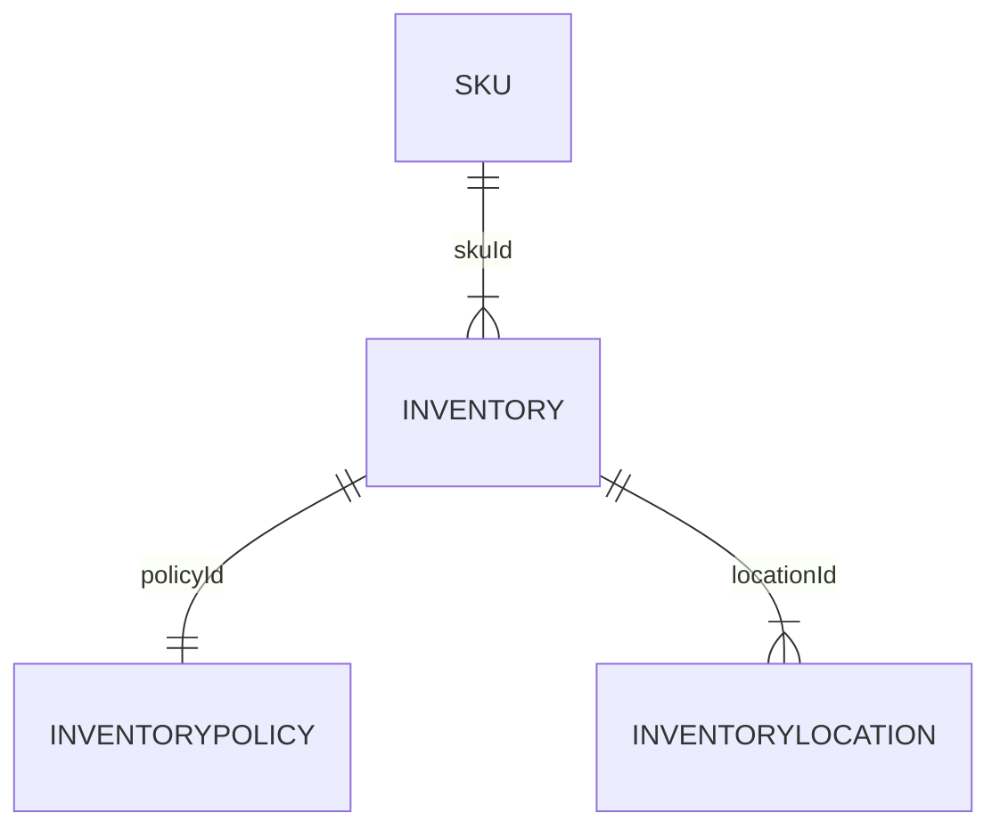

# MACH Alliance, Open Data Model Entity: `Inventory`

## Table of contents

- [Entity: Inventory](#entity-inventory)
- [Purpose](#purpose)
- [Object: Inventory](#object-inventory)
- [Sample Object: Inventory](#sample-object-inventory)
- [Core Components & Relationships](#core-components--relationships)
- [Typical Pitfalls](#typical-pitfalls)

 
---

## Purpose  
Holds the real-time, location-level stock picture for a single **SKU** so every channel can make consistent availability, reservation, and fulfilment decisions. 

---

## Object: Inventory

| Field            | Description                                                                                             | Practice |
|------------------|---------------------------------------------------------------------------------------------------------|----------|
| `id`             | Unique record ID (often composite `skuId-locationId`).                                                  | **SHOULD** |
| `status`         | Lifecycle state (`draft`, `active`, `inactive`).                                                        | **SHOULD** |
| `referenceIds`   | External keys (e.g. `sap`, `netsuite`, `wms`) for easy reconciliation.                                  | **SHOULD** |
| `createdAt`      | Creation timestamp using [Timestamp](../utilities/timestamp.md) utility object. | **SHOULD** |
| `updatedAt`      | Update timestamp using [Timestamp](../utilities/timestamp.md) utility object. | **SHOULD** |
| `skuId`          | Relationship to the SKU entity.                                                                                   | **SHOULD** |
| `locationId`     | Reference to the inventory location.                                                                   | **SHOULD** |
| `policyId`       | Reference to the inventory policy ruleset.                                                                    | **SHOULD** |
| `quantities`     | `{ onHand, reserved, available, incoming }` numbers (uses **Quantity** utility object).                 | **SHOULD** |
| `stockStatus`    | Snapshot state (`inStock`, `outOfStock`, `backorder`, `preorder`).                                      | **SHOULD** |
| `backorderable`  | Boolean flag allowing oversell under policy limits.                                                     | **COULD** |
| `backorderEta`   | Date an incoming PO or transfer replenishes stock.                                                      | **COULD** |
| `safetyStock`    | Absolute buffer removed from `available`.                                                               | **COULD** |
| `version`        | Integer for optimistic concurrency control.                                                             | **COULD** |
| `traits`         | Namespaced dictionary for optional domain data (e.g. `forecast`, `demandSignals`).                      | **COULD** |

---

## Sample Object: Inventory

```jsonc
{
  "id": "INV-SKU-123-LOC-DC-TOR",
  "status": "active",
  "referenceIds": {
    "sap": "100045-TOR",
    "netsuite": "NS-INV-77812"
  },
  "createdAt": "2025-03-12T09:00:00Z",
  "updatedAt": "2025-06-22T16:30:00Z",
  "skuId": "SKU-123",
  "locationId": "LOC-DC-TOR",
  "policyId": "POLICY-STD",
  "quantities": {
    "onHand": 120,
    "reserved": 15,
    "available": 105,
    "incoming": 40
  },
  "stockStatus": "inStock",
  "backorderable": true,
  "backorderEta": "2025-07-10T00:00:00Z",
  "safetyStock": 10,
  "version": 4,
  "traits": {
    "forecast": {
      "nextFourWeeksDemand": 90,
      "source": "demand_planner"
    },
    "demandSignals": {
      "last24hAddToCarts": 12,
      "source": "analytics"
    }
  }
}
````

---

## Core Components & Relationships

### Components

| Concept                 | Description                                  | Typical Source |
| ----------------------- | -------------------------------------------- | -------------- |
| **Inventory**           | Stock per SKU-location record.               | IMS / WMS      |
| **InventoryLocation**   | Physical or virtual node (DC, store, 3PL).   | WMS / OMS      |
| **InventoryPolicy**     | Oversell & safety-stock ruleset.             | OMS / IMS      |
| **InventoryAdjustment** | Immutable ledger of stock deltas.            | IMS / ERP      |
| **Availability Feed**   | Denormalised edge projection for fast reads. | CDN / API Edge |

### Typical Relationships



---

## Typical pitfalls

* **Stale edge caches** show in-stock when units are gone.
* **Race conditions** without soft-reserve tokens oversell popular SKUs.
* **Ignoring safety-stock** erodes fulfilment SLAs.
* **No immutable adjustments** hinders audit & shrinkage analysis.
* **Single global pool** breaks click-and-collect and ship-from-store.
* **Blocking WMS calls** at checkout slow the flow under peak load.&#x20;

---

>  This MACH Alliance Canonical Data Model is intentionally __vendor-neutral__ and serves as a foundation for interoperability across composable architectures. It is __continually evolving__ through community contributions, which are reviewed and approved collaboratively.
>  
>  All contributions are made under the __Creative Commons Attribution 4.0 International License (CC BY 4.0)__. By submitting a contribution, you agree to license your content under <a href="https://creativecommons.org/licenses/by/4.0/deed.en">CC BY 4.0</a>, allowing others to share and adapt the material with proper attribution.
>  
>  We welcome and encourage continued improvements through community input. For more information and guidance on how to contribute, please refer to the <a href="https://github.com/machalliance/common-data-model/blob/main/contributing.md">Contributor Guide</a>.
