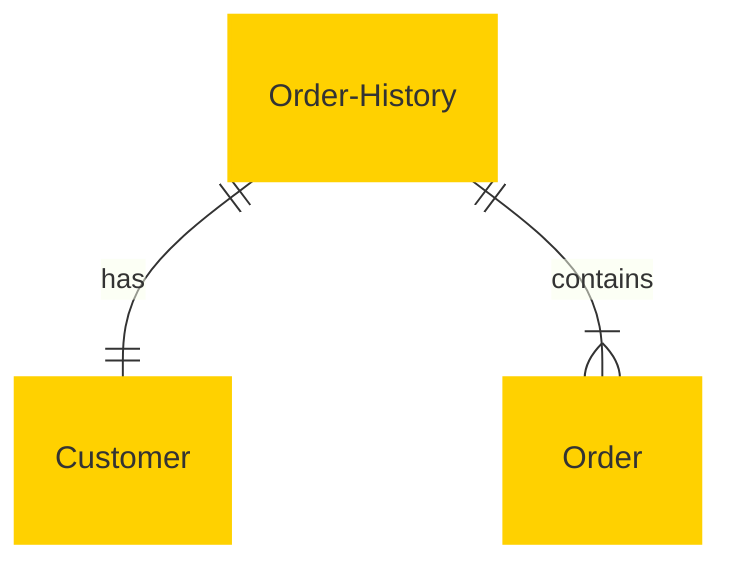

# MACH Alliance • Open Data Model Entity: `Order History`

## Table of contents
- [Entity: Order History](#entity-order-history)
- [Purpose](#purpose)
- [Object: Order History](#object-order-history)
- [Utility Object: OrderReference](#utility-object-orderreference)
- [Sample Object: Order History for a Customer](#sample-object-order-history-for-a-customer)
- [Core Components & Relationships](#core-components--relationships)
- [Typical Pitfalls](#typical-pitfalls)

---

## Purpose

The `Order History` entity represents a customer’s historical order activity, supporting order tracking, customer service inquiries, analytics, loyalty programs, and reordering flows. It links to past `Order` objects while capturing derived and contextual metadata. It is commonly used in Customer Profiles, Account Dashboards, CRM, CDPs, and Loyalty Systems.

The Entity describes:

- A historical list of orders per customer
- Aggregated metrics (total orders, last order, etc.)
- Canonical linkage to individual `Order` entities
- Contextual extensions (e.g. customer service flags, return rates, loyalty scoring)
- Auditability and interoperability across commerce and CRM systems

---

## Object: Order History

| Field              | Description                                                         | Practice     |
|--------------------|---------------------------------------------------------------------|--------------|
| `id`               | Unique identifier for the order history record (e.g. customer-based)| SHOULD       |
| `customer_id`       | Customer ID the history belongs to                                   | SHOULD       |
| `external_references`     | Cross-system identifiers (e.g. CDP, CRM, Commerce Engine)           | SHOULD       |
| `orders`           | List of order summary snapshots (uses `OrderReference` utility)     | SHOULD       |
| `aggregates`       | Metrics about order activity (e.g. count, totalSpent)               | SHOULD       |
| `created_at`        | Timestamp of when this history record was created                   | SHOULD       |
| `updated_at`        | Timestamp of last update                                            | SHOULD       |
| `extensions`           | Namespaced dictionary for contextual extensions                     | RECOMMENDED  |

---

### Utility Object: OrderReference

```json
{
  "order_id": "ORD-2024-0001",
  "status": "fulfilled",
  "order_date": "2024-06-12T14:23:00Z",
  "total": {
    "amount": 129.99,
    "currency": "USD"
  }
}
```

## Sample Object: Order History for a Customer

```json
{
  "id": "order-history-12345",
  "customer_id": "cus_001",
  "external_references": {
    "crm": "crm-001-abc",
    "cdp": "cdp-9988-xyz",
    "commerce": "cust-000123"
  },
  "orders": [
    {
      "order_id": "ORD-2024-0001",
      "status": "fulfilled",
      "order_date": "2024-06-12T14:23:00Z",
      "total": {
        "amount": 129.99,
        "currency": "USD"
      }
    },
    {
      "order_id": "ORD-2024-0002",
      "status": "returned",
      "order_date": "2024-06-01T10:05:00Z",
      "total": {
        "amount": 89.50,
        "currency": "USD"
      }
    }
  ],
  "aggregates": {
    "total_orders": 2,
    "fulfilled_orders": 1,
    "returned_orders": 1,
    "totalSpent": {
      "amount": 219.49,
      "currency": "USD"
    },
    "lastOrder_date": "2024-06-12T14:23:00Z"
  },
  "created_at": "2024-06-12T14:23:00Z",
  "updated_at": "2024-06-27T09:00:00Z",
  "extensions": {
    "loyalty": {
      "lifetime_value": {
        "amount": 219.49,
        "currency": "USD"
      },
      "pointsEarned": 220,
      "status": "silver",
      "source": "loyalty-platform"
    },
    "service": {
      "support_tickets": 1,
      "last_ticket_status": "resolved",
      "source": "zendesk"
    },
    "reordering": {
      "frequent_items": ["SKU-12345", "SKU-67890"],
      "nextLikely_order": "2024-07-15",
      "source": "recommendation-engine"
    }
  }
}
```
---

## Core Components & Relationships

### Components

| Concept         | Description                         | Typical Source of Truth       |
| --------------- | ----------------------------------- | ----------------------------- |
| Customer ID     | Identifier of associated customer   | CRM / Commerce Engine         |
| Order Reference | Summary data per historical order   | Order Management System (OMS) |
| Aggregates      | Derived KPIs from historical orders | Analytics Platform / CDP      |
| Extensions          | Contextual extensions scoped by domain  | Loyalty / Support / CDP       |
| Reference IDs   | Cross-system ID mapping             | Integration Layer             |

### Relationships


---

## Typical Pitfalls

- Not canonicalizing orders via `orderReference` — leading to schema duplication
- Overloading `extensions` without source system tagging — hinders interoperability
- Storing full `order` objects in history — leads to bloated, version-sensitive records
- Failing to normalize monetary values — causes inconsistencies in LTV or spend tracking
- Not aligning with order status definitions — breaks consistency across entities
- Missing timestamps — harms auditability and orchestration
- Not using extensions for cross-domain features — leads to rigid, hard-to-evolve models

---

>  This MACH Alliance Canonical Data Model is intentionally __vendor-neutral__ and serves as a foundation for interoperability across composable architectures. It is __continually evolving__ through community contributions, which are reviewed and approved collaboratively.
>  
>  All contributions are made under the __Creative Commons Attribution 4.0 International License (CC BY 4.0)__. By submitting a contribution, you agree to license your content under <a href="https://creativecommons.org/licenses/by/4.0/deed.en">CC BY 4.0</a>, allowing others to share and adapt the material with proper attribution.
>  
>  We welcome and encourage continued improvements through community input. For more information and guidance on how to contribute, please refer to the <a href="https://github.com/machalliance/common-data-model/blob/main/contributing.md">Contributor Guide</a>.

