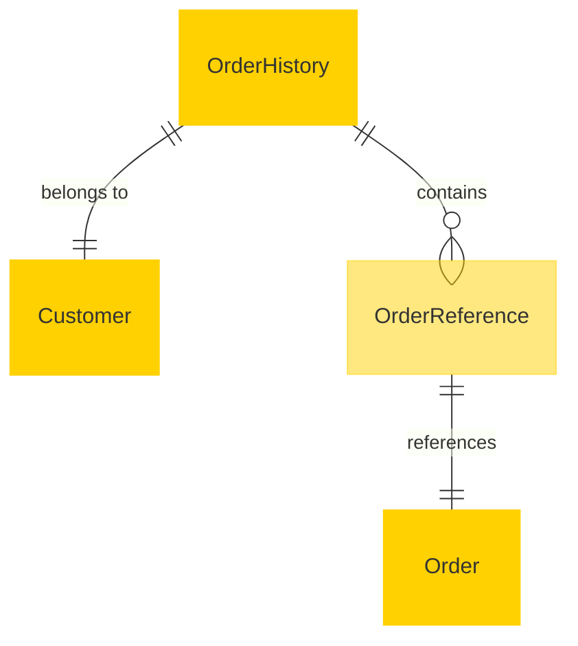

# MACH Alliance, Open Data Model Entity: `Order History`

## Table of contents

- [MACH Alliance, Open Data Model Entity: `Order History`](#mach-alliance-open-data-model-entity-order-history)
  - [Table of contents](#table-of-contents)
  - [Entity purpose](#entity-purpose)
  - [Object: Order History](#object-order-history)
  - [YAML Schema Definition](#yaml-schema-definition)
    - [Order History Schema](#order-history-schema)
    - [Supporting Type Definitions](#supporting-type-definitions)
  - [Sample Object: Minimal Order History](#sample-object-minimal-order-history)
  - [Sample Object: Full Order History](#sample-object-full-order-history)
  - [Core Components \& Relationships](#core-components--relationships)
    - [Components](#components)
    - [Typical Relationships](#typical-relationships)
  - [Typical pitfalls](#typical-pitfalls)

---

## Entity purpose

The Order History entity represents a customer's historical order activity, supporting order tracking, customer service inquiries, analytics, loyalty programs, and reordering flows. It links to past Order objects while capturing derived and contextual metadata. It is commonly used in Customer Profiles, Account Dashboards, CRM, CDPs, and Loyalty Systems.

The model supports:
- **Historical tracking**: Complete customer purchase history with order summaries
- **Analytics integration**: Aggregated metrics for customer lifetime value and behavior analysis
- **Customer service**: Quick access to order history for support inquiries
- **Loyalty programs**: Purchase history for points calculation and tier management
- **Reordering flows**: Frequent items and purchase pattern analysis
- **Cross-system sync**: Unified view across commerce, CRM, and CDP platforms

---

## Object: Order History

| Field                 | Description                                                                         | Practice    |
| --------------------- | ----------------------------------------------------------------------------------- | ----------- |
| `id`                  | Unique identifier for the order history record                                      | MUST        |
| `customer_id`         | Customer ID the history belongs to                                                  | MUST        |
| `external_references` | Dictionary of cross-system identifiers (CDP, CRM, Commerce Engine)                  | SHOULD      |
| `orders`              | Array of order summary snapshots                                                    | SHOULD      |
| `aggregates`          | Metrics about order activity (count, total spent, etc.)                            | SHOULD      |
| `created_at`          | ISO 8601 creation timestamp                                                         | SHOULD      |
| `updated_at`          | ISO 8601 update timestamp                                                           | SHOULD      |
| `version`             | Integer for optimistic concurrency control                                          | RECOMMENDED |
| `extensions`          | Namespaced dictionary for contextual extensions                                     | RECOMMENDED |

---

## YAML Schema Definition

### Order History Schema

```yaml
OrderHistory:
  type: object
  required:
    - id
    - customer_id
    - orders
  properties:
    # Core identification
    id:
      type: string
      description: Unique identifier for the order history record
      # example: "order-history-12345"

    customer_id:
      type: string
      description: Customer ID the history belongs to
      # example: "cus_001"

    # External references
    external_references:
      type: object
      description: Dictionary of cross-system identifiers
      additionalProperties:
        type: string
      # example:
      #   crm: "crm-001-abc"
      #   cdp: "cdp-9988-xyz"
      #   commerce: "cust-000123"

    # Order data
    orders:
      type: array
      items:
        $ref: "#/components/schemas/OrderReference"
      description: Array of order summary snapshots
      # example: List of historical orders with key details

    aggregates:
      $ref: "#/components/schemas/OrderAggregates"
      description: Metrics about order activity

    # Timestamps
    created_at:
      type: string
      format: date-time
      description: ISO 8601 creation timestamp

    updated_at:
      type: string
      format: date-time
      description: ISO 8601 update timestamp

    # Concurrency control
    version:
      type: integer
      description: Version number for optimistic concurrency control
      minimum: 0
      default: 0

    # Extensibility
    extensions:
      type: object
      description: Namespaced dictionary for contextual extensions
      additionalProperties: true
      # example:
      #   loyalty:
      #     lifetime_value: 219.49
      #     points_earned: 220
      #   service:
      #     support_tickets: 1
      #     last_ticket_status: "resolved"
```

### Supporting Type Definitions

```yaml
OrderReference:
  type: object
  required:
    - order_id
    - status
    - order_date
    - total
  properties:
    order_id:
      type: string
      description: Reference to the order entity
      # example: "ORD-2024-0001"

    status:
      type: string
      enum: ["new", "processing", "shipped", "delivered", "cancelled", "returned"]
      description: Order status at time of snapshot
      # example: "fulfilled"

    order_date:
      type: string
      format: date-time
      description: When the order was placed
      # example: "2024-06-12T14:23:00Z"

    total:
      $ref: "../utilities/money.yaml#/Money"
      description: Order total amount
      # example: {"amount": 129.99, "currency": "USD"}

OrderAggregates:
  type: object
  properties:
    total_orders:
      type: integer
      description: Total number of orders
      minimum: 0

    fulfilled_orders:
      type: integer
      description: Number of successfully fulfilled orders
      minimum: 0

    returned_orders:
      type: integer
      description: Number of returned orders
      minimum: 0

    cancelled_orders:
      type: integer
      description: Number of cancelled orders
      minimum: 0

    total_spent:
      $ref: "../utilities/money.yaml#/Money"
      description: Total amount spent across all orders

    average_order_value:
      $ref: "../utilities/money.yaml#/Money"
      description: Average order value

    last_order_date:
      type: string
      format: date-time
      description: Date of most recent order

    first_order_date:
      type: string
      format: date-time
      description: Date of first order
```

---

## Sample Object: Minimal Order History

Basic order history with essential fields only.

```json
{
  "id": "order-history-001",
  "customer_id": "cus_001",
  "orders": [
    {
      "order_id": "ORD-2024-0001",
      "status": "delivered",
      "order_date": "2024-06-12T14:23:00Z",
      "total": {
        "amount": 129.99,
        "currency": "USD"
      }
    }
  ]
}
```

## Sample Object: Full Order History

Complete order history with all fields populated.

```json
{
  "id": "order-history-12345",
  "customer_id": "cus_001",
  "external_references": {
    "crm": "crm-001-abc",
    "cdp": "cdp-9988-xyz",
    "commerce": "cust-000123"
  },
  "orders": [
    {
      "order_id": "ORD-2024-0001",
      "status": "delivered",
      "order_date": "2024-06-12T14:23:00Z",
      "total": {
        "amount": 129.99,
        "currency": "USD"
      }
    },
    {
      "order_id": "ORD-2024-0002",
      "status": "returned",
      "order_date": "2024-06-01T10:05:00Z",
      "total": {
        "amount": 89.50,
        "currency": "USD"
      }
    },
    {
      "order_id": "ORD-2024-0003",
      "status": "cancelled",
      "order_date": "2024-05-15T16:30:00Z",
      "total": {
        "amount": 45.00,
        "currency": "USD"
      }
    }
  ],
  "aggregates": {
    "total_orders": 3,
    "fulfilled_orders": 1,
    "returned_orders": 1,
    "cancelled_orders": 1,
    "total_spent": {
      "amount": 219.49,
      "currency": "USD"
    },
    "average_order_value": {
      "amount": 88.16,
      "currency": "USD"
    },
    "last_order_date": "2024-06-12T14:23:00Z",
    "first_order_date": "2024-05-15T16:30:00Z"
  },
  "created_at": "2024-05-15T16:30:00Z",
  "updated_at": "2024-06-27T09:00:00Z",
  "version": 5,
  "extensions": {
    "loyalty": {
      "lifetime_value": {
        "amount": 219.49,
        "currency": "USD"
      },
      "points_earned": 220,
      "tier": "silver",
      "source": "loyalty-platform"
    },
    "service": {
      "support_tickets": 1,
      "last_ticket_status": "resolved",
      "satisfaction_score": 4.5,
      "source": "zendesk"
    },
    "analytics": {
      "frequent_categories": ["electronics", "books"],
      "purchase_frequency": "monthly",
      "next_likely_order": "2024-07-15T00:00:00Z",
      "source": "recommendation-engine"
    }
  }
}
```

---

## Core Components & Relationships

### Components

| Concept            | Description                           | Typical Source of Truth |
| ------------------ | ------------------------------------- | ----------------------- |
| **Order History**  | Customer's complete order timeline    | CDP / CRM / OMS         |
| **Order Reference** | Summary snapshot of individual order  | OMS / Commerce Engine   |
| **Customer**       | Person or organization with history   | CRM / Commerce Engine   |
| **Aggregates**     | Derived metrics from order activity   | Analytics Platform      |
| **Extensions**     | Domain-specific contextual data       | Loyalty / Support / CDP |

### Typical Relationships



---

## Typical pitfalls

### Data Modeling Issues
- **Storing full order objects** - Including complete order data instead of lightweight references, causing bloated records and version conflicts
- **Missing order snapshots** - Not capturing order state at time of history creation, losing historical accuracy when orders change
- **Inconsistent aggregates** - Calculated metrics not matching actual order data due to timing or filtering differences

### Integration Problems
- **Poor external references** - Missing cross-system IDs making it difficult to sync history across CRM, CDP, and commerce platforms
- **No source attribution** - Extensions lacking source system identification, hindering data lineage and conflict resolution
- **Stale data handling** - Not properly updating history when orders change status or are modified

### Performance Issues
- **Unbounded growth** - Not implementing pagination or archiving strategies for customers with extensive order history
- **Missing indexes** - Not optimizing for common queries like date ranges, status filters, or customer lookups
- **Synchronous updates** - Blocking order processing to update history instead of using async patterns

### Business Logic Errors
- **Currency inconsistencies** - Not normalizing monetary values across different order currencies in aggregates
- **Status misalignment** - Using different order status definitions than the canonical Order entity
- **Incomplete aggregates** - Missing key metrics like return rates, average order value, or purchase frequency

### Architecture Problems
- **Tight coupling** - Making order history dependent on specific order schema versions instead of using stable references
- **Missing versioning** - No optimistic concurrency control leading to lost updates in high-frequency scenarios
- **Poor extension design** - Overloading extensions without proper namespacing or structure validation

### Data Quality Issues
- **Missing timestamps** - Not tracking when history records are created or updated, harming auditability
- **Duplicate entries** - Not properly deduplicating orders when rebuilding history from multiple sources
- **Inconsistent formatting** - Using different date formats or currency representations across order references

---

>  This MACH Alliance Canonical Data Model is intentionally __vendor-neutral__ and serves as a foundation for interoperability across composable architectures. It is __continually evolving__ through community contributions, which are reviewed and approved collaboratively.
>
>  All contributions are made under the __Creative Commons Attribution 4.0 International License (CC BY 4.0)__. By submitting a contribution, you agree to license your content under <a href="https://creativecommons.org/licenses/by/4.0/deed.en">CC BY 4.0</a>, allowing others to share and adapt the material with proper attribution.
>
>  We welcome and encourage continued improvements through community input. For more information and guidance on how to contribute, please refer to the <a href="../../CONTRIBUTING.md">Contributor Guide</a>.