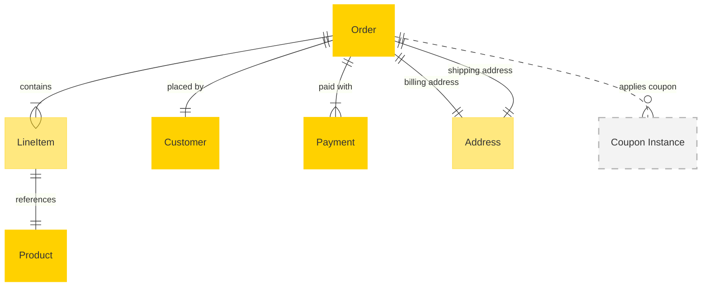

# MACH Alliance, Open Data Model Entity: `Order`

## Table of contents

- [MACH Alliance, Open Data Model Entity: `Order`](#mach-alliance-open-data-model-entity-order)
  - [Table of contents](#table-of-contents)
  - [Entity purpose](#entity-purpose)
  - [Object: Order](#object-order)
  - [YAML Schema Definition](#yaml-schema-definition)
    - [Order Schema](#order-schema)
    - [Supporting Type Definitions](#supporting-type-definitions)
  - [Sample Object: Minimal Order](#sample-object-minimal-order)
  - [Sample Object: Full Order](#sample-object-full-order)
  - [Sample Object: Multi-Payment Order](#sample-object-multi-payment-order)
  - [Core Components \& Relationships](#core-components--relationships)
    - [Components](#components)
    - [Typical Relationships](#typical-relationships)
  - [Typical pitfalls](#typical-pitfalls)

---

## Entity purpose

The Order entity represents the core transaction record in commerce and retail systems. It typically resides within Order Management Systems (OMS), Commerce Engines, Point of Sale (POS) systems, and Enterprise Resource Planning (ERP) solutions. The order model encapsulates crucial information about customer purchases, including item details, shipping information, payment data, and order status. It serves as the central data structure driving fulfillment processes, financial transactions, and customer communication workflows.

The model supports:
- **Transaction recording**: Complete purchase history with immutable audit trail
- **Multi-channel commerce**: Unified order structure across online, in-store, and mobile channels
- **Payment orchestration**: Support for multiple payment methods and split payments
- **Fulfillment coordination**: Integration with inventory, shipping, and delivery systems
- **Customer communication**: Order status updates and delivery notifications
- **Financial reconciliation**: Tax calculation, discount application, and revenue recognition

---

## Object: Order

| Field                 | Description                                                                         | Practice    |
| --------------------- | ----------------------------------------------------------------------------------- | ----------- |
| `id`                  | Unique order identifier (e.g., UUID, order number)                                 | MUST        |
| `order_number`        | Human-readable order number for customer reference                                  | SHOULD      |
| `customer_id`         | Reference to customer who placed the order                                          | SHOULD      |
| `status`              | Order lifecycle status (`new`, `processing`, `shipped`, `delivered`, `cancelled`)   | SHOULD      |
| `external_references` | Dictionary of cross-system IDs (e.g., ERP, OMS, payment gateway)                    | SHOULD      |
| `created_at`          | ISO 8601 creation timestamp                                                         | SHOULD      |
| `updated_at`          | ISO 8601 update timestamp                                                           | SHOULD      |
| `currency`            | ISO 4217 currency code (e.g., `USD`, `EUR`, `NOK`)                                 | SHOULD      |
| `total`               | Total order amount including tax and shipping                                       | SHOULD      |
| `sub_total`           | Subtotal before tax and shipping                                                    | SHOULD      |
| `tax_total`           | Total tax amount                                                                    | SHOULD      |
| `shipping_total`      | Total shipping cost                                                                 | SHOULD      |
| `discount_total`      | Total discounts applied                                                             | COULD       |
| `line_items`          | Array of items purchased                                                            | SHOULD      |
| `billing_address`     | Billing address using the shared address utility object                            | RECOMMENDED |
| `shipping_address`    | Shipping address using the shared address utility object                           | RECOMMENDED |
| `payments`            | Array of payment transactions                                                       | RECOMMENDED |
| `version`             | Integer for optimistic concurrency control                                          | RECOMMENDED |
| `extensions`          | Namespaced dictionary for extension data grouped by concern                         | RECOMMENDED |

---

## YAML Schema Definition

### Order Schema

```yaml
Order:
  type: object
  required:
    - id
    - status
    - currency
    - total
    - line_items
  properties:
    # Core identification
    id:
      type: string
      description: Unique order identifier
      # example: "ord_12345" or "ORD-2024-001234"

    order_number:
      type: string
      description: Human-readable order number for customer reference
      # example: "10284"

    customer_id:
      type: string
      description: Reference to customer who placed the order
      # example: "cus_4741044683"

    # Status and lifecycle
    status:
      type: string
      enum: ["new", "processing", "shipped", "delivered", "cancelled", "returned"]
      description: Order lifecycle status
      # example: "processing"

    # External references
    external_references:
      type: object
      description: Dictionary of cross-system IDs
      additionalProperties:
        type: string
      # example:
      #   erp_order_id: "ERP-67890"
      #   oms_id: "OMS-12345"
      #   payment_gateway_id: "PG-98765"

    # Timestamps
    created_at:
      type: string
      format: date-time
      description: ISO 8601 creation timestamp

    updated_at:
      type: string
      format: date-time
      description: ISO 8601 update timestamp

    # Financial details
    currency:
      type: string
      pattern: "^[A-Z]{3}$"
      description: ISO 4217 currency code
      # example: "USD", "EUR", "NOK"

    total:
      type: number
      description: Total order amount including tax and shipping
      minimum: 0

    sub_total:
      type: number
      description: Subtotal before tax and shipping
      minimum: 0

    tax_total:
      type: number
      description: Total tax amount
      minimum: 0
      default: 0

    shipping_total:
      type: number
      description: Total shipping cost
      minimum: 0
      default: 0

    discount_total:
      type: number
      description: Total discounts applied
      minimum: 0
      default: 0

    # Order contents
    line_items:
      type: array
      items:
        $ref: "#/components/schemas/LineItem"
      description: Array of items purchased
      minItems: 1

    # Addresses
    billing_address:
      $ref: "../utilities/address.yaml#/Address"
      description: Billing address

    shipping_address:
      $ref: "../utilities/address.yaml#/Address"
      description: Shipping address

    # Payments
    payments:
      type: array
      items:
        $ref: "#/components/schemas/Payment"
      description: Array of payment transactions

    # Concurrency control
    version:
      type: integer
      description: Version number for optimistic concurrency control
      minimum: 0
      default: 0

    # Extensibility
    extensions:
      type: object
      description: Namespaced dictionary for extension data
      additionalProperties: true
      # example:
      #   fulfillment:
      #     channel: "online"
      #     estimated_delivery: "2023-06-10T00:00:00Z"
      #   analytics:
      #     campaign_id: "LOYAL10"
      #     source: "segment"
```

### Supporting Type Definitions

```yaml
LineItem:
  type: object
  required:
    - id
    - product_id
    - sku
    - name
    - quantity
    - unit_price
    - total_price
  properties:
    id:
      type: string
      description: Unique line item identifier

    product_id:
      type: string
      description: Reference to the product

    sku:
      type: string
      description: Stock keeping unit identifier

    name:
      type: string
      description: Product name at time of purchase

    quantity:
      type: integer
      description: Quantity ordered
      minimum: 1

    unit_price:
      type: number
      description: Price per unit before discounts
      minimum: 0

    total_price:
      type: number
      description: Total price after discounts and before tax
      minimum: 0

    discount_amount:
      type: number
      description: Total discount applied to this line item
      minimum: 0
      default: 0

    tax_amount:
      type: number
      description: Tax amount for this line item
      minimum: 0
      default: 0

    tax_rate:
      type: number
      description: Tax rate percentage applied
      minimum: 0
      maximum: 100

    properties:
      type: array
      items:
        type: object
        properties:
          name:
            type: string
          value:
            type: string
      description: Product variant properties (size, color, etc.)

Payment:
  type: object
  required:
    - id
    - amount
    - currency
    - method
    - status
  properties:
    id:
      type: string
      description: Unique payment identifier

    amount:
      type: number
      description: Payment amount
      minimum: 0

    currency:
      type: string
      pattern: "^[A-Z]{3}$"
      description: ISO 4217 currency code

    method:
      type: string
      description: Payment method used
      # example: "credit_card", "paypal", "klarna", "store_credit"

    status:
      type: string
      enum: ["pending", "processing", "processed", "failed", "cancelled", "refunded"]
      description: Payment status

    transaction_id:
      type: string
      description: External payment processor transaction ID

    processed_at:
      type: string
      format: date-time
      description: When the payment was processed

    coupon_id:
      type: string
      description: Coupon or store credit identifier if applicable
```

---

## Sample Object: Minimal Order

Basic order with essential fields only.

```json
{
  "id": "ord_001",
  "status": "new",
  "currency": "USD",
  "total": 29.99,
  "line_items": [
    {
      "id": "li_001",
      "product_id": "prod_123",
      "sku": "BASIC-TEE-M",
      "name": "Basic T-Shirt",
      "quantity": 1,
      "unit_price": 29.99,
      "total_price": 29.99
    }
  ]
}
```

## Sample Object: Full Order

Complete order with all fields populated.

```json
{
  "id": "ord_12345",
  "order_number": "10284",
  "customer_id": "cus_4741044683",
  "status": "processing",
  "external_references": {
    "erp_order_id": "ERP-67890",
    "oms_id": "OMS-12345",
    "payment_gateway_id": "PG-98765"
  },
  "created_at": "2023-06-03T08:55:31Z",
  "updated_at": "2023-06-03T09:15:00Z",
  "currency": "NOK",
  "total": 36519.2,
  "sub_total": 29215.36,
  "tax_total": 7303.84,
  "shipping_total": 0,
  "discount_total": 4079.8,
  "version": 3,
  "line_items": [
    {
      "id": "li_89c50254",
      "product_id": "c-56235",
      "sku": "c-56235-58",
      "name": "Cannondale Synapse Carbon disc",
      "quantity": 1,
      "unit_price": 38900,
      "total_price": 34990.93,
      "discount_amount": 3909.07,
      "tax_amount": 6998.19,
      "tax_rate": 25,
      "properties": [
        {"name": "size", "value": "58"},
        {"name": "color", "value": "Deep blue"}
      ]
    },
    {
      "id": "li_7ba2282a",
      "product_id": "cb-9988",
      "sku": "cb-9988",
      "name": "CamelBak Podium Chill Bottle 710ml",
      "quantity": 1,
      "unit_price": 199,
      "total_price": 0,
      "discount_amount": 199,
      "tax_amount": 0,
      "properties": [
        {"name": "color", "value": "White"}
      ]
    }
  ],
  "billing_address": {
    "line1": "Hoffsveien 1a",
    "line2": "Apt 123",
    "city": "Oslo",
    "region": "",
    "postal_code": "0275",
    "country": "NO"
  },
  "shipping_address": {
    "line1": "Hoffsveien 1a",
    "line2": "Apt 123",
    "city": "Oslo",
    "region": "",
    "postal_code": "0275",
    "country": "NO"
  },
  "payments": [
    {
      "id": "pay_1",
      "amount": 36519.2,
      "currency": "NOK",
      "method": "klarna_checkout",
      "status": "processed",
      "transaction_id": "38a53650-9cb8-6f85-a4fe-617edb3fbb24",
      "processed_at": "2023-06-03T09:00:00Z"
    }
  ],
  "extensions": {
    "fulfillment": {
      "channel": "online",
      "market_id": "NOR",
      "estimated_delivery": "2023-06-10T00:00:00Z",
      "source": "shopify"
    },
    "analytics": {
      "campaign_id": "LOYAL10",
      "cart_id": "C100197",
      "source": "segment"
    },
    "loyalty": {
      "points_earned": 365,
      "tier_at_purchase": "gold",
      "source": "talonone"
    }
  }
}
```

## Sample Object: Multi-Payment Order

Order with multiple payment methods including store credit.

```json
{
  "id": "ord_67890",
  "order_number": "10285",
  "customer_id": "cus_9876543",
  "status": "processing",
  "currency": "USD",
  "total": 150.00,
  "sub_total": 140.00,
  "tax_total": 10.00,
  "shipping_total": 0,
  "discount_total": 0,
  "line_items": [
    {
      "id": "li_001",
      "product_id": "prod_456",
      "sku": "PREMIUM-JACKET-L",
      "name": "Premium Winter Jacket",
      "quantity": 1,
      "unit_price": 140.00,
      "total_price": 140.00,
      "tax_amount": 10.00,
      "tax_rate": 7.14
    }
  ],
  "payments": [
    {
      "id": "pay_store_credit",
      "amount": 50.00,
      "currency": "USD",
      "method": "store_credit",
      "coupon_id": "STORE-CREDIT-123",
      "status": "processed",
      "processed_at": "2023-06-03T09:00:00Z"
    },
    {
      "id": "pay_card",
      "amount": 100.00,
      "currency": "USD",
      "method": "credit_card",
      "status": "processed",
      "transaction_id": "cc_txn_789456",
      "processed_at": "2023-06-03T09:01:00Z"
    }
  ]
}
```

---

## Core Components & Relationships

### Components

| Concept      | Description                                    | Typical Source of Truth |
| ------------ | ---------------------------------------------- | ----------------------- |
| **Order**    | Overall purchase transaction record            | OMS / Commerce Engine   |
| **LineItem** | Individual product or service in the order     | OMS / Commerce Engine   |
| **Payment**  | Financial transaction associated with the order | Payment Gateway / OMS   |
| **Customer** | Person or organization making the purchase     | CRM / Commerce Engine   |
| **Address**  | Shipping and billing locations                 | OMS / Commerce Engine   |
| **Product**  | Item being purchased                           | PIM / Commerce Engine   |

### Typical Relationships



---

## Typical pitfalls

### Data Integrity Issues
- **Missing immutable snapshots** - Not storing product names, prices, and addresses at time of order, making historical data unreliable
- **Inconsistent currency handling** - Mixing currencies within an order or not specifying precision for monetary calculations
- **Poor version control** - No optimistic locking leading to concurrent update conflicts

### Integration Problems
- **Inadequate external references** - Missing cross-system IDs making order orchestration across OMS, ERP, and fulfillment systems difficult
- **Poor inventory integration** - Line items lacking sufficient product reference data for inventory lookups and allocation
- **Weak payment reconciliation** - Payment records not linking properly to external payment processor transactions

### Business Logic Errors
- **Inflexible status model** - Using rigid status enums that don't support complex fulfillment workflows or partial shipments
- **Insufficient multi-channel support** - Not distinguishing between online, in-store, mobile, and marketplace orders in extensions
- **Complex pricing in wrong place** - Embedding discount calculations and tax logic in custom fields instead of structured fields

### Architecture Issues
- **Overloaded order model** - Trying to handle shipments, returns, and fulfillment status within the order instead of separate entities
- **Missing audit trail** - No immutable record of order changes for compliance and customer service
- **Poor extension design** - Using unstructured metadata instead of namespaced extensions with clear ownership

### Performance Problems
- **Missing indexes** - Not optimizing for common queries like customer order history or status-based searches
- **Synchronous payment processing** - Blocking order creation on payment gateway responses instead of async processing
- **No caching strategy** - Repeatedly calculating totals and availability instead of caching computed values

---

>  This MACH Alliance Canonical Data Model is intentionally __vendor-neutral__ and serves as a foundation for interoperability across composable architectures. It is __continually evolving__ through community contributions, which are reviewed and approved collaboratively.
>
>  All contributions are made under the __Creative Commons Attribution 4.0 International License (CC BY 4.0)__. By submitting a contribution, you agree to license your content under <a href="https://creativecommons.org/licenses/by/4.0/deed.en">CC BY 4.0</a>, allowing others to share and adapt the material with proper attribution.
>
>  We welcome and encourage continued improvements through community input. For more information and guidance on how to contribute, please refer to the <a href="../../CONTRIBUTING.md">Contributor Guide</a>.