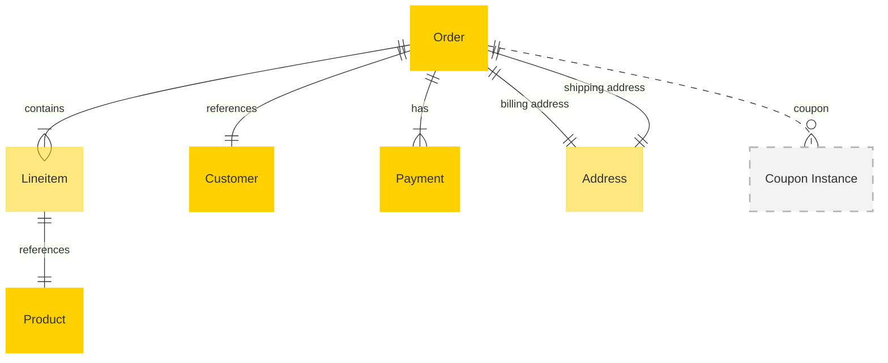

# MACH Alliance • Open Data Model Entity: `Order`

## Table of contents

- [Purpose](#purpose)
- [Object: Order](#object-order)
- [Sample Object: Order](#sample-object-order)
- [Sample Object: LineItem](#sample-object-lineitem)
- [Sample Object: Payment](#sample-object-payment)
- [Core Components & Relationships](#core-components--relationships)
- [Typical Pitfalls](#typical-pitfalls)


 
---

## Purpose
The Order entity represents the core transaction record in commerce and retail systems. It typically resides within Order Management Systems (OMS), Commerce Engines, Point of Sale (POS) systems, and Enterprise Resource Planning (ERP) solutions. The order model encapsulates crucial information about customer purchases, including item details, shipping information, payment data, and order status. It serves as the central data structure driving fulfillment processes, financial transactions, and customer communication workflows.

The 'Order' entity represents:
* _A record of what the customer has purchased_
* _Where to ship the order_
* _Who made the purchase_
* _Using what payment method_
* _Via which channel_
* _And the order status_

---

## Object: Order

| Field | Description | Practice |
|-------|-------------|----------|
| `id` | Unique order identifier (e.g., UUID, order number). | SHOULD |
| `order_number` | Human-readable order number for customer reference. | SHOULD |
| `customer_id` | Reference to customer who placed the order. | SHOULD |
| `status` | Order lifecycle status (`new`, `processing`, `shipped`, `delivered`, `cancelled`). | SHOULD |
| `external_references` | Dictionary of cross-system IDs (e.g., ERP, OMS, payment gateway) to ease orchestration logic. | SHOULD |
| `created_at` | Creation timestamp using [timestamp](../utilities/timestamp.md) utility object. | SHOULD |
| `updated_at` | Update timestamp using [timestamp](../utilities/timestamp.md) utility object. | SHOULD |
| `currency` | ISO 4217 currency code (e.g., `USD`, `EUR`, `NOK`). | SHOULD |
| `total` | Total order amount including tax and shipping. | SHOULD |
| `subTotal` | Subtotal before tax and shipping. | SHOULD |
| `taxTotal` | Total tax amount. | SHOULD |
| `shippingTotal` | Total shipping cost. | SHOULD |
| `discountTotal` | Total discounts applied. | COULD |
| `line_items` | Array of items purchased. | SHOULD |
| `billing_address` | Billing address using the shared [address](../utilities/address.md) utility object. | RECOMMENDED |
| `shipping_address` | Shipping address using the shared [address](../utilities/address.md) utility object. | RECOMMENDED |
| `payments` | Array of payment transactions. | RECOMMENDED |
| `extensions` | Namespaced dictionary for extension data grouped by concern (e.g., `fulfillment`, `analytics`, `loyalty`). | RECOMMENDED |

---

## Sample Object: Order

```json
{
  "id": "ord_12345",
  "order_number": "10284",
  "customer_id": "cus_4741044683",
  "status": "processing",
  "external_references": {
    "erp_order_id": "ERP-67890",
    "oms_id": "OMS-12345",
    "paymentGateway_id": "PG-98765"
  },
  "created_at": "2023-06-03T08:55:31Z",
  "updated_at": "2023-06-03T09:15:00Z",
  "currency": "NOK",
  "total": 36519.2,
  "sub_total": 29215.36,
  "tax_total": 7303.84,
  "shipping_total": 0,
  "discount_total": 4079.8,
  "extensions": {
    "fulfillment": {
      "channel": "online",
      "market_id": "NOR",
      "estimated_delivery": "2023-06-10T00:00:00Z",
      "source": "shopify"
    },
    "analytics": {
      "campaign_id": "LOYAL10",
      "cart_id": "C100197",
      "source": "segment"
    },
    "loyalty": {
      "points_earned": 365,
      "tier_at_purchase": "gold",
      "source": "talonone"
    }
  },
  "line_items": [
    {
      "id": "li_89c50254",
      "product_id": "c-56235",
      "sku": "c-56235-58",
      "name": "Cannondale Synapse Carbon disc",
      "quantity": 1,
      "unit_price": 38900,
      "total_price": 34990.93,
      "discount_amount": 3909.07,
      "tax_amount": 6998.19,
      "properties": [
        {"name": "size", "value": "58"},
        {"name": "color", "value": "Deep blue"}
      ]
    },
    {
      "id": "li_7ba2282a",
      "product_id": "cb-9988",
      "sku": "cb-9988",
      "name": "CamelBak Podium Chill Bottle 710ml",
      "quantity": 1,
      "unit_price": 199,
      "total_price": 0,
      "discount_amount": 199,
      "tax_amount": 0,
      "properties": [
        {"name": "color", "value": "White"}
      ]
    }
  ],
  "billing_address": {
    "line1": "Hoffsveien 1a",
    "line2": "Apt 123",
    "city": "Oslo",
    "region": "",
    "postal_code": "0275",
    "country": "NO"
  },
  "shipping_address": {
    "line1": "Hoffsveien 1a",
    "line2": "Apt 123",
    "city": "Oslo",
    "region": "",
    "postal_code": "0275",
    "country": "NO"
  },
  "payments": [
    {
      "id": "pay_1",
      "amount": 36519.2,
      "currency": "NOK",
      "method": "KlarnaCheckout",
      "status": "processed",
      "transaction_id": "38a53650-9cb8-6f85-a4fe-617edb3fbb24",
      "processed_at": "2023-06-03T09:00:00Z"
    }
  ]
}
```

---

## Sample Object: LineItem

```json
{
  "id": "li_89c50254",
  "product_id": "c-56235",
  "sku": "c-56235-58",
  "name": "Cannondale Synapse Carbon disc",
  "quantity": 1,
  "unit_price": 38900,
  "total_price": 34990.93,
  "discount_amount": 3909.07,
  "tax_amount": 6998.19,
  "tax_rate": 25,
  "properties": [
    {"name": "size", "value": "58"},
    {"name": "color", "value": "Deep blue"}
  ]
}
```

---

## Sample Object: Payment

```json
{
  "id": "pay_1",
  "amount": 36519.2,
  "currency": "NOK",
  "method": "KlarnaCheckout",
  "status": "processed",
  "transaction_id": "38a53650-9cb8-6f85-a4fe-617edb3fbb24",
  "processed_at": "2023-06-03T09:00:00Z"
}
```

## Sample Object: Payment (from coupon)

```json
{
  "id": "pay_2",
  "amount": 10.00,
  "currency": "USD",
  "method": "store_credit",
  "coupon_id": "COUP-INST-006",
  "status": "processed",
  "transaction_id": "38a53650-9cb8-6f85-a4fe-617edb3fbb24",
  "processed_at": "2023-06-03T09:00:00Z"
}
```

---

## Core Components & Relationships

### Components

| Concept | Description | Typical Source of Truth |
|---------|-------------|--------------------------|
| Order | Overall purchase transaction | OMS / Commerce Engine |
| LineItem | Individual product or service in the order | OMS / Commerce Engine |
| Payment | Financial transaction associated with the order | Payment Gateway / OMS |
| Customer | Person or organization making the purchase | CRM / Commerce Engine |
| Address | Shipping and billing locations | OMS / Commerce Engine |

### Typical Relationships



---

## Typical Pitfalls

- Inadequate support for multi-channel orders. Use `extensions.fulfillment.channel` to distinguish between online, in-store, and other channels.
- Poor integration with inventory systems. Ensure `line_items` contain sufficient product reference data for inventory lookups.
- Insufficient handling of complex pricing scenarios. Use structured discount and tax fields rather than embedding calculations in custom fields.
- Lack of support for multi-currency orders. Always specify `currency` at the order level and ensure all monetary amounts use consistent precision.
- Inadequate order status tracking. Use standardized status values and leverage `extensions` for system-specific status extensions.
- Poor handling of partial shipments. Consider using separate shipment entities rather than overloading the order model.
- Forgetting that order records must be immutable for audit purposes. Always store snapshots of addresses and pricing at time of order.


---

>  This MACH Alliance Canonical Data Model is intentionally __vendor-neutral__ and serves as a foundation for interoperability across composable architectures. It is __continually evolving__ through community contributions, which are reviewed and approved collaboratively.
>  
>  All contributions are made under the __Creative Commons Attribution 4.0 International License (CC BY 4.0)__. By submitting a contribution, you agree to license your content under <a href="https://creativecommons.org/licenses/by/4.0/deed.en">CC BY 4.0</a>, allowing others to share and adapt the material with proper attribution.
>  
>  We welcome and encourage continued improvements through community input. For more information and guidance on how to contribute, please refer to the <a href="https://github.com/machalliance/common-data-model/blob/main/contributing.md">Contributor Guide</a>.
