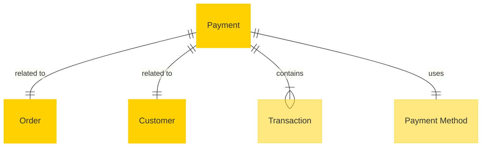

# MACH Alliance • Open Data Model Entity: `Payment`

## Table of contents

- [Purpose](#purpose)
- [Object: Payment](#object-payment)
- [Sample Object: Payment](#sample-object-payment)
- [Sample Object: Transaction](#sample-object-transaction)
- [Sample Object: Refund Payment](#sample-object-refund-payment)
- [Core Components & Relationships](#core-components--relationships)
- [Typical Pitfalls](#typical-pitfalls)
 
---

## Purpose
The Payment entity represents the financial transaction component within eCommerce and retail systems. It primarily resides within Payment Service Providers (PSP), Payment Gateways, Order Management Systems (OMS), and Enterprise Resource Planning (ERP) solutions. The payment model manages the complete lifecycle of financial transactions, from authorization to settlement, supporting various payment methods, currencies, and regulatory requirements. It serves as the critical link between order processing and financial systems, ensuring secure and compliant monetary transactions.

Represents a payment transaction associated with an order, including payment method details, status, and transaction history.

* Payment method details
* Payment status
* Payment amount
* Transaction history

---

## Object: Payment

| Field | Description | Practice |
|-------|-------------|----------|
| `id` | Unique payment identifier (e.g., UUID). | SHOULD |
| `order_id` | Reference to the associated order. | SHOULD |
| `customer_id` | Reference to customer making the payment. | SHOULD |
| `amount` | Payment amount using [money](../utilities/money.md) utility object. | SHOULD |
| `currency` | ISO 4217 currency code (e.g., `USD`, `EUR`, `NOK`). | SHOULD |
| `status` | Payment status (`pending`, `authorized`, `captured`, `refunded`, `failed`, `cancelled`). | SHOULD |
| `method` | Payment method type (`card`, `bank_transfer`, `digital_wallet`, `buy_now_pay_later`). | SHOULD |
| `provider` | Payment service provider (e.g., `stripe`, `klarna`, `paypal`). | SHOULD |
| `external_references` | Dictionary of cross-system IDs (e.g., gateway transaction ID, PSP reference) to ease orchestration logic. | SHOULD |
| `created_at` | Creation timestamp using [timestamp](../utilities/timestamp.md) utility object. | SHOULD |
| `updated_at` | Update timestamp using [timestamp](../utilities/timestamp.md) utility object. | SHOULD |
| `processed_at` | Processing timestamp using [timestamp](../utilities/timestamp.md) utility object. | COULD |
| `transactions` | Array of transaction operations (auth, capture, refund). | RECOMMENDED |
| `method_details` | Payment method specific details (masked/tokenized). | COULD |
| `extensions` | Namespaced dictionary for extension data grouped by concern (e.g., `fraud`, `reconciliation`, `analytics`). | RECOMMENDED |

---

## Sample Object: Payment

```json
{
  "id": "pay_776f9240",
  "order_id": "ord_12345",
  "customer_id": "cus_4741044683",
  "amount": 3651920,
  "currency": "NOK",
  "status": "captured",
  "method": "card",
  "provider": "stripe",
  "external_references": {
    "stripe_payment_intent_id": "pi_3NkM8w2eZvKYlo2C1",
    "stripe_charge_id": "ch_3NkM8w2eZvKYlo2C1",
    "merchant_reference": "ORD-12345-PAY-1"
  },
  "created_at": "2023-06-03T08:54:11Z",
  "updated_at": "2023-06-03T08:55:00Z",
  "processed_at": "2023-06-03T08:55:00Z",
  "extensions": {
    "fraud": {
      "risk_score": 0.15,
      "risk_level": "low",
      "checks": ["cvv_pass", "address_pass"],
      "source": "stripe_radar"
    },
    "reconciliation": {
      "settlement_date": "2023-06-05",
      "batch_id": "batch_20230605_001",
      "fees": 1095,
      "source": "stripe"
    },
    "analytics": {
      "conversion_flow_id": "flow_checkout_123",
      "payment_attempts": 1,
      "time_to_complete": 45,
      "source": "segment"
    }
  },
  "transactions": [
    {
      "id": "txn_authorization_001",
      "type": "authorization",
      "amount": 3651920,
      "status": "success",
      "timestamp": "2023-06-03T08:54:24Z",
      "reference": "ch_3NkM8w2eZvKYlo2C1"
    },
    {
      "id": "txn_capture_001",
      "type": "capture",
      "amount": 3651920,
      "status": "success",
      "timestamp": "2023-06-03T08:55:00Z",
      "reference": "ch_3NkM8w2eZvKYlo2C1_cap"
    }
  ],
  "method_details": {
    "brand": "visa",
    "last4": "4242",
    "expiry_month": 12,
    "expiry_year": 2024,
    "fingerprint": "Xt5EWLLDS7FJjR1c"
  }
}
```

---

## Sample Object: Transaction

```json
{
  "id": "txn_authorization_001",
  "type": "authorization",
  "amount": 3651920,
  "status": "success",
  "timestamp": "2023-06-03T08:54:24Z",
  "reference": "ch_3NkM8w2eZvKYlo2C1",
  "error": null
}
```

---

## Sample Object: Refund Payment

```json
{
  "id": "pay_refund_456",
  "order_id": "ord_12345",
  "customer_id": "cus_4741044683",
  "amount": -1000000,
  "currency": "NOK",
  "status": "refunded",
  "method": "card",
  "provider": "stripe",
  "external_references": {
    "stripe_refund_id": "re_3NkM8w2eZvKYlo2C1",
    "original_payment_id": "pay_776f9240",
    "merchant_reference": "REF-12345-001"
  },
  "created_at": "2023-06-10T14:30:00Z",
  "updated_at": "2023-06-10T14:30:15Z",
  "processed_at": "2023-06-10T14:30:15Z",
  "extensions": {
    "reconciliation": {
      "refund_reason": "customer_request",
      "refund_type": "partial",
      "source": "customer_service"
    }
  },
  "transactions": [
    {
      "id": "txn_refund_001",
      "type": "refund",
      "amount": -1000000,
      "status": "success",
      "timestamp": "2023-06-10T14:30:15Z",
      "reference": "re_3NkM8w2eZvKYlo2C1"
    }
  ]
}
```

---

## Core Components & Relationships

### Components

| Concept | Description | Typical Source of Truth |
|---------|-------------|--------------------------|
| Payment | Overall payment transaction | Payment Gateway / OMS |
| Transaction | Individual payment operations (auth, capture, refund) | Payment Gateway |
| Order | Purchase transaction being paid for | OMS / Commerce Engine |
| Customer | Person or organization making the payment | CRM / Commerce Engine |
| Payment Method | Type and details of payment instrument | Payment Gateway |

### Typical Relationships



---

## Typical Pitfalls

- Inadequate handling of payment security requirements. Never store sensitive payment data - use tokenization and reference payment gateway records.
- Poor management of payment state transitions. Use clear status enums and ensure proper state machine logic for status changes.
- Insufficient error handling for failed transactions. Always capture error codes and messages for debugging and customer communication.
- Lack of support for multiple payment methods and providers. Use standardized method types and leverage `extensions` for provider-specific extensions.
- Incomplete transaction logging and audit trails. Store all transaction attempts, not just successful ones, with proper timestamps.
- Poor handling of refunds and partial payments. Use negative amounts for refunds and maintain clear references to original payments.
- Storing amounts as floating point numbers. Always use integers in smallest currency unit (cents) to avoid rounding errors.
- Insufficient handling of asynchronous payment flows. Design for eventual consistency and webhook-based status updates.

---

>  This MACH Alliance Canonical Data Model is intentionally __vendor-neutral__ and serves as a foundation for interoperability across composable architectures. It is __continually evolving__ through community contributions, which are reviewed and approved collaboratively.
>  
>  All contributions are made under the __Creative Commons Attribution 4.0 International License (CC BY 4.0)__. By submitting a contribution, you agree to license your content under <a href="https://creativecommons.org/licenses/by/4.0/deed.en">CC BY 4.0</a>, allowing others to share and adapt the material with proper attribution.
>  
>  We welcome and encourage continued improvements through community input. For more information and guidance on how to contribute, please refer to the <a href="https://github.com/machalliance/common-data-model/blob/main/contributing.md">Contributor Guide</a>.
