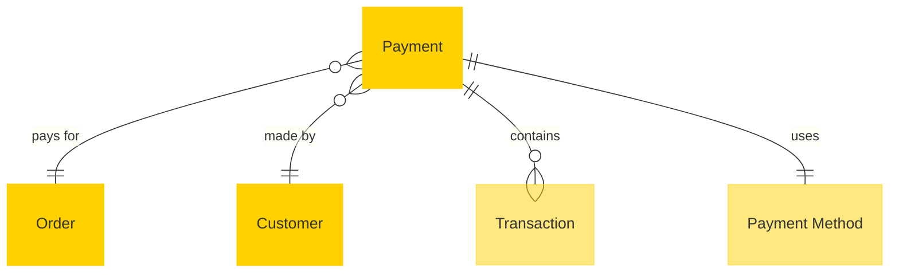

# MACH Alliance, Open Data Model Entity: `Payment`

## Table of contents

- [MACH Alliance, Open Data Model Entity: `Payment`](#mach-alliance-open-data-model-entity-payment)
  - [Table of contents](#table-of-contents)
  - [Entity purpose](#entity-purpose)
  - [Object: Payment](#object-payment)
  - [YAML Schema Definition](#yaml-schema-definition)
    - [Payment Schema](#payment-schema)
    - [Supporting Type Definitions](#supporting-type-definitions)
  - [Sample Object: Minimal Payment](#sample-object-minimal-payment)
  - [Sample Object: Full Payment](#sample-object-full-payment)
  - [Sample Object: Refund Payment](#sample-object-refund-payment)
  - [Sample Object: Split Payment](#sample-object-split-payment)
  - [Sample Object: Partial Capture](#sample-object-partial-capture)
  - [Core Components \& Relationships](#core-components--relationships)
    - [Components](#components)
    - [Typical Relationships](#typical-relationships)
  - [Typical pitfalls](#typical-pitfalls)
    - [Security Issues](#security-issues)
    - [Data Integrity Problems](#data-integrity-problems)
    - [Integration Issues](#integration-issues)
    - [Business Logic Errors](#business-logic-errors)
    - [Architecture Problems](#architecture-problems)
    - [Performance Issues](#performance-issues)

---

## Entity purpose

The Payment entity represents the financial transaction component within eCommerce and retail systems. It primarily resides within Payment Service Providers (PSP), Payment Gateways, Order Management Systems (OMS), and Enterprise Resource Planning (ERP) solutions. The payment model manages the complete lifecycle of financial transactions, from authorization to settlement, supporting various payment methods, currencies, and regulatory requirements.

The model supports:
- **Transaction lifecycle**: Authorization, capture, settlement, and refund operations
- **Multi-provider support**: Integration with various payment gateways and processors
- **Security compliance**: PCI-DSS compliant tokenization and data handling
- **Fraud prevention**: Risk scoring and fraud detection integration
- **Reconciliation**: Settlement tracking and fee management
- **Audit trails**: Complete transaction history and status tracking

---

## Object: Payment

| Field                      | Description                                                                                                                           | Practice    |
| -------------------------- | ------------------------------------------------------------------------------------------------------------------------------------- | ----------- |
| `id`                       | Unique payment identifier (e.g., UUID)                                                                                                | MUST        |
| `order_id`                 | Reference to the associated order                                                                                                     | SHOULD      |
| `customer_id`              | Reference to customer making the payment                                                                                              | SHOULD      |
| `amount`                   | Payment amount in smallest currency unit, always positive (negative amounts use Transaction records)                                  | MUST        |
| `currency`                 | ISO 4217 currency code (e.g., `USD`, `EUR`, `NOK`)                                                                                    | MUST        |
| `status`                   | Payment status (`pending`, `authorized`, `captured`, `partially_captured`, `refunded`, `failed`, `cancelled`, `voided`, `chargeback`) | MUST        |
| `method`                   | Payment method type (`card`, `bank_transfer`, `digital_wallet`, `bnpl`, `store_credit`, `cash`)                                       | MUST        |
| `provider`                 | Payment service provider identifier (e.g., `stripe`, `klarna`, `paypal`, `adyen`)                                                     | SHOULD      |
| `payment_group_id`         | Groups related payments for split payment scenarios                                                                                   | COULD       |
| `payment_type`             | Type of payment (`full`, `partial`, `split`, `installment`)                                                                           | COULD       |
| `external_references`      | Dictionary of cross-system IDs for integration (PSP transaction IDs, merchant refs)                                                   | SHOULD      |
| `created_at`               | ISO 8601 creation timestamp                                                                                                           | SHOULD      |
| `updated_at`               | ISO 8601 update timestamp                                                                                                             | SHOULD      |
| `processed_at`             | ISO 8601 processing timestamp                                                                                                         | COULD       |
| `authorization_expires_at` | ISO 8601 timestamp when authorization expires (typically 7-30 days)                                                                   | COULD       |
| `transactions`             | Array of transaction operations (auth, capture, refund)                                                                               | RECOMMENDED |
| `method_details`           | Payment method details including token and masked card info (PCI-compliant)                                                           | COULD       |
| `version`                  | Integer for optimistic concurrency control                                                                                            | RECOMMENDED |
| `extensions`               | Namespaced dictionary for vendor-specific data (fraud, SCA, reconciliation)                                                           | RECOMMENDED |

---

## YAML Schema Definition

### Payment Schema

```yaml
Payment:
  type: object
  required:
    - id
    - amount
    - currency
    - status
    - method
  properties:
    # Core identification
    id:
      type: string
      description: Unique payment identifier
      example: "pay_776f9240"

    order_id:
      type: string
      description: Reference to the associated order
      example: "ord_12345"

    customer_id:
      type: string
      description: Reference to customer making the payment
      example: "cus_4741044683"

    # Financial details
    amount:
      type: integer
      description: |
        Payment amount in smallest currency unit (cents).
        Always positive - negative operations are represented through Transaction records.
        For refunds, the Payment amount remains positive and refund transactions have negative amounts.
      minimum: 0
      example: 3651920

    currency:
      type: string
      pattern: "^[A-Z]{3}$"
      description: ISO 4217 currency code
      example: "USD"

    # Status and processing
    status:
      type: string
      enum: ["pending", "authorized", "captured", "partially_captured", "refunded", "failed", "cancelled", "voided", "chargeback"]
      description: |
        Payment status:
        - pending: Payment initiated but not yet processed
        - authorized: Payment authorized but not captured
        - captured: Payment successfully captured in full
        - partially_captured: Payment partially captured with amount remaining
        - refunded: Payment refunded (full or partial)
        - failed: Payment processing failed
        - cancelled: Payment cancelled before processing
        - voided: Previously authorized payment voided
        - chargeback: Payment disputed by cardholder
      example: "captured"

    method:
      type: string
      enum: ["card", "bank_transfer", "digital_wallet", "bnpl", "store_credit", "cash"]
      description: Payment method type
      example: "card"

    provider:
      type: string
      description: Payment service provider
      example: "stripe"

    # Split payment support
    payment_group_id:
      type: string
      description: Groups related payments for split payment scenarios
      example: "grp_3NkM8w2eZvKYlo2C1"

    payment_type:
      type: string
      enum: ["full", "partial", "split", "installment"]
      description: Type of payment transaction
      example: "split"

    # External references
    external_references:
      type: object
      description: Dictionary of cross-system IDs
      additionalProperties:
        type: string
      example:
        stripe_payment_intent_id: "pi_3NkM8w2eZvKYlo2C1"
        merchant_reference: "ORD-12345-PAY-1"

    # Timestamps
    created_at:
      type: string
      format: date-time
      description: ISO 8601 creation timestamp

    updated_at:
      type: string
      format: date-time
      description: ISO 8601 update timestamp

    processed_at:
      type: string
      format: date-time
      description: ISO 8601 processing timestamp

    authorization_expires_at:
      type: string
      format: date-time
      description: ISO 8601 timestamp when authorization expires (typically 7-30 days)
      example: "2023-06-30T08:54:24Z"

    # Transaction history
    transactions:
      type: array
      items:
        $ref: "#/components/schemas/Transaction"
      description: Array of transaction operations

    # Payment method details
    method_details:
      type: object
      description: Payment method specific details (masked/tokenized)
      properties:
        token:
          type: string
          description: PSP payment token for secure transactions
          example: "tok_1ABcdefghijk23456789"
        brand:
          type: string
          description: Card brand or payment method brand
          example: "visa"
        last4:
          type: string
          description: Last 4 digits of card number (for cards)
          example: "4242"
        expiry_month:
          type: integer
          description: Expiration month (for cards)
          example: 12
        expiry_year:
          type: integer
          description: Expiration year (for cards)
          example: 2024
        fingerprint:
          type: string
          description: Unique fingerprint for deduplication
          example: "Xt5EWLLDS7FJjR1c"

    # Concurrency control
    version:
      type: integer
      description: Version number for optimistic concurrency control
      minimum: 0
      default: 0

    # Extensibility
    extensions:
      type: object
      description: Namespaced dictionary for extension data
      additionalProperties: true
      examples:
        - fraud:
            risk_score: 0.15
            risk_level: "low"
            checks: ["cvv_pass", "address_pass"]
            source: "stripe_radar"
          reconciliation:
            settlement_date: "2023-06-05"
            batch_id: "batch_20230605_001"
            fees: 1095
            source: "stripe"
        - sca:
            version: "2.2.0"
            authentication_status: "authenticated"
            eci: "05"
            cavv: "AAABCZIhcQAAAABZlyAxAAAAAAA="
            transaction_id: "c5b808e7-1de1-4069"
            challenge_required: false
            liability_shift: true
            source: "stripe"
        - recurring:
            subscription_id: "sub_1234567890"
            billing_cycle: "monthly"
            next_billing_date: "2023-07-03T08:54:11Z"
            trial_end_date: "2023-06-10T08:54:11Z"
            mandate_id: "mndt_abc123"
            source: "stripe"
```

### Supporting Type Definitions

```yaml
Transaction:
  type: object
  required:
    - id
    - type
    - amount
    - status
    - timestamp
  properties:
    id:
      type: string
      description: Unique transaction identifier

    type:
      type: string
      enum: ["authorization", "capture", "refund", "void", "chargeback"]
      description: Transaction operation type

    amount:
      type: integer
      description: |
        Transaction amount in smallest currency unit.
        Positive for charges (authorization, capture).
        Negative for reversals (refund, void, chargeback).
      example: 1000

    status:
      type: string
      enum: ["success", "failed", "pending"]
      description: Transaction status

    timestamp:
      type: string
      format: date-time
      description: When the transaction occurred

    reference:
      type: string
      description: External transaction reference

    error:
      type: object
      description: Error details if transaction failed
      properties:
        code:
          type: string
        message:
          type: string
```

---

## Sample Object: Minimal Payment

Basic payment with essential fields only.

```json
{
  "id": "pay_001",
  "amount": 2999,
  "currency": "USD",
  "status": "captured",
  "method": "card"
}
```

## Sample Object: Full Payment

Complete payment with all fields populated.

```json
{
  "id": "pay_776f9240",
  "order_id": "ord_12345",
  "customer_id": "cus_4741044683",
  "amount": 3651920,
  "currency": "NOK",
  "status": "captured",
  "method": "card",
  "provider": "stripe",
  "external_references": {
    "stripe_payment_intent_id": "pi_3NkM8w2eZvKYlo2C1",
    "stripe_charge_id": "ch_3NkM8w2eZvKYlo2C1",
    "merchant_reference": "ORD-12345-PAY-1"
  },
  "created_at": "2023-06-03T08:54:11Z",
  "updated_at": "2023-06-03T08:55:00Z",
  "processed_at": "2023-06-03T08:55:00Z",
  "version": 2,
  "transactions": [
    {
      "id": "txn_authorization_001",
      "type": "authorization",
      "amount": 3651920,
      "status": "success",
      "timestamp": "2023-06-03T08:54:24Z",
      "reference": "ch_3NkM8w2eZvKYlo2C1"
    },
    {
      "id": "txn_capture_001",
      "type": "capture",
      "amount": 3651920,
      "status": "success",
      "timestamp": "2023-06-03T08:55:00Z",
      "reference": "ch_3NkM8w2eZvKYlo2C1_cap"
    }
  ],
  "method_details": {
    "brand": "visa",
    "last4": "4242",
    "expiry_month": 12,
    "expiry_year": 2024,
    "fingerprint": "Xt5EWLLDS7FJjR1c"
  },
  "extensions": {
    "fraud": {
      "risk_score": 0.15,
      "risk_level": "low",
      "checks": ["cvv_pass", "address_pass"],
      "source": "stripe_radar"
    },
    "reconciliation": {
      "settlement_date": "2023-06-05",
      "batch_id": "batch_20230605_001",
      "fees": 1095,
      "source": "stripe"
    },
    "analytics": {
      "conversion_flow_id": "flow_checkout_123",
      "payment_attempts": 1,
      "time_to_complete": 45,
      "source": "segment"
    }
  }
}
```

## Sample Object: Refund Payment

Payment record showing a refund transaction. Note: Payment amount stays positive, refund is represented in the Transaction record with negative amount.

```json
{
  "id": "pay_refund_456",
  "order_id": "ord_12345",
  "customer_id": "cus_4741044683",
  "amount": 1000000,
  "currency": "NOK",
  "status": "refunded",
  "method": "card",
  "provider": "stripe",
  "external_references": {
    "stripe_refund_id": "re_3NkM8w2eZvKYlo2C1",
    "original_payment_id": "pay_776f9240",
    "merchant_reference": "REF-12345-001"
  },
  "created_at": "2023-06-10T14:30:00Z",
  "updated_at": "2023-06-10T14:30:15Z",
  "processed_at": "2023-06-10T14:30:15Z",
  "transactions": [
    {
      "id": "txn_refund_001",
      "type": "refund",
      "amount": -1000000,
      "status": "success",
      "timestamp": "2023-06-10T14:30:15Z",
      "reference": "re_3NkM8w2eZvKYlo2C1"
    }
  ],
  "extensions": {
    "reconciliation": {
      "refund_reason": "customer_request",
      "refund_type": "partial",
      "source": "customer_service"
    }
  }
}
```

## Sample Object: Split Payment

Payment that is part of a split payment scenario (e.g., 50% card, 50% store credit).

```json
{
  "id": "pay_split_001",
  "order_id": "ord_12345",
  "customer_id": "cus_4741044683",
  "amount": 1825960,
  "currency": "NOK",
  "status": "captured",
  "method": "card",
  "provider": "stripe",
  "payment_group_id": "grp_ord_12345",
  "payment_type": "split",
  "external_references": {
    "stripe_payment_intent_id": "pi_3NkM8w2eZvKYlo2C2",
    "merchant_reference": "ORD-12345-PAY-1of2"
  },
  "created_at": "2023-06-03T08:54:11Z",
  "updated_at": "2023-06-03T08:55:00Z",
  "processed_at": "2023-06-03T08:55:00Z",
  "authorization_expires_at": "2023-06-10T08:54:11Z",
  "transactions": [
    {
      "id": "txn_auth_split_001",
      "type": "authorization",
      "amount": 1825960,
      "status": "success",
      "timestamp": "2023-06-03T08:54:24Z",
      "reference": "ch_3NkM8w2eZvKYlo2C2"
    },
    {
      "id": "txn_capture_split_001",
      "type": "capture",
      "amount": 1825960,
      "status": "success",
      "timestamp": "2023-06-03T08:55:00Z",
      "reference": "ch_3NkM8w2eZvKYlo2C2_cap"
    }
  ],
  "method_details": {
    "token": "tok_1ABcdefghijk23456789",
    "brand": "visa",
    "last4": "4242",
    "expiry_month": 12,
    "expiry_year": 2024,
    "fingerprint": "Xt5EWLLDS7FJjR1c"
  },
  "extensions": {
    "split_payment": {
      "total_order_amount": 3651920,
      "this_payment_percentage": 50,
      "related_payment_ids": ["pay_split_002"],
      "source": "checkout_service"
    }
  }
}
```

## Sample Object: Partial Capture

Payment with partial capture scenario (authorized for $100, captured $75).

```json
{
  "id": "pay_partial_001",
  "order_id": "ord_67890",
  "customer_id": "cus_4741044683",
  "amount": 7500,
  "currency": "USD",
  "status": "partially_captured",
  "method": "card",
  "provider": "stripe",
  "payment_type": "partial",
  "external_references": {
    "stripe_payment_intent_id": "pi_3NkM8w2eZvKYlo2C3",
    "merchant_reference": "ORD-67890-PAY-PARTIAL"
  },
  "created_at": "2023-06-03T08:54:11Z",
  "updated_at": "2023-06-03T08:55:30Z",
  "processed_at": "2023-06-03T08:55:30Z",
  "authorization_expires_at": "2023-06-10T08:54:11Z",
  "transactions": [
    {
      "id": "txn_auth_partial_001",
      "type": "authorization",
      "amount": 10000,
      "status": "success",
      "timestamp": "2023-06-03T08:54:24Z",
      "reference": "ch_3NkM8w2eZvKYlo2C3"
    },
    {
      "id": "txn_capture_partial_001",
      "type": "capture",
      "amount": 7500,
      "status": "success",
      "timestamp": "2023-06-03T08:55:30Z",
      "reference": "ch_3NkM8w2eZvKYlo2C3_cap"
    }
  ],
  "method_details": {
    "token": "tok_1CDEfghijk23456789",
    "brand": "mastercard",
    "last4": "5555",
    "expiry_month": 8,
    "expiry_year": 2025,
    "fingerprint": "Bg8DWLLDS9FJjR2x"
  },
  "extensions": {
    "partial_capture": {
      "authorized_amount": 10000,
      "captured_amount": 7500,
      "remaining_capturable": 2500,
      "reason": "partial_shipment",
      "source": "oms"
    }
  }
}
```

---

## Core Components & Relationships

### Components

| Concept            | Description                                           | Typical Source of Truth |
| ------------------ | ----------------------------------------------------- | ----------------------- |
| **Payment**        | Overall payment transaction record                    | Payment Gateway / OMS   |
| **Transaction**    | Individual payment operations (auth, capture, refund) | Payment Gateway         |
| **Order**          | Purchase transaction being paid for                   | OMS / Commerce Engine   |
| **Customer**       | Person or organization making the payment             | CRM / Commerce Engine   |
| **Payment Method** | Type and details of payment instrument                | Payment Gateway         |

### Typical Relationships



---

## Typical pitfalls

### Security Issues
- **Storing sensitive payment data** - Never store card numbers, CVV, or other sensitive data; use tokenization and reference payment gateway records
- **Inadequate PCI compliance** - Not following PCI-DSS requirements for payment data handling and storage
- **Missing encryption** - Transmitting payment data without proper encryption or secure channels

### Data Integrity Problems
- **Floating point amounts** - Using decimal numbers instead of integers in smallest currency unit, causing rounding errors
- **Inconsistent currency handling** - Mixing currencies or not properly converting between different currency representations
- **Missing transaction history** - Not storing complete audit trail of all payment operations and state changes

### Integration Issues
- **Poor error handling** - Not capturing detailed error codes and messages from payment providers for debugging
- **Synchronous processing** - Blocking order flow on payment gateway responses instead of async webhook processing
- **Missing idempotency** - Not handling duplicate payment requests properly, leading to double charges

### Business Logic Errors
- **Inflexible status model** - Using rigid status enums that don't support complex payment flows or provider-specific states
- **Poor refund handling** - Not properly linking refunds to original payments or handling partial refunds
- **Missing reconciliation data** - Not tracking settlement dates, fees, and batch information for financial reconciliation

### Architecture Problems
- **Tight coupling to providers** - Hard-coding provider-specific logic instead of using abstraction layers
- **No retry mechanisms** - Not handling transient failures or network issues with proper retry logic
- **Missing webhook validation** - Not properly validating webhook signatures and handling replay attacks

### Performance Issues
- **No caching strategy** - Repeatedly querying payment status instead of caching frequently accessed data
- **Missing indexes** - Not optimizing database queries for common payment lookup patterns
- **Synchronous fraud checks** - Blocking payment flow on fraud detection instead of async processing

---

>  This MACH Alliance Canonical Data Model is intentionally __vendor-neutral__ and serves as a foundation for interoperability across composable architectures. It is __continually evolving__ through community contributions, which are reviewed and approved collaboratively.
>
>  All contributions are made under the __Creative Commons Attribution 4.0 International License (CC BY 4.0)__. By submitting a contribution, you agree to license your content under <a href="https://creativecommons.org/licenses/by/4.0/deed.en">CC BY 4.0</a>, allowing others to share and adapt the material with proper attribution.
>
>  We welcome and encourage continued improvements through community input. For more information and guidance on how to contribute, please refer to the <a href="../../CONTRIBUTING.md">Contributor Guide</a>.
