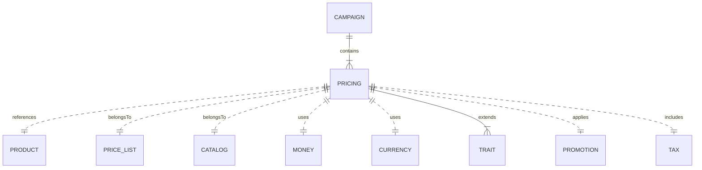

# MACH Alliance, Open Data Model Entity: `Pricing`

## Table of contents

- [Purpose](#purpose)  
- [Object: Pricing](#object-pricing)  
- [Sample Objects](#sample-objects)  
  - [Simple Retail Pricing](#sample-object-simple-retail-pricing)  
  - [Campaign-Based Pricing](#sample-object-campaign-based-pricing)  
  - [Tiered Pricing](#sample-object-tiered-pricing)  
  - [Bulk Pricing](#sample-object-bulk-pricing)  
  - [Multi-Currency Pricing](#sample-object-multi-currency-pricing)  
  - [Pricing as a Precomputed Matrix for Wholesale/B2B](#sample-object-pricing-as-a-precomputed-matrix-for-wholesaleb2b)  
- [Core Components & Relationships](#core-components--relationships)  
  - [Components](#components)  
  - [Typical Relationships](#typical-relationships)  
- [Typical Pitfalls](#typical-pitfalls)

 
---

## Purpose

A unified pricing model that supports flexible, multi-currency pricing across both B2B and B2C commerce scenarios. It resides within Commerce Engines, Pricing Management Systems, and ERP systems. The pricing model supports base pricing, tiered pricing, bulk pricing, dynamic pricing, and promotional adjustments. It serves as the foundational data structure driving pricing strategies, customer segmentation, and revenue optimization.

The Entity describes:
- List price (MSRP) and sale price distinction
- Cost price for internal calculations
- Price list and catalog context associations
- Campaign context for promotional and marketing initiatives
- Tiered pricing for different customer segments
- Bulk pricing for quantity-based discounts
- Dynamic pricing strategies and AI-driven adjustments
- Multi-currency support with conversion rates
- Promotional pricing and business rule adjustments
- Scope-based pricing overrides (region, channel, customer group)
- Tax inclusion and calculation
- Price history and audit trails
- Scheduling and phasing for price changes

---

## Object: Pricing

| Field              | Description                                                    | Practice                 |
| -------------------- | -------------------------------------------------------------- | --------------------------------------- |
| `id`                   | Unique identifier for the pricing record                       | SHOULD |
| `productId`           | Linked product ID this pricing applies to                      | SHOULD |
| `campaignId`          | Associated campaign identifier (optional)                      | COULD |
| `priceListId`         | Associated price list or catalog identifier                    | COULD |
| `catalogId`           | Associated catalog context identifier                          | COULD |
| `type`                | Pricing type (`retail`, `wholesale`, `bulk`)                   | SHOULD |
| `status`              | Lifecycle status (`active`, `inactive`, `archived`)            | SHOULD |
| `referenceIds`        | Dictionary of cross-system IDs to ease orchestration logic     | SHOULD |
| `createdAt`           | Creation timestamp using [Timestamp](../utilities/timestamp.md) utility object | SHOULD |
| `updatedAt`           | Update timestamp using [Timestamp](../utilities/timestamp.md) utility object | SHOULD |
| `listPrice`           | Manufacturer's suggested retail price (MSRP) using [Money](../utilities/money.md) utility object | SHOULD |
| `salePrice`           | Actual selling price using [Money](../utilities/money.md) utility object                | SHOULD |
| `tax`                 | Tax inclusion, rate, and type information                       | SHOULD |
| `traits`              | Namespaced dictionary for extension data grouped by concern     | RECOMMENDED |

---

## Sample Object: Simple Retail Pricing

Basic pricing for a standard retail product with list and sale price distinction.

```jsonc
{
  "id": "PRICE-001",
  "productId": "PROD-001",
  "priceListId": "RETAIL-2024",
  "catalogId": "EU-ENGLISH",
  "type": "retail",
  "status": "active",
  "referenceIds": {
    "pms": "price-123",
    "erp": "price-456"
  },
  "createdAt": "2024-01-01T00:00:00Z",
  "updatedAt": "2024-01-01T00:00:00Z",
  "listPrice": {
    "amount": 39.95,
    "currency": "EUR"
  },
  "salePrice": {
    "amount": 34.95,
    "currency": "EUR"
  },
  "tax": {
    "included": true,
    "rate": 0.21,
    "type": "VAT"
  },
  "traits": {
    "internal": {
      "costPrice": {
        "amount": 25.00,
        "currency": "EUR"
      },
      "source": "erp"
    }
  }
}
```

## Sample Object: Campaign-Based Pricing

Pricing associated with a specific marketing campaign.

```jsonc
{
  "id": "PRICE-CAMPAIGN-001",
  "productId": "PROD-001",
  "campaignId": "CAMPAIGN-002",
  "priceListId": "BLACK-FRIDAY-2024",
  "catalogId": "EU-ENGLISH",
  "type": "retail",
  "status": "active",
  "referenceIds": {
    "pms": "price-campaign-123",
    "erp": "price-campaign-456"
  },
  "createdAt": "2024-10-01T00:00:00Z",
  "updatedAt": "2024-11-20T00:00:00Z",
  "listPrice": {
    "amount": 39.95,
    "currency": "EUR"
  },
  "salePrice": {
    "amount": 31.96,
    "currency": "EUR"
  },
  "tax": {
    "included": true,
    "rate": 0.21,
    "type": "VAT"
  },
  "traits": {
    "campaign": {
      "campaignName": "Black Friday Sale 2024",
      "discountPercentage": 20,
      "validFrom": "2024-11-29T00:00:00Z",
      "validTo": "2024-12-02T23:59:59Z",
      "source": "promotion-system"
    },
    "internal": {
      "costPrice": {
        "amount": 25.00,
        "currency": "EUR"
      },
      "source": "erp"
    }
  }
}
```

## Sample Object: Tiered Pricing

Pricing with different tiers for customer segments using traits.

```jsonc
{
  "id": "PRICE-TIER-001",
  "productId": "PROD-001",
  "campaignId": "CAMPAIGN-001",
  "priceListId": "B2B-2024-Q1",
  "catalogId": "EU-ENGLISH",
  "type": "retail",
  "status": "active",
  "referenceIds": {
    "pms": "price-tier-123",
    "erp": "price-tier-456"
  },
  "createdAt": "2024-01-01T00:00:00Z",
  "updatedAt": "2024-01-01T00:00:00Z",
  "listPrice": {
    "amount": 39.95,
    "currency": "EUR"
  },
  "salePrice": {
    "amount": 34.95,
    "currency": "EUR"
  },
  "tax": {
    "included": true,
    "rate": 0.21,
    "type": "VAT"
  },
  "traits": {
    "tiered": {
      "tiers": [
        {
          "name": "Premium",
          "type": "premium",
          "salePrice": {
            "amount": 31.95,
            "currency": "EUR"
          },
          "minimumQuantity": 10,
          "maximumQuantity": 100,
          "customerSegments": ["premium"],
          "source": "pms"
        },
        {
          "name": "Enterprise",
          "type": "enterprise",
          "salePrice": {
            "amount": 29.95,
            "currency": "EUR"
          },
          "minimumQuantity": 100,
          "customerSegments": ["enterprise"],
          "source": "pms"
        }
      ],
      "source": "pms"
    },
    "campaign": {
      "campaignName": "Q1 B2B Pricing",
      "season": "q1",
      "targetAudience": ["b2b", "enterprise"],
      "source": "marketing-platform"
    },
    "internal": {
      "costPrice": {
        "amount": 25.00,
        "currency": "EUR"
      },
      "source": "erp"
    }
  }
}
```

## Sample Object: Bulk Pricing

Bulk pricing for quantity-based discounts.

```jsonc
{
  "id": "PRICE-BULK-001",
  "productId": "PROD-001",
  "priceListId": "BULK-2024",
  "catalogId": "EU-ENGLISH",
  "type": "bulk",
  "status": "active",
  "referenceIds": {
    "pms": "price-bulk-123",
    "erp": "price-bulk-456"
  },
  "createdAt": "2024-01-01T00:00:00Z",
  "updatedAt": "2024-01-01T00:00:00Z",
  "listPrice": {
    "amount": 39.95,
    "currency": "EUR"
  },
  "salePrice": {
    "amount": 39.95,
    "currency": "EUR"
  },
  "tax": {
    "included": true,
    "rate": 0.21,
    "type": "VAT"
  },
  "traits": {
    "bulk": {
      "tiers": [
        {
          "minimumQuantity": 10,
          "maximumQuantity": 49,
          "price": {
            "amount": 35.95,
            "currency": "EUR"
          },
          "source": "pms"
        },
        {
          "minimumQuantity": 50,
          "maximumQuantity": 99,
          "price": {
            "amount": 32.95,
            "currency": "EUR"
          },
          "source": "pms"
        },
        {
          "minimumQuantity": 100,
          "price": {
            "amount": 29.95,
            "currency": "EUR"
          },
          "source": "pms"
        }
      ],
      "source": "pms"
    },
    "internal": {
      "costPrice": {
        "amount": 25.00,
        "currency": "EUR"
      },
      "source": "erp"
    }
  }
}
```

## Sample Object: Multi-Currency Pricing

Pricing with currency conversion support using traits.

```jsonc
{
  "id": "PRICE-MULTI-001",
  "productId": "PROD-001",
  "priceListId": "INTERNATIONAL-2024",
  "catalogId": "GLOBAL-ENGLISH",
  "type": "retail",
  "status": "active",
  "referenceIds": {
    "pms": "price-multi-123",
    "currency-service": "conv-456"
  },
  "createdAt": "2024-01-01T00:00:00Z",
  "updatedAt": "2024-01-01T00:00:00Z",
  "listPrice": {
    "amount": 39.95,
    "currency": "EUR"
  },
  "salePrice": {
    "amount": 34.95,
    "currency": "EUR"
  },
  "tax": {
    "included": true,
    "rate": 0.21,
    "type": "VAT"
  },
  "traits": {
    "conversion": {
      "rates": [
        {
          "from": "EUR",
          "to": "USD",
          "rate": 1.1,
          "source": "ECB",
          "timestamp": "2024-01-01T00:00:00Z"
        }
      ],
      "source": "currency-service"
    },
    "promotional": {
      "appliedPromotions": [
        {
          "promotionId": "PROMO-2024-01",
          "type": "percentage",
          "value": 10,
          "validFrom": "2024-03-01T00:00:00Z",
          "validTo": "2024-03-31T23:59:59Z",
          "source": "promotion-system"
        }
      ],
      "source": "promotion-system"
    },
    "business": {
      "rules": [
        {
          "type": "contract",
          "condition": "customerType == 'enterprise'",
          "adjustment": {
            "type": "percentage",
            "value": 5
          },
          "source": "pms"
        }
      ],
      "source": "pms"
    },
    "internal": {
      "costPrice": {
        "amount": 25.00,
        "currency": "EUR"
      },
      "source": "erp"
    }
  }
}
```
## Sample Object: Pricing as a precomputed matrix for Wholesale/B2B

Efficient customer specific prices PRODUCT or CATALOGUE + CUSTOMER SEGMENT or CUSTOMER + CHANNEL and maybe CURRENCY → PRICE

Requires Indexed prices by product/category ID + customer group ID. can be stored in orchestration layer to gain sub 10ms performance.

```jsonc
{
  "segmentId": "CUST-042",
  "referenceIds": {
    "priceListId": "B2B-JUNE-2025",
  },
  "createdAt": "2024-01-01T00:00:00Z",
  "updatedAt": "2024-01-01T00:00:00Z",
  "expireAt": "2027-01-01T00:00:00Z",
  "categoryId": "CAT-TSHIRTS",
  "prices": [
    {
      "productId": "PROD-001",
      "sku": "TSHIRT-001",
      "salePrice": 28.95,
      "listPrice": 39.95,
      "currency": "EUR",
      "unit": "colli",
      "tier": "default"
    },
    {
      "productId": "PROD-002",
      "sku": "TSHIRT-002",
      "salePrice": 25.50,
      "listPrice": 35.00,
      "currency": "EUR",
      "tier": "bulk",
      "unit": "colli",
      "minimumQuantity": 10
    }
  ]
}


```

---

## Core Components & Relationships

### Components

| Concept             | Description                                                    | Typical Source of Truth             |
| -------------------- | -------------------------------------------------------------- | --------------------------------------- |
| List Price          | Manufacturer's suggested retail price (MSRP)                   | Price Management System         |
| Sale Price          | Actual selling price to customer                               | Price Management System         |
| Cost Price          | Internal cost price (in traits.internal)                       | ERP System                      |
| Campaign            | Associated campaign context                                    | Campaign Management System      |
| Price List          | Associated price list or catalog context                       | Price Management System         |
| Currency            | Price currency and conversion rates                            | Currency Management System      |
| Tax                 | Tax inclusion, rate, and type                                  | Tax Engine                      |
| Traits              | Optional and scoped extensions                                 | Various domain systems          |
| ReferenceIds        | Cross-system identifiers                                       | Integration Layer               |

`Pricing` typically resides in many systems, including:

- Commerce Engine
- Price Management System (PMS)
- Campaign Management System
- Promotion Management System
- ERP systems
- Pricing Engine
- Tax Engine

### Typical Relationships



---

### Typical pitfalls

- Not using utility objects for common patterns like Money and Currency - Leads to inconsistent data structures and increased complexity across systems.
- Overloading the core schema with domain-specific logic instead of using traits - Makes the model rigid and difficult to extend for new use cases.
- Missing source system declarations in traits - Creates traceability issues and makes conflict resolution difficult across MACH services.
- Not distinguishing between list price, sale price, and cost price - Creates confusion in pricing strategy and margin calculations.
- Missing campaign context for promotional pricing - Makes it difficult to track campaign performance and attribution.
- Missing price list and catalog context - Makes it difficult to manage multi-tenant and B2B pricing scenarios.
- Not using scheduling traits for phased price changes - Limits ability to implement sophisticated pricing strategies.
- Using unstructured meta fields instead of namespaced traits - Makes data difficult to query, validate, and reason about.
- Forgetting to include standard audit fields (createdAt, updatedAt, referenceIds) - Creates challenges in data orchestration and compliance tracking.

---

>  This MACH Alliance Canonical Data Model is intentionally __vendor-neutral__ and serves as a foundation for interoperability across composable architectures. It is __continually evolving__ through community contributions, which are reviewed and approved collaboratively.
>  
>  All contributions are made under the __Creative Commons Attribution 4.0 International License (CC BY 4.0)__. By submitting a contribution, you agree to license your content under <a href="https://creativecommons.org/licenses/by/4.0/deed.en">CC BY 4.0</a>, allowing others to share and adapt the material with proper attribution.
>  
>  We welcome and encourage continued improvements through community input. For more information and guidance on how to contribute, please refer to the <a href="https://github.com/machalliance/common-data-model/blob/main/contributing.md">Contributor Guide</a>.
