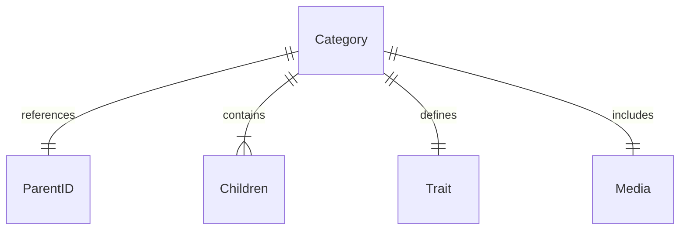

# MACH Alliance Canonical Entity Model

# Entity: `Category`

## Table of contents

- [Entity purpose](#entity-purpose)
- [Object: Category](#object-category)
- [Sample Object: Category - Minimal](#sample-object-category---minimal)
- [Sample Object: Category - Extended](#sample-object-category---extended)
- [Core Components & Relationships](#core-components--relationships)
- [Typical pitfalls](#typical-pitfalls)

---

## Purpose
The Category entity defines the hierarchical and navigational structure used to group and organize products. It is central to product discovery, navigation, and merchandising strategies across both B2B and B2C environments. Categories are typically managed in Commerce Engines, PIM systems, and DXP solutions, supporting multi-level hierarchies, localization, and business-specific taxonomies.

- Groups products into logical structures
- Enables product discovery through navigation and search
- Supports merchandising and campaign strategies
- Drives SEO and channel-specific taxonomies
- Localizes the product experience by region or language
- Organizes catalog hierarchies for both internal and customer-facing use

---

## Object: Category

| Field | Description | Practice |
|-------|-------------|----------|
| `id` | Unique identifier in given context (e.g., UUID, slug). | SHOULD |
| `name` | Display name of the category. | SHOULD |
| `description` | Detailed description of the category. | COULD |
| `status` | Lifecycle status (`active`, `inactive`, `archived`). | SHOULD |
| `referenceIds` | Dictionary of cross-system IDs (e.g., PIM, ERP, Commerce Engine) to ease orchestration logic | SHOULD |
| `createdAt` | Creation timestamp using [Timestamp](../utilities/timestamp.md) utility object. | SHOULD |
| `updatedAt` | Update timestamp using [Timestamp](../utilities/timestamp.md) utility object. | SHOULD |
| `parentId` | Parent Category identifier (often used for breadcrumbs). | COULD |
| `slug` | URL-friendly identifier fragment. | SHOULD |
| `children` | Array of child category objects. | COULD |
| `attributes` | Additional metadata schemas. | COULD |
| `tags` | Used for metadata, SEO, etc. | COULD |
| `media` | Image(s) depicting the category using [Media](../utilities/media.md) utility object. | SHOULD |
| `traits` | Namespaced dictionary for extension data grouped by concern (e.g., `seo`, `merchandising`). | COULD |

---

## Sample Object: Category - Minimal

Minimal category object for working with individual category, e.g., displaying in the product page.

```json
{
  "id": "shorts",
  "name": { "en-US": "Shorts", "en-GB": "Shorts" },
  "slug": "shorts",
  "parentId": "clothes"
}
```

---

## Sample Object: Category - Extended

Extended category object with traits and additional fields for comprehensive category management.

```json
{
  "id": "shorts",
  "name": { "en-US": "Shorts", "en-GB": "Shorts" },
  "description": { "en-US": "Comfortable shorts for all occasions", "en-GB": "Comfortable shorts for all occasions" },
  "slug": "shorts",
  "status": "active",
  "referenceIds": {
    "pimId": "cat_shorts_001",
    "commercetools": "shorts-category"
  },
  "createdAt": "2025-06-01T12:00:00Z",
  "updatedAt": "2025-06-10T12:30:00Z",
  "parentId": "clothes",
  "children": [
    {
      "id": "running-shorts",
      "name": { "en-US": "Running Shorts", "en-GB": "Running Shorts" },
      "slug": "running-shorts",
      "parentId": "shorts"
    }
  ],
  "attributes": {
    "style": "Modern",
    "season": "Summer"
  },
  "tags": ["Trousers", "Clothing", "Casual"],
  "media": {
    "imageUrl": "https://cdn.example.com/shorts.jpg",
    "altText": "Comfortable shorts collection"
  },
  "traits": {
    "seo": {
      "metaTitle": { "en-US": "Premium Shorts Collection", "en-GB": "Premium Shorts Collection" },
      "metaDescription": { "en-US": "Discover our comfortable shorts for every occasion", "en-GB": "Discover our comfortable shorts for every occasion" },
      "keywords": ["shorts", "casual wear", "summer"],
      "source": "contentful"
    },
    "merchandising": {
      "featured": true,
      "displayOrder": 5,
      "promotionalBadge": { "en-US": "New Collection", "en-GB": "New Collection" },
      "source": "commercetools"
    },
    "availability": {
      "channelAvailability": ["web", "store"],
      "regionAvailability": ["EU", "US"],
      "source": "pim"
    }
  }
}
```

---

## Core Components & Relationships

### Components

| Concept | Description | Typical Source of Truth |
|---------|-------------|-------------------------|
| ID | Unique category identifier | Commerce Engine / PIM / CMS |
| Hierarchy | Parent-child relationships | PIM / Commerce Engine |
| Traits | Optional and scoped extensions | SEO Tools / Merchandising / PIM |
| Media | Category images and assets | DAM / CDN / CMS |

### Typical Relationships



---

## Typical Pitfalls

- **Not supporting multi-level or nested category hierarchies** - Limits the ability to structure products logically, harming site navigation and SEO.
- **Poor localization of category names and descriptions** - Creates a disjointed user experience for international customers and reduces search relevancy in localized markets.
- **Missing ability to assign products to multiple categories** - Results in limited product discoverability and forces duplication or workarounds in merchandising.
- **Inadequate support for merchandising attributes (e.g., SEO metadata, display rules)** - Hinders marketing efforts, reduces visibility in search engines, and leads to missed merchandising opportunities.
- **Not tracking category changes over time (e.g., versioning, effective dates)** - Makes it hard to understand performance trends and recover from mistaken changes.
- **Not integrating with search and filtering systems effectively** - Leads to poor product discovery, ineffective faceted search, and user frustration during navigation.
- **Poor governance for managing large and complex taxonomies** - Causes inconsistent category structures, broken navigation paths, and scaling issues as the catalog grows.
- **Assuming parent and child categories can not be used in combination.** A category may exist as a child of two parents, but it may have one of those defined as a parent category for tasks such as breadcrumb building if a user came via search. For example, Hiking Boots may appear as a child under Footwear and Camping Equipment. But Hiking Boots may have Footwear defined as a parent category in order to build a breadcrumb.

---

>  This MACH Alliance Canonical Data Model is intentionally __vendor-neutral__ and serves as a foundation for interoperability across composable architectures. It is __continually evolving__ through community contributions, which are reviewed and approved collaboratively.
>  
>  All contributions are made under the __Creative Commons Attribution 4.0 International License (CC BY 4.0)__. By submitting a contribution, you agree to license your content under <a href="https://creativecommons.org/licenses/by/4.0/deed.en">CC BY 4.0</a>, allowing others to share and adapt the material with proper attribution.
>  
>  We welcome and encourage continued improvements through community input. For more information and guidance on how to contribute, please refer to the <a href="https://github.com/machalliance/common-data-model/blob/main/contributing.md">Contributor Guide</a>.


