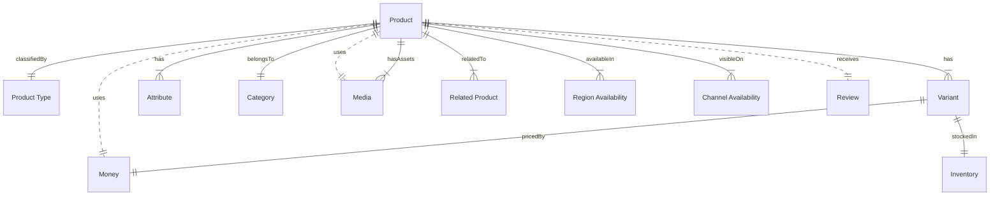

# MACH Alliance, Open Data Model Entity: `Product`

## Table of contents

- [Entity purpose](#entity-purpose)
- [Object: Product](#object-product)
- [Sample Object: Simple Product](#sample-object-simple-product)
- [Sample Object: Configurable Product with Variants](#sample-object-configurable-product-with-variants)
- [Sample Object: Bundle Product](#sample-object-bundle-product)
- [Sample Object: Virtual Product](#sample-object-virtual-product)
- [Sample Object: Product on Listing (Simplified)](#sample-object-product-on-listing-simplified)
- [Sample Object: Localized product with multiple inventory locations](#sample-object-localized-product-with-multiple-inventory-locations-yellow-t-shirt-across-us-ca-dk)
- [Sample Object: AI-enriched product content](#sample-object-ai-enriched-product-content-with-embedded-enrichment-details)
- [Core Components & Relationships](#core-components--relationships)
- [Typical pitfalls](#typical-pitfalls)

---

## Entity purpose

A unified product model that supports the core unit of sale across both B2B and B2C commerce scenarios. It resides within Commerce Engines, Product Information Management (PIM) systems, and Digital Experience Platforms (DXP). The product model supports rich content, variant configurations, pricing logic, inventory visibility, and localization. It serves as the foundational data structure driving search, merchandising, and transactional workflows.

The Entity describes: 
- What is being sold
- How it is configured (variants, options, specifications)
- How is it priced
- What content is used to describe and promote it
- Where it is available (channels, regions)
- What inventory exists
- How it relates to other products (e.g., bundles, accessories)

---

## Object: Product

| Field         | Description | Practice |
|---------------|-------------|----------|
| `id`                   | Unique identifier in given context (e.g., UUID in context)          | SHOULD |
| `sku`                  | Human readable unique identifier                              | RECOMMENDED |
| `slug`                 | URL-friendly string for routing and SEO                        | RECOMMENDED |
| `type`                 | Reference to Product Type for classification                   | SHOULD |
| `status`               | Lifecycle status (`sellable`, `backorder`, `discontinued`)         | SHOULD  |
| `referenceIds`         | Dictionary of cross-system IDs (e.g., ERP, WMS, ) to ease orchestration logic | SHOULD |
| `createdAt`            | ISO 8601 creation timestamp using [Timestamp](../utilities/timestamp.md) utility object. | SHOULD |
| `updatedAt`            | ISO 8601 update timestamp using [Timestamp](../utilities/timestamp.md) utility object. | SHOULD |
| `name`                 | Product name                                                   | SHOULD |
| `description`          | Product description                                            | SHOULD |
| `price`                | Product pricing using [Money](../utilities/money.md) utility object.                   | SHOULD |
| `inventory`            | products available to promise, inventory `onhand`, `bulk` with lead time | SHOULD |
| `primaryImage`         | Primary image  using [Media](../utilities/media.md) utility object.                       | SHOULD |
| `media`                | Additional images, videos, documents  using [Media](../utilities/media.md) utility object.       | COULD  |
| `rating`               | Aggregated customer review information                         | COULD  |
| `attributes`           | Array of product specifications and properties                  | RECOMMENDED  |
| `variants`             | Array of product variants with their own SKUs and pricing      | COULD  |
| `category`             | Logical grouping for navigation, filtering, SEO, query related products etc.| COULD |
| `relatedProducts`      | Accessories, bundles, substitutes                              | COULD  |
| `traits`               | Namespaced dictionary for extension data grouped by concern    | RECOMMENDED |


---

## Sample Object: Simple Product

Simple, sellable product without variants.

```jsonc
{
  "id": "PROD-001",
  "sku": "TSHIRT-001",
  "type": "PT-APPAREL-001",
  "slug": "organic-cotton-tshirt",
  "status": "sellable",
  "referenceIds": {
    "erp": "ERP-TSHIRT-001",
    "wms": "WMS-TSHIRT-001"
  },
  "createdAt": "2024-01-15T10:00:00Z",
  "updatedAt": "2025-06-20T08:45:00Z",
  "name": "Organic Cotton T‑Shirt",
  "description": "Sustainable, soft cotton t-shirt.",
  "price": {
    "amount": 34.95,
    "currency": "EUR"
  },
  "inventory": {
    "onhand": 28,
    "bulk": 72,
    "leadTimeDays": 2
  },
  "primaryImage": {
    "url": "https://cdn.example.com/img/tshirt-primary.webp",
    "description": "Organic Cotton T-Shirt",
  },
  "media": [
    {
      "url": "https://cdn.example.com/img/tshirt-gallery-1.webp",
      "description": "T-Shirt Front View",
      "type": "image"
    }
  ],
  "rating": { "average": 4.5, "count": 120 },
  "attributes": [
    { "label": "Material", "value": "Organic Cotton" },
    { "label": "Fit", "value": "Regular" },
    { "label": "Care Instructions", "value": ["Machine wash", "Do not bleach", "Iron on low"] },
    { "label": "Certifications", "value": ["Fair Trade", "MACH-Approved"] }
    { "label": "size", "value": "onesize" }
  ],
  "relatedProducts": ["PROD-002"],
  "traits": {
    "seo": {
      "metaTitle": "Organic Cotton T-Shirt - Sustainable Fashion",
      "metaDescription" : "Eco-friendly organic cotton t-shirt for conscious consumers." ,
      "source": "pim"
    },
    "marketing": {
      "priority": 3,
      "type": "bestseller",
      "source": "merchandising"
    },
     "catalog": {
      "brand": "MACH Merch",
      "slug": "mm",
      "source": "pim"
    }
  }
}
```


## Sample Object: Configurable Product with Variants

A parent product with multiple variants based on attributes.

```jsonc
{
  "variants": [
    {
      "id": "VAR-001",
      "sku": "TSHIRT-001-BLK-M",
      "name": "Black T-Shirt - Medium",
      "attributes": [
        { "label": "Color", "value": "Black" },
        { "label": "Size", "value": "M" }
      ],
      "inventory": {
        "onhand": 4,
        "bulk": 22,
        "leadTimeDays": 2
      },
      "price": {
        "amount": 34.95,
        "currency": "EUR"
      },
      "media": [
        {
          "url": "https://cdn.example.com/img/tshirt-blk-m.webp",
          "description": "Black T-shirt, Medium",
          "type": "image"
        }
      ]
    }
  ]
}
```

## Sample Object: Bundle Product

Customizable set of items sold together as one purchasable unit.

```jsonc
{
"traits": {
  "bundle": {
    "type": "fixed",
    "items": [
      { "productId": "PROD-001", "quantity": 1 },
      { "productId": "PROD-002", "quantity": 1 },
      { "productId": "PROD-004", "quantity": 1 }
    ],
    "source": "commerce_platform"
  }
}
}
```

## Sample Object: Virtual Product

An intangible product such as a service or experience, often time-based.

```jsonc
{
  "id": "PROD-006",
  "productTypeId": "PT-SERVICE-001",
  "slug": "virtual-styling-session",
  "name": { "Virtual Styling Session"},
  "description": { "30-minute Zoom call with a fashion stylist." },
  "price": {
    "amount": 29.95,
    "currency": "EUR"
  },
  "primaryImage": {
    "url": "https://cdn.example.com/img/styling-session.webp",
    "description": "Virtual Styling Session",
  },
  "status": "active",
  "attributes": [
    { "label": "Duration", "value": "30 minutes" },
    { "label": "Service Type", "value": "Virtual Consultation" }
  ],
  "traits": {
    "service": {
      "duration": "30_minutes",
      "platform": "zoom",
      "timezone": "UTC",
      "source": "booking_system"
    },
    "availability": {
      "channelAvailability": ["web"],
      "regionAvailability": ["global"],
      "source": "ecommerce",
      "contentRating": "pg"
    }
  }
}
```

## Sample Object: Product on Listing (Simplified)

```jsonc
{
  "id": "PROD-001",
  "sku": "TSHIRT-001",
  "type": "PT-APPAREL-001",
  "slug": "organic-cotton-tshirt",
  "name": { "en-US": "Organic Cotton T‑Shirt", "en-GB": "Organic Cotton T‑Shirt" },
  "description": { "en-US": "Sustainable, soft cotton T‑shirt.", "en-GB": "Sustainable, soft cotton t-shirt." },
  "price": {
    "amount": 34.95,
    "currency": "EUR"
  },
  "primaryImage": {
    "url": "https://cdn.example.com/img/tshirt-primary.jpg",
    "description": "Organic Cotton T-Shirt",
  },
  "rating": { "average": 4.5, "count": 1203 },
  "attributes": [
    { "label": "Material", "value": "Organic Cotton" }
  ]
}
```

##  Sample Object: Localized product with multiple inventory locations: yellow t-shirt across US, CA, DK

```jsonc

{
  "id": "PROD-YELLOW-TSHIRT-001",
  "sku": "YTSHIRT-001",
  "slug": "yellow-cotton-tshirt",
  "type": "apparelOnesize",
  "referenceIds": {
    "erp": "ERP-8749302",
    "wmsUS": "UWMS-123-YT",
    "wmsEU": "EWMS-123-YT"
  },
  "createdAt": "2025-07-01T12:00:00Z",
  "updatedAt": "2025-07-03T08:30:00Z",
  "name": {
    "en-US": "Yellow Cotton T-Shirt",
    "en-CA": "Yellow Cotton T-Shirt",
    "fr-CA": "T-shirt en coton jaune",
    "da-DK": "Gul bomulds-T-shirt"
  },
  "description": {
    "en-US": "Bright yellow T-shirt made from 100% soft cotton.",
    "en-CA": "Bright yellow T-shirt made from 100% soft cotton.",
    "fr-CA": "T-shirt jaune vif en coton doux à 100 %.",
    "da-DK": "Kraftig gul T-shirt i 100% blød bomuld."
  },
  "price": {
    "en-US": { "amount": 24.99, "currency": "USD" },
    "en-CA": { "amount": 32.00, "currency": "CAD" },
    "fr-CA": { "amount": 32.00, "currency": "CAD" },
    "da-DK": { "amount": 179.00, "currency": "DKK" }
  },
  "inventory": {
    "US": {
      "onHand": 127,
      "bulk": 300,
      "leadTimeDays": 1
    },
    "CA": {
      "onHand": 0,
      "bulk": 300,
      "leadTimeDays": 3
    },
    "DK": {
      "onHand": 8,
      "bulk": 42,
      "leadTimeDays": 1
    }
  },
  "status": {
    "US": "sellable",
    "CA": "backorder",
    "DK": "sellable"
  },
  "primaryImage": {
    "url": "https://cdn.example.com/img/yellow-tshirt.webp",
    "description": "Yellow Cotton T-Shirt",
  },
  "traits": {
    "seo": {
      "metaTitle": {
        "en-US": "Yellow Cotton T-Shirt – Soft & Vibrant",
        "en-CA": "Yellow Cotton T-Shirt – Soft & Vibrant",
        "fr-CA": "T-shirt en coton jaune – Doux et éclatant",
        "da-DK": "Gul bomulds-T-shirt – Blød og levende"
      },
      "metaDescription": {
        "en-US": "Classic yellow cotton T-shirt. Comfortable, soft and sustainably produced.",
        "en-CA": "Classic yellow cotton T-shirt. Comfortable, soft and sustainably produced.",
        "fr-CA": "T-shirt classique en coton jaune. Confortable, doux et produit durablement.",
        "da-DK": "Klassisk gul bomulds-T-shirt. Komfortabel, blød og bæredygtigt produceret."
      },
      "source": "orchestration.content-acceleration-service.localize-pim",
    }
  }
}

```

##  Sample Object: AI-enriched product content with embedded enrichment details
On the product detail page (PDP), the `enriched.text` can dynamically replace or supplement the base description to better resonate with eco-conscious shoppers, increasing engagement and conversion.
The detailed `enriched.targetAudience` metadata enables personalization engines to conditionally surface this enriched copy when the shopper profile or channel context matches, improving relevance across segments.

```jsonc
{
  "description": {
    "base": {
      "text": "Eco-Comfort Organic Cotton T‑Shirt – Soft, Breathable & Sustainable",
      "source": "pim"
    },
    "enriched": {
      "text": "Experience everyday comfort with our eco-friendly organic cotton T-shirt—crafted from 100% sustainably grown fibers for a soft, breathable fit that aligns .",
      "source": "orchestration.content-acceleration-service",
      "engine": "speedtrain-ai-writer-v7",
      "enrichmentType": "ai-rewrite.value-based-copy",
      "updatedAt": "2025-07-02T16:20:00Z",
      "confidence": 0.94,
      "targetAudience": {
        "demographic": {
          "ageRange": "25–45",
          "gender": "all",
          "location": "urban",
        },
        "psychographic": {
          "values": "sustainability",
          "purchaseMotivation": "feel-good-fashion"
        },
        "behavioral": {
          "shoppingFrequency": 6,
          "purchaseIntentScore":5,
          "loyaltyLevel": "aware.explore"
        },
        "channel": "ecommerce.product-detail-page"
      }
    }
  }
}
```


---

## Core Components & Relationships

| Concept             | Description                                                    | Typical Source of Truth             |
| -------------------- | -------------------------------------------------------------- | --------------------------------------- |
| Product Type         | Classification and attribute schema reference                  | PIM / Commerce Engine               |
| ID                   | Unique identifier in given context (e.g., UUID, slug)          | PIM / Commerce Engine / OMS                  |
| Name                 | Product name                                                   | PIM / Commerce Engine / CMS                  |
| Price                | Product pricing using Money utility object                     | PIM / Commerce Engine / Pricing Engine       |
| Media                | Visual assets using Media utility object                       | Commerce Engine / CMS / DAM                  |
| Variants             | Product configurations with individual SKUs and pricing        | PIM / Commerce Engine             |
| Variant Inventory    | Stock quantity and availability at variant/location level      | Commerce Engine / OMS                        |
| Channel Availability | Sales channels where product is available (see [Channel](../utilities/channel.md) utility) | Commerce Engine                   |
| Region Availability  | Geographic regions where product can be sold                   | Commerce Engine                    |

`Product` typically resides in many systems, including:

- Commerce Engine
- Order Management (OMS)
- Product Information Management (PIM)
- Search and Merchandising
- Digital Asset Management (DAM)
- Content Management (CMS)

### Typical Relationships



---

### Typical pitfalls
- Relying solely on real-time federation of product data across systems – Leads to increased latency, compute overhead, and performance degradation under load. Without an orchestration layer or indexed materialization, querying product details from multiple backends at runtime (e.g., PIM, inventory, pricing) results in poor customer experience, especially during peak traffic or high-volume listings.
- Inadequate support for product variants and attribute-driven SKUs - Leads to poor user experience, inability to differentiate similar products, and challenges in inventory tracking.
- Not handling localization for product content and specifications - Results in inconsistent customer experience across regions, regulatory compliance issues, and lower international conversion rates.
- Missing og misconfiguring support for multiple pricing and tax models (e.g., tiered, regional, customer-specific)
- Poor handling of product supply chain states (e.g., sellable, out of stock, active, discontinued)
- Not maintaining relationships between related or substitute products - Reduces cross-sell and up-sell opportunities and weakens the recommendation engine's effectiveness.
- Poor integration with inventory and availability systems - Leads to underselling or overselling
---

>  This MACH Alliance Canonical Data Model is intentionally __vendor-neutral__ and serves as a foundation for interoperability across composable architectures. It is __continually evolving__ through community contributions, which are reviewed and approved collaboratively.
>  
>  All contributions are made under the __Creative Commons Attribution 4.0 International License (CC BY 4.0)__. By submitting a contribution, you agree to license your content under <a href="https://creativecommons.org/licenses/by/4.0/deed.en">CC BY 4.0</a>, allowing others to share and adapt the material with proper attribution.
>  
>  We welcome and encourage continued improvements through community input. For more information and guidance on how to contribute, please refer to the <a href="https://github.com/machalliance/common-data-model/blob/main/contributing.md">Contributor Guide</a>.

