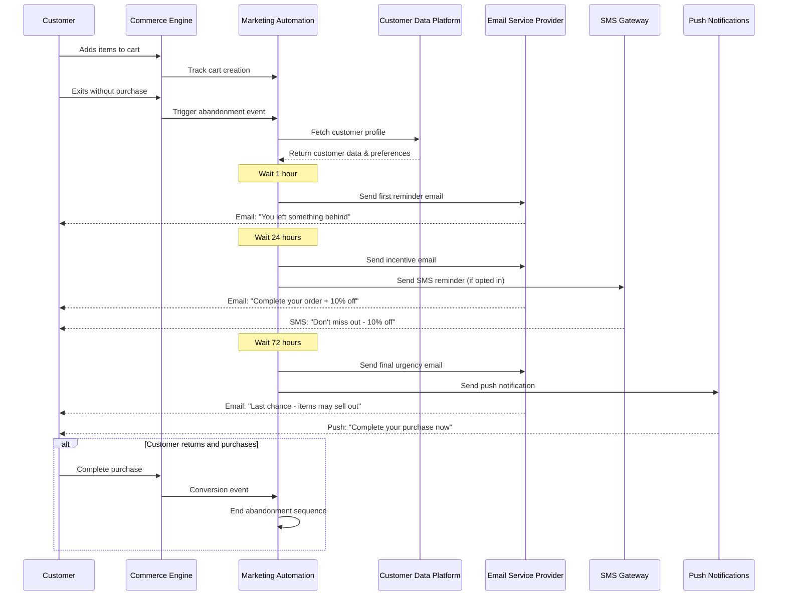

# MACH Alliance • Open Data Model

## Entity: `Abandoned Cart Recovery Recipe`

### Recipe Purpose
To recover lost sales by re-engaging customers who have added items to their cart but haven't completed their purchase through automated, multi-channel communication sequences.

KPI tie-ins: Conversion rate recovery, revenue recovery rate, email open rates, cart abandonment rate reduction, customer lifetime value.

___Key Business Goals:___
* Recover 15-25% of abandoned carts through targeted messaging
* Reduce overall cart abandonment rate
* Increase customer engagement and retention
* Maximize revenue from existing traffic
* Improve email marketing performance metrics

---

### Recipe Overview

When a customer adds items to their cart but leaves without completing the purchase, this orchestration triggers a series of personalized, timed communications across multiple channels (email, SMS, push notifications, retargeting ads) to encourage them to return and complete their purchase. The system tracks customer behavior, personalizes messaging based on cart contents and customer history, and optimizes send times for maximum engagement.

---

### Actors / Stakeholders

* **Customer**: Abandons cart, receives recovery messages, may return to complete purchase
* **Commerce Engine**: Tracks cart state and customer behavior
* **Marketing Automation Platform**: Orchestrates multi-channel messaging campaigns
* **CDP/CRM**: Provides customer profile and preferences
* **Email Service Provider**: Delivers email campaigns
* **SMS Gateway**: Sends text message notifications
* **Push Notification Service**: Sends mobile app notifications
* **Retargeting Platform**: Displays personalized ads across web
* **Analytics Engine**: Tracks campaign performance and optimization

---

### Trigger Points / Events

**Action-based triggers:**
* Cart abandonment detected (no activity for 30 minutes)
* Customer exits checkout process
* Session timeout with items in cart
* Mobile app backgrounded with cart items

**Time-based triggers:**
* 1 hour post-abandonment: First email reminder
* 24 hours post-abandonment: Second email with incentive
* 72 hours post-abandonment: Final email with urgency messaging
* 7 days post-abandonment: Win-back campaign

---

### Recipe Flows

---

### Systems Involved

| **System**                    | **Role**                                      | **Owner**                    |
| ----------------------------- | --------------------------------------------- | ---------------------------- |
| Commerce Engine               | Cart state tracking, abandonment detection   | Engineering / Product        |
| Marketing Automation Platform | Campaign orchestration and timing            | Marketing / MarTech          |
| Customer Data Platform        | Customer profiles and segmentation           | Data / Marketing             |
| Email Service Provider        | Email delivery and tracking                  | Marketing / IT               |
| SMS Gateway                   | Text message delivery                        | Marketing / IT               |
| Push Notification Service     | Mobile app notifications                     | Mobile / Product             |
| Retargeting Platform          | Display ad campaigns                         | Marketing / Advertising      |
| Analytics Engine              | Campaign performance tracking                | Data / Analytics             |

---

### Data Requirements

**Inputs:**
* Cart ID, customer ID, session data
* Product SKUs, quantities, prices in cart
* Customer contact preferences and history
* Browsing behavior and engagement data
* Customer segment and lifecycle stage

**Outputs:**
* Campaign performance metrics
* Recovery rates by channel and timing
* Customer engagement scores
* Revenue attribution data

**Data Flow:**
* Cart data stored in Commerce Engine
* Customer profiles enriched in CDP
* Campaign data tracked in Marketing Automation
* Performance metrics aggregated in Analytics Engine

**Privacy/PII Considerations:**
* Email/SMS consent management
* GDPR/CCPA compliance for customer data
* Right to be forgotten handling
* Preference center integration

---

### Variants / Alternatives

**Channel Variations:**
* Email-only campaigns for basic customers
* Multi-channel campaigns for high-value customers
* SMS-first approach for mobile-heavy demographics
* Push notification priority for app users

**Timing Variations:**
* Accelerated sequence for high-intent customers
* Extended nurture for first-time visitors
* Seasonal timing adjustments
* Time zone optimization

**Personalization Levels:**
* Basic: Product name and price
* Advanced: Personalized recommendations
* Premium: Dynamic pricing and exclusive offers

---

### Failure Modes / Edge Cases

| **Scenario**                      | **Handling Strategy**                            |
| --------------------------------- | ------------------------------------------------ |
| Customer unsubscribes mid-sequence | Immediately halt all communications             |
| Cart items go out of stock        | Substitute similar products or pause campaign   |
| Customer completes purchase elsewhere | Detect and end sequence, send confirmation      |
| Email delivery failures           | Retry with different email or switch to SMS     |
| Customer privacy request          | Immediate data purge and sequence termination   |
| Multiple abandoned carts          | Consolidate or prioritize highest value cart     |
| Pricing changes during sequence   | Update with current pricing or honor original   |

---

### Success Metrics / KPIs

**Primary KPIs:**
* Cart recovery rate: 15-25% target
* Revenue recovery rate: 10-20% of total abandoned cart value
* Time to recovery: Average time from abandonment to conversion

**Secondary KPIs:**
* Email open rates: >25% for abandonment emails
* Click-through rates: >5% for abandonment emails
* SMS response rates: >10% for abandonment texts
* Multi-channel engagement uplift: 30-50% vs single channel

**Optimization Metrics:**
* A/B test performance across subject lines, timing, incentives
* Channel performance comparison
* Customer segment performance analysis
* Seasonal and promotional impact measurement

---

### Security & Compliance Notes

**GDPR/CCPA Compliance:**
* Explicit consent for email and SMS communications
* Easy unsubscribe mechanisms in all communications
* Data retention policies for cart and customer data
* Right to be forgotten implementation

**Security Requirements:**
* Secure customer data transmission
* PCI compliance for payment-related data
* Authentication for customer re-engagement
* Fraud detection for suspicious recovery attempts

**Privacy Considerations:**
* Anonymized analytics where possible
* Secure storage of customer preferences
* Clear privacy policy communication
* Opt-out respect across all channels

---

### Footnote
This MACH Alliance Canonical Data Model Recipe is intentionally vendor neutral.
More details please refer to [MACH Alliance Standards](https://github.com/machalliance/standards)
