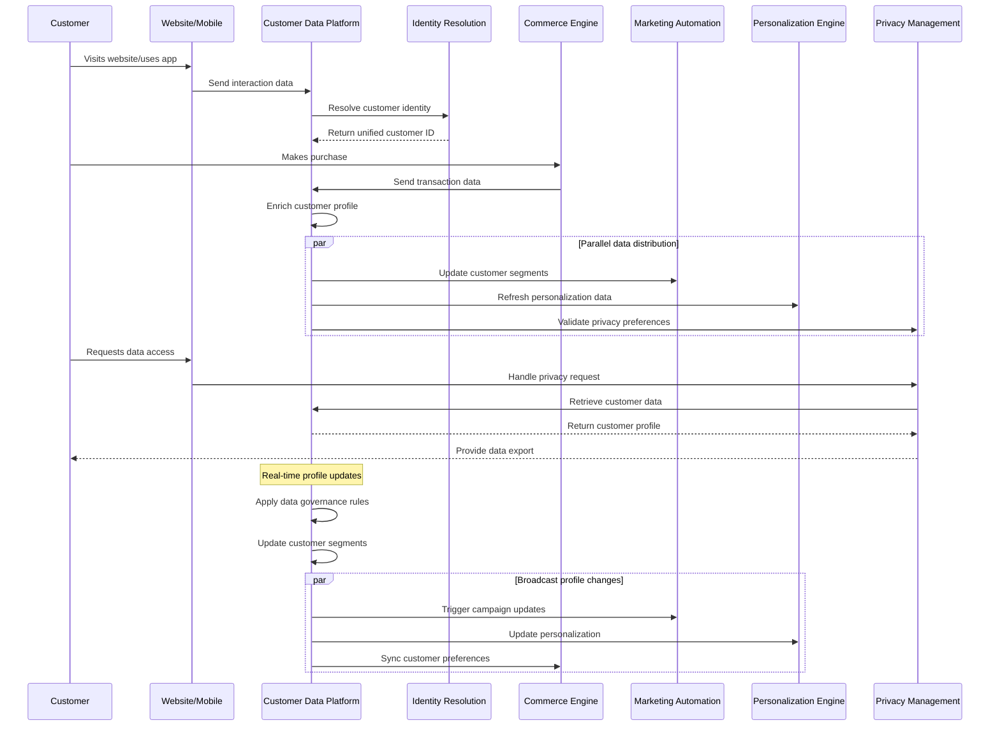

# MACH Alliance • Open Data Model

## Entity: `Customer Data Platform (CDP) Sync Recipe`

### Recipe Purpose
To create and maintain unified, real-time customer profiles by collecting, integrating, and synchronizing customer data from all touchpoints and systems, enabling personalized experiences, targeted marketing, and data-driven business decisions.

KPI tie-ins: Customer data completeness, profile accuracy, real-time sync success rate, marketing campaign performance, personalization effectiveness, customer lifetime value.

___Key Business Goals:___
* Create 360-degree customer view with 95%+ data completeness
* Enable real-time personalization across all touchpoints
* Improve marketing campaign performance through better segmentation
* Increase customer lifetime value through data-driven insights
* Ensure data privacy compliance and customer trust

---

### Recipe Overview

When customer interactions occur across any touchpoint (website, mobile app, email, social media, in-store, customer service), the CDP orchestration captures, processes, and synchronizes this data to maintain a unified customer profile. The system handles identity resolution, data enrichment, real-time updates, and privacy compliance while making enriched customer data available to all downstream systems for personalization, marketing automation, and analytics.

---

### Actors / Stakeholders

* **Customer**: Interacts across multiple touchpoints and channels
* **Customer Data Platform**: Central hub for unified customer profiles
* **Identity Resolution Engine**: Matches and merges customer identities
* **Data Sources**: All customer touchpoints and interaction systems
* **Marketing Automation Platform**: Consumes customer data for campaigns
* **Personalization Engine**: Uses customer data for tailored experiences
* **Analytics Platform**: Provides insights and customer intelligence
* **Commerce Engine**: Transactional data and customer behavior
* **Customer Service Platform**: Support interactions and case history
* **Privacy Management System**: Consent and preference management

---

### Trigger Points / Events

**Customer Interaction Events:**
* Website visit or page view
* Mobile app engagement
* Email open, click, or unsubscribe
* Social media interaction or mention
* In-store visit or purchase
* Customer service contact

**Transaction Events:**
* Purchase completion
* Cart abandonment
* Product return or exchange
* Subscription signup or cancellation
* Loyalty program activity

**Data Management Events:**
* New customer registration
* Profile data update
* Consent preference change
* Data source connection
* Scheduled data refresh
* Privacy request (access, deletion)

---

### Recipe Flows

---

### Systems Involved

| **System**                    | **Role**                                    | **Owner**                    |
| ----------------------------- | ------------------------------------------- | ---------------------------- |
| Customer Data Platform        | Central customer profile management        | Data / Marketing             |
| Identity Resolution Engine    | Customer identity matching and merging     | Data Engineering             |
| Web Analytics Platform        | Website and app interaction tracking       | Analytics / Marketing        |
| Commerce Engine               | Transaction and purchase behavior data     | Engineering / Product        |
| Marketing Automation Platform | Campaign data and customer communications  | Marketing / MarTech          |
| Customer Service Platform     | Support interactions and satisfaction data | Customer Service / Support   |
| Social Media Management       | Social interactions and sentiment data     | Marketing / Social Media     |
| Email Service Provider        | Email engagement and preference data       | Marketing / Communications   |
| Privacy Management System     | Consent and preference management          | Legal / Privacy              |
| Data Warehouse                | Historical data storage and analytics      | Data Engineering / Analytics |

---

### Data Requirements

**Inputs:**
* Customer identifiers (email, phone, loyalty ID, social handles)
* Behavioral data (clicks, views, purchases, searches)
* Demographic data (age, location, preferences)
* Transactional data (purchase history, order values, returns)
* Engagement data (email opens, social interactions, support tickets)
* Preference data (communication preferences, product interests)

**Outputs:**
* Unified customer profiles with 360-degree view
* Real-time customer segments and audiences
* Personalization triggers and recommendations
* Marketing campaign targeting lists
* Customer journey analytics and insights
* Privacy compliance reports and audit trails

**Data Flow:**
* Real-time data streams from all customer touchpoints
* Batch data imports from legacy systems and data warehouses
* Identity resolution and profile merging processes
* Real-time profile updates distributed to consuming systems
* Data governance and quality validation at each stage

**Privacy/PII Considerations:**
* GDPR Article 6 lawful basis for data processing
* CCPA compliance for California residents
* Consent management and preference centers
* Right to access, rectify, and delete personal data
* Data minimization and purpose limitation principles
* Secure data encryption and access controls

---

### Variants / Alternatives

**CDP Implementation Approaches:**
* **Real-time CDP**: Immediate data processing and profile updates
* **Batch CDP**: Scheduled data processing for cost optimization
* **Hybrid CDP**: Combination of real-time and batch processing
* **Edge CDP**: Distributed processing closer to data sources

**Data Integration Patterns:**
* **API-based**: Real-time data streaming via REST/GraphQL APIs
* **Event-driven**: Message queues and event streaming platforms
* **Database replication**: Direct database sync and CDC
* **File-based**: Scheduled batch imports and exports

**Industry-Specific Variants:**
* **Retail**: Focus on purchase behavior and product preferences
* **Financial Services**: Emphasis on transaction data and risk profiles
* **Healthcare**: Patient data integration with privacy compliance
* **B2B**: Account-based data and buying committee tracking

---

### Failure Modes / Edge Cases

| **Scenario**                    | **Handling Strategy**                         |
| ------------------------------- | --------------------------------------------- |
| Identity resolution conflicts   | Apply confidence scoring and manual review    |
| Data source system outage      | Queue data and sync when connection restored  |
| Privacy request processing     | Automated workflow with compliance tracking   |
| Data quality issues detected   | Quarantine data and trigger quality workflows |
| Profile merge conflicts        | Business rules engine with fallback options  |
| Real-time sync delays          | Batch reconciliation and error notifications  |
| Consent withdrawal             | Immediate data suppression and system updates |
| GDPR/CCPA compliance violation | Automated remediation and incident response   |

---

### Success Metrics / KPIs

**Data Quality & Completeness:**
* Customer profile completeness: >95%
* Data accuracy rate: >98%
* Identity resolution accuracy: >95%
* Real-time sync success rate: >99%

**Business Impact:**
* Marketing campaign performance uplift: 25-40%
* Personalization effectiveness improvement: 30-50%
* Customer lifetime value increase: 15-25%
* Customer acquisition cost reduction: 10-20%

**Operational Efficiency:**
* Data processing latency: <5 seconds for real-time updates
* System availability: >99.9%
* Data integration success rate: >98%
* Privacy request processing time: <30 days

**Privacy & Compliance:**
* Consent management accuracy: 100%
* Privacy request fulfillment rate: 100%
* Data retention policy compliance: 100%
* Security incident response time: <4 hours

---

### Security & Compliance Notes

**Data Privacy Compliance:**
* GDPR compliance for European customers
* CCPA compliance for California residents
* PIPEDA compliance for Canadian customers
* Industry-specific privacy regulations (HIPAA, GLBA, etc.)
* Privacy by design principles in system architecture

**Data Security Requirements:**
* End-to-end encryption for all customer data
* Role-based access controls and data masking
* Regular security audits and penetration testing
* Secure data transmission protocols (TLS 1.3+)
* Data loss prevention (DLP) and monitoring systems

**Consent Management:**
* Granular consent collection and management
* Preference centers for customer control
* Consent proof and audit trails
* Automated consent enforcement across systems
* Regular consent refresh and validation

**Data Governance:**
* Data lineage tracking and documentation
* Data quality monitoring and alerting
* Master data management and standardization
* Data retention and deletion policies
* Regular compliance audits and reporting

---

### Footnote
This MACH Alliance Canonical Data Model Recipe is intentionally vendor neutral.
More details please refer to [MACH Alliance Standards](https://github.com/machalliance/standards)
