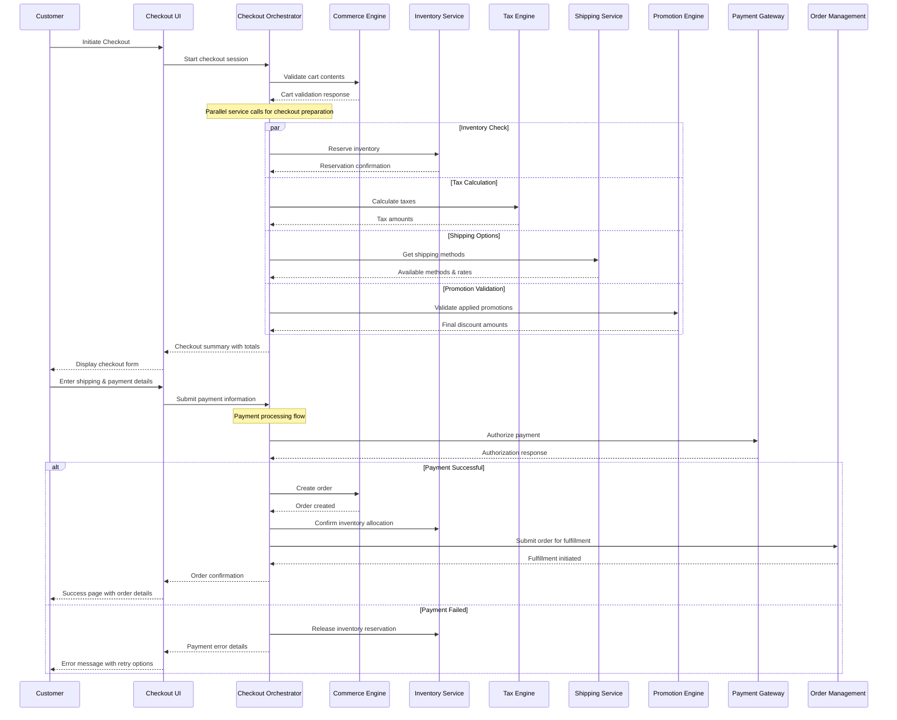

# MACH Alliance • Open Data Model

## Recipe: `Multi-Step Checkout Flow Orchestration`

## Table of contents

- [Recipe purpose](#recipe-purpose)
- [Recipe Overview](#recipe-overview)
- [Typical pitfalls](#typical-pitfalls)
- [Actors / Stakeholders](#actors--stakeholders)
- [Trigger Points / Events](#trigger-points--events)
- [Recipe Flows](#recipe-flows)
- [Systems Involved](#systems-involved)
- [Data Requirements](#data-requirements)
- [Variants / Alternatives](#variants--alternatives)
- [Failure Modes / Edge Cases](#failure-modes--edge-cases)
- [Success Metrics / KPIs](#success-metrics--kpis)
- [Security & Compliance Notes](#security--compliance-notes)

## Recipe Purpose

To deliver a seamless, secure, and conversion-optimized checkout experience by orchestrating cart validation, payment processing, inventory allocation, tax calculation, and order fulfillment across distributed MACH services. This enables consistent checkout behavior across all channels while maintaining system flexibility and reliability.

___Key Business Goals:___
* Maximize conversion rates through streamlined, user-friendly checkout flow
* Ensure payment security and regulatory compliance across all channels
* Reduce cart abandonment through real-time validation and error handling
* Enable flexible fulfillment options (shipping, pickup, digital delivery)
* Support complex pricing scenarios (promotions, taxes, multi-currency)
* Provide consistent experience across web, mobile, and in-store channels
  
**KPI tie-ins:** Conversion rate, cart abandonment rate, checkout completion time, payment success rate, customer satisfaction scores, average order value.

---

## Recipe Overview

When a customer initiates checkout, the system must orchestrate multiple backend services to validate cart contents, calculate final pricing with taxes and shipping, process payment, allocate inventory, and initiate fulfillment. This orchestration handles complex business logic while providing a smooth customer experience with real-time feedback and error recovery.

#### Approach Rationale

In composable commerce, using an orchestration layer for checkout instead of client-side coordination is essential for several critical reasons:

##### Security & Compliance
- **Payment Security:** Client-side checkout coordination would expose payment processing logic and potentially sensitive data. Server-side orchestration ensures PCI compliance and secure payment flows.
- **Data Validation:** Critical business rules, tax calculations, and inventory validations must be processed server-side to prevent tampering and ensure accuracy.
- **Regulatory Compliance:** GDPR, tax regulations, and financial compliance requirements mandate server-side processing and audit trails.

##### Business Logic Integrity
- **Atomic Operations:** Checkout requires multiple coordinated actions (inventory allocation, payment processing, order creation) that must succeed or fail together.
- **Real-time Validation:** Inventory levels, pricing, and promotions can change rapidly and must be validated at the moment of purchase.
- **Complex Calculations:** Tax calculations, shipping rates, and promotional discounts involve complex business rules that require reliable server-side processing.

##### Performance & Reliability
- **Error Handling:** Distributed checkout operations require sophisticated error handling, retry logic, and rollback mechanisms that are impossible to implement reliably client-side.
- **Network Optimization:** Orchestrating multiple API calls server-side reduces network latency and provides optimized response payloads.
- **Caching & Optimization:** Server-side orchestration enables intelligent caching of tax rates, shipping methods, and pricing calculations.

##### Operational Excellence
- **Monitoring & Observability:** Centralized checkout orchestration enables comprehensive logging, metrics, and alerting for business-critical operations.
- **A/B Testing:** Checkout flow experiments and optimization require controlled server-side logic that can't be reliably implemented client-side.
- **Scalability:** Server-side orchestration can handle high-traffic scenarios with proper load balancing and resource management.

---

## Typical pitfalls

**This orchestrated approach is ideal for:**
- High-conversion checkout experiences requiring real-time validation
- Complex multi-step flows with conditional logic and business rules
- Scenarios requiring strong security, compliance, and audit requirements

**However, consider simpler approaches if:**
- You have very simple products with minimal business logic. Consult the [Simple Checkout Flow](simple-checkout-flow-recipe.md) recipe.

- Your checkout flow has minimal validation requirements
- You're building a basic MVP with straightforward payment processing

**Common implementation challenges:**
- Managing state consistency across multiple services during checkout
- Handling partial failures and implementing proper rollback mechanisms
- Balancing real-time validation with acceptable response times
- Implementing proper error messaging and recovery flows for customers

---

## Actors / Stakeholders

**Users:**
- **Customers:** Complete purchases through optimized, secure checkout experience
- **Guest Users:** Convert through streamlined guest checkout flows
- **B2B Buyers:** Navigate approval workflows and complex pricing structures
- **Customer Service:** Assist with checkout issues and order modifications

**Systems:**
- **Checkout Orchestrator:** Coordinates the entire checkout flow and business logic
- **Commerce Engine:** Manages cart state, product validation, and order creation
- **Payment Gateway:** Processes payments, handles fraud detection, and manages compliance
- **Tax Engine:** Calculates taxes based on location, product type, and regulations
- **Inventory Service:** Validates availability and allocates stock
- **Shipping Service:** Calculates rates, validates addresses, and provides delivery options
- **Promotion Engine:** Applies discounts, validates coupon codes, and manages campaigns
- **Customer Service Platform:** Enables support team to assist with checkout issues

**Teams:**
- **Product/UX:** Owns checkout experience design and conversion optimization
- **Engineering:** Implements technical orchestration and maintains system reliability
- **Payments Team:** Manages payment processing, fraud prevention, and compliance
- **Operations:** Handles inventory management, shipping logistics, and order fulfillment
- **Customer Experience:** Manages support processes and customer communication
- **Legal/Compliance:** Ensures regulatory compliance and data protection

---

## Trigger Points / Events

**Action-based triggers:**
- Customer clicks "Checkout" or "Buy Now" from cart or product pages
- Customer updates shipping address or delivery preferences
- Customer applies or removes discount codes or gift cards
- Customer selects different payment methods or shipping options
- Customer attempts to complete final purchase submission

**Validation triggers:**
- Cart contents change requiring price/availability revalidation
- Payment authorization attempts and responses
- Address validation and tax calculation requests
- Inventory allocation and reservation expiration
- Fraud detection checks and manual review requirements

**Time-based triggers:**
- Checkout session timeout and cleanup
- Inventory reservation expiration (typically 10-15 minutes)
- Payment authorization timeout and retry logic
- Abandoned checkout follow-up workflows
- Periodic validation refresh for long checkout sessions

---

## Recipe Flows

#### Swimlane or Sequence Diagram



---

## Systems Involved

| **System**              | **Role**                                           | **Owner**                    |
| ----------------------- | -------------------------------------------------- | ---------------------------- |
| Checkout Orchestrator   | Central coordination of checkout flow and logic    | Architecture / Engineering   |
| Commerce Engine         | Cart management, product validation, order creation| Commerce / Product Team      |
| Payment Gateway         | Payment processing, fraud detection, compliance    | Payments / Security Team     |
| Inventory Service       | Stock validation, reservation, allocation          | Operations / Supply Chain    |
| Tax Engine              | Tax calculation, compliance, reporting             | Finance / Compliance Team    |
| Shipping Service        | Rate calculation, address validation, carriers     | Operations / Logistics       |
| Promotion Engine        | Discount validation, campaign management           | Marketing / Pricing Team     |
| Order Management System | Order fulfillment, tracking, communication        | Operations Team              |
| Customer Data Platform  | Customer profiles, preferences, history           | Data / Marketing Team        |
| Fraud Detection Service | Risk assessment, transaction monitoring           | Security / Risk Team         |

---

## Data Requirements

| **Entity**                  | **Function**                                        | **Source System**         |
| --------------------------- | --------------------------------------------------- | ------------------------- |
| [Cart](../entities/cart/cart.md)                    | Input - Cart contents and customer session data    | Commerce Engine           |
| [Customer](../entities/customer/customer.md)        | Input - Customer profile, addresses, preferences    | Customer Data Platform    |
| [Product](../entities/product/product.md)           | Input - Product details, pricing, availability     | Commerce Engine / PIM     |
| [Inventory](../entities/inventory/inventory.md)     | Input/Output - Stock levels, reservations          | Inventory Service         |
| [Pricing](../entities/pricing/pricing.md)           | Input - Product pricing, promotions, discounts     | Pricing Engine            |
| [Order](../entities/order/order.md)                 | Output - Created order with all transaction details| Order Management System   |
| Payment Transaction         | Output - Payment authorization, capture details     | Payment Gateway           |
| Tax Calculation             | Output - Tax amounts, rates, exemptions            | Tax Engine                |
| [Shipping Method](../entities/shipping/shipping-method.md) | Input - Available shipping options and rates | Shipping Service          |

### Data Flow Details

**Checkout Initiation Inputs:**
- Cart ID and session information
- Customer identification (authenticated or guest)
- Channel context (web, mobile, store, API)
- Geographic location for tax and shipping calculations

**Service Coordination Data:**
- Real-time inventory levels and reservation status
- Current pricing including promotions and customer-specific rates
- Tax rates and regulations for customer location and products
- Available shipping methods with calculated rates and delivery estimates
- Payment method options and fraud risk assessments

**Transaction Completion Outputs:**
- Confirmed order with complete transaction details
- Payment authorization and capture confirmation
- Inventory allocation and shipment preparation instructions
- Customer communication triggers (confirmation emails, SMS)
- Analytics events for conversion tracking and optimization

### Data Lineage & Performance Considerations

- **Real-time Processing:** Critical checkout data must be processed in real-time to ensure accuracy and prevent overselling
- **Caching Strategy:** Non-critical data like shipping methods and tax rates can be cached with appropriate TTL
- **State Management:** Checkout session state must be maintained across multiple service calls with proper cleanup
- **Rollback Handling:** Failed transactions require coordinated rollback across inventory reservations and payment authorizations

### Privacy/PII Considerations

**Minimal Checkout Data:**
- Guest checkout with minimal required information (email, shipping address)
- Temporary storage of payment details with PCI-compliant tokenization
- Session-based data retention with automatic cleanup

**Authenticated Customer Data:**
- Secure handling of saved payment methods and addresses
- Customer preference management for marketing communications
- Order history integration with proper data retention policies
- Cross-border data transfer compliance for international customers

#### Example Checkout Session State

```json
{
  "session_id": "checkout_abc123",
  "customer_id": "cus_001",
  "cart": {
    "id": "cart_001",
    "line_items": [
      {
        "product_id": "PROD-001",
        "variant_id": "VAR-001",
        "quantity": 2,
        "unit_price": {
          "amount": 29.99,
          "currency": "USD"
        }
      }
    ],
    "subtotal": {
      "amount": 59.98,
      "currency": "USD"
    }
  },
  "shipping_address": {
    "line1": "123 Main St",
    "city": "Seattle",
    "region": "WA",
    "postal_code": "98101",
    "country": "US"
  },
  "billing_address": {
    "same_as_shipping": true
  },
  "shipping_method": {
    "id": "standard-ground",
    "name": "Standard Ground",
    "cost": {
      "amount": 8.99,
      "currency": "USD"
    },
    "estimated_delivery": "2024-01-15"
  },
  "taxes": {
    "rate": 0.095,
    "amount": {
      "amount": 6.55,
      "currency": "USD"
    }
  },
  "promotions": [
    {
      "code": "SAVE10",
      "discount": {
        "amount": 5.99,
        "currency": "USD"
      }
    }
  ],
  "totals": {
    "subtotal": {
      "amount": 59.98,
      "currency": "USD"
    },
    "shipping": {
      "amount": 8.99,
      "currency": "USD"
    },
    "tax": {
      "amount": 6.55,
      "currency": "USD"
    },
    "discount": {
      "amount": 5.99,
      "currency": "USD"
    },
    "total": {
      "amount": 69.53,
      "currency": "USD"
    }
  },
  "payment": {
    "method": "card",
    "token": "pm_1234567890",
    "last_four": "4242"
  },
  "inventory_reservations": [
    {
      "variant_id": "VAR-001",
      "quantity": 2,
      "reservation_id": "res_abc123",
      "expires_at": "2024-01-08T15:45:00Z"
    }
  ],
  "status": "payment_processing",
  "created_at": "2024-01-08T15:30:00Z",
  "updated_at": "2024-01-08T15:42:00Z",
  "expires_at": "2024-01-08T16:00:00Z"
}
```

---

## Variants / Alternatives

**Express Checkout Options:**
- One-click checkout for authenticated customers with saved payment methods
- Digital wallet integration (Apple Pay, Google Pay, PayPal Express)
- Buy Now, Pay Later (BNPL) providers with embedded checkout flows
- Mobile-optimized checkout with autofill and biometric authentication

**B2B Checkout Variations:**
- Purchase order workflows with approval chains and spending limits
- Contract pricing and negotiated terms with custom payment schedules
- Multi-location shipping with cost center allocation and budgeting
- Bulk ordering with volume discounts and inventory allocation

**Multi-Channel Adaptations:**
- In-store checkout with tablet/POS integration for unified inventory
- Mobile app checkout with native payment processing and push notifications
- Social commerce checkout embedded in social media platforms
- Voice commerce checkout through smart speakers and virtual assistants

**International Checkout Support:**
- Multi-currency pricing with real-time exchange rates and local payment methods
- Localized tax calculation including VAT, GST, and duty calculations
- Address format validation and shipping restrictions by country
- Compliance with regional data protection and consumer protection laws

---

## Failure Modes / Edge Cases

| **Scenario**                      | **Impact**                               | **Mitigation Strategy**                           |
| --------------------------------- | ---------------------------------------- | ------------------------------------------------- |
| **Payment Authorization Failure** | Customer cannot complete purchase        | Retry logic with alternate payment methods; clear error messaging with suggested actions |
| **Inventory Depletion Mid-Checkout** | Product becomes unavailable during checkout | Real-time inventory checks; offer alternatives; waitlist signup options |
| **Tax Service Unavailable**      | Cannot calculate final order total       | Fallback to cached tax rates; provide estimated totals with clear disclaimers |
| **Shipping Service Timeout**     | Cannot provide shipping options          | Default shipping methods; cached rate fallbacks; estimated delivery dates |
| **Promotion Engine Error**       | Discounts cannot be applied              | Allow checkout without discount; manual review and credit post-purchase |
| **Session Timeout**              | Customer loses checkout progress         | Extended session warnings; auto-save functionality; quick recovery options |
| **Address Validation Failure**   | Cannot validate shipping address         | Allow manual address entry; flag for verification; provide address suggestions |
| **Fraud Detection Trigger**      | Payment flagged for manual review        | Hold order processing; customer communication; expedited review process |
| **Multiple Browser Tab Conflicts** | Concurrent checkout sessions cause errors | Session management with conflict detection; clear messaging about active sessions |
| **Network Connectivity Issues**  | Partial service failures or timeouts    | Circuit breakers; graceful degradation; retry mechanisms with exponential backoff |

---

## Success Metrics / KPIs

**Conversion Metrics:**
- Checkout conversion rate: Target >80% from checkout initiation to completion
- Cart abandonment rate: Target <30% with recovery campaigns
- Checkout completion time: Target <3 minutes average time-to-purchase
- Error rate: Target <2% of checkout attempts result in technical errors
- Payment success rate: Target >98% of authorized payments successfully process

**Customer Experience Metrics:**
- Customer satisfaction scores for checkout experience: Target >4.5/5.0
- Mobile checkout conversion: Target parity with desktop within 5%
- Guest checkout adoption: Target 60% of non-authenticated customers
- Express checkout usage: Target 40% of authenticated customers
- Return customer checkout time: Target <90 seconds for saved payment methods

**Business Impact Metrics:**
- Average order value through checkout: Monitor for optimization opportunities
- Revenue per checkout session: Measure cross-sell and up-sell effectiveness
- Checkout-driven subscription signup: Target 20% conversion to loyalty programs
- Multi-channel conversion consistency: Target <10% variance across channels

**Technical Performance Metrics:**
- Checkout orchestrator response time: Target <500ms p99 response time
- Service availability: Target >99.9% uptime for critical checkout services
- Data synchronization accuracy: Target >99.95% consistency across services
- Cache hit rate: Target >90% for frequently accessed checkout data

---

## Security & Compliance Notes

**Payment Security Requirements:**
- PCI DSS Level 1 compliance for all payment card processing
- End-to-end encryption for payment data in transit and at rest
- Tokenization of stored payment methods with secure vault management
- Regular security audits and penetration testing of checkout flows
- Fraud detection and prevention with machine learning risk scoring

**Data Protection & Privacy:**
- GDPR compliance including right to deletion and data portability
- CCPA compliance with transparent data collection and opt-out mechanisms
- SOC 2 Type II compliance for customer data handling and processing
- Data minimization principles with purpose limitation and retention policies
- Cross-border data transfer safeguards with appropriate legal mechanisms

**Authentication & Authorization:**
- Multi-factor authentication for high-value transactions
- Role-based access control for administrative checkout management
- Customer authentication with secure session management
- API security with rate limiting, authentication tokens, and request signing
- Administrative access controls with audit logging and approval workflows

**Compliance & Regulatory Requirements:**
- Sales tax compliance with automated tax calculation and reporting
- Consumer protection law compliance including clear pricing and terms
- Accessibility compliance (WCAG 2.1 AA) for inclusive checkout experiences
- Financial regulation compliance including anti-money laundering (AML) requirements
- International trade compliance including export controls and sanctions screening

**Operational Security:**
- Comprehensive audit trails for all checkout transactions and modifications
- Disaster recovery and business continuity planning for checkout services
- Regular backup and recovery testing with defined RTO/RPO objectives
- Incident response procedures with clear escalation and communication protocols
- Security monitoring with real-time alerting and automated threat response

---

>  This MACH Alliance Canonical Data Model is intentionally __vendor-neutral__ and serves as a foundation for interoperability across composable architectures. It is __continually evolving__ through community contributions, which are reviewed and approved collaboratively.
>  
>  All contributions are made under the __Creative Commons Attribution 4.0 International License (CC BY 4.0)__. By submitting a contribution, you agree to license your content under <a href="https://creativecommons.org/licenses/by/4.0/deed.en">CC BY 4.0</a>, allowing others to share and adapt the material with proper attribution.
>  
>  We welcome and encourage continued improvements through community input.