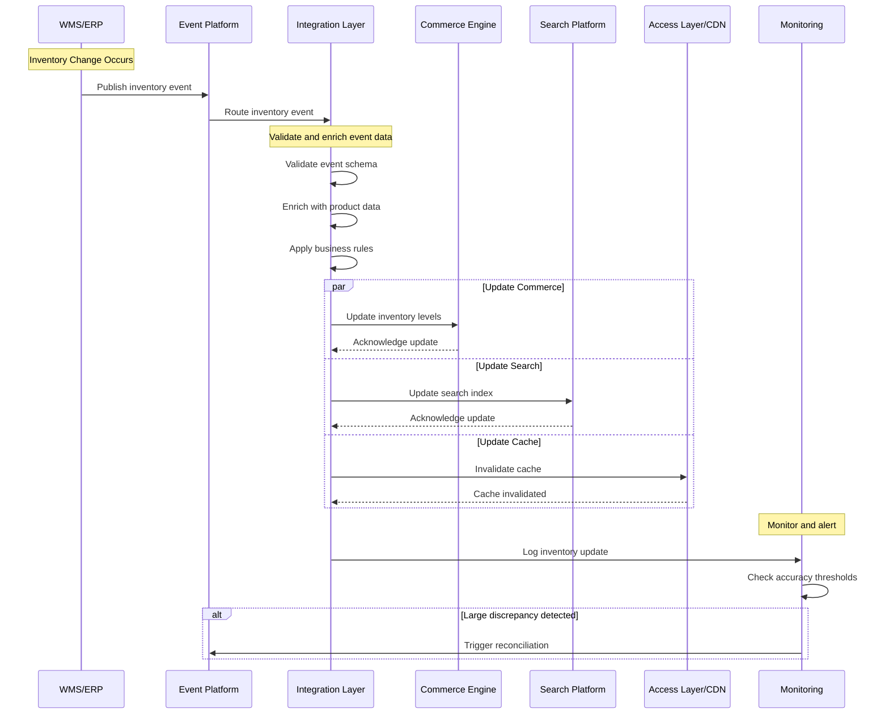
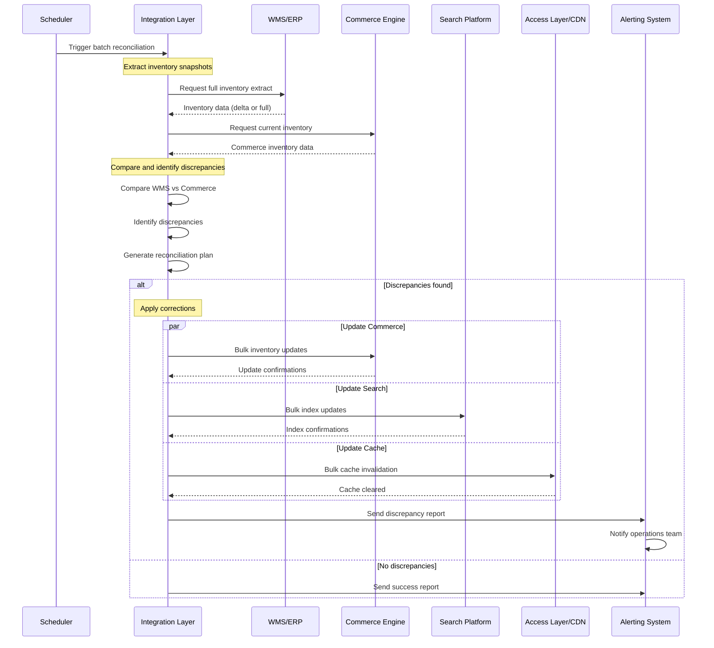
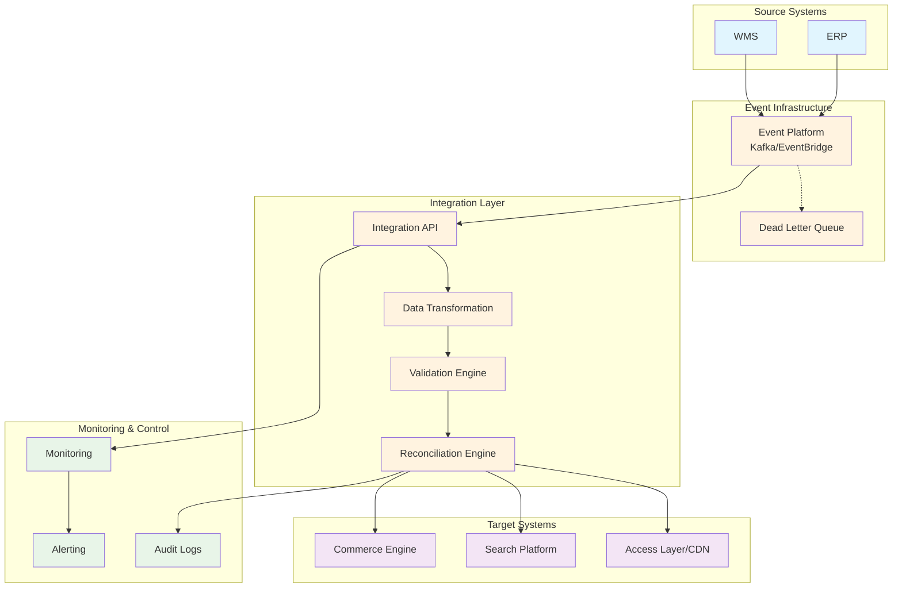

# MACH Alliance • Open Data Model

## Recipe: `Inventory Reconciliation`

## Table of contents

- [MACH Alliance • Open Data Model](#mach-alliance--open-data-model)
  - [Recipe: `Inventory Reconciliation`](#recipe-inventory-reconciliation)
  - [Table of contents](#table-of-contents)
  - [Recipe Purpose](#recipe-purpose)
  - [Recipe Overview](#recipe-overview)
    - [Approach Rationale](#approach-rationale)
      - [Real-Time vs Batch Considerations](#real-time-vs-batch-considerations)
      - [Data Integrity and Consistency](#data-integrity-and-consistency)
      - [Performance and Scalability](#performance-and-scalability)
      - [Business Continuity](#business-continuity)
  - [Typical pitfalls](#typical-pitfalls)
  - [Actors / Stakeholders](#actors--stakeholders)
  - [Trigger Points / Events](#trigger-points--events)
  - [Recipe Flows](#recipe-flows)
    - [Swimlane Diagram: Event-Driven Inventory Update](#swimlane-diagram-event-driven-inventory-update)
    - [Swimlane Diagram: Batch Reconciliation Process](#swimlane-diagram-batch-reconciliation-process)
    - [Architectural Overlay](#architectural-overlay)
  - [Systems Involved](#systems-involved)
  - [Data Requirements](#data-requirements)
    - [Data Flow Details](#data-flow-details)
    - [Data Lineage \& Performance Considerations](#data-lineage--performance-considerations)
    - [Privacy/PII Considerations](#privacypii-considerations)
  - [Variants / Alternatives](#variants--alternatives)
  - [Failure Modes / Edge Cases](#failure-modes--edge-cases)
  - [Success Metrics / KPIs](#success-metrics--kpis)
  - [Security \& Compliance Notes](#security--compliance-notes)

## Recipe Purpose

To maintain accurate, real-time inventory data across all commerce channels by synchronizing inventory levels from authoritative source systems (WMS, ERP) to commerce engines and search platforms. This ensures consistent product availability, prevents overselling, and maintains customer trust through reliable inventory information.

___Key Business Goals:___
* Prevent overselling and stockouts by maintaining accurate inventory levels
* Reduce cart abandonment due to inventory discrepancies
* Enable real-time inventory visibility across all channels
* Improve customer trust through accurate product availability
* Optimize inventory turnover and reduce carrying costs
* Support omnichannel fulfillment strategies

**KPI tie-ins:** Inventory accuracy rate, oversell incidents, cart abandonment rate, order fulfillment rate, inventory turnover, customer satisfaction scores, system downtime costs.

---

## Recipe Overview

When inventory levels change in source systems (WMS receiving stock, ERP processing transfers, fulfillment centers shipping orders), these changes must be propagated to all customer-facing systems to maintain accuracy. This recipe orchestrates the flow of inventory data from authoritative sources through integration layers to commerce engines, search indexes, and access layers.

#### Approach Rationale

In composable commerce, maintaining inventory accuracy across distributed systems requires a sophisticated reconciliation strategy that balances real-time updates with system performance:

##### Real-Time vs Batch Considerations
- **Event-Driven Updates**: Critical for high-velocity SKUs where inventory changes frequently. Provides near-real-time accuracy but requires robust event handling and potential throttling.
- **Batch Reconciliation**: Essential for comprehensive data validation and catching missed events. Provides system-wide consistency but with acceptable latency for slower-moving inventory.
- **Hybrid Approach**: Combines both strategies for optimal balance of accuracy and performance.

##### Data Integrity and Consistency
- **Source of Truth**: WMS/ERP systems maintain authoritative inventory records with proper concurrency control
- **Event Sourcing**: Immutable event logs provide audit trails and recovery capabilities
- **Eventual Consistency**: Accepts temporary inconsistencies for better system resilience and performance
- **Conflict Resolution**: Clear precedence rules when systems disagree on inventory levels

##### Performance and Scalability
- **Throttling and Rate Limiting**: Prevents downstream systems from being overwhelmed during peak inventory activity
- **Delta Processing**: Only syncs changed inventory to reduce processing overhead
- **Parallel Processing**: Updates multiple channels simultaneously while maintaining data consistency
- **Circuit Breakers**: Graceful degradation when downstream systems are unavailable

##### Business Continuity
- **Fallback Mechanisms**: Alternative data sources when primary systems are unavailable
- **Graceful Degradation**: Continue operations with cached data during outages
- **Monitoring and Alerting**: Proactive detection of inventory discrepancies
- **Recovery Procedures**: Automated reconciliation after system failures

---

## Typical pitfalls

- **Real-time only approach**: Without batch reconciliation, missed events or system failures can create permanent inventory discrepancies that are difficult to detect and resolve.
- **Batch only approach**: Long synchronization intervals lead to overselling, poor customer experience, and missed sales opportunities during high-demand periods.
- **No conflict resolution strategy**: When multiple systems update inventory simultaneously, lack of clear precedence rules causes data corruption.
- **Insufficient error handling**: Failed updates without retry mechanisms or dead letter queues result in persistent inventory inaccuracies.
- **Ignoring network partitions**: During connectivity issues, systems may diverge significantly, requiring comprehensive reconciliation strategies.

---

## Actors / Stakeholders

**Users:**
- **Customers:** Experience accurate inventory availability during browsing and checkout
- **Customer Service:** Access real-time inventory information for order inquiries
- **Inventory Managers:** Monitor inventory levels and identify discrepancies
- **Operations Teams:** Manage inventory reconciliation processes and resolve issues

**Systems:**
- **WMS (Warehouse Management System):** Authoritative source for physical inventory levels
- **ERP (Enterprise Resource Planning):** Master inventory data and business rules
- **Commerce Engine:** Customer-facing inventory for checkout and availability checks
- **Search/Discovery Platform:** Inventory data for product filtering and search results
- **Integration Platform:** Orchestrates data flow between systems
- **Access Layer/CDN:** Cached inventory data for high-performance reads
- **Monitoring Systems:** Track inventory accuracy and system health

**Teams:**
- **Operations:** Owns inventory reconciliation processes and monitoring
- **Engineering:** Implements and maintains integration infrastructure
- **Product Management:** Defines inventory accuracy requirements and customer experience
- **DevOps:** Manages system reliability and performance monitoring
- **Business Intelligence:** Analyzes inventory metrics and identifies optimization opportunities

---

## Trigger Points / Events

**Event-based (Real-time):**
- Inventory adjustment events from WMS (receipts, shipments, cycle counts)
- Order fulfillment confirmations
- Inventory transfers between locations
- Product returns and restocking
- Quality control holds and releases
- Emergency inventory updates (recalls, damage)

**Time-based (Batch):**
- Scheduled full reconciliation (typically nightly)
- Periodic delta synchronization (every 15-30 minutes)
- End-of-day inventory snapshots
- Weekly comprehensive audits
- Monthly inventory closing procedures

**System-driven:**
- Circuit breaker recovery (when systems come back online)
- Cache expiration and refresh
- Database maintenance windows
- System startup and initialization
- Failover and disaster recovery procedures

**Manual triggers:**
- On-demand reconciliation by operations teams
- Investigation of inventory discrepancies
- New product launches requiring inventory setup
- System integration testing and validation

---

## Recipe Flows

#### Swimlane Diagram: Event-Driven Inventory Update



#### Swimlane Diagram: Batch Reconciliation Process



#### Architectural Overlay



---

## Systems Involved

| **System**              | **Role**                                    | **Owner**                    |
| ----------------------- | ------------------------------------------- | ---------------------------- |
| WMS (Warehouse Mgmt)    | Authoritative physical inventory source     | Operations / Supply Chain    |
| ERP (Enterprise)        | Master inventory data and business rules    | IT / Finance                 |
| Event Platform          | Event streaming and routing                 | Platform / Integration Team  |
| Integration Layer       | Data transformation and orchestration      | Integration / Platform Team  |
| Commerce Engine         | Customer-facing inventory availability      | E-commerce / Product Team    |
| Search Platform         | Inventory data for product discovery        | Search / Engineering Team    |
| Access Layer/CDN        | High-performance inventory reads           | Platform / DevOps Team       |
| Monitoring System       | Inventory accuracy tracking and alerting    | Operations / DevOps Team     |

---

## Data Requirements

| **Entity**                                                  | **Function**                                                | **Source System**    |
| ----------------------------------------------------------- | ----------------------------------------------------------- | -------------------- |
| [Inventory](../entities/inventory/inventory.md)            | Input - Real-time inventory levels and reservations        | WMS / ERP            |
| [Product](../entities/product/product.md)                  | Context - SKU information for inventory mapping            | PIM / Commerce       |
| Inventory Event                                             | Input - Change events (receipts, shipments, adjustments)  | WMS / ERP            |
| Location                                                    | Context - Warehouse/store location information             | WMS / OMS            |
| Reconciliation Report                                       | Output - Discrepancy analysis and corrections applied      | Integration Layer    |

### Data Flow Details

**Inputs:**
- [Inventory](../entities/inventory/inventory.md) snapshots from WMS/ERP (quantities, reservations, locations)
- Inventory change events (real-time updates, stock movements)
- [Product](../entities/product/product.md) master data for SKU validation
- Location hierarchy for multi-warehouse scenarios

**Event Stream Data:**
- Event type (receipt, shipment, adjustment, transfer, return)
- SKU/product identifier and variant information
- Quantity changes (before/after, delta)
- Location identifiers (warehouse, store, zone)
- Timestamp and event sequencing information
- Business context (order ID, purchase order, cycle count)

**Processing Outputs:**
- Standardized [Inventory](../entities/inventory/inventory.md) objects for target systems
- Cache invalidation keys for access layer updates
- Reconciliation reports with discrepancy analysis
- Audit logs for compliance and troubleshooting
- Performance metrics and accuracy measurements

### Data Lineage & Performance Considerations

- **Real-time Processing:** Event-driven updates processed within 5-10 seconds of source changes
- **Batch Processing:** Full reconciliation completed within 2-hour maintenance windows
- **Caching Strategy:** Multi-layer caching with smart invalidation to balance accuracy and performance
- **Archive Strategy:** Event logs retained for 90 days, reconciliation reports for 2 years

### Privacy/PII Considerations

**Minimal Data Exposure:**
- Inventory events contain only business-relevant data (SKU, quantity, location)
- No customer PII in inventory reconciliation processes
- Employee information limited to system user IDs for audit trails

**Data Protection:**
- Inventory data encrypted in transit and at rest
- Access controls restrict sensitive inventory information
- Audit logs capture all inventory modifications with user attribution
- Cross-border data residency requirements for multi-national operations

#### Example Inventory Event Object
```json
{
  "event_id": "evt-inv-20240915-001234",
  "event_type": "inventory_adjustment",
  "source_system": "wms-warehouse-east",
  "timestamp": "2024-09-15T14:30:15Z",
  "sku_id": "TSHIRT-BLUE-M",
  "location_id": "WH-EAST-A12",
  "inventory_change": {
    "quantity_before": 120,
    "quantity_after": 145,
    "quantity_delta": 25,
    "reserved_before": 15,
    "reserved_after": 15,
    "available_before": 95,
    "available_after": 120
  },
  "business_context": {
    "transaction_type": "receipt",
    "reference_id": "PO-2024-5678",
    "reason_code": "STOCK_RECEIPT",
    "operator_id": "user123"
  },
  "version": 1
}
```

#### Example Reconciliation Report Object
```json
{
  "reconciliation_id": "recon-20240915-nightly",
  "execution_time": "2024-09-15T02:00:00Z",
  "scope": "full_inventory",
  "summary": {
    "total_skus_processed": 15847,
    "discrepancies_found": 23,
    "corrections_applied": 21,
    "manual_review_required": 2,
    "processing_time_seconds": 4285
  },
  "discrepancies": [
    {
      "sku_id": "WIDGET-001",
      "location_id": "WH-CENTRAL",
      "wms_quantity": 50,
      "commerce_quantity": 47,
      "difference": 3,
      "severity": "medium",
      "action_taken": "updated_commerce_to_wms",
      "possible_cause": "missed_shipment_event"
    }
  ],
  "performance_metrics": {
    "accuracy_rate": 99.85,
    "sync_latency_seconds": 12.3,
    "error_rate": 0.01
  }
}
```

---

## Variants / Alternatives

**Near Real-Time Approach:**
- Event-driven updates with 30-second batching for high-frequency changes
- Reduced system load while maintaining acceptable accuracy for most SKUs
- Ideal for businesses with moderate inventory velocity

**High-Frequency Trading Model:**
- Sub-second inventory updates for flash sales and limited inventory scenarios
- Requires dedicated high-performance event processing infrastructure
- Essential for auction sites, limited drops, and time-sensitive inventory

**Regional Reconciliation Strategy:**
- Separate reconciliation processes by geographic region or business unit
- Enables different accuracy requirements and processing windows
- Supports compliance with data residency requirements

**Channel-Specific Prioritization:**
- Different update frequencies for different sales channels (web vs mobile vs B2B)
- Prioritizes high-value channels during system resource constraints
- Allows for channel-specific business rules and inventory allocation

**Conflict Resolution Strategies:**
- **WMS Always Wins:** Simple approach where physical inventory takes precedence
- **Business Rules-Based:** Complex logic considering order timing, customer priority, channel
- **Manual Review Queue:** Flagging significant discrepancies for human decision
- **Weighted Consensus:** Using confidence scores from multiple sources

---

## Failure Modes / Edge Cases

| **Scenario** | **Impact** | **Mitigation Strategy** |
|--------------|------------|-------------------------|
| **WMS/ERP System Outage** | No new inventory updates, potential overselling | Use cached data with degraded accuracy warnings; implement read-only failover replicas; set conservative inventory buffers |
| **Event Platform Failure** | Missed real-time updates, growing reconciliation gaps | Dead letter queues for event replay; batch reconciliation frequencies increased; direct API fallback for critical updates |
| **Network Partitions** | Systems operate with stale data, significant divergence | Implement jitter in reconciliation timing; use vector clocks for conflict detection; automated recovery procedures |
| **Duplicate Event Processing** | Double counting inventory changes, incorrect availability | Event deduplication using unique event IDs; idempotent update operations; audit trails for detecting duplicates |
| **Race Conditions** | Concurrent updates causing data corruption or lost changes | Optimistic concurrency control with version numbers; retry logic with exponential backoff; conflict resolution queues |
| **Schema Evolution** | New data formats breaking downstream processors | Backward-compatible schema design; gradual rollout with feature flags; comprehensive integration testing |
| **High-Frequency Updates** | System overload, processing delays, cascading failures | Rate limiting and throttling; priority queues for critical SKUs; circuit breakers to prevent cascade failures |
| **Data Quality Issues** | Negative inventory, invalid SKU references, corrupted data | Schema validation at ingestion; business rule validation; data quality monitoring and alerting |
| **Timezone and Timing Issues** | Sequence errors, incorrect event ordering, batch conflicts | UTC timestamps throughout; event sequence numbers; temporal consistency checks |
| **Large Reconciliation Gaps** | Massive data differences requiring full rebuilds | Incremental reconciliation strategies; data validation checkpoints; parallel processing for large datasets |

---

## Success Metrics / KPIs

**Accuracy Metrics:**
- Inventory accuracy rate: Target >99.5% across all SKUs
- Discrepancy resolution time: Target <15 minutes for high-priority items
- Oversell incident rate: Target <0.1% of all orders
- Stockout prevention rate: Target >95% of potential stockouts caught before customer impact

**Performance Metrics:**
- Real-time sync latency: Target <30 seconds for event-driven updates
- Batch reconciliation completion time: Target <2 hours for nightly full sync
- System availability: Target >99.9% uptime for inventory services
- Event processing throughput: Target 10,000+ events per minute capacity

**Business Impact Metrics:**
- Cart abandonment due to inventory issues: Target <2% of all abandonments
- Customer complaints related to inventory: Target <5 per 10,000 orders
- Revenue loss from overselling: Target <0.05% of total revenue
- Inventory turnover improvement: Target 10-15% increase in inventory velocity

**Operational Metrics:**
- Mean time to detect inventory discrepancies: Target <10 minutes
- Mean time to resolve inventory issues: Target <30 minutes
- Manual intervention rate: Target <1% of all inventory updates
- False positive alert rate: Target <5% of all inventory alerts

---

## Security & Compliance Notes

> [!WARNING]
> This list is not exhaustive, and you must do your own due diligence to ensure you meet the required security and compliance standards for your unique scenario, however, some common aspects to review are:

**Data Security:**
- End-to-end encryption for all inventory data in transit using TLS 1.3
- Encryption at rest for inventory databases and event stores
- API authentication using OAuth 2.0 or mutual TLS for system-to-system communication
- Secure key management for encryption keys and API credentials
- Network segmentation to isolate inventory systems from public networks

**Access Control:**
- Role-based access control (RBAC) for inventory management functions
- Principle of least privilege for system accounts and API keys
- Multi-factor authentication for administrative access to inventory systems
- Regular access reviews and automated deprovisioning of unused accounts
- Audit logging of all access to sensitive inventory data

**Compliance Requirements:**
- SOX compliance for financial inventory reporting and audit trails
- Data retention policies for inventory transactions and reconciliation reports
- Cross-border data transfer compliance for multi-national inventory operations
- Industry-specific regulations (FDA for pharmaceuticals, FTC for consumer goods)
- Privacy regulations impact on customer-linked inventory data

**Audit and Monitoring:**
- Complete audit trails for all inventory changes with immutable logging
- Real-time monitoring for unusual inventory patterns or potential fraud
- Regular penetration testing of inventory management APIs
- Compliance reporting automation for regulatory requirements
- Incident response procedures for inventory data breaches

**Business Continuity:**
- Disaster recovery procedures with <4 hour RTO for inventory systems
- Business continuity planning for extended outages of source systems
- Data backup and recovery testing for inventory databases
- Failover procedures that maintain data consistency and accuracy
- Regular disaster recovery drills including inventory reconciliation scenarios

---

>  This MACH Alliance Canonical Data Model is intentionally __vendor-neutral__ and serves as a foundation for interoperability across composable architectures. It is __continually evolving__ through community contributions, which are reviewed and approved collaboratively.
>  
>  All contributions are made under the __Creative Commons Attribution 4.0 International License (CC BY 4.0)__. By submitting a contribution, you agree to license your content under <a href="https://creativecommons.org/licenses/by/4.0/deed.en">CC BY 4.0</a>, allowing others to share and adapt the material with proper attribution.
>  
>  We welcome and encourage continued improvements through community input.