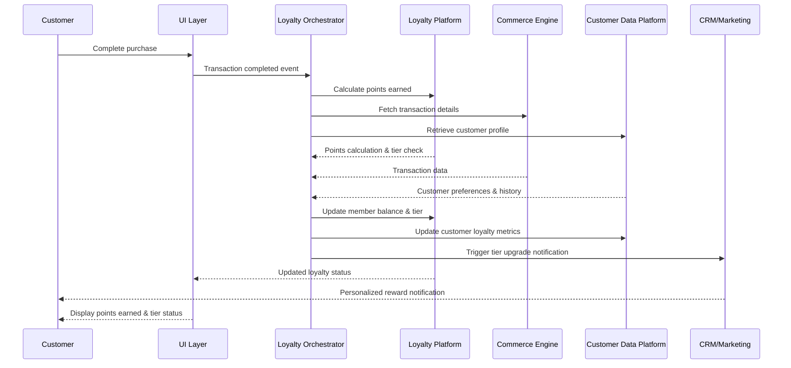
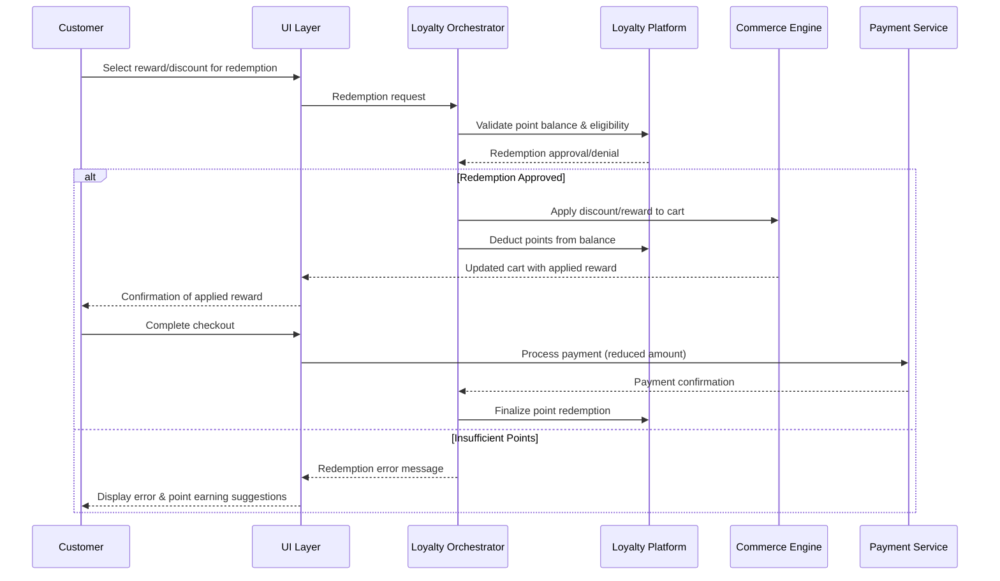

# MACH Alliance • Open Data Model

## Entity: `Loyalty Program Integration`

NOTE: A "recipe" is a document intended to serve cross-functional stakeholders (e.g., product, engineering, ops, CX, analytics).

### Recipe Purpose
To integrate a comprehensive loyalty program that drives customer retention, increases customer lifetime value, and provides personalized rewards experiences across all touchpoints. This recipe enables seamless point earning, redemption, tier management, and personalized offers.

KPI tie-ins: Customer Lifetime Value (CLV), repeat purchase rate, average order value (AOV), customer retention rate, engagement frequency, Net Promoter Score (NPS).

___Key Business Goals:___
* Increase customer retention and repeat purchase behavior
* Drive higher average order values through tier-based incentives
* Enable personalized marketing and product recommendations
* Create competitive differentiation through exclusive member benefits
* Generate valuable customer behavior data for analytics

---

### Recipe Overview

The loyalty program integration orchestrates customer enrollment, point accrual and redemption, tier progression, and personalized reward delivery across all customer touchpoints. When customers interact with the brand—whether through purchases, reviews, social engagement, or referrals—the system automatically tracks activities, calculates rewards, updates member status, and triggers relevant communications or offers.

This integration spans the entire customer journey from initial signup through ongoing engagement, ensuring consistent loyalty program experiences across web, mobile, in-store, and customer service channels.

---

### Actors / Stakeholders
Who is involved?

* __Users:__ Customer (loyalty member), Guest user, Customer service agent, Store associate
* __Systems:__ Loyalty platform, Commerce engine, CDP, CRM, Email/SMS platform, Mobile app, POS system, Customer service platform
* __Teams:__ Marketing, Customer experience, Product, Engineering, Operations, Analytics, Customer service

---

### Trigger Points / Events

What initiates this recipe?

* __Action-based:__ 
  * Customer completes purchase transaction
  * Customer creates account or enrolls in loyalty program
  * Customer reaches new tier threshold
  * Customer attempts point redemption
  * Customer refers new member
  * Customer writes product review
  * Customer celebrates birthday/anniversary
* __Time-based:__
  * Monthly tier status evaluation
  * Point expiration warnings (30/7 days before expiry)
  * Quarterly engagement campaigns
  * Seasonal bonus point promotions

---

### Recipe Flows

#### Typical purchase process

#### Point Redemption Flow

---

### Systems Involved

NOTE - ALIGN WITH THE REFERENCE ARCHITECTURE: https://github.com/machalliance/standards/blob/main/src/diagrams/MACH%20Alliance%20Reference%20Architecture%20Diagrams-rev1.4.pdf

| **System**              | **Role**                                    | **Owner**                    |
| ----------------------- | ------------------------------------------- | ---------------------------- |
| Loyalty Platform        | Core loyalty logic, points, tiers, rewards | Marketing / Customer Experience |
| Commerce Engine         | Transaction data, product catalog, pricing | Product / Engineering        |
| Customer Data Platform  | Unified customer profiles and preferences   | Data / Analytics             |
| CRM/Marketing Platform  | Personalized communications and campaigns   | Marketing                    |
| Payment Services        | Handle monetary redemptions and refunds     | Finance / Engineering        |
| Mobile App              | Mobile-specific loyalty experiences         | Mobile Team                  |
| POS System              | In-store loyalty integration                | Retail Operations            |
| Customer Service        | Agent tools for loyalty support            | Customer Experience          |
| Analytics Platform      | Program performance and customer insights   | Analytics / Data Science     |

---

### Data Requirements

* **Inputs:**
  * Customer ID, transaction data, product purchases
  * Customer behavior events (reviews, referrals, social shares)
  * Store visit data, customer service interactions
  * Campaign engagement metrics
  
* **Outputs:**
  * Point balances and transaction history
  * Tier status and progression metrics
  * Personalized reward recommendations
  * Redemption confirmations and receipts
  * Program performance analytics
  
* **Data lineage:** Customer data flows from touchpoints → CDP → Loyalty Platform → Marketing systems
* **Privacy/PII considerations:** 
  * Customer consent for loyalty program data usage
  * GDPR/CCPA compliance for reward communications
  * Secure storage of redemption history
  * Right to be forgotten implementation

---

### Variants / Alternatives

* **Mobile-first program:** App-exclusive rewards and mobile wallet integration
* **B2B loyalty:** Account-based rewards with approval workflows
* **Coalition program:** Multi-brand point sharing and redemption
* **Gamified experience:** Badges, challenges, and social leaderboards
* **Subscription-based tiers:** Paid premium membership levels
* **Partner integrations:** Third-party reward catalog and cross-brand earning

---

### Failure Modes / Edge Cases

What can go wrong?

| **Scenario**                    | **Handling Strategy**                                      |
| ------------------------------- | ---------------------------------------------------------- |
| Loyalty platform unavailable   | Cache recent balances; allow transactions, sync later     |
| Point calculation error         | Default to customer benefit; flag for manual review       |
| Duplicate point awards          | Implement idempotency keys; automated deduplication       |
| Tier downgrade edge cases       | Grace period with tier benefits; clear communication      |
| Redemption at checkout fails    | Allow completion; issue credit for future use             |
| Cross-channel sync delays       | Display "syncing" status; eventual consistency model      |
| Fraudulent point earning        | Real-time fraud detection; automated account flagging     |
| Expired point redemption        | Customer service override capability; goodwill policies   |

---

### Success Metrics / KPIs

* **Program Engagement:**
  * 80%+ active member participation rate
  * 25%+ increase in purchase frequency for members
  * 15%+ higher average order value for loyalty members
  
* **Technical Performance:**
  * 99.9% loyalty platform uptime
  * <500ms response time for balance/tier lookups
  * 95%+ successful point redemption rate
  
* **Business Impact:**
  * 20%+ improvement in customer lifetime value
  * 30%+ increase in repeat customer rate
  * 10%+ reduction in customer acquisition cost through referrals

---

### Security & Compliance Notes
PLEASE NOTE: This list is not exhaustive, and you must do your own due diligence to ensure you meet the required security and compliance standards for your unique scenario, however, some common aspects to review are:

* **GDPR/CCPA implications:** Consent management for loyalty communications and data usage
* **PCI compliance:** Secure handling of payment data during redemptions
* **Fraud prevention:** Point earning and redemption monitoring systems
* **Data encryption:** Customer loyalty data at rest and in transit
* **Audit trails:** Complete transaction history for loyalty activities
* **Account security:** Multi-factor authentication for high-value redemptions
* **Geographic compliance:** Local loyalty program regulations and tax implications

---

### Footnote
This MACH Alliance Canonical Data Model Recipe is intentionally vendor neutral.
More details please refer to ADD LINK ON ALL
