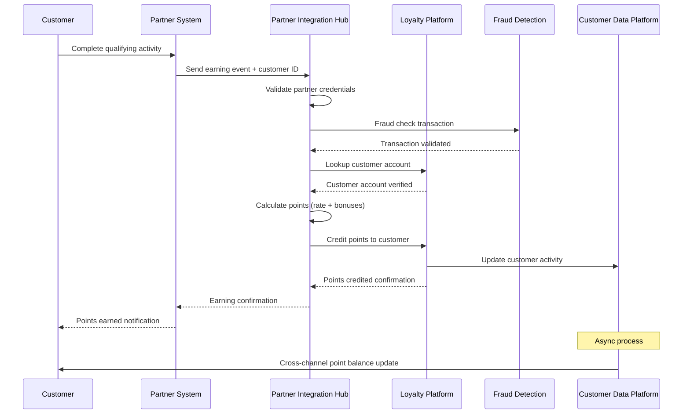
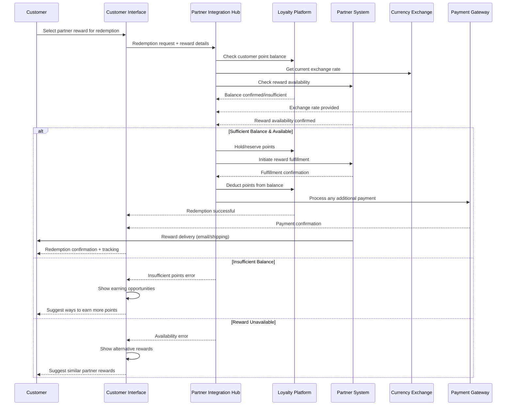
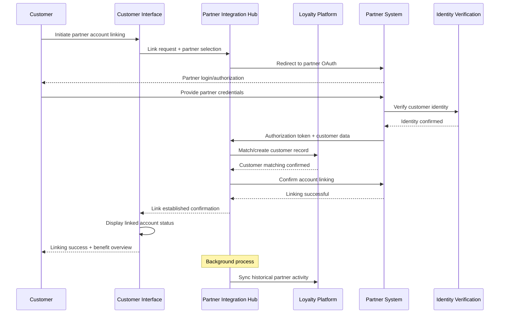

# MACH Alliance • Open Data Model

## Entity: `Loyalty Program Partner Integration`

NOTE: A "recipe" is a document intended to serve cross-functional stakeholders (e.g., product, engineering, ops, CX, analytics).

### Recipe Purpose
To enable seamless point earning and redemption across partner ecosystem while maintaining brand control, customer experience consistency, and revenue optimization. This integration expands the loyalty program's value proposition through strategic partnerships including airlines, hotels, credit cards, and retail coalitions.

KPI tie-ins: Partner-driven customer acquisition, cross-partner engagement rates, partner revenue share, customer lifetime value uplift, program stickiness metrics.

___Key Business Goals:___
* Expand point earning opportunities to drive program engagement
* Increase redemption options and perceived program value
* Acquire customers through partner channels
* Generate additional revenue streams through partner commissions
* Create competitive moats through exclusive partnership benefits
* Reduce program liability through diversified redemption options

---

### Recipe Overview

The partner integration orchestrates bi-directional point earning and redemption flows across multiple partner ecosystems. When customers interact with partners—whether earning points through credit card spending or redeeming points for airline miles—the system manages real-time point transfers, currency conversions, customer verification, and transaction reconciliation.

This integration maintains consistent customer experiences across all partner touchpoints while handling complex business rules, exchange rates, partner-specific promotions, and cross-brand data privacy requirements.

---

### Actors / Stakeholders
Who is involved?

* __Users:__ Loyalty member, Partner customer, Guest user
* __Systems:__ Loyalty platform, Partner APIs, Currency exchange service, Fraud detection, Payment gateway, Customer service platform
* __Teams:__ Partnerships, Product, Engineering, Finance, Legal, Customer experience, Marketing, Analytics
* __Partners:__ Airlines, Hotels, Credit card issuers, Retail partners, Online marketplaces, Service providers

---

### Trigger Points / Events

What initiates this recipe?

* __Point Earning Events:__
  * Credit card transaction at partner merchant
  * Hotel stay completion or airline flight taken
  * Partner e-commerce purchase
  * Partner app engagement or review submission
  
* __Point Redemption Events:__
  * Customer initiates cross-partner redemption
  * Partner reward catalog browsing
  * Miles/points transfer requests
  * Partner gift card purchases
  
* __Account Management Events:__
  * Partner account linking/unlinking
  * Cross-partner tier status matching
  * Partner promotion enrollment
  
* __Administrative Events:__
  * Partner contract updates or renewals
  * Exchange rate adjustments
  * Partner system maintenance windows

---

### Recipe Flows

#### Partner Point Earning Flow

#### Cross-Partner Point Redemption Flow

#### Partner Account Linking Flow

---

### Systems Involved

| **System**                 | **Role**                                    | **Owner**                    |
| -------------------------- | ------------------------------------------- | ---------------------------- |
| Partner Integration Hub    | API orchestration & partner communication  | Engineering / Partnerships   |
| Loyalty Platform           | Core point management & customer accounts   | Marketing / Customer Experience |
| Partner APIs               | External partner system integration        | Partner Technical Teams      |
| Currency Exchange Service  | Point-to-point & point-to-cash conversions | Finance / Engineering        |
| Fraud Detection           | Cross-partner transaction monitoring        | Risk / Security              |
| Identity Verification     | Customer matching across partner systems   | Security / Engineering       |
| Payment Gateway           | Handle cash portions of mixed redemptions  | Finance / Engineering        |
| Customer Service Platform | Partner-related support and troubleshooting| Customer Experience          |
| Analytics Platform        | Partner performance and customer insights  | Analytics / Data Science     |

---

### Data Requirements

* **Inputs:**
  * Partner transaction data and customer identifiers
  * Real-time exchange rates and conversion factors
  * Partner reward catalogs and availability
  * Customer account linking authorizations
  * Partner contract terms and commission structures
  
* **Outputs:**
  * Cross-partner point balances and transactions
  * Partner reward fulfillment confirmations
  * Revenue reconciliation and settlement data
  * Customer engagement analytics across partners
  * Partner performance metrics and insights
  
* **Data lineage:** Partner systems → Integration hub → Loyalty platform → Customer touchpoints → Analytics
* **Privacy/PII considerations:** 
  * Cross-border data transfer compliance
  * Partner-specific data sharing agreements
  * Customer consent for cross-partner data usage
  * Data minimization for partner communications

---

### Variants / Alternatives

* **White-label partner programs:** Partners use our loyalty technology under their brand
* **Coalition loyalty programs:** Shared point currency across multiple brands
* **API marketplace model:** Self-service partner integration platform
* **Affiliate earning programs:** Commission-based point earning through partner channels
* **Co-branded credit cards:** Deep financial partner integration with shared benefits
* **Travel booking integrations:** Direct booking with loyalty point redemption
* **Gift card exchange networks:** Point-to-gift-card conversion across retailers

---

### Failure Modes / Edge Cases

| **Scenario**                    | **Handling Strategy**                                      |
| ------------------------------- | ---------------------------------------------------------- |
| Partner API unavailable         | Queue transactions; retry with exponential backoff       |
| Exchange rate service failure   | Use cached rates with expiration warnings                |
| Duplicate earning events        | Deduplication based on partner transaction IDs           |
| Customer account mismatch       | Manual review queue; customer service resolution          |
| Partner reward out of stock     | Real-time inventory check; alternative suggestions       |
| Settlement reconciliation error | Automated flagging; finance team investigation           |
| Cross-partner fraud detection   | Transaction holds; multi-system fraud scoring           |
| Partner contract changes        | Automated rate updates; customer communication plan      |

---

### Success Metrics / KPIs

* **Partner Engagement:**
  * 25%+ of members actively use partner earning opportunities
  * 40%+ of redemptions involve partner rewards
  * 90%+ partner transaction processing success rate
  
* **Revenue Impact:**
  * 15%+ increase in program engagement through partner activities
  * Partner channel customer acquisition cost 30% lower than direct
  * Partner revenue share contributing 20%+ to program profitability
  
* **Technical Performance:**
  * 99.5% partner API uptime and availability
  * <3 second response time for partner transaction processing
  * 95%+ real-time point balance synchronization accuracy

---

### Partner Integration Matrix

| **Partner Type**    | **Integration Method** | **Earning Rate**    | **Redemption Options** | **Data Exchange** |
| ------------------- | ---------------------- | ------------------- | ---------------------- | ----------------- |
| Credit Cards        | Real-time API          | 1-5x multipliers    | Statement credits      | Transaction data  |
| Airlines            | Daily batch + API      | Miles conversion    | Award flights          | Travel history    |
| Hotels              | API + loyalty match    | Stay-based earning  | Free nights            | Stay records      |
| Retail Partners     | E-commerce API         | Purchase percentage | Gift cards/products    | Purchase behavior |
| Dining Partners     | Card-linked offers     | Dining bonuses      | Restaurant credits     | Dining preferences|
| Online Marketplaces | Affiliate tracking     | Commission-based    | Marketplace credits    | Category insights |

---

### Security & Compliance Notes

* **Data privacy regulations:** GDPR/CCPA compliance for cross-partner data sharing
* **PCI compliance:** Secure handling of payment data in mixed redemptions
* **Partner contract compliance:** Adherence to data usage and customer communication terms
* **API security:** OAuth 2.0, API keys, and rate limiting for partner integrations
* **Fraud prevention:** Cross-partner transaction monitoring and suspicious activity detection
* **Financial compliance:** Proper accounting for partner commissions and revenue sharing
* **International regulations:** Compliance with local loyalty program and consumer protection laws

---

### Partner Onboarding Checklist

- [ ] **Legal & Commercial**
  - [ ] Partnership agreement executed
  - [ ] Revenue sharing terms defined
  - [ ] Data sharing agreement signed
  - [ ] Compliance requirements reviewed

- [ ] **Technical Integration**
  - [ ] API specifications documented
  - [ ] Authentication methods implemented
  - [ ] Error handling protocols established
  - [ ] Rate limiting and throttling configured

- [ ] **Business Configuration**
  - [ ] Earning rates and bonuses configured
  - [ ] Redemption catalog integrated
  - [ ] Exchange rates and fees set
  - [ ] Customer communication templates created

- [ ] **Testing & Launch**
  - [ ] End-to-end integration testing completed
  - [ ] Fraud detection rules configured
  - [ ] Customer support training conducted
  - [ ] Soft launch with limited customer base
  - [ ] Full launch with marketing campaign

---

### Footnote
This MACH Alliance Canonical Data Model Recipe is intentionally vendor neutral.
More details please refer to ADD LINK ON ALL
