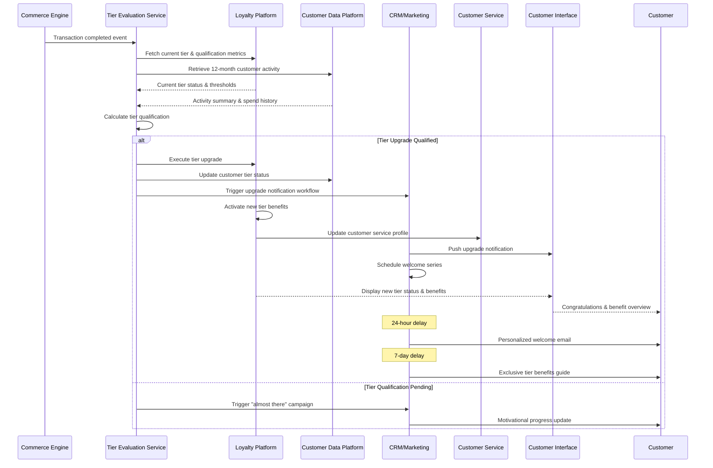
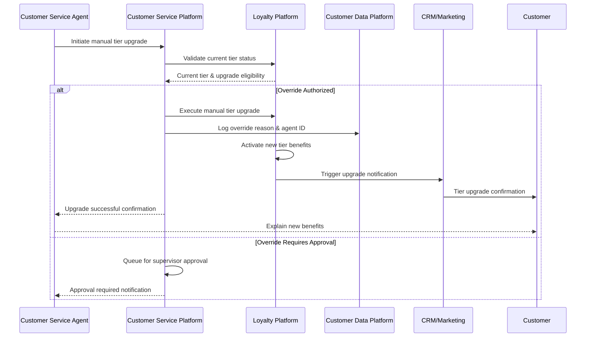

# MACH Alliance • Open Data Model

## Entity: `Loyalty Program Tier Upgrade`

NOTE: A "recipe" is a document intended to serve cross-functional stakeholders (e.g., product, engineering, ops, CX, analytics).

### Recipe Purpose
To orchestrate automatic tier progression for loyalty members based on spending thresholds, activity levels, or time-based criteria, while delivering personalized upgrade experiences that drive continued engagement and higher-value behaviors.

KPI tie-ins: Tier progression rate, post-upgrade spending velocity, tier retention rate, customer satisfaction scores, premium tier engagement metrics.

___Key Business Goals:___
* Increase customer lifetime value through tier-based spending incentives
* Drive aspirational behavior toward higher-value tiers
* Deliver exclusive experiences that justify premium tier benefits
* Reduce churn through tier-based retention strategies
* Generate incremental revenue through tier-exclusive offerings

---

### Recipe Overview

The tier upgrade process monitors customer activity against predefined tier thresholds and automatically promotes eligible members to higher tiers. The system calculates qualification criteria (spending, points, frequency, tenure), triggers upgrade workflows, unlocks new benefits, and orchestrates personalized welcome experiences. This includes immediate benefit activation, targeted communications, and exclusive access to premium features or products.

The upgrade process considers multiple qualification paths including spend-based, activity-based, and hybrid models while maintaining tier status integrity across all customer touchpoints.

---

### Actors / Stakeholders
Who is involved?

* __Users:__ Loyalty member (upgrading), Customer service agent, VIP concierge team
* __Systems:__ Loyalty platform, CDP, CRM, Commerce engine, Email/SMS platform, Mobile app, Customer service platform, Inventory management
* __Teams:__ Marketing, Customer experience, Product, Engineering, VIP services, Analytics, Customer service

---

### Trigger Points / Events

What initiates this recipe?

* __Spend-based triggers:__
  * Customer reaches annual/rolling spend threshold
  * Single transaction pushes customer over tier minimum
  * Points earned threshold achieved
  
* __Activity-based triggers:__
  * Minimum transaction frequency met
  * Product category diversification achieved
  * Engagement milestone reached (reviews, referrals)
  
* __Time-based triggers:__
  * Monthly tier evaluation cycle
  * Anniversary date tier assessment
  * Campaign-specific qualification windows
  
* __Hybrid triggers:__
  * Combination of spend + activity requirements
  * Accelerated paths during promotional periods

---

### Recipe Flows

#### Automatic Tier Upgrade Flow

#### Manual Tier Override Flow

---

### Systems Involved

| **System**                 | **Role**                                    | **Owner**                    |
| -------------------------- | ------------------------------------------- | ---------------------------- |
| Tier Evaluation Service    | Calculate qualifications & trigger upgrades | Engineering / Product        |
| Loyalty Platform           | Tier status management & benefit activation | Marketing / Customer Experience |
| Customer Data Platform     | Historical activity & spend aggregation    | Data / Analytics             |
| CRM/Marketing Platform     | Upgrade communications & welcome journeys   | Marketing                    |
| Customer Service Platform  | Agent tools & manual override capabilities | Customer Experience          |
| Commerce Engine            | Real-time transaction data & tier pricing  | Product / Engineering        |
| Inventory Management       | Tier-exclusive product access control      | Operations                   |
| Mobile App                 | Tier status display & benefit access       | Mobile Team                  |

---

### Data Requirements

* **Inputs:**
  * Customer spend history (12-24 months rolling)
  * Transaction frequency and recency metrics
  * Product category diversity scores
  * Engagement activity (reviews, referrals, app usage)
  * Current tier status and upgrade thresholds
  * Manual override requests and approvals
  
* **Outputs:**
  * Updated tier status and effective date
  * Unlocked benefits and exclusive access
  * Tier progression notifications
  * Welcome journey trigger events
  * Tier performance analytics
  
* **Data lineage:** Transaction data → CDP aggregation → Tier evaluation → Loyalty platform → Customer touchpoints
* **Privacy/PII considerations:** 
  * Customer consent for tier-based marketing
  * Spending behavior data protection
  * VIP customer data handling protocols

---

### Variants / Alternatives

* **Accelerated tier paths:** Holiday season or campaign-specific qualification shortcuts
* **Tier challenges:** Gamified progression with milestone rewards
* **Family tier sharing:** Household-based tier qualification and benefits
* **Corporate tier programs:** B2B account-based tier management
* **Invitation-only tiers:** Curated premium tier access beyond spend thresholds
* **Seasonal tier holds:** Temporary tier maintenance during low-activity periods
* **Partner tier matching:** Credit card or airline status matching programs

---

### Failure Modes / Edge Cases

| **Scenario**                    | **Handling Strategy**                                      |
| ------------------------------- | ---------------------------------------------------------- |
| Tier calculation service down   | Queue upgrades for processing; avoid downgrades           |
| Duplicate tier upgrade events   | Idempotency keys; single upgrade per qualification cycle  |
| Benefits activation failure     | Manual activation queue; customer service escalation      |
| Cross-channel tier sync delay   | Display "updating" status; eventual consistency           |
| Tier downgrade at renewal       | Grace period warning; customer service intervention       |
| Fraudulent spend inflation      | Fraud detection; tier freeze pending investigation        |
| System upgrade during cycle     | Pause evaluations; resume with full recalculation        |
| VIP concierge assignment error  | Automated escalation; immediate customer service contact  |

---

### Success Metrics / KPIs

* **Tier Progression:**
  * 15%+ of eligible customers upgrade annually
  * 90%+ tier upgrade notification delivery rate
  * 24-hour average tier benefit activation time
  
* **Post-Upgrade Engagement:**
  * 30%+ increase in spending within 90 days post-upgrade
  * 80%+ tier benefit utilization rate within first month
  * 95%+ tier retention rate at annual renewal
  
* **Customer Experience:**
  * Net Promoter Score increase of 20+ points for upgraded customers
  * 90%+ satisfaction with tier upgrade communication
  * <5% customer service escalations related to tier issues

---

### Tier Qualification Matrix

| **Tier Level** | **Annual Spend** | **Transaction Count** | **Category Breadth** | **Additional Benefits** |
| -------------- | ---------------- | -------------------- | -------------------- | ----------------------- |
| Bronze         | $0-$499          | 1+ transactions      | Any                  | Basic rewards           |
| Silver         | $500-$1,499      | 5+ transactions      | 2+ categories        | Free shipping           |
| Gold           | $1,500-$4,999    | 12+ transactions     | 3+ categories        | Priority support        |
| Platinum       | $5,000+          | 20+ transactions     | 4+ categories        | VIP concierge           |
| Diamond        | Invitation Only  | Relationship based   | Premium engagement   | White-glove service     |

---

### Security & Compliance Notes

* **Tier qualification auditing:** Complete audit trail of tier calculations and overrides
* **Fraud prevention:** Monitoring for artificial spend inflation or gaming behaviors
* **Data privacy:** Secure handling of detailed spending and behavior analytics
* **Customer service access:** Role-based permissions for tier override capabilities
* **Benefit activation security:** Prevent unauthorized access to tier-exclusive features
* **Financial compliance:** Proper accounting for tier-based discounts and benefits

---

### Footnote
This MACH Alliance Canonical Data Model Recipe is intentionally vendor neutral.
More details please refer to ADD LINK ON ALL
