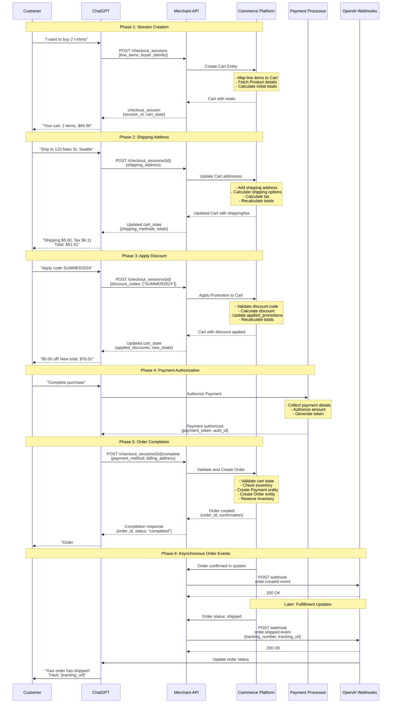
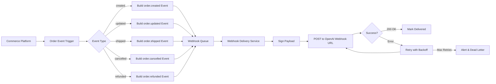
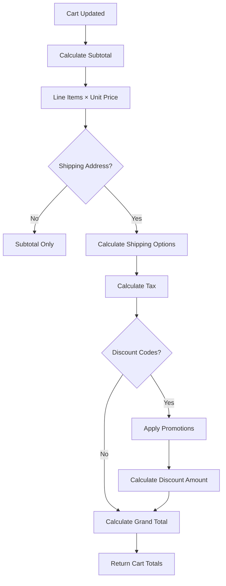

# MACH Alliance • Open Data Model

## Recipe: `OpenAI Agentic Checkout Flow`

## Table of contents

- [Recipe Purpose](#recipe-purpose)
- [Recipe Overview](#recipe-overview)
- [When to Use This Recipe](#when-to-use-this-recipe)
- [Typical pitfalls](#typical-pitfalls)
- [Actors / Stakeholders](#actors--stakeholders)
- [Trigger Points / Events](#trigger-points--events)
- [Recipe Flows](#recipe-flows)
- [Systems Involved](#systems-involved)
- [Data Requirements](#data-requirements)
- [Entity Mapping Concepts](#entity-mapping-concepts)
- [Integration Patterns](#integration-patterns)
- [Variants / Alternatives](#variants--alternatives)
- [Failure Modes / Edge Cases](#failure-modes--edge-cases)
- [Success Metrics / KPIs](#success-metrics--kpis)
- [Security & Compliance Notes](#security--compliance-notes)

---

## Recipe Purpose

> [!NOTE]
> This recipe implements the [OpenAI Agentic Checkout Specification](https://developers.openai.com/commerce/specs/checkout), enabling end-to-end checkout flows inside ChatGPT while maintaining full control over orders, payments, and compliance on the merchant's existing MACH commerce stack.

Enable merchants to offer seamless AI-powered checkout experiences through ChatGPT by mapping MACH Alliance Open Data Model entities (Product, Cart, Payment, Order) to OpenAI's Agentic Checkout Spec. This recipe demonstrates the architectural patterns and data flows required to implement the REST endpoints and webhooks while leveraging existing MACH architecture and business logic.

___Key Business Goals:___
* Enable ChatGPT users to complete purchases without leaving the conversation
* Maintain full merchant control over pricing, inventory, and order fulfillment
* Leverage existing commerce stack and payment integrations
* Provide rich, authoritative cart state throughout the checkout journey
* Support real-time order updates through webhook events
* Expand sales channels to AI-native commerce experiences

**KPI tie-ins:** ChatGPT conversion rate, AI checkout completion rate, average order value via ChatGPT, cart abandonment reduction, customer acquisition cost via AI channel.

---

## Recipe Overview

OpenAI's Agentic Checkout enables customers to complete purchases directly within ChatGPT through a structured flow: ChatGPT creates a checkout session with cart contents, the merchant returns authoritative cart state with pricing and options, ChatGPT collects payment and shipping details, and the merchant completes the order. Throughout this process, the merchant maintains full control using existing MACH entities while transforming data to meet OpenAI's specification.

### Approach Rationale

This Agentic Checkout integration approach provides:

#### Conversational Commerce
- **Natural Shopping Flow:** Customers discuss products and checkout without leaving ChatGPT
- **AI-Guided Experience:** ChatGPT helps customers make decisions and complete purchases
- **Reduced Friction:** No app switching or complex navigation required
- **Voice-First Ready:** Same flow works for voice and text interactions

#### Merchant Control
- **Existing Commerce Stack:** Use current MACH entities and business logic
- **Payment Integration:** Leverage existing payment processors and fraud prevention
- **Pricing Authority:** Merchant calculates and validates all pricing
- **Inventory Management:** Real-time inventory checks using existing systems
- **Compliance:** Maintain tax, shipping, and regulatory compliance

#### Rich Cart State
- **Single Source of Truth:** Merchant provides authoritative cart state for every interaction
- **Real-Time Updates:** Immediate pricing, tax, and availability calculations
- **Transparent Pricing:** Line-by-line breakdown of costs, taxes, and discounts
- **Validation:** Merchant validates all changes before confirming to ChatGPT

---

## When to Use This Recipe

> [!TIP]
> This recipe is essential for merchants approved for OpenAI's Instant Checkout program who want to enable purchases directly within ChatGPT while maintaining their existing MACH commerce architecture.

**Use this approach when:**
- Approved as an OpenAI Instant Checkout partner
- Selling products suitable for conversational discovery and purchase
- Have existing MACH architecture with Product, Cart, Payment entities
- Want to expand to AI-native sales channels
- Need to maintain full control over pricing and order fulfillment
- Support for real-time inventory and dynamic pricing

**Consider alternative approaches when:**
- Not yet approved for OpenAI Instant Checkout (apply first)
- Selling highly complex B2B products requiring human review
- Products require extensive configuration or customization
- Regulatory restrictions prevent AI-assisted transactions
- Unable to provide real-time pricing and inventory APIs

---

## Typical pitfalls

**This approach works well for:**
- Direct-to-consumer e-commerce with straightforward product catalogs
- Products with simple to moderate variant complexity
- Merchants with real-time inventory and pricing APIs
- Standard shipping and tax calculation capabilities
- Existing payment processor integrations (Stripe, PayPal, etc.)

**Requires additional consideration for:**
- Complex B2B approval workflows - May need human review steps outside ChatGPT
- Highly regulated products - Ensure compliance checks during session creation
- Custom or configured products - May need to simplify for AI context
- Multi-warehouse fulfillment - Ensure accurate availability calculation
- International shipping - Support multiple currencies and tax regimes

---

## Actors / Stakeholders

**Users:**
- **ChatGPT Users:** Customers shopping and checking out within ChatGPT
- **Merchant Staff:** Teams monitoring AI-driven orders in existing systems
- **Customer Support:** Agents handling AI checkout issues

**Systems:**
- **ChatGPT Platform:** Orchestrates conversation and calls merchant APIs
- **Merchant Commerce API:** Implements OpenAI Agentic Checkout Spec endpoints
- **Commerce Platform:** Manages Product, Cart, Order entities (MACH)
- **Payment Processor:** Handles payment authorization via ChatGPT
- **Inventory System:** Provides real-time product availability
- **Tax Service:** Calculates taxes based on addresses
- **Shipping Service:** Provides shipping methods and rates
- **Webhook Consumer:** Receives order events from merchant

**Teams:**
- **Engineering:** Implements Agentic Checkout endpoints and entity mappings
- **Product:** Designs AI checkout experience and error handling
- **Operations:** Manages fulfillment for ChatGPT orders
- **Finance:** Oversees payment reconciliation for AI channel
- **Legal/Compliance:** Ensures regulatory compliance for AI commerce

---

## Trigger Points / Events

**Action-based (ChatGPT → Merchant):**
- ChatGPT calls `POST /checkout_sessions` to create checkout with cart contents
- ChatGPT calls `POST /checkout_sessions/{id}` to update items, shipping, or discounts
- ChatGPT calls `POST /checkout_sessions/{id}/complete` to finalize order
- ChatGPT calls `POST /checkout_sessions/{id}/cancel` to abandon checkout

**System-based (Merchant → ChatGPT):**
- Merchant publishes `order.created` webhook when order confirmed
- Merchant publishes `order.updated` webhook for status changes
- Merchant publishes `order.shipped` webhook with tracking information
- Merchant publishes `order.cancelled` webhook if order cancelled
- Merchant publishes `order.refunded` webhook for returns

**Validation-based:**
- Merchant validates inventory availability for each session operation
- Merchant recalculates pricing, tax, and shipping for all updates
- Merchant verifies payment authorization before order creation
- Merchant confirms addresses and applies fraud checks

---

## Recipe Flows

### Sequence Diagram



---

## Systems Involved

| **System**                 | **Role**                                               | **Owner**             |
| -------------------------- | ------------------------------------------------------ | --------------------- |
| ChatGPT Platform           | Conversation orchestration and checkout UI             | OpenAI                |
| Merchant Commerce API      | Implements Agentic Checkout Spec endpoints             | Engineering Team      |
| Commerce Platform          | Manages Cart, Order, Payment entities (MACH)           | Engineering Team      |
| Product Information (PIM)  | Source of truth for product data and pricing           | Product Team          |
| Inventory System           | Real-time product availability                         | Operations Team       |
| Tax Service                | Tax calculation by address                             | Finance Team          |
| Shipping Service           | Shipping methods and rate calculation                  | Operations Team       |
| Payment Processor          | Payment authorization (Stripe, PayPal, etc.)           | Engineering / Finance |
| Order Management System    | Order fulfillment and tracking                         | Operations Team       |
| Webhook Consumer (OpenAI)  | Receives order lifecycle events from merchant          | OpenAI                |

---

## Data Requirements

| **Entity**                                    | **Function**                                    | **Source System**         |
| --------------------------------------------- | ----------------------------------------------- | ------------------------- |
| [Product](../entities/product/product.md)     | Input - Product catalog and pricing             | PIM / Commerce            |
| [Cart](../entities/cart/cart.md)              | State - Checkout session and line items         | Commerce Platform         |
| [Payment](../entities/payment/payment.md)     | Output - Payment authorization record           | Payment Processor         |
| [Order](../entities/order/order.md)           | Output - Completed order                        | Order Management          |
| [Address](../entities/utilities/address.md)   | Input - Shipping and billing addresses          | ChatGPT / Customer        |
| [Promotion](../entities/promotion/promotion.md) | Input - Discount codes and promotions         | Promotion Engine          |

### Agentic Checkout Data Flow

**Input Data (from ChatGPT):**
- Checkout session creation request with cart items
- Session update requests (items, shipping, discounts)
- Payment authorization details for order completion
- Customer information (name, email, addresses)

**Processing (Entity Transformation):**
- Create or update Cart entity with line items and addresses
- Calculate CartTotals including shipping, tax, discounts
- Validate inventory and pricing using Product entities
- Apply Promotion entities for discount codes
- Create Payment entity with authorization details
- Generate Order entity on successful checkout completion

**Output (to ChatGPT):**
- Checkout session with complete cart state
- Line-by-line pricing breakdown
- Available shipping methods and rates
- Applied discounts and promotions
- Order confirmation with order ID and tracking

**Output (to OpenAI Webhooks):**
- Order lifecycle events (created, updated, shipped, cancelled)
- Fulfillment updates with tracking information
- Status changes throughout order journey

### Example Data Structures

#### Create Session Request (OpenAI → Merchant)

```json
{
  "line_items": [
    {
      "product_id": "PROD-001",
      "variant_id": "VAR-001",
      "quantity": 2
    }
  ],
  "buyer_identity": {
    "email": "customer@example.com",
    "full_name": "John Doe"
  },
  "currency": "USD"
}
```

#### Session Response (Merchant → OpenAI)

```json
{
  "checkout_session_id": "cs_abc123xyz",
  "status": "pending",
  "currency": "USD",
  "line_items": [
    {
      "line_item_id": "item_001",
      "product_id": "PROD-001",
      "variant_id": "VAR-001",
      "name": "Organic Cotton T-Shirt - Black M",
      "quantity": 2,
      "unit_amount": 3495,
      "total_amount": 6990
    }
  ],
  "subtotal_amount": 6990,
  "shipping_amount": 500,
  "tax_amount": 611,
  "discount_amount": 0,
  "total_amount": 8101,
  "available_shipping_methods": [
    {
      "shipping_method_id": "standard",
      "name": "Standard Shipping",
      "amount": 500,
      "estimated_delivery_date": "2025-10-15"
    }
  ],
  "metadata": {
    "mach_cart_id": "cart_abc123"
  }
}
```

#### Order Created Webhook (Merchant → OpenAI)

```json
{
  "event_type": "order.created",
  "event_id": "evt_001",
  "timestamp": "2025-10-10T14:25:00Z",
  "order": {
    "order_id": "ord_12345",
    "checkout_session_id": "cs_abc123xyz",
    "status": "processing",
    "currency": "USD",
    "total_amount": 8101,
    "estimated_delivery_date": "2025-10-15"
  }
}
```

---

## Entity Mapping Concepts

### MACH Cart ↔ OpenAI Checkout Session

**Core Mapping Principles:**

| **MACH Cart Field**              | **OpenAI Field**                  | **Transformation Notes**                                      |
| -------------------------------- | --------------------------------- | ------------------------------------------------------------- |
| `Cart.id`                        | `metadata.mach_cart_id`           | Preserve internal ID in metadata                              |
| `Cart.line_items[]`              | `line_items[]`                    | Map each line item with product details                       |
| `Cart.totals.subtotal`           | `subtotal_amount`                 | Convert to cents (multiply by 100)                            |
| `Cart.totals.shipping`           | `shipping_amount`                 | Convert to cents                                              |
| `Cart.totals.tax`                | `tax_amount`                      | Convert to cents                                              |
| `Cart.totals.discount`           | `discount_amount`                 | Convert to cents                                              |
| `Cart.totals.grand_total`        | `total_amount`                    | Convert to cents                                              |
| `Cart.addresses[type=shipping]`  | `shipping_address`                | Transform address structure                                   |
| `Cart.addresses[type=billing]`   | `billing_address`                 | Transform address structure                                   |
| `Cart.shipping_methods[]`        | `available_shipping_methods[]`    | Map shipping options with rates                               |
| `Cart.applied_promotions[]`      | `applied_discounts[]`             | Map discount codes and amounts                                |
| `Cart.customer_email`            | `buyer_identity.email`            | Direct mapping                                                |

**Key Transformation Rules:**

1. **Currency Conversion:** OpenAI expects amounts in cents (integer), while MACH entities may use decimal representation. Always convert and round appropriately.

2. **Address Structure:** MACH Address entities use nested structures (`address.line1`, `contact.first_name`) that must be flattened to OpenAI's format (`line1`, `full_name`).

3. **Status Mapping:** Cart status values (`active`, `completed`, `abandoned`) map to OpenAI session status (`pending`, `completed`, `expired`).

4. **Line Item Enrichment:** OpenAI requires complete product information in each line item, necessitating Product entity lookups to populate `name`, `variant_title`, `image_url`.

5. **Metadata Preservation:** Store MACH-specific identifiers (Cart ID, Customer ID) in OpenAI's `metadata` field for bidirectional reference.

### MACH Payment ↔ OpenAI Payment Methods

**Payment Authorization Flow:**

1. **ChatGPT Collects Payment:** ChatGPT interface gathers payment details from customer
2. **Payment Processor Authorization:** ChatGPT authorizes payment with processor (Stripe, PayPal, etc.)
3. **Token Generation:** Payment processor returns authorization token and transaction ID
4. **Token Transmission:** ChatGPT sends payment token to merchant in completion request
5. **MACH Payment Entity Creation:** Merchant creates Payment entity with authorization details

**Key Payment Mappings:**

| **OpenAI Payment Method**        | **MACH Payment Entity**           | **Notes**                                                     |
| -------------------------------- | --------------------------------- | ------------------------------------------------------------- |
| `payment_method.type`            | `Payment.method`                  | Map `card` → `card`, `paypal` → `digital_wallet`              |
| `payment_method.token`           | `Payment.external_references.payment_token` | Store processor token               |
| `payment_method.last4`           | `Payment.method_details.last4`    | Card last 4 digits for display                                |
| Authorization response           | `Payment.transactions[0]`         | Record authorization as first transaction                     |
| Checkout session total           | `Payment.amount`                  | Payment amount in cents                                       |

### MACH Order ↔ OpenAI Order Events

**Order Lifecycle Event Mapping:**

| **MACH Order Status**    | **OpenAI Event Type**     | **When to Send**                                              |
| ------------------------ | ------------------------- | ------------------------------------------------------------- |
| Order created            | `order.created`           | Immediately after order confirmation                          |
| Status change            | `order.updated`           | Any status change (payment captured, processing started)      |
| Order shipped            | `order.shipped`           | When tracking number assigned and shipment created            |
| Order delivered          | `order.delivered`         | When delivery confirmed (optional)                            |
| Order cancelled          | `order.cancelled`         | When order cancellation processed                             |
| Refund processed         | `order.refunded`          | When refund completed                                         |

**Order Event Data Mapping:**

| **MACH Order Field**             | **OpenAI Event Field**            | **Notes**                                                     |
| -------------------------------- | --------------------------------- | ------------------------------------------------------------- |
| `Order.id`                       | `order.order_id`                  | Merchant's order identifier                                   |
| `Order.order_number`             | `metadata.order_number`           | Customer-facing order number                                  |
| `Order.status`                   | `order.status`                    | Map to OpenAI status values                                   |
| `Order.tracking_number`          | `order.tracking_number`           | Shipment tracking number                                      |
| `Order.tracking_url`             | `order.tracking_url`              | Carrier tracking page URL                                     |
| `Order.estimated_delivery_date`  | `order.estimated_delivery_date`   | ISO 8601 date format                                          |
| `Order.external_references.openai_session_id` | `order.checkout_session_id` | Link back to original session    |

---

## Integration Patterns

### API Endpoint Requirements

The merchant must implement four core REST API endpoints:

#### 1. Create Checkout Session
**Endpoint:** `POST /checkout_sessions`

**Purpose:** Initialize a new checkout session from cart items

**Flow:**
1. Receive line items and buyer identity from ChatGPT
2. Create MACH Cart entity with line items
3. Fetch Product details for each line item
4. Calculate initial totals (subtotal only, no shipping/tax yet)
5. Return checkout session with cart state

**Key Considerations:**
- Generate unique session ID for tracking
- Store session ID in Cart entity for future lookups
- Validate product availability before creating session
- Lock product prices at session creation time

#### 2. Update Checkout Session
**Endpoint:** `POST /checkout_sessions/{checkout_session_id}`

**Purpose:** Update existing session with items, addresses, shipping, or discounts

**Flow:**
1. Locate Cart entity by session ID
2. Apply requested updates (line items, addresses, shipping method, discount codes)
3. Recalculate all totals (shipping, tax, discounts)
4. Validate updated cart state
5. Return updated cart state

**Key Considerations:**
- Always recalculate totals after any update
- Validate addresses for shipping availability
- Calculate shipping options based on address
- Apply tax calculations based on address
- Validate and apply discount codes
- Handle concurrent updates with optimistic locking

#### 3. Complete Checkout
**Endpoint:** `POST /checkout_sessions/{checkout_session_id}/complete`

**Purpose:** Finalize checkout and create order

**Flow:**
1. Locate Cart entity by session ID
2. Validate cart state (inventory, addresses, shipping method)
3. Create Payment entity with authorization details
4. Create Order entity from Cart
5. Update Cart status to completed
6. Send `order.created` webhook to OpenAI
7. Return completion confirmation

**Key Considerations:**
- Validate inventory availability before order creation
- Ensure payment authorization is valid
- Atomic order creation (rollback on failure)
- Immediate webhook notification
- Reserve or decrement inventory

#### 4. Cancel Checkout Session
**Endpoint:** `POST /checkout_sessions/{checkout_session_id}/cancel`

**Purpose:** Abandon checkout session

**Flow:**
1. Locate Cart entity by session ID
2. Update Cart status to abandoned
3. Release any reserved inventory
4. Return cancellation confirmation

**Key Considerations:**
- Allow cancellation at any stage before completion
- Clean up resources and reservations
- Log abandonment for analytics

### Webhook Implementation Pattern

**Webhook Delivery Architecture:**



**Webhook Best Practices:**

1. **Asynchronous Delivery:** Queue webhooks for reliable delivery, don't block order processing
2. **Retry Logic:** Implement exponential backoff (e.g., 1s, 5s, 25s, 125s, 625s)
3. **Webhook Signatures:** Sign payloads with HMAC for verification
4. **Idempotency:** Include event IDs so OpenAI can deduplicate
5. **Timeout Handling:** Set reasonable timeouts (5-10 seconds)
6. **Dead Letter Queue:** Store failed webhooks after max retries for manual review
7. **Monitoring:** Alert on high failure rates or delivery delays

### Session State Management

**Session Storage Options:**

| **Approach**              | **Description**                                           | **Pros**                              | **Cons**                              |
| ------------------------- | --------------------------------------------------------- | ------------------------------------- | ------------------------------------- |
| **Stateful (Recommended)** | Store full Cart entity, update on each request          | Complete state, easy querying         | Requires database writes              |
| **Stateless**             | Rebuild cart from minimal session data                    | No storage overhead                   | Complex rebuilding logic              |
| **Hybrid**                | Cache Cart entity with TTL, rebuild if expired            | Balance performance and storage       | Cache invalidation complexity         |

**Recommended: Stateful Approach**
- Create Cart entity on session creation
- Update Cart entity on each session update
- Query Cart entity by session ID lookup
- Maintain Cart as source of truth throughout session
- Set reasonable session expiration (30-60 minutes)

### Total Calculation Pattern

**Calculation Flow:**



**Critical Calculation Rules:**

1. **Always Recalculate:** Never trust client-provided totals, always recalculate server-side
2. **Order of Operations:** Subtotal → Shipping → Tax → Discounts → Grand Total
3. **Tax Calculation:** Apply tax to (Subtotal + Shipping - Discounts) based on address
4. **Rounding:** Round to currency precision (2 decimals for USD) at each step
5. **Currency Consistency:** Ensure all amounts use same currency throughout session

---

## Variants / Alternatives

### Session Storage Strategies

**Stateful Sessions (Recommended)**
- Store complete Cart entity in database
- Update on every session operation
- Query by session ID for fast retrieval
- Suitable for: Most implementations

**Stateless Sessions**
- Store minimal session metadata only
- Rebuild cart from line items on each request
- Recalculate everything dynamically
- Suitable for: High-scale, read-heavy workloads

**Hybrid Caching**
- Cache Cart entity in Redis/Memcached
- Rebuild from database if cache miss
- Set TTL for automatic expiration
- Suitable for: High-performance requirements

### Payment Integration Approaches

**Direct Integration**
- ChatGPT authorizes directly with payment processor
- Merchant receives payment token
- Simplest approach, fewer moving parts
- Example: Stripe, PayPal direct integration

**Payment Gateway**
- Route through payment gateway for multiple processors
- Support various payment methods centrally
- More complex but more flexible
- Example: Adyen, Stripe

**Stored Payment Methods**
- Support returning customers with saved cards
- Requires customer authentication
- Faster checkout for repeat purchases
- Requires PCI compliance consideration

### Webhook Delivery Patterns

**Synchronous (Not Recommended)**
- Send webhook immediately in request flow
- Blocks order processing on webhook failure
- Simple but fragile

**Asynchronous Queue (Recommended)**
- Queue webhook events for async delivery
- Retry failed deliveries automatically
- Doesn't block order processing
- Example: RabbitMQ, AWS SQS, Google Pub/Sub

**Event Streaming**
- Publish events to event bus
- Webhook service consumes and delivers
- Highly scalable and decoupled
- Example: Kafka, AWS EventBridge

---

## Failure Modes / Edge Cases

| **Scenario**                        | **Impact**                              | **Mitigation Strategy**                                                     |
| ----------------------------------- | --------------------------------------- | --------------------------------------------------------------------------- |
| **Inventory Out of Stock**          | Cannot fulfill checkout                 | Real-time inventory check on session create/update; suggest alternatives    |
| **Price Changes During Session**    | Customer sees different price at completion | Lock prices on session creation; notify if change required              |
| **Payment Authorization Fails**     | Cannot complete order                   | Clear error message to ChatGPT; offer alternative payment methods           |
| **Address Validation Fails**        | Cannot calculate shipping/tax           | Validate addresses on update; provide correction suggestions                |
| **Shipping Method Unavailable**     | Cannot ship to address                  | Filter shipping methods by address; show only valid options                 |
| **Discount Code Invalid**           | Customer frustrated                     | Validate codes immediately; provide clear error messages                    |
| **Session Timeout/Expiration**      | Lost cart state                         | Generous session timeout (30+ minutes); allow session recovery              |
| **Webhook Delivery Fails**          | ChatGPT not updated on order status     | Implement retry logic with exponential backoff; alert on persistent failure |
| **Concurrent Session Updates**      | Race conditions in cart state           | Use optimistic locking or versioning on Cart entity                         |
| **Tax Calculation Service Down**    | Cannot show accurate totals             | Use cached tax rates as fallback; notify customer of estimate               |
| **Product Deleted During Session**  | Checkout fails on completion            | Validate products exist before creating session; handle gracefully          |
| **Currency Mismatch**               | Incorrect pricing display               | Enforce single currency per session; validate on each update                |

---

## Success Metrics / KPIs

**Checkout Performance:**
- ChatGPT checkout conversion rate: Target >65%
- Session completion rate (session create → complete): Target >70%
- Average time to checkout completion: Target <3 minutes
- Session abandonment rate: Target <30%
- Payment authorization success rate: Target >96%

**User Experience:**
- Customer satisfaction with ChatGPT checkout: Target >4.3/5.0
- Error rate during checkout: Target <2%
- Session update latency: Target <500ms
- Webhook delivery success rate: Target >99.5%
- Address validation accuracy: Target >98%

**Business Impact:**
- Revenue from ChatGPT channel: Track growth month-over-month
- Average order value ChatGPT vs web: Compare channels
- Customer acquisition cost via ChatGPT: Measure efficiency
- Repeat purchase rate for ChatGPT customers: Target >35%
- Cart abandonment recovery via ChatGPT: Track recovery rates

**Technical Performance:**
- API response time (p95): Target <750ms
- Webhook delivery time (p95): Target <2 seconds
- Cart entity transformation overhead: Target <100ms
- Database query performance: Target <200ms per operation
- System uptime for checkout endpoints: Target >99.95%

---

## Security & Compliance Notes

**API Security:**
- **Authentication:** OAuth 2.0 or API key authentication for all endpoints
- **Rate Limiting:** Prevent abuse with per-merchant rate limits
- **Request Validation:** Validate all inputs against schema before processing
- **HTTPS Only:** Enforce TLS 1.3 for all API communications
- **Webhook Signatures:** Verify webhook authenticity using HMAC signatures

**Data Privacy:**
- **PCI DSS Compliance:** Never store raw payment card data; use tokens only
- **Customer Consent:** Ensure GDPR compliance for customer data collection
- **Data Minimization:** Only share necessary data with ChatGPT
- **Right to Deletion:** Support customer data deletion requests
- **Data Retention:** Clear policies for checkout session data retention (30-90 days)

**Payment Security:**
- **Tokenization:** Use payment processor tokens, never raw card numbers
- **3D Secure:** Support SCA requirements for European customers
- **Fraud Detection:** Integrate fraud scoring on payment authorization
- **Authorization Only:** Capture payment after order confirmation, not during session
- **Refund Support:** Implement secure refund processes

**Operational Security:**
- **Audit Logging:** Log all checkout operations with timestamps and user context
- **Monitoring:** Alert on unusual patterns (high failure rates, suspicious activity)
- **Secrets Management:** Secure storage for API keys and webhook secrets
- **Incident Response:** Plan for security incidents and data breaches
- **Regular Reviews:** Periodic security audits of integration

**Compliance:**
- **Tax Compliance:** Accurate tax calculation per jurisdiction
- **Shipping Restrictions:** Enforce export controls and restricted shipping
- **Age Verification:** Support for age-restricted products if needed
- **Terms of Service:** Clear terms presented during checkout
- **Consumer Protection:** Comply with consumer protection laws (returns, refunds)

---

>  This MACH Alliance Canonical Data Model is intentionally __vendor-neutral__ and serves as a foundation for interoperability across composable architectures. It is __continually evolving__ through community contributions, which are reviewed and approved collaboratively.
>
>  All contributions are made under the __Creative Commons Attribution 4.0 International License (CC BY 4.0)__. By submitting a contribution, you agree to license your content under <a href="https://creativecommons.org/licenses/by/4.0/deed.en">CC BY 4.0</a>, allowing others to share and adapt the material with proper attribution.
>
>  We welcome and encourage continued improvements through community input.