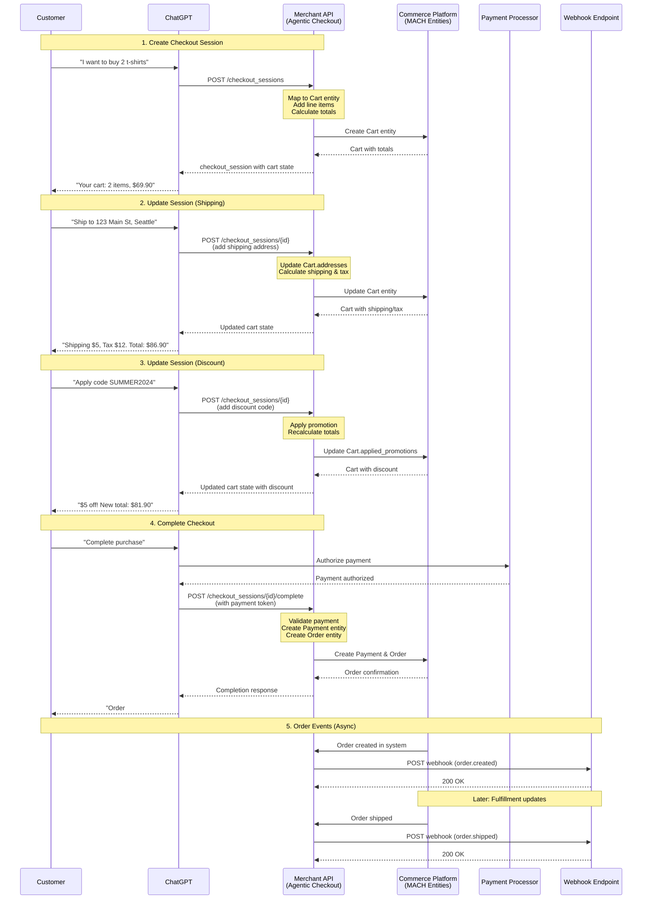

# MACH Alliance • Open Data Model

## Recipe: `OpenAI Agentic Checkout Flow`

## Table of contents

- [MACH Alliance • Open Data Model](#mach-alliance--open-data-model)
  - [Recipe: `OpenAI Agentic Checkout Flow`](#recipe-openai-agentic-checkout-flow)
  - [Table of contents](#table-of-contents)
  - [Recipe Purpose](#recipe-purpose)
  - [Recipe Overview](#recipe-overview)
      - [Approach Rationale](#approach-rationale)
        - [Conversational Commerce](#conversational-commerce)
        - [Merchant Control](#merchant-control)
        - [Rich Cart State](#rich-cart-state)
  - [When to Use This Recipe](#when-to-use-this-recipe)
  - [Typical pitfalls](#typical-pitfalls)
  - [Actors / Stakeholders](#actors--stakeholders)
  - [Trigger Points / Events](#trigger-points--events)
  - [Recipe Flows](#recipe-flows)
      - [Sequence Diagram](#sequence-diagram)
  - [Systems Involved](#systems-involved)
  - [Data Requirements](#data-requirements)
    - [Agentic Checkout Data Flow](#agentic-checkout-data-flow)
      - [Example Create Session Request (OpenAI → Merchant)](#example-create-session-request-openai--merchant)
      - [Example Session Response (Merchant → OpenAI)](#example-session-response-merchant--openai)
      - [Example Complete Checkout Request](#example-complete-checkout-request)
      - [Example Order Created Webhook (Merchant → OpenAI)](#example-order-created-webhook-merchant--openai)
  - [Entity Mappings](#entity-mappings)
    - [MACH Cart to OpenAI Checkout Session](#mach-cart-to-openai-checkout-session)
    - [MACH Payment to OpenAI Payment Methods](#mach-payment-to-openai-payment-methods)
    - [MACH Order to OpenAI Order Events](#mach-order-to-openai-order-events)
  - [API Endpoint Implementations](#api-endpoint-implementations)
    - [POST /checkout\_sessions](#post-checkout_sessions)
    - [POST /checkout\_sessions/{checkout\_session\_id}](#post-checkout_sessionscheckout_session_id)
    - [POST /checkout\_sessions/{checkout\_session\_id}/complete](#post-checkout_sessionscheckout_session_idcomplete)
    - [POST /checkout\_sessions/{checkout\_session\_id}/cancel](#post-checkout_sessionscheckout_session_idcancel)
  - [Webhook Implementation](#webhook-implementation)
    - [Order Lifecycle Events](#order-lifecycle-events)
  - [Variants / Alternatives](#variants--alternatives)
  - [Failure Modes / Edge Cases](#failure-modes--edge-cases)
  - [Success Metrics / KPIs](#success-metrics--kpis)
  - [Security \& Compliance Notes](#security--compliance-notes)

## Recipe Purpose

> [!NOTE]
> This recipe implements the OpenAI Agentic Checkout Specification, enabling end-to-end checkout flows inside ChatGPT while maintaining full control over orders, payments, and compliance on the merchant's existing MACH commerce stack.

To enable merchants to offer seamless AI-powered checkout experiences through ChatGPT by mapping MACH Alliance Open Data Model entities (Product, Cart, Payment, Order) to OpenAI's Agentic Checkout Spec. This recipe demonstrates how to implement the required REST endpoints and webhooks while leveraging existing MACH architecture and business logic.

___Key Business Goals:___
* Enable ChatGPT users to complete purchases without leaving the conversation
* Maintain full merchant control over pricing, inventory, and order fulfillment
* Leverage existing commerce stack and payment integrations
* Provide rich, authoritative cart state throughout the checkout journey
* Support real-time order updates through webhook events
* Expand sales channels to AI-native commerce experiences

**KPI tie-ins:** ChatGPT conversion rate, AI checkout completion rate, average order value via ChatGPT, cart abandonment reduction, customer acquisition cost via AI channel.

---

## Recipe Overview

OpenAI's Agentic Checkout enables customers to complete purchases directly within ChatGPT through a structured flow: ChatGPT creates a checkout session with cart contents, the merchant returns authoritative cart state with pricing and options, ChatGPT collects payment and shipping details, and the merchant completes the order. Throughout this process, the merchant maintains full control using existing MACH entities while transforming data to meet OpenAI's specification.

#### Approach Rationale

This Agentic Checkout integration approach provides:

##### Conversational Commerce
- **Natural Shopping Flow:** Customers discuss products and checkout without leaving ChatGPT
- **AI-Guided Experience:** ChatGPT helps customers make decisions and complete purchases
- **Reduced Friction:** No app switching or complex navigation required
- **Voice-First Ready:** Same flow works for voice and text interactions

##### Merchant Control
- **Existing Commerce Stack:** Use current MACH entities and business logic
- **Payment Integration:** Leverage existing payment processors and fraud prevention
- **Pricing Authority:** Merchant calculates and validates all pricing
- **Inventory Management:** Real-time inventory checks using existing systems
- **Compliance:** Maintain tax, shipping, and regulatory compliance

##### Rich Cart State
- **Single Source of Truth:** Merchant provides authoritative cart state for every interaction
- **Real-Time Updates:** Immediate pricing, tax, and availability calculations
- **Transparent Pricing:** Line-by-line breakdown of costs, taxes, and discounts
- **Validation:** Merchant validates all changes before confirming to ChatGPT

---

## When to Use This Recipe

> [!TIP]
> This recipe is essential for merchants approved for OpenAI's Instant Checkout program who want to enable purchases directly within ChatGPT while maintaining their existing MACH commerce architecture.

**Use this approach when:**
- Approved as an OpenAI Instant Checkout partner
- Selling products suitable for conversational discovery and purchase
- Have existing MACH architecture with Product, Cart, Payment entities
- Want to expand to AI-native sales channels
- Need to maintain full control over pricing and order fulfillment
- Support for real-time inventory and dynamic pricing

**Consider alternative approaches when:**
- Not yet approved for OpenAI Instant Checkout (apply first)
- Selling highly complex B2B products requiring human review
- Products require extensive configuration or customization
- Regulatory restrictions prevent AI-assisted transactions
- Unable to provide real-time pricing and inventory APIs

---

## Typical pitfalls

**This approach works well for:**
- Direct-to-consumer e-commerce with straightforward product catalogs
- Products with simple to moderate variant complexity
- Merchants with real-time inventory and pricing APIs
- Standard shipping and tax calculation capabilities
- Existing payment processor integrations (Stripe, PayPal, etc.)

**Requires additional consideration for:**
- Complex B2B approval workflows - May need human review steps outside ChatGPT
- Highly regulated products - Ensure compliance checks during session creation
- Custom or configured products - May need to simplify for AI context
- Multi-warehouse fulfillment - Ensure accurate availability calculation
- International shipping - Support multiple currencies and tax regimes

---

## Actors / Stakeholders

**Users:**
- **ChatGPT Users:** Customers shopping and checking out within ChatGPT
- **Merchant Staff:** Teams monitoring AI-driven orders in existing systems
- **Customer Support:** Agents handling AI checkout issues

**Systems:**
- **ChatGPT Platform:** Orchestrates conversation and calls merchant APIs
- **Merchant Commerce API:** Implements OpenAI Agentic Checkout Spec endpoints
- **Commerce Platform:** Manages Product, Cart, Order entities (MACH)
- **Payment Processor:** Handles payment authorization via ChatGPT
- **Inventory System:** Provides real-time product availability
- **Tax Service:** Calculates taxes based on addresses
- **Shipping Service:** Provides shipping methods and rates
- **Webhook Consumer:** Receives order events from merchant

**Teams:**
- **Engineering:** Implements Agentic Checkout endpoints and entity mappings
- **Product:** Designs AI checkout experience and error handling
- **Operations:** Manages fulfillment for ChatGPT orders
- **Finance:** Oversees payment reconciliation for AI channel
- **Legal/Compliance:** Ensures regulatory compliance for AI commerce

---

## Trigger Points / Events

**Action-based (ChatGPT → Merchant):**
- ChatGPT calls `POST /checkout_sessions` to create checkout with cart contents
- ChatGPT calls `POST /checkout_sessions/{id}` to update items, shipping, or discounts
- ChatGPT calls `POST /checkout_sessions/{id}/complete` to finalize order
- ChatGPT calls `POST /checkout_sessions/{id}/cancel` to abandon checkout

**System-based (Merchant → ChatGPT):**
- Merchant publishes `order.created` webhook when order confirmed
- Merchant publishes `order.updated` webhook for status changes
- Merchant publishes `order.shipped` webhook with tracking information
- Merchant publishes `order.cancelled` webhook if order cancelled
- Merchant publishes `order.refunded` webhook for returns

**Validation-based:**
- Merchant validates inventory availability for each session operation
- Merchant recalculates pricing, tax, and shipping for all updates
- Merchant verifies payment authorization before order creation
- Merchant confirms addresses and applies fraud checks

---

## Recipe Flows

#### Sequence Diagram



---

## Systems Involved

| **System**                 | **Role**                                               | **Owner**             |
| -------------------------- | ------------------------------------------------------ | --------------------- |
| ChatGPT Platform           | Conversation orchestration and checkout UI             | OpenAI                |
| Merchant Commerce API      | Implements Agentic Checkout Spec endpoints             | Engineering Team      |
| Commerce Platform          | Manages Cart, Order, Payment entities (MACH)           | Engineering Team      |
| Product Information (PIM)  | Source of truth for product data and pricing           | Product Team          |
| Inventory System           | Real-time product availability                         | Operations Team       |
| Tax Service                | Tax calculation by address                             | Finance Team          |
| Shipping Service           | Shipping methods and rate calculation                  | Operations Team       |
| Payment Processor          | Payment authorization (Stripe, PayPal, etc.)           | Engineering / Finance |
| Order Management System    | Order fulfillment and tracking                         | Operations Team       |
| Webhook Consumer (OpenAI)  | Receives order lifecycle events from merchant          | OpenAI                |

---

## Data Requirements

| **Entity**                                    | **Function**                                    | **Source System**         |
| --------------------------------------------- | ----------------------------------------------- | ------------------------- |
| [Product](../entities/product/product.md)     | Input - Product catalog and pricing             | PIM / Commerce            |
| [Cart](../entities/cart/cart.md)              | State - Checkout session and line items         | Commerce Platform         |
| [Payment](../entities/payment/payment.md)     | Output - Payment authorization record           | Payment Processor         |
| [Order](../entities/order/order.md)           | Output - Completed order                        | Order Management          |
| [Address](../entities/utilities/address.md)   | Input - Shipping and billing addresses          | ChatGPT / Customer        |
| [Promotion](../entities/promotion/promotion.md) | Input - Discount codes and promotions         | Promotion Engine          |

### Agentic Checkout Data Flow

**Input Data (from ChatGPT):**
- Checkout session creation request with cart items
- Session update requests (items, shipping, discounts)
- Payment authorization details for order completion
- Customer information (name, email, addresses)

**Processing (Entity Transformation):**
- Create or update Cart entity with line items and addresses
- Calculate CartTotals including shipping, tax, discounts
- Validate inventory and pricing using Product entities
- Apply Promotion entities for discount codes
- Create Payment entity with authorization details
- Generate Order entity on successful checkout completion

**Output (to ChatGPT):**
- Checkout session with complete cart state
- Line-by-line pricing breakdown
- Available shipping methods and rates
- Applied discounts and promotions
- Order confirmation with order ID and tracking

**Output (to OpenAI Webhooks):**
- Order lifecycle events (created, updated, shipped, cancelled)
- Fulfillment updates with tracking information
- Status changes throughout order journey

#### Example Create Session Request (OpenAI → Merchant)

```json
{
  "line_items": [
    {
      "product_id": "PROD-001",
      "variant_id": "VAR-001",
      "quantity": 2
    }
  ],
  "buyer_identity": {
    "email": "customer@example.com",
    "full_name": "John Doe"
  },
  "currency": "USD"
}
```

#### Example Session Response (Merchant → OpenAI)

This response maps from MACH Cart entity to OpenAI's expected format:

```json
{
  "checkout_session_id": "cs_abc123xyz",
  "status": "pending",
  "currency": "USD",
  "line_items": [
    {
      "line_item_id": "item_001",
      "product_id": "PROD-001",
      "variant_id": "VAR-001",
      "name": "Organic Cotton T-Shirt - Black M",
      "quantity": 2,
      "unit_amount": 3495,
      "total_amount": 6990,
      "variant_title": "Black / M"
    }
  ],
  "subtotal_amount": 6990,
  "shipping_amount": 0,
  "tax_amount": 0,
  "discount_amount": 0,
  "total_amount": 6990,
  "buyer_identity": {
    "email": "customer@example.com",
    "full_name": "John Doe"
  },
  "available_shipping_methods": [],
  "selected_shipping_method": null,
  "shipping_address": null,
  "billing_address": null,
  "applied_discounts": [],
  "metadata": {
    "mach_cart_id": "cart_abc123",
    "session_created_at": "2025-10-10T14:23:15Z"
  }
}
```

#### Example Complete Checkout Request

```json
{
  "payment_method": {
    "type": "card",
    "token": "pm_1234567890"
  },
  "billing_address": {
    "line1": "123 Main St",
    "city": "Seattle",
    "region": "WA",
    "postal_code": "98101",
    "country": "US"
  }
}
```

**Complete Checkout Response:**

```json
{
  "checkout_session_id": "cs_abc123xyz",
  "status": "completed",
  "order_id": "ord_12345",
  "currency": "USD",
  "total_amount": 8190,
  "confirmation_number": "ORD-12345",
  "metadata": {
    "mach_order_id": "ord_12345",
    "mach_payment_id": "pay_001"
  }
}
```

#### Example Order Created Webhook (Merchant → OpenAI)

```json
{
  "event_type": "order.created",
  "event_id": "evt_001",
  "timestamp": "2025-10-10T14:25:00Z",
  "order": {
    "order_id": "ord_12345",
    "checkout_session_id": "cs_abc123xyz",
    "status": "processing",
    "currency": "USD",
    "total_amount": 8190,
    "buyer_identity": {
      "email": "customer@example.com",
      "full_name": "John Doe"
    },
    "line_items": [
      {
        "line_item_id": "item_001",
        "product_id": "PROD-001",
        "name": "Organic Cotton T-Shirt",
        "quantity": 2,
        "total_amount": 6990
      }
    ],
    "shipping_address": {
      "line1": "123 Main St",
      "city": "Seattle",
      "region": "WA",
      "postal_code": "98101",
      "country": "US"
    },
    "estimated_delivery_date": "2025-10-15"
  }
}
```

---

## Entity Mappings

### MACH Cart to OpenAI Checkout Session

Transform MACH Cart entity to OpenAI checkout_session format:

```javascript
function transformCartToCheckoutSession(machCart, sessionId) {
  // OpenAI uses cents for amounts, MACH entities may use decimal or cents
  const toCents = (amount) => Math.round(amount * 100);
  
  return {
    checkout_session_id: sessionId || machCart.external_references?.openai_session_id,
    status: mapCartStatusToSessionStatus(machCart.status),
    currency: machCart.totals?.currency || 'USD',
    
    // Map line items from Cart.line_items
    line_items: machCart.line_items?.map(item => ({
      line_item_id: item.id,
      product_id: item.product_id,
      variant_id: item.variant_id,
      name: item.name,
      quantity: item.quantity,
      unit_amount: toCents(item.price.amount),
      total_amount: toCents(item.price.amount * item.quantity),
      variant_title: extractVariantTitle(item),
      image_url: item.primary_image?.url,
      product_url: item.product_url
    })) || [],
    
    // Map totals from Cart.totals
    subtotal_amount: toCents(machCart.totals?.subtotal || 0),
    shipping_amount: toCents(machCart.totals?.shipping || 0),
    tax_amount: toCents(machCart.totals?.tax || 0),
    discount_amount: toCents(machCart.totals?.discount || 0),
    total_amount: toCents(machCart.totals?.grand_total || 0),
    
    // Map buyer identity
    buyer_identity: {
      email: machCart.customer_email || machCart.addresses?.find(a => a.type === 'shipping')?.contact?.email,
      full_name: extractFullName(machCart),
      phone: machCart.addresses?.find(a => a.type === 'shipping')?.contact?.phone
    },
    
    // Map shipping methods
    available_shipping_methods: machCart.shipping_methods?.map(method => ({
      shipping_method_id: method.id,
      name: method.name,
      amount: toCents(method.price?.amount || 0),
      estimated_delivery_date: method.estimated_delivery_date,
      description: method.description
    })) || [],
    
    selected_shipping_method: machCart.shipping_methods?.find(m => m.selected)?.id,
    
    // Map addresses from Cart.addresses
    shipping_address: transformAddress(machCart.addresses?.find(a => a.type === 'shipping')),
    billing_address: transformAddress(machCart.addresses?.find(a => a.type === 'billing')),
    
    // Map promotions from Cart.applied_promotions
    applied_discounts: machCart.applied_promotions?.map(promo => ({
      discount_code: promo.code,
      discount_id: promo.id,
      name: promo.name,
      amount: toCents(promo.discount.amount)
    })) || [],
    
    // Preserve MACH references in metadata
    metadata: {
      mach_cart_id: machCart.id,
      mach_customer_id: machCart.customer_id,
      session_created_at: machCart.created_at,
      session_updated_at: machCart.updated_at,
      ...machCart.extensions?.openai
    }
  };
}

function mapCartStatusToSessionStatus(cartStatus) {
  const statusMap = {
    'active': 'pending',
    'completed': 'completed',
    'abandoned': 'expired',
    'pending_approval': 'pending'
  };
  return statusMap[cartStatus] || 'pending';
}

function transformAddress(cartAddress) {
  if (!cartAddress) return null;
  
  return {
    line1: cartAddress.address?.line1,
    line2: cartAddress.address?.line2,
    city: cartAddress.address?.city,
    region: cartAddress.address?.region,
    postal_code: cartAddress.address?.postal_code,
    country: cartAddress.address?.country,
    full_name: `${cartAddress.contact?.first_name || ''} ${cartAddress.contact?.last_name || ''}`.trim(),
    phone: cartAddress.contact?.phone
  };
}

function extractVariantTitle(lineItem) {
  // Extract variant options like "Black / M" from line item
  if (lineItem.variant_options) {
    return Object.values(lineItem.variant_options).join(' / ');
  }
  return null;
}

function extractFullName(cart) {
  const shippingContact = cart.addresses?.find(a => a.type === 'shipping')?.contact;
  if (shippingContact?.first_name || shippingContact?.last_name) {
    return `${shippingContact.first_name || ''} ${shippingContact.last_name || ''}`.trim();
  }
  return null;
}
```

### MACH Payment to OpenAI Payment Methods

Map payment authorization from ChatGPT to MACH Payment entity:

```javascript
function createPaymentFromCheckout(checkoutSession, paymentMethod, authorizationResult) {
  return {
    id: generatePaymentId(),
    order_id: checkoutSession.metadata?.mach_order_id,
    customer_id: checkoutSession.metadata?.mach_customer_id,
    amount: checkoutSession.total_amount, // Already in cents
    currency: checkoutSession.currency,
    status: mapAuthorizationStatus(authorizationResult.status),
    method: mapPaymentMethodType(paymentMethod.type),
    provider: detectPaymentProvider(paymentMethod),
    external_references: {
      openai_checkout_session_id: checkoutSession.checkout_session_id,
      payment_token: paymentMethod.token,
      authorization_id: authorizationResult.authorization_id
    },
    created_at: new Date().toISOString(),
    updated_at: new Date().toISOString(),
    transactions: [
      {
        id: generateTransactionId(),
        type: 'authorization',
        amount: checkoutSession.total_amount,
        status: 'success',
        timestamp: new Date().toISOString(),
        reference: authorizationResult.authorization_id
      }
    ],
    method_details: {
      token: paymentMethod.token,
      last4: paymentMethod.last4,
      brand: paymentMethod.brand
    },
    extensions: {
      openai: {
        checkout_session_id: checkoutSession.checkout_session_id,
        payment_method_type: paymentMethod.type
      }
    }
  };
}

function mapAuthorizationStatus(authStatus) {
  const statusMap = {
    'succeeded': 'authorized',
    'pending': 'pending',
    'failed': 'failed'
  };
  return statusMap[authStatus] || 'pending';
}

function mapPaymentMethodType(openaiType) {
  const typeMap = {
    'card': 'card',
    'paypal': 'digital_wallet',
    'apple_pay': 'digital_wallet',
    'google_pay': 'digital_wallet'
  };
  return typeMap[openaiType] || 'card';
}
```

### MACH Order to OpenAI Order Events

Transform MACH Order entity to OpenAI webhook event format:

```javascript
function createOrderCreatedEvent(machOrder, checkoutSessionId) {
  return {
    event_type: 'order.created',
    event_id: generateEventId(),
    timestamp: new Date().toISOString(),
    order: {
      order_id: machOrder.id,
      checkout_session_id: checkoutSessionId,
      status: mapOrderStatus(machOrder.status),
      currency: machOrder.currency,
      total_amount: Math.round(machOrder.total_amount * 100), // Convert to cents
      
      buyer_identity: {
        email: machOrder.customer_email,
        full_name: machOrder.customer_name,
        phone: machOrder.customer_phone
      },
      
      line_items: machOrder.line_items?.map(item => ({
        line_item_id: item.id,
        product_id: item.product_id,
        variant_id: item.variant_id,
        name: item.name,
        quantity: item.quantity,
        unit_amount: Math.round(item.unit_price * 100),
        total_amount: Math.round(item.total_price * 100)
      })) || [],
      
      shipping_address: transformAddress(machOrder.shipping_address),
      billing_address: transformAddress(machOrder.billing_address),
      
      estimated_delivery_date: machOrder.estimated_delivery_date,
      tracking_number: machOrder.tracking_number,
      tracking_url: machOrder.tracking_url,
      
      metadata: {
        mach_order_id: machOrder.id,
        order_number: machOrder.order_number
      }
    }
  };
}

function createOrderShippedEvent(machOrder, checkoutSessionId) {
  return {
    event_type: 'order.shipped',
    event_id: generateEventId(),
    timestamp: new Date().toISOString(),
    order: {
      order_id: machOrder.id,
      checkout_session_id: checkoutSessionId,
      status: 'shipped',
      tracking_number: machOrder.tracking_number,
      tracking_url: machOrder.tracking_url,
      shipped_at: machOrder.shipped_at,
      estimated_delivery_date: machOrder.estimated_delivery_date
    }
  };
}

function mapOrderStatus(machStatus) {
  const statusMap = {
    'pending': 'processing',
    'confirmed': 'processing',
    'processing': 'processing',
    'shipped': 'shipped',
    'delivered': 'delivered',
    'cancelled': 'cancelled',
    'refunded': 'refunded'
  };
  return statusMap[machStatus] || 'processing';
}
```

---

## API Endpoint Implementations

### POST /checkout_sessions

Create a new checkout session from cart items.

**Implementation Pattern:**

```javascript
async function createCheckoutSession(request) {
  // 1. Extract OpenAI request data
  const { line_items, buyer_identity, currency, discount_codes } = request.body;
  
  // 2. Create MACH Cart entity
  const cart = {
    id: generateCartId(),
    type: 'b2c',
    status: 'active',
    customer_email: buyer_identity?.email,
    created_at: new Date().toISOString(),
    updated_at: new Date().toISOString(),
    
    line_items: await Promise.all(line_items.map(async item => {
      // Fetch product details from Product entity
      const product = await getProduct(item.product_id);
      const variant = product.variants?.find(v => v.id === item.variant_id);
      
      return {
        id: generateLineItemId(),
        sku: variant.sku,
        product_id: item.product_id,
        variant_id: item.variant_id,
        name: `${product.name} - ${variant.variant_title || ''}`,
        quantity: item.quantity,
        price: {
          amount: variant.price.amount,
          currency: currency || variant.price.currency,
          type: 'retail'
        }
      };
    })),
    
    extensions: {
      openai: {
        checkout_session_id: generateCheckoutSessionId(),
        source: 'openai_checkout'
      }
    }
  };
  
  // 3. Apply discount codes if provided
  if (discount_codes?.length > 0) {
    cart.applied_promotions = await applyPromotions(cart, discount_codes);
  }
  
  // 4. Calculate totals
  cart.totals = await calculateCartTotals(cart);
  
  // 5. Save Cart entity
  await saveCart(cart);
  
  // 6. Transform to OpenAI format and return
  return transformCartToCheckoutSession(cart, cart.extensions.openai.checkout_session_id);
}
```

### POST /checkout_sessions/{checkout_session_id}

Update an existing checkout session with new items, shipping, or discounts.

**Implementation Pattern:**

```javascript
async function updateCheckoutSession(checkoutSessionId, request) {
  // 1. Find existing Cart entity by OpenAI session ID
  const cart = await findCartBySessionId(checkoutSessionId);
  
  if (!cart) {
    throw new Error('Checkout session not found');
  }
  
  // 2. Apply updates based on request
  const { line_items, shipping_address, billing_address, shipping_method_id, discount_codes } = request.body;
  
  // Update line items if provided
  if (line_items) {
    cart.line_items = await updateLineItems(cart, line_items);
  }
  
  // Update shipping address
  if (shipping_address) {
    cart.addresses = cart.addresses || [];
    const shippingIndex = cart.addresses.findIndex(a => a.type === 'shipping');
    const mappedAddress = {
      type: 'shipping',
      address: {
        line1: shipping_address.line1,
        line2: shipping_address.line2,
        city: shipping_address.city,
        region: shipping_address.region,
        postal_code: shipping_address.postal_code,
        country: shipping_address.country
      },
      contact: {
        first_name: shipping_address.full_name?.split(' ')[0],
        last_name: shipping_address.full_name?.split(' ').slice(1).join(' '),
        phone: shipping_address.phone
      }
    };
    
    if (shippingIndex >= 0) {
      cart.addresses[shippingIndex] = mappedAddress;
    } else {
      cart.addresses.push(mappedAddress);
    }
    
    // Calculate shipping methods based on address
    cart.shipping_methods = await calculateShippingMethods(cart);
  }
  
  // Update billing address
  if (billing_address) {
    cart.addresses = cart.addresses || [];
    const billingIndex = cart.addresses.findIndex(a => a.type === 'billing');
    const mappedAddress = {
      type: 'billing',
      address: {
        line1: billing_address.line1,
        line2: billing_address.line2,
        city: billing_address.city,
        region: billing_address.region,
        postal_code: billing_address.postal_code,
        country: billing_address.country
      },
      contact: {
        first_name: billing_address.full_name?.split(' ')[0],
        last_name: billing_address.full_name?.split(' ').slice(1).join(' '),
        phone: billing_address.phone
      }
    };
    
    if (billingIndex >= 0) {
      cart.addresses[billingIndex] = mappedAddress;
    } else {
      cart.addresses.push(mappedAddress);
    }
  }
  
  // Select shipping method
  if (shipping_method_id) {
    cart.shipping_methods = cart.shipping_methods?.map(method => ({
      ...method,
      selected: method.id === shipping_method_id
    }));
  }
  
  // Apply discount codes
  if (discount_codes) {
    cart.applied_promotions = await applyPromotions(cart, discount_codes);
  }
  
  // 3. Recalculate totals (important!)
  cart.totals = await calculateCartTotals(cart);
  
  // 4. Update timestamp
  cart.updated_at = new Date().toISOString();
  
  // 5. Save updated Cart entity
  await saveCart(cart);
  
  // 6. Transform to OpenAI format and return
  return transformCartToCheckoutSession(cart, checkoutSessionId);
}
```

### POST /checkout_sessions/{checkout_session_id}/complete

Complete the checkout and create an order.

**Implementation Pattern:**

```javascript
async function completeCheckout(checkoutSessionId, request) {
  // 1. Find Cart entity
  const cart = await findCartBySessionId(checkoutSessionId);
  
  if (!cart) {
    throw new Error('Checkout session not found');
  }
  
  // 2. Validate cart state
  await validateCartForCheckout(cart);
  
  // 3. Process payment authorization
  const { payment_method, billing_address } = request.body;
  
  // Update billing address if provided
  if (billing_address) {
    const billingIndex = cart.addresses.findIndex(a => a.type === 'billing');
    const mappedAddress = {
      type: 'billing',
      address: {
        line1: billing_address.line1,
        line2: billing_address.line2,
        city: billing_address.city,
        region: billing_address.region,
        postal_code: billing_address.postal_code,
        country: billing_address.country
      },
      contact: {
        first_name: billing_address.full_name?.split(' ')[0],
        last_name: billing_address.full_name?.split(' ').slice(1).join(' '),
        phone: billing_address.phone
      }
    };
    
    if (billingIndex >= 0) {
      cart.addresses[billingIndex] = mappedAddress;
    } else {
      cart.addresses = cart.addresses || [];
      cart.addresses.push(mappedAddress);
    }
  }
  
  // 4. Create Payment entity
  const payment = await createPaymentFromCheckout(
    transformCartToCheckoutSession(cart, checkoutSessionId),
    payment_method,
    await authorizePayment(payment_method, cart.totals.grand_total)
  );
  
  await savePayment(payment);
  
  // 5. Create Order entity from Cart
  const order = await createOrderFromCart(cart, payment);
  await saveOrder(order);
  
  // 6. Update cart status
  cart.status = 'completed';
  cart.updated_at = new Date().toISOString();
  await saveCart(cart);
  
  // 7. Send order.created webhook to OpenAI
  await sendWebhook(createOrderCreatedEvent(order, checkoutSessionId));
  
  // 8. Return completion response
  return {
    checkout_session_id: checkoutSessionId,
    status: 'completed',
    order_id: order.id,
    currency: cart.totals.currency,
    total_amount: Math.round(cart.totals.grand_total * 100),
    confirmation_number: order.order_number,
    metadata: {
      mach_order_id: order.id,
      mach_payment_id: payment.id,
      mach_cart_id: cart.id
    }
  };
}

async function validateCartForCheckout(cart) {
  // Validate inventory availability
  for (const item of cart.line_items) {
    const inventory = await getInventory(item.variant_id);
    if (inventory.quantity < item.quantity) {
      throw new Error(`Insufficient inventory for ${item.name}`);
    }
  }
  
  // Validate addresses
  if (!cart.addresses?.find(a => a.type === 'shipping')) {
    throw new Error('Shipping address required');
  }
  
  // Validate shipping method selected
  if (!cart.shipping_methods?.find(m => m.selected)) {
    throw new Error('Shipping method required');
  }
  
  // Additional validation as needed
}

async function createOrderFromCart(cart, payment) {
  return {
    id: generateOrderId(),
    order_number: generateOrderNumber(),
    customer_id: cart.customer_id,
    customer_email: cart.customer_email,
    status: 'confirmed',
    currency: cart.totals.currency,
    total_amount: cart.totals.grand_total,
    
    line_items: cart.line_items.map(item => ({
      id: item.id,
      sku: item.sku,
      product_id: item.product_id,
      variant_id: item.variant_id,
      name: item.name,
      quantity: item.quantity,
      unit_price: item.price.amount,
      total_price: item.price.amount * item.quantity
    })),
    
    shipping_address: cart.addresses.find(a => a.type === 'shipping'),
    billing_address: cart.addresses.find(a => a.type === 'billing'),
    
    payment_id: payment.id,
    payment_status: payment.status,
    
    created_at: new Date().toISOString(),
    updated_at: new Date().toISOString(),
    
    external_references: {
      openai_checkout_session_id: cart.extensions.openai.checkout_session_id,
      cart_id: cart.id
    }
  };
}
```

### POST /checkout_sessions/{checkout_session_id}/cancel

Cancel a checkout session.

**Implementation Pattern:**

```javascript
async function cancelCheckoutSession(checkoutSessionId) {
  // 1. Find Cart entity
  const cart = await findCartBySessionId(checkoutSessionId);
  
  if (!cart) {
    throw new Error('Checkout session not found');
  }
  
  // 2. Update cart status
  cart.status = 'abandoned';
  cart.updated_at = new Date().toISOString();
  
  // 3. Save updated cart
  await saveCart(cart);
  
  // 4. Return cancellation confirmation
  return {
    checkout_session_id: checkoutSessionId,
    status: 'cancelled',
    cancelled_at: new Date().toISOString()
  };
}
```

---

## Webhook Implementation

### Order Lifecycle Events

Send order lifecycle events to OpenAI's webhook endpoint:

**Implementation Pattern:**

```javascript
async function sendWebhook(eventPayload) {
  const webhookUrl = process.env.OPENAI_WEBHOOK_URL;
  const webhookSecret = process.env.OPENAI_WEBHOOK_SECRET;
  
  // Create signature for webhook verification
  const signature = createWebhookSignature(eventPayload, webhookSecret);
  
  try {
    const response = await fetch(webhookUrl, {
      method: 'POST',
      headers: {
        'Content-Type': 'application/json',
        'X-Webhook-Signature': signature,
        'X-Event-Type': eventPayload.event_type
      },
      body: JSON.stringify(eventPayload)
    });
    
    if (!response.ok) {
      console.error('Webhook delivery failed:', response.status);
      // Implement retry logic here
      await retryWebhook(eventPayload);
    }
    
    return response;
  } catch (error) {
    console.error('Webhook error:', error);
    await retryWebhook(eventPayload);
  }
}

// Example: Send order.shipped event
async function notifyOrderShipped(order) {
  const checkoutSessionId = order.external_references?.openai_checkout_session_id;
  
  if (!checkoutSessionId) {
    console.log('No OpenAI session ID, skipping webhook');
    return;
  }
  
  const event = createOrderShippedEvent(order, checkoutSessionId);
  await sendWebhook(event);
}

// Example: Send order.updated event
async function notifyOrderUpdated(order) {
  const checkoutSessionId = order.external_references?.openai_checkout_session_id;
  
  if (!checkoutSessionId) {
    return;
  }
  
  const event = {
    event_type: 'order.updated',
    event_id: generateEventId(),
    timestamp: new Date().toISOString(),
    order: {
      order_id: order.id,
      checkout_session_id: checkoutSessionId,
      status: mapOrderStatus(order.status),
      updated_at: order.updated_at
    }
  };
  
  await sendWebhook(event);
}
```

---

## Variants / Alternatives

**Session Storage Approaches:**
- **Stateful Sessions:** Store full Cart entity, update on each request (recommended)
- **Stateless Sessions:** Rebuild cart from minimal session data on each request
- **Hybrid Approach:** Cache Cart entity with short TTL, rebuild if expired

**Payment Integration Patterns:**
- **Direct Payment Processor:** ChatGPT calls your processor directly (Stripe, PayPal)
- **Payment Gateway:** Route through payment gateway for multiple processor support
- **Stored Payment Methods:** Support returning customers with saved payment methods
- **Alternative Payments:** Support Apple Pay, Google Pay, Buy Now Pay Later

**Webhook Delivery:**
- **Synchronous:** Send webhook immediately after order events
- **Asynchronous Queue:** Queue webhooks for reliable delivery with retries
- **Batch Updates:** Combine multiple updates into single webhook call
- **Event Streaming:** Use event bus (Kafka, RabbitMQ) for webhook delivery

**Discount Code Handling:**
- **Automatic Application:** Apply best available discount automatically
- **Code Stacking:** Allow multiple discount codes
- **Customer-Specific:** Apply account-level discounts from CRM
- **Dynamic Pricing:** Real-time pricing from external systems

---

## Failure Modes / Edge Cases

| **Scenario**                        | **Impact**                              | **Mitigation Strategy**                                                     |
| ----------------------------------- | --------------------------------------- | --------------------------------------------------------------------------- |
| **Inventory Out of Stock**          | Cannot fulfill checkout                 | Real-time inventory check on session create/update; suggest alternatives    |
| **Price Changes During Session**    | Customer sees different price at completion | Lock prices on session creation; notify if change required              |
| **Payment Authorization Fails**     | Cannot complete order                   | Clear error message to ChatGPT; offer alternative payment methods           |
| **Address Validation Fails**        | Cannot calculate shipping/tax           | Validate addresses on update; provide correction suggestions                |
| **Shipping Method Unavailable**     | Cannot ship to address                  | Filter shipping methods by address; show only valid options                 |
| **Discount Code Invalid**           | Customer frustrated                     | Validate codes immediately; provide clear error messages                    |
| **Session Timeout/Expiration**      | Lost cart state                         | Generous session timeout (30+ minutes); allow session recovery              |
| **Webhook Delivery Fails**          | ChatGPT not updated on order status     | Implement retry logic with exponential backoff; alert on persistent failure |
| **Concurrent Session Updates**      | Race conditions in cart state           | Use optimistic locking or versioning on Cart entity                         |
| **Tax Calculation Service Down**    | Cannot show accurate totals             | Use cached tax rates as fallback; notify customer of estimate               |
| **Product Deleted During Session**  | Checkout fails on completion            | Validate products exist before creating session; handle gracefully          |
| **Currency Mismatch**               | Incorrect pricing display               | Enforce single currency per session; validate on each update                |

---

## Success Metrics / KPIs

**Checkout Performance:**
- ChatGPT checkout conversion rate: Target >65%
- Session completion rate (session create → complete): Target >70%
- Average time to checkout completion: Target <3 minutes
- Session abandonment rate: Target <30%
- Payment authorization success rate: Target >96%

**User Experience:**
- Customer satisfaction with ChatGPT checkout: Target >4.3/5.0
- Error rate during checkout: Target <2%
- Session update latency: Target <500ms
- Webhook delivery success rate: Target >99.5%
- Address validation accuracy: Target >98%

**Business Impact:**
- Revenue from ChatGPT channel: Track growth month-over-month
- Average order value ChatGPT vs web: Compare channels
- Customer acquisition cost via ChatGPT: Measure efficiency
- Repeat purchase rate for ChatGPT customers: Target >35%
- Cart abandonment recovery via ChatGPT: Track recovery rates

**Technical Performance:**
- API response time (p95): Target <750ms
- Webhook delivery time (p95): Target <2 seconds
- Cart entity transformation overhead: Target <100ms
- Database query performance: Target <200ms per operation
- System uptime for checkout endpoints: Target >99.95%

---

## Security & Compliance Notes

**API Security:**
- **Authentication:** OAuth 2.0 or API key authentication for all endpoints
- **Rate Limiting:** Prevent abuse with per-merchant rate limits
- **Request Validation:** Validate all inputs against schema before processing
- **HTTPS Only:** Enforce TLS 1.3 for all API communications
- **Webhook Signatures:** Verify webhook authenticity using HMAC signatures

**Data Privacy:**
- **PCI DSS Compliance:** Never store raw payment card data; use tokens only
- **Customer Consent:** Ensure GDPR compliance for customer data collection
- **Data Minimization:** Only share necessary data with ChatGPT
- **Right to Deletion:** Support customer data deletion requests
- **Data Retention:** Clear policies for checkout session data retention (30-90 days)

**Payment Security:**
- **Tokenization:** Use payment processor tokens, never raw card numbers
- **3D Secure:** Support SCA requirements for European customers
- **Fraud Detection:** Integrate fraud scoring on payment authorization
- **Authorization Only:** Capture payment after order confirmation, not during session
- **Refund Support:** Implement secure refund processes

**Operational Security:**
- **Audit Logging:** Log all checkout operations with timestamps and user context
- **Monitoring:** Alert on unusual patterns (high failure rates, suspicious activity)
- **Secrets Management:** Secure storage for API keys and webhook secrets
- **Incident Response:** Plan for security incidents and data breaches
- **Regular Reviews:** Periodic security audits of integration

**Compliance:**
- **Tax Compliance:** Accurate tax calculation per jurisdiction
- **Shipping Restrictions:** Enforce export controls and restricted shipping
- **Age Verification:** Support for age-restricted products if needed
- **Terms of Service:** Clear terms presented during checkout
- **Consumer Protection:** Comply with consumer protection laws (returns, refunds)

---

>  This MACH Alliance Canonical Data Model is intentionally __vendor-neutral__ and serves as a foundation for interoperability across composable architectures. It is __continually evolving__ through community contributions, which are reviewed and approved collaboratively.
>
>  All contributions are made under the __Creative Commons Attribution 4.0 International License (CC BY 4.0)__. By submitting a contribution, you agree to license your content under <a href="https://creativecommons.org/licenses/by/4.0/deed.en">CC BY 4.0</a>, allowing others to share and adapt the material with proper attribution.
>
>  We welcome and encourage continued improvements through community input.