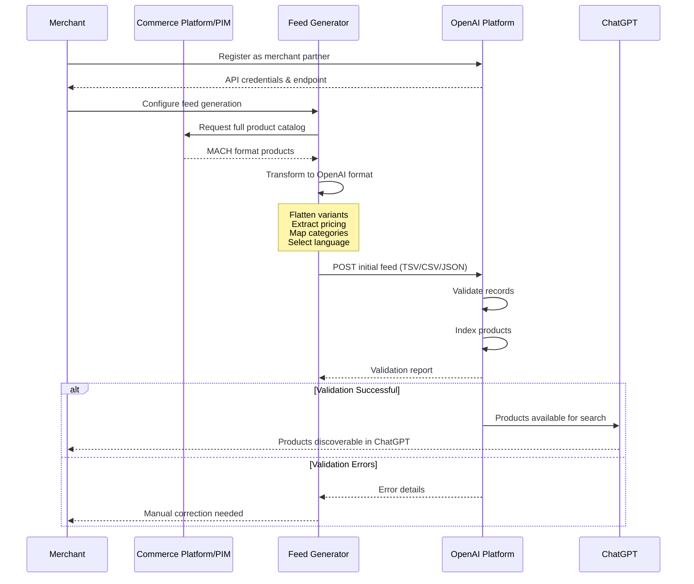
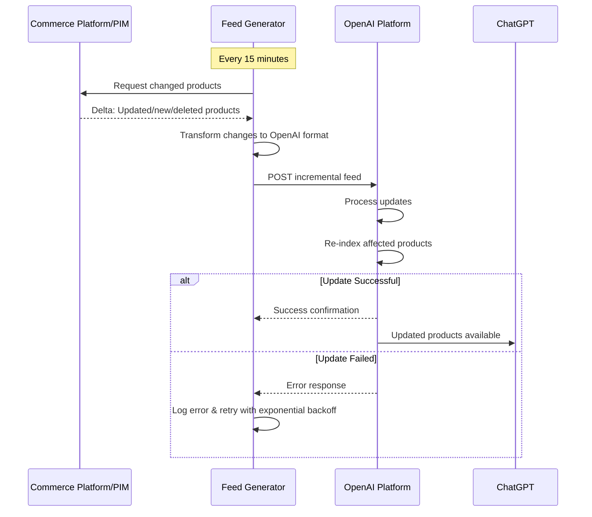

# MACH Alliance • Open Data Model

## Recipe: `OpenAI Product Feed Integration`

## Table of contents

- [MACH Alliance • Open Data Model](#mach-alliance--open-data-model)
  - [Recipe: `OpenAI Product Feed Integration`](#recipe-openai-product-feed-integration)
  - [Table of contents](#table-of-contents)
  - [Recipe Purpose](#recipe-purpose)
  - [Recipe Overview](#recipe-overview)
      - [Approach Rationale](#approach-rationale)
        - [AI-Powered Discovery](#ai-powered-discovery)
        - [Conversational Commerce](#conversational-commerce)
        - [Incremental Adoption](#incremental-adoption)
  - [When to Use This Recipe](#when-to-use-this-recipe)
  - [Typical pitfalls](#typical-pitfalls)
  - [Actors / Stakeholders](#actors--stakeholders)
  - [Trigger Points / Events](#trigger-points--events)
  - [Recipe Flows](#recipe-flows)
      - [Sequence Diagram: Initial Feed Setup](#sequence-diagram-initial-feed-setup)
      - [Sequence Diagram: Incremental Updates](#sequence-diagram-incremental-updates)
  - [Systems Involved](#systems-involved)
  - [Data Requirements](#data-requirements)
    - [Product Feed Data Flow](#product-feed-data-flow)
      - [Example Product Feed Transformation](#example-product-feed-transformation)
  - [Variants / Alternatives](#variants--alternatives)
  - [Failure Modes / Edge Cases](#failure-modes--edge-cases)
  - [Success Metrics / KPIs](#success-metrics--kpis)
  - [Security \& Compliance Notes](#security--compliance-notes)

## Recipe Purpose

> [!NOTE]
> This recipe describes how to transform MACH Alliance Open Data Model product data into OpenAI Product Feed format to enable ChatGPT-powered product discovery and shopping experiences.

To expose product catalogs to ChatGPT for AI-powered product search, recommendations, and conversational shopping experiences. This integration enables merchants to reach customers through natural language interactions while maintaining their existing composable commerce architecture.

___Key Business Goals:___
* Enable product discovery through conversational AI interfaces
* Expand sales channels with minimal integration effort
* Leverage ChatGPT's user base for product visibility
* Maintain single source of truth in existing systems
* Support both search and checkout capabilities in ChatGPT

**KPI tie-ins:** Discovery-to-purchase conversion, ChatGPT referral traffic, new customer acquisition, multi-channel revenue attribution, AI-assisted sales volume.

---

## Recipe Overview

When product data changes in your commerce system, the integration transforms MACH Alliance canonical product data into OpenAI's feed format and pushes it to OpenAI endpoints. ChatGPT can then surface your products in response to user queries, with optional checkout capabilities.

#### Approach Rationale

This OpenAI product feed integration is ideal for:

##### AI-Powered Discovery
- **Natural Language Search:** Customers find products through conversational queries rather than traditional search
- **Contextual Recommendations:** ChatGPT understands intent and suggests relevant products based on conversation context
- **Visual Search Support:** Product images enhance AI understanding and presentation

##### Conversational Commerce
- **Guided Shopping:** AI walks customers through product selection with questions and comparisons
- **Intent Recognition:** Understands complex queries like "waterproof trail shoes under $100 for wide feet"
- **Multi-Product Comparison:** Naturally compares features and prices across products

##### Incremental Adoption
- **Search-Only Start:** Begin with product discovery without enabling checkout
- **Gradual Rollout:** Test with subset of products before full catalog
- **Fallback Support:** Drive traffic to existing checkout flows initially

---

## When to Use This Recipe

> [!TIP]
> Start with search-only integration (`enable_search: true`, `enable_checkout: false`) to test ChatGPT as a discovery channel before enabling full checkout.

**Use this approach when:**
- Seeking new customer acquisition channels
- Operating B2C e-commerce with visual products
- Maintaining product catalog in PIM or commerce platform
- Products have clear descriptions and specifications
- Target audience includes ChatGPT users
- Able to handle 15-minute feed update frequency

**Consider alternative approaches when:**
- Selling primarily B2B with complex pricing
- Products require extensive customization
- Inventory changes more frequently than every 15 minutes
- Primary market doesn't use ChatGPT
- Products need extensive human consultation

---

## Typical pitfalls

**This approach works well for:**
- Consumer products with straightforward descriptions
- Catalogs with stable inventory and pricing
- Visual products (apparel, electronics, home goods)
- Products with GTINs/UPCs for better matching
- Merchants comfortable with AI-powered discovery

**Watch out for these challenges:**
- **Variant Explosion:** Products with many variants create numerous feed entries
- **Real-Time Inventory:** 15-minute refresh may show out-of-stock items briefly
- **Pricing Complexity:** Feed format doesn't support tiered or customer-specific pricing
- **Localization:** Requires separate feeds per language/region
- **Product Relationships:** Cross-sells and bundles not explicitly supported

---

## Actors / Stakeholders

**Users:**
- **ChatGPT Users:** Discover products through conversational searches
- **Customers:** Experience guided shopping with AI assistance
- **Anonymous Browsers:** Find products without account creation

**Systems:**
- **Commerce Platform / PIM:** Source of truth for product data
- **Feed Generator:** Transforms MACH data to OpenAI format
- **OpenAI Platform:** Ingests feed and powers ChatGPT shopping
- **CDN:** Hosts product images for ChatGPT display

**Teams:**
- **Merchandising:** Curates product data and descriptions for AI discoverability
- **Engineering:** Implements feed generation and maintains integration
- **Marketing:** Monitors ChatGPT channel performance and attribution
- **Operations:** Manages inventory accuracy and fulfillment for ChatGPT orders

---

## Trigger Points / Events

**Time-based:**
- Scheduled feed generation every 15 minutes
- Daily full catalog refresh for data consistency
- Hourly inventory reconciliation for high-turnover products

**Event-based:**
- Product created/updated in PIM or commerce platform
- Price change in pricing engine
- Inventory level drops below threshold
- Product status changes (active/inactive/discontinued)
- New product variants added

**Initial Setup:**
- Merchant registers with OpenAI as commerce partner
- Initial full catalog export and validation
- Feed endpoint configuration and authentication

---

## Recipe Flows

#### Sequence Diagram: Initial Feed Setup



#### Sequence Diagram: Incremental Updates



---

## Systems Involved

| **System**                  | **Role**                                           | **Owner**                   |
| --------------------------- | -------------------------------------------------- | --------------------------- |
| Commerce Platform / PIM     | Source of truth for product data                   | Engineering Team            |
| Feed Generator              | Transforms MACH data to OpenAI format              | Engineering Team            |
| OpenAI Platform             | Ingests feeds, indexes products, powers ChatGPT    | OpenAI (External)           |
| Inventory Management System | Real-time stock levels                             | Operations Team             |
| Pricing Engine              | Product pricing and promotional prices             | Finance / Merchandising     |
| CDN                         | Hosts product images for ChatGPT display           | Engineering / DevOps        |
| Analytics Platform          | Tracks ChatGPT channel performance                 | Marketing / Data Team       |

---

## Data Requirements

| **MACH Entity**                                            | **OpenAI Feed Field**         | **Transformation Required**                                 |
| ---------------------------------------------------------- | ----------------------------- | ----------------------------------------------------------- |
| [Product](../entities/product/product.md) → `id`           | `id`                          | Use variant SKU for uniqueness                              |
| [Product](../entities/product/product.md) → `name`         | `title`                       | Extract single language or primary locale                   |
| [Product](../entities/product/product.md) → `description`  | `description`                 | Extract single language; truncate if needed                 |
| [ProductVariant](../entities/product/product.md) → `sku`   | `id` (recommended)            | Use as primary identifier                                   |
| [ProductVariant](../entities/product/product.md) → `price` | `price` + `currency`          | Extract amount and currency from Money object               |
| [Pricing](../entities/pricing/pricing.md) → `sale_price`   | `sale_price`                  | Extract from promotional pricing if active                  |
| [Inventory](../entities/inventory/inventory.md)            | `availability`                | Map to: `in_stock`, `out_of_stock`, `preorder`, `backorder` |
| [Category](../entities/product/category.md)                | `category`                    | Select primary category from array                          |
| [Product](../entities/product/product.md) → `brand`        | `brand`                       | Direct mapping                                              |
| [Media](../entities/utilities/media.md) → `primary_image`  | `image_url`                   | Extract URL from file object                                |
| [Media](../entities/utilities/media.md) → `media`          | `additional_image_urls`       | Extract URLs from array                                     |
| ProductVariant → `barcodes`                                | `gtin`                        | Extract UPC/EAN/GTIN from barcodes object                   |

### Product Feed Data Flow

**Input Data (MACH Format):**
- Product with nested variants
- Multiple localized names/descriptions
- Structured pricing with Money objects
- Location-based inventory
- Hierarchical categories
- Rich media with metadata

**Processing Steps:**
1. **Flatten Variants:** Each variant becomes separate feed entry
2. **Select Language:** Choose primary locale for title/description
3. **Extract Pricing:** Pull amount from Money utility object
4. **Calculate Availability:** Aggregate inventory across locations
5. **Map Categories:** Select best-fit single category
6. **Extract Media URLs:** Get primary image and additional images
7. **Generate GTINs:** Pull from barcode object if available
8. **Set OpenAI Flags:** Configure `enable_search` and `enable_checkout`

**Output (OpenAI Feed Format):**
- Flat TSV/CSV/JSON file
- One record per variant
- Simple price values (not objects)
- Single category string
- Direct image URLs
- Binary availability status

#### Example Product Feed Transformation

**Input: MACH Format Product**
```json
{
  "id": "PROD-TSHIRT-001",
  "name": {
    "en-US": "Classic Cotton T-Shirt",
    "es-ES": "Camiseta de Algodón Clásica"
  },
  "description": {
    "en-US": "Comfortable 100% organic cotton t-shirt",
    "es-ES": "Cómoda camiseta de algodón 100% orgánico"
  },
  "brand": "MACH Apparel",
  "categories": ["apparel", "shirts", "sustainable"],
  "primary_image": {
    "file": {
      "url": "https://cdn.example.com/tshirt-primary.jpg"
    }
  },
  "media": [
    {
      "file": {
        "url": "https://cdn.example.com/tshirt-back.jpg"
      }
    }
  ],
  "variants": [
    {
      "id": "VAR-001",
      "sku": "TSHIRT-RED-M",
      "option_values": [
        { "option_id": "color", "value": "Red" },
        { "option_id": "size", "value": "M" }
      ],
      "price": {
        "amount": 29.99,
        "currency": "USD"
      },
      "compare_at_price": {
        "amount": 39.99,
        "currency": "USD"
      },
      "barcodes": {
        "upc": "123456789012"
      },
      "inventory": {
        "quantities": {
          "available": 150
        }
      },
      "weight": {
        "value": 200,
        "unit": "g"
      }
    }
  ]
}
```

**Output: OpenAI Feed Format (TSV/CSV)**
```tsv
enable_search	enable_checkout	id	gtin	mpn	title	description	brand	category	color	size	image_url	additional_image_urls	product_url	price	currency	availability	sale_price	sale_start_date	sale_end_date	shipping_cost	shipping_country
true	true	TSHIRT-RED-M	123456789012	TSHIRT-RED-M	Classic Cotton T-Shirt	Comfortable 100% organic cotton t-shirt	MACH Apparel	Apparel & Accessories > Clothing > Shirts	Red	M	https://cdn.example.com/tshirt-primary.jpg	https://cdn.example.com/tshirt-back.jpg	https://example.com/products/classic-cotton-tshirt	29.99	USD	in_stock	39.99			5.99	US
```

**Output: OpenAI Feed Format (JSON)**
```json
{
  "enable_search": true,
  "enable_checkout": true,
  "id": "TSHIRT-RED-M",
  "gtin": "123456789012",
  "mpn": "TSHIRT-RED-M",
  "title": "Classic Cotton T-Shirt",
  "description": "Comfortable 100% organic cotton t-shirt",
  "brand": "MACH Apparel",
  "category": "Apparel & Accessories > Clothing > Shirts",
  "color": "Red",
  "size": "M",
  "image_url": "https://cdn.example.com/tshirt-primary.jpg",
  "additional_image_urls": ["https://cdn.example.com/tshirt-back.jpg"],
  "product_url": "https://example.com/products/classic-cotton-tshirt",
  "price": 29.99,
  "currency": "USD",
  "availability": "in_stock",
  "sale_price": 39.99,
  "shipping_cost": 5.99,
  "shipping_country": "US"
}
```

---

## Variants / Alternatives

**Feed Format Options:**
- **TSV (Tab-Separated Values):** Best for large catalogs, efficient parsing
- **CSV (Comma-Separated Values):** Universal compatibility, easy to generate
- **JSON:** Structured format, better for complex data, easier debugging
- **XML:** Legacy format, verbose but standards-compliant

**Update Frequency Strategies:**
- **Real-Time Updates:** Push changes immediately via API (not standard OpenAI approach)
- **Frequent Updates:** Every 15 minutes for fast-moving inventory
- **Hourly Updates:** Balanced approach for most catalogs
- **Daily Updates:** Sufficient for stable catalogs with slow inventory turnover
- **Hybrid Approach:** Frequent updates for hot products, daily for long-tail

**Language/Region Handling:**
- **Separate Feeds per Locale:** Create distinct feeds for en-US, es-ES, fr-FR, etc.
- **Primary Language Only:** Start with single largest market
- **Dynamic Language Selection:** Generate feeds on-demand based on ChatGPT user locale
- **Fallback Strategy:** Use primary language with locale hints in extensions

**Variant Flattening Strategies:**
- **All Variants:** Every color/size combination as separate entry (comprehensive but verbose)
- **Popular Variants Only:** Limit to best-selling combinations (reduces feed size)
- **Parent + Default Variant:** One entry per product with default variant pricing
- **Configurable Products:** Use product URL to handle variant selection on site

---

## Failure Modes / Edge Cases

| **Scenario**                          | **Impact**                                      | **Mitigation Strategy**                                                                    |
| ------------------------------------- | ----------------------------------------------- | ------------------------------------------------------------------------------------------ |
| **Feed Validation Failure**           | Products not indexed in ChatGPT                 | Implement pre-validation before submission; log errors for manual review                   |
| **Variant Explosion (100+ variants)** | Massive feed size, potential indexing issues    | Filter to popular variants; use product URL for full selection                             |
| **Missing GTINs**                     | Reduced product matching accuracy               | Use MPN field; improve barcode data in source systems                                      |
| **Inventory Sync Lag**                | Show out-of-stock items briefly                 | Implement safety stock buffer; show estimated availability                                 |
| **Price Mismatch**                    | Different prices in ChatGPT vs. website         | Ensure pricing engine updates feed; add timestamp checks                                   |
| **Image URL Broken**                  | Products display without images                 | Pre-validate image URLs; use CDN with fallback images                                      |
| **Category Mapping Ambiguity**        | Product in wrong category                       | Create category mapping table; manual review for new products                              |
| **Multi-Currency Complexity**         | Feed only supports one currency per product     | Generate separate feeds per region/currency; use price conversion                          |
| **Localization Missing**              | Non-English products with English descriptions  | Extract primary language consistently; flag untranslated content                           |
| **Feed Endpoint Timeout**             | Failed upload, stale data in ChatGPT            | Implement retry with exponential backoff; monitor endpoint health                          |
| **Product Deleted but Still in Feed** | ChatGPT shows unavailable products              | Mark as deleted in feed (`deleted: true`); implement tombstone records                     |
| **Promotional Pricing Expired**       | Shows sale price after promotion ends           | Include `sale_start_date` and `sale_end_date`; clean up expired promotions before feed gen |

---

## Success Metrics / KPIs

**Discovery & Engagement Metrics:**
- ChatGPT product impressions: Products shown in ChatGPT responses
- Click-through rate from ChatGPT to product pages: Target >5%
- Conversation-to-click conversion: Users engaging then visiting site
- Product discovery via natural language queries: Queries matched to products

**Sales & Revenue Metrics:**
- ChatGPT-attributed revenue: Sales with ChatGPT as referral source
- Conversion rate for ChatGPT traffic: Target within 20% of site average
- Average order value for ChatGPT customers: Compare to other channels
- New customer acquisition from ChatGPT: First-time buyers from channel

**Technical Performance Metrics:**
- Feed generation success rate: Target >99.5%
- Feed validation pass rate: Target >95% of products validated
- Update frequency adherence: Actual vs. target 15-minute cadence
- API endpoint uptime: Target >99.9%
- Average feed processing time: OpenAI ingestion duration

**Data Quality Metrics:**
- Product coverage: % of catalog included in feed
- GTIN population rate: Target >80% of products with valid GTINs
- Image availability rate: Target 100% products with primary image
- Description completeness: Products with adequate descriptions
- Price accuracy: Price mismatches between feed and website

---

## Security & Compliance Notes

**Data Security Requirements:**
- **HTTPS Required:** All feed transfers over encrypted HTTPS connections
- **API Authentication:** Secure credentials for OpenAI endpoint access
- **Image CDN Security:** Publicly accessible URLs but with secure headers
- **No Sensitive Data:** Exclude internal SKUs, cost prices, supplier info
- **Token Management:** Rotate API credentials regularly; use secrets management

**Privacy & Data Protection:**
- **Customer Data Exclusion:** Feed contains only product data, no customer PII
- **Price Transparency:** Ensure displayed prices match customer-facing prices
- **Regional Restrictions:** Respect geographic selling restrictions
- **Data Retention:** Understand OpenAI's product data retention policies
- **Right to Remove:** Process for removing products from ChatGPT index

**Product Data Compliance:**
- **Accurate Descriptions:** Ensure marketing claims are substantiated
- **Regulatory Compliance:** Exclude products not approved for sale in target regions
- **Age-Restricted Products:** Proper categorization for alcohol, tobacco, etc.
- **Pricing Accuracy:** MAP (Minimum Advertised Price) compliance
- **Product Safety:** Ensure recalled products removed from feed immediately

**Intellectual Property:**
- **Image Rights:** Confirm rights to use product images in ChatGPT
- **Brand Authorization:** Ensure authorization to sell branded products
- **Copyright Compliance:** Product descriptions don't violate copyright
- **Trademark Usage:** Proper use of brand names and trademarks

**Operational Security:**
- **Feed Validation Logging:** Audit trail of feed submissions and validations
- **Change Tracking:** Monitor what products/prices changed in each feed
- **Error Alerting:** Real-time notifications for feed failures
- **Fallback Procedures:** Manual feed submission process if automation fails
- **Disaster Recovery:** Ability to regenerate full feed from source systems

---

>  This MACH Alliance Canonical Data Model is intentionally __vendor-neutral__ and serves as a foundation for interoperability across composable architectures. It is __continually evolving__ through community contributions, which are reviewed and approved collaboratively.
>
>  All contributions are made under the __Creative Commons Attribution 4.0 International License (CC BY 4.0)__. By submitting a contribution, you agree to license your content under <a href="https://creativecommons.org/licenses/by/4.0/deed.en">CC BY 4.0</a>, allowing others to share and adapt the material with proper attribution.
>
>  We welcome and encourage continued improvements through community input.