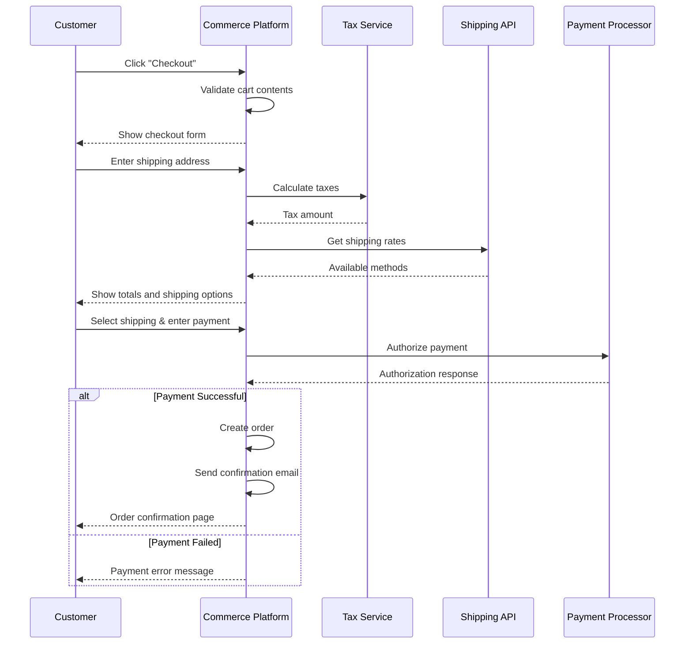

# MACH Alliance • Open Data Model

## Recipe: `Simple Checkout Flow`

## Table of contents

- [Recipe purpose](#recipe-purpose)
- [Recipe Overview](#recipe-overview)
- [Typical pitfalls](#typical-pitfalls)
- [Actors / Stakeholders](#actors--stakeholders)
- [Trigger Points / Events](#trigger-points--events)
- [Recipe Flows](#recipe-flows)
- [Systems Involved](#systems-involved)
- [Data Requirements](#data-requirements)
- [Variants / Alternatives](#variants--alternatives)
- [Failure Modes / Edge Cases](#failure-modes--edge-cases)
- [Success Metrics / KPIs](#success-metrics--kpis)
- [Security & Compliance Notes](#security--compliance-notes)

## Recipe Purpose

To deliver a streamlined, secure checkout experience that converts cart contents into completed orders with minimal friction. This simplified approach focuses on essential checkout functions while maintaining security and reliability for small to medium-scale commerce operations.

___Key Business Goals:___
* Maximize conversion with simple, fast checkout process
* Ensure secure payment processing and data protection
* Minimize cart abandonment through streamlined user experience
* Support basic shipping and tax calculations
* Enable guest and registered customer purchases
  
**KPI tie-ins:** Conversion rate, checkout completion time, cart abandonment rate, payment success rate, customer satisfaction.

---

## Recipe Overview

When a customer clicks "Checkout," the system validates cart contents, calculates taxes and shipping, processes payment, and creates an order. This simplified approach handles essential checkout functions in a linear flow, prioritizing speed and reliability over complex orchestration.

#### Approach Rationale

This simplified checkout approach is ideal for:

##### Quick Implementation
- **Minimal Complexity:** Linear checkout flow with basic validation reduces development time and maintenance overhead
- **Standard Integrations:** Uses common payment processors and shipping APIs without complex orchestration layers
- **Proven Patterns:** Follows established e-commerce checkout patterns that customers understand

##### Essential Security
- **Payment Security:** Maintains PCI compliance through payment processor integration
- **Data Protection:** Basic customer data encryption and secure transmission
- **Fraud Prevention:** Leverages payment processor's built-in fraud detection

##### Performance Focus
- **Single-Page Checkout:** Reduces friction with one-page checkout experience
- **Minimal API Calls:** Reduces latency by combining operations where possible
- **Simple State Management:** Avoids complex session state across multiple services

For a more advanced version, consult the [Multi-Step Checkout Flow Orchestration](checkout-flow-recipe.md) recipe.

---

## Typical pitfalls

**This approach works well for:**
- Small to medium-scale e-commerce sites with straightforward products
- MVPs and new commerce implementations
- Single-currency, single-region operations
- Simple product catalogs without complex pricing rules

**Consider the more complex orchestrated approach if you need:**
- Multi-step approval workflows (B2B)
- Complex inventory allocation across multiple warehouses  
- Advanced fraud detection and risk management
- Real-time pricing from multiple sources
- Complex promotional rule engines

---

## Actors / Stakeholders

**Users:**
- **Customers:** Complete purchases quickly with minimal steps
- **Guest Users:** Convert without account creation requirements

**Systems:**
- **Commerce Platform:** Manages cart, processes checkout, creates orders
- **Payment Processor:** Handles payment authorization and capture
- **Tax Service:** Calculates taxes based on location and products
- **Shipping API:** Provides shipping rates and options

**Teams:**
- **Product/UX:** Owns checkout experience and conversion optimization
- **Engineering:** Implements checkout flow and maintains integrations
- **Operations:** Manages order fulfillment and customer service

---

## Trigger Points / Events

**Action-based:**
- Customer clicks "Checkout" from cart page
- Customer updates shipping address or payment method
- Customer submits final order for payment

**Validation-based:**
- Address entered requires tax calculation
- Shipping method selection triggers rate calculation
- Payment submission initiates authorization

---

## Recipe Flows

#### Sequence Diagram



---

## Systems Involved

| **System**          | **Role**                                    | **Owner**                |
| ------------------- | ------------------------------------------- | ------------------------ |
| Commerce Platform   | Cart management, checkout flow, order creation | Engineering Team     |
| Payment Processor   | Payment authorization and processing        | Engineering / Finance    |
| Tax Service         | Tax calculation by location                 | Finance Team             |
| Shipping API        | Shipping rates and tracking                 | Operations Team          |

---

## Data Requirements

| **Entity**               | **Function**                           | **Source System**      |
| ------------------------ | -------------------------------------- | ---------------------- |
| [Cart](../entities/cart/cart.md)                 | Input - Cart contents and totals       | Commerce Platform      |
| [Address](../entities/utilities/address.md)         | Input - Shipping and billing addresses | Customer input         |
| [Product](../entities/product/product.md)        | Input - Product details and pricing    | Commerce Platform      |
| Tax Calculation          | Output - Tax amounts and rates         | Tax Service            |
| Shipping Options         | Output - Available methods and rates   | Shipping API           |
| [Order](../entities/order/order.md)              | Output - Completed order record        | Commerce Platform      |

### Simple Checkout Data Flow

**Input Data:**
- Cart ID and line items with quantities
- Customer email and contact information
- Shipping and billing addresses
- Selected payment method

**Processing:**
- Product availability check
- Tax calculation based on shipping address
- Shipping rate calculation for selected method
- Payment authorization with fraud check

**Output:**
- Created order with confirmation number
- Payment confirmation and receipt
- Order confirmation email to customer

#### Example Simple Checkout Request

```json
{
  "cart_id": "cart_abc123",
  "customer": {
    "email": "customer@example.com",
    "first_name": "John",
    "last_name": "Doe"
  },
  "shipping_address": {
    "line1": "123 Main St",
    "city": "Seattle",
    "region": "WA",
    "postal_code": "98101",
    "country": "US"
  },
  "billing_address": {
    "same_as_shipping": true
  },
  "payment": {
    "method": "card",
    "number": "4242424242424242",
    "exp_month": "12",
    "exp_year": "2025",
    "cvc": "123"
  },
  "shipping_method": "standard"
}
```

---

## Variants / Alternatives

**Guest vs. Registered Checkout:**
- Guest checkout with email-only registration
- Account creation during or after checkout completion
- Social login integration for quick account setup

**Payment Method Variations:**
- Credit/debit card processing with major processors (Stripe, PayPal)
- Digital wallet options (Apple Pay, Google Pay) for mobile
- Buy now, pay later options (Afterpay, Klarna) as payment alternatives

**Shipping Simplifications:**
- Flat-rate shipping with simple tier structure
- Free shipping over threshold amount
- Local pickup options for regional businesses
- Digital product delivery with instant fulfillment

---

## Failure Modes / Edge Cases

| **Scenario**                    | **Impact**                        | **Mitigation Strategy**              |
| ------------------------------- | --------------------------------- | ------------------------------------ |
| **Payment Declined**           | Customer cannot complete purchase | Clear error message with retry option; suggest alternative payment methods |
| **Tax Service Unavailable**    | Cannot calculate exact tax        | Use default tax rate with customer notification |
| **Shipping API Timeout**       | Cannot show shipping options      | Fallback to standard shipping rate |
| **Product Out of Stock**       | Item unavailable during checkout  | Remove item with notification; suggest alternatives |
| **Invalid Address**            | Cannot process shipping           | Address validation with correction suggestions |
| **Session Timeout**            | Customer loses progress           | Extended session warning; save form data |

---

## Success Metrics / KPIs

**Core Conversion Metrics:**
- Checkout conversion rate: Target >75% from checkout page to completion
- Cart abandonment rate: Target <35%
- Average checkout completion time: Target <2 minutes
- Payment success rate: Target >95%

**User Experience Metrics:**
- Single-page checkout completion rate: Target >80%
- Mobile checkout conversion: Target within 10% of desktop
- Guest checkout usage: Target >50% of transactions
- Customer satisfaction with checkout: Target >4.0/5.0

**Technical Performance:**
- Checkout page load time: Target <2 seconds
- Payment processing time: Target <3 seconds
- System uptime during checkout: Target >99.5%

---

## Security & Compliance Notes

**Essential Security Requirements:**
- PCI DSS compliance through payment processor (no card data storage)
- SSL/TLS encryption for all checkout pages and API communications
- Basic fraud detection through payment processor integration
- Secure customer data transmission and temporary storage

**Privacy & Data Protection:**
- Customer consent for data collection and marketing communications
- Secure handling of personal information with encryption at rest
- Data retention policies with automatic cleanup of temporary checkout data
- Basic GDPR compliance for European customers (consent, data access)

**Payment Security:**
- Payment tokenization to avoid storing sensitive card data
- CVV verification for all card transactions
- Address verification service (AVS) integration
- Basic velocity checks for repeated transaction attempts

**Operational Security:**
- Regular security updates for commerce platform and integrations
- Basic audit logging for payment transactions and order creation
- Secure API authentication for third-party service integrations
- Backup and recovery procedures for order and customer data

---

>  This MACH Alliance Canonical Data Model is intentionally __vendor-neutral__ and serves as a foundation for interoperability across composable architectures. It is __continually evolving__ through community contributions, which are reviewed and approved collaboratively.
>  
>  All contributions are made under the __Creative Commons Attribution 4.0 International License (CC BY 4.0)__. By submitting a contribution, you agree to license your content under <a href="https://creativecommons.org/licenses/by/4.0/deed.en">CC BY 4.0</a>, allowing others to share and adapt the material with proper attribution.
>  
>  We welcome and encourage continued improvements through community input.