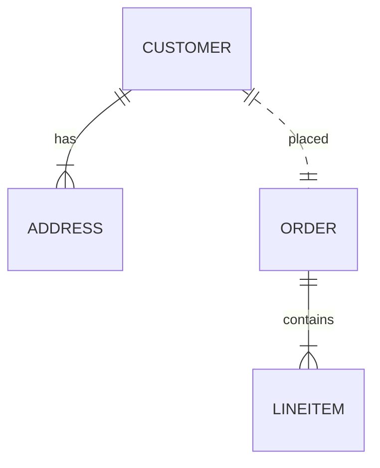

# MACH Alliance Canonical Entity Model Template

# Entity: `Entity Name`

## Purpose

This template defines how to describe canonical entities within a MACH composable architecture. It serves as a recipe for data interoperability across vendors and platforms.

Each entity should:
- Be easy to read, extend, and version.
- Include both tabular and JSON examples—**samples appear at the top** to streamline developer adoption.
- Encourage the use of **utility objects** (e.g., `Address`) for reuse.
- Promote the use of **namespaced trait dictionaries** for flexibility and semantic clarity.

---

## Entity: Customer

| Field         | Description | Practice |
|---------------|-------------|----------|
| `id`          | Unique identifier in given context (e.g., UUID, slug). | SHOULD |
| `type`        | Indicates `person` or `company`. | SHOULD |
| `status`      | Lifecycle status (`active`, `inactive`, `archived`). | SHOULD |
| `referenceIds`| Dictionary of cross-system IDs (e.g., CRM, ERP, commerce) to ease orchestration logic | SHOULD |
| `createdAt`   | ISO 8601 creation timestamp. | SHOULD |
| `updatedAt`   | ISO 8601 update timestamp. | SHOULD |
| `traits`      | Namespaced dictionary for extension data grouped by concern (e.g., `marketing`, `loyalty`). | RECOMMENDED |
| `person`      | Object for person data. Only present if `type = person`. | COULD |
| `company`     | Object for company data. Only present if `type = company`. | COULD |
| `addresses`   | List of typed addresses. Uses the shared utility object `Address`. | RECOMMENDED |

---

## Sample Object: Customer

```json
{
  "id": "cus_001",
  "type": "person",
  "status": "active",
  "referenceIds": {
    "crmContactId": "123456",
    "commercetools": "customer-98765"
  },
  "createdAt": "2025-06-01T12:00:00Z",
  "updatedAt": "2025-06-10T12:30:00Z",
  "traits": {
    "marketing": {
      "consent": "optedIn"
    },
    "loyalty": {
      "points": 200,
      "tier": "silver",
      "source": "talonone",
      "sourceId":"s9df8"
    }
  },
  "person": {
    "firstName": "Emma",
    "lastName": "Larsen",
    "email": "emma@example.com",
    "phone": "+45 12345678"
  },
  "addresses": [
    {
      "type": "shipping",
      "address": {
        "line1": "Strandvejen 100",
        "city": "Aarhus",
        "region": "Midtjylland",
        "postalCode": "8000",
        "country": "DK"
      }
    }
  ]
}
```

---

## Sample Object: Address (Utility Object)

Utility objects are shared, composable models used across entities eg.: reusing `Address` across `Customer`, `Order`, and `Company`.

```json
{
  "line1": "Strandvejen 100",
  "line2": "c/o Novak",
  "city": "Aarhus",
  "region": "Midtjylland",
  "postalCode": "8000",
  "country": "DK"
}
```

> See Address utility object.

---

## Components

### Typical Relationships

| Concept     | Description                          | Typical Source of Truth |
|-------------|--------------------------------------|--------------------------|
| ID          | Unique customer identifier           | CRM / CDP / Commerce     |
| ReferenceId | External system identifiers          | Integration Layer        |
| Traits      | Optional and scoped extensions       | CDP / Loyalty / CRM      |
| Address     | Customer billing/shipping location   | Commerce / OMS / ERP     |

### Typical Relationships



---

## Typical Pitfalls

- Not distinguishing between `company` and `person` fields. Keep these clearly separated using nested objects.
- Overloading a `meta` or `customVariables` field with unstructured data. Use namespaced `traits` instead.
- Using `zip` or `zipcode`—standardize on `postalCode` per ISO guidelines.
- Forgetting that address records must be immutable on orders or other transactional states for data records. Always store a snapshot: If you saw it, log it.


---

>  This MACH Alliance Canonical Data Model is intentionally __vendor-neutral__ and serves as a foundation for interoperability across composable architectures. It is __continually evolving__ through community contributions, which are reviewed and approved collaboratively.
>  
>  All contributions are made under the __Creative Commons Attribution 4.0 International License (CC BY 4.0)__. By submitting a contribution, you agree to license your content under <a href="https://creativecommons.org/licenses/by/4.0/deed.en">CC BY 4.0</a>, allowing others to share and adapt the material with proper attribution.
>  
>  We welcome and encourage continued improvements through community input. For more information and guidance on how to contribute, please refer to the <a href="https://github.com/machalliance/common-data-model/blob/main/contributing.md">Contributor Guide</a>.
