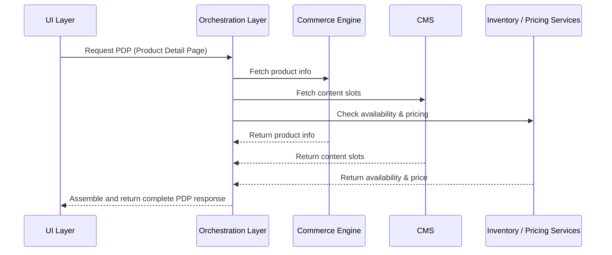

# MACH Alliance • Open Data Model

## Entity: `Master Recipe Template DRAFT`

NOTE: A "recipe" is a document intended to serve cross-functional stakeholders (e.g., product, engineering, ops, CX, analytics).

### Recipe Purpose
What business goal this recipe supports (e.g., increase trust, reduce cart abandonment, drive product insights).

KPI tie-ins: (e.g., conversion rate, CSAT, engagement, NPS, return rate).

_For example, PDP Orchestration_
_To deliver a fast, reliable, and fully populated Product Detail Page (PDP) by orchestrating multiple back-end services into a single, customer-facing API. This enables consistent display of product information, pricing, inventory, and rich content across channels._

___Key Business Goals:___
* _Improve PDP load time and performance_
* _Reduce page abandonment rate_
* _Enable personalized or contextual PDP content_
* _Streamline cross-channel consistency (web, mobile, kiosk)_

---

### Recipe Overview

Short paragraph describing what this recipe does and how it fits into the eCommerce ecosystem.

Include a high-level customer or system journey narrative.

_For example, PDP Orchestration_
_When a user requests a product page, the system must gather and assemble product data from multiple domains: product info, pricing, availability, media, and content slots. This orchestration handles the back-end coordination, ensuring fast, complete, and accurate PDP rendering._

---

### Actors / Stakeholders
Who is involved?

* __Users:__ (Customer, Agent, Admin)
* __Systems:__  (e.g., Commerce Engine, CDP, CMS, CRM)
* __Teams:__  (e.g., Product, Marketing, Support)

_For example, PDP Orchestration_
* ___Customer__: Triggers PDP request through UI_
* ___UI Layer__: Sends PDP API request_
* ___Orchestration Layer__: Aggregates data_
* ___Commerce Engine__: Supplies product core data_
* ___CMS__: Provides marketing and content blocks_
* ___Inventory Service__: Supplies real-time availability_
* ___Pricing Engine__: Provides contextual pricing (region, user segment)_

---

### Trigger Points / Events

What initiates this recipe?

* __Time-based__ (e.g., post-delivery + 3 days)
* __Action-based__ (e.g., customer clicks on a Product from a Product Listing Page)

---

### Recipe Flows

#### Swimlane or Sequence Diagram

PLEASE USE MERMAID

_For example, PDP Orchestration_

#### Architectural Overlay (optional)

To be added

---

### Systems Involved

NOTE - ALIGN WITH THE REFERENCE ARCHITECTURE: https://github.com/machalliance/standards/blob/main/src/diagrams/MACH%20Alliance%20Reference%20Architecture%20Diagrams-rev1.4.pdf

_For example, PDP Orchestration_

| **System**          | **Role**                           | **Owner**             |
| ------------------- | ---------------------------------- | --------------------- |
| Commerce Engine     | Core product data, SKU, attributes | Product / Engineering |
| CMS                 | PDP content slots, copy, assets    | Marketing / CMS Team  |
| Inventory Service   | Real-time availability data        | Operations / Supply   |
| Pricing Engine      | Contextual and promotional pricing | Pricing / Product     |
| Orchestration Layer | Aggregates all service responses   | Architecture / API    |
| UI / Frontend       | Renders the final PDP experience   | Frontend Team         |

---

### Data Requirements

* What data is needed? 
  * Inputs: Customer ID, order ID, delivery date 
  * Outputs: Rating, review text, media uploads 
* Data lineage: where it’s stored, how it flows 
* Privacy/PII considerations

---

### Variants / Alternatives

* Mobile-specific adaptations
* Agent-assisted workflows
* Third-party integrations

---

### Failure Modes / Edge Cases

What can go wrong?
* Delivery data missing
* Duplicate review submissions
* Spam reviews
* How to handle fallback gracefully?

 _For example, PDP Orchestration_
 
 | Scenario               | Handling Strategy                          |
| ---------------------- | ------------------------------------------ |
| CMS not responding     | Fallback to default content or placeholder |
| Inventory unavailable  | Show “Out of stock” with alternative SKUs  |
| Pricing engine timeout | Show MSRP with disclaimer                  |
| Product not found      | 404 or redirect to PLP                     |

---

### Success Metrics / KPIs

 _For example, PDP Orchestration_

*  PDP average load time < 2 seconds
*  0% error rate on PDP data fetch
*  95% data completeness on PDP API
*  Conversion rate uplift from personalized PDP

---

### Security & Compliance Notes
PLEASE NOTE: This list is not exhaustive, and you must do your own due dilligence to ensure you meet the required security and compliance standards for your unique scenario, however, some common aspects to review are:
* DPR/CCPA implications
* Authentication required?
* Moderation required by law?

---

### Footnote
  This MACH Alliance Canonical Data Model Recipe is intentionally vendor neutral.
  More details please refer to ADD LINK ON ALL

