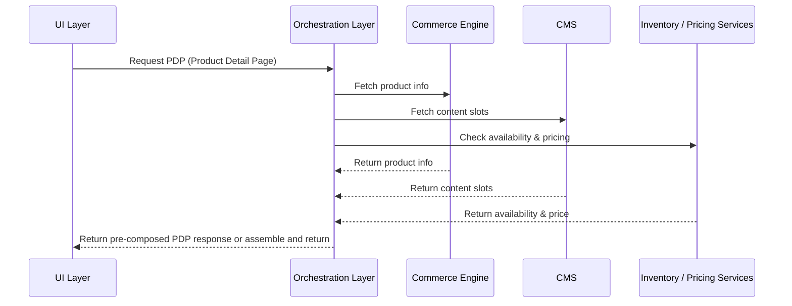

# MACH Alliance • Open Data Model

## Recipe: `Recipe Name`

> [!IMPORTANT]
> A "recipe" is a document intended to serve cross-functional stakeholders (e.g., product, engineering, ops, CX, analytics) when developing composable applications. It is meant to describe a method for solving a business problem in a composable approach. It is envisioned that we may have _multiple_ recipes solving similar problems, but that the advantages and disadvantages of specific approaches unique to the use case are also highlighted.

## Table of contents

- [Recipe purpose](#recipe-purpose)
- [Recipe Overview](#recipe-overview)
- [Typical pitfalls](#typical-pitfalls)
- [Actors / Stakeholders](#actors--stakeholders)
- [Trigger Points / Events](#trigger-points--events)
- [Recipe Flows](#recipe-flows)
- [Systems Involved](#systems-involved)
- [Data Requirements](#data-requirements)
- [Variants / Alternatives](#variants--alternatives)
- [Failure Modes / Edge Cases](#failure-modes--edge-cases)
- [Success Metrics / KPIs](#failure-modes--edge-cases)
- [Security & Compliance Notes](#security--compliance-notes)

## Recipe Purpose
> [!NOTE]
> What business goal this recipe supports (e.g., increase trust, reduce cart abandonment, drive product insights).

> [!TIP]
> A **PDP (Product Detail Page) Orchestration** [example](../recipes/PDP-orchestration-on-the-fly.md) is included throughout this template.:

To deliver a fast, reliable, and fully populated Product Detail Page (PDP) by orchestrating multiple back-end services into a single, customer-facing API. This enables consistent display of product information, pricing, inventory, and rich content across channels.

___Key Business Goals:___
* Improve PDP load time and performance
* Reduce page abandonment rate
* Enable non-dev marketing updates to product content
* Enable personalized or contextual PDP content
* Streamline cross-channel consistency (web, mobile, kiosk)
  
**KPI tie-ins:** Conversion rate, average order value (AOV), content engagement metrics, page load time, SEO rankings, content publish velocity.

---

## Recipe Overview
> [!NOTE]
> Short paragraph describing what this recipe does and *why this approach is a best practice for described scenarios*.
> 
> Include a high-level customer or system journey narrative.

> [!TIP]
> **PDP Orchestration** example:

When a user requests a product page, the system must gather and assemble product data from multiple domains: product info, pricing, availability, media, and content slots. This orchestration handles the back-end coordination, ensuring fast, complete, and accurate PDP rendering.

#### Approach Rationale

In composable commerce, using an orchestration layer instead of front-end binding is advantageous for several architectural, operational, and business reasons:
##### Performance & User Experience
- Reduced Client-Side Complexity: Front-end binding means the browser must orchestrate multiple API calls, handle failures, and manage complex business logic. This creates slower page loads, increased JavaScript bundle sizes, and potential for user-facing errors during API failures.
- Caching & Optimization: An integration layer can implement sophisticated caching strategies, data transformation, and response optimization that would be impossible or inefficient to replicate in every front-end instance.
- Network Efficiency: Instead of making multiple round-trips from client to various services, the integration layer can aggregate data server-side and return optimized payloads.
##### Security & Compliance 
- API Key Management: Front-end binding exposes API credentials in client-side code or requires complex token management. The integration layer keeps sensitive credentials server-side.
- Data Sanitization: Customer data, pricing information, and business logic can be properly filtered and sanitized before reaching the client, preventing data leakage.
- Rate Limiting & Throttling: Protection against API abuse and managing third-party service rate limits is handled centrally rather than hoping each client implementation respects limits.
##### Business Logic & Consistency
- Centralized Business Rules: Complex pricing calculations, inventory allocation rules, and customer-specific logic should be consistent across all touchpoints. Front-end binding leads to duplicated logic and potential inconsistencies.
- Data Transformation: Converting between different service formats, handling regional variations, and applying business-specific transformations is better managed in one place.
- Workflow Orchestration: Multi-step processes like order placement (inventory check → pricing calculation → payment processing → fulfillment) require reliable orchestration that can handle partial failures.
##### Maintainability & Scalability
- Single Source of Truth: When a third-party service changes its API, you update the integration layer once rather than hunting through multiple front-end implementations.
- Service Evolution: New services can be integrated without requiring front-end changes. Legacy services can be deprecated gracefully.
- Testing & Debugging: It's much easier to test, monitor, and debug server-side integration logic than distributed client-side implementations.
##### Operational Excellence
- Monitoring & Observability: Centralized logging, metrics, and alerting for all third-party service interactions. You can track performance, errors, and usage patterns effectively.
- Fallback Strategies: Implementing circuit breakers, graceful degradation, and fallback mechanisms is more reliable server-side.
Deployment Independence: Front-end applications can be deployed independently of backend service changes, and vice versa._

---
## Typical pitfalls
- This approach outlines using orchestration to assemble multiple sources on the fly. This approach is ideal if your underlying services are fast and reliable or if you have to make multiple decision points and business logic that may limit the benefit of caching:
  - For example, if the output is regularly changing based on changing underlying data or unique user requirements (such as personalizing by segment or geography).
- Depending on the speed of underlying services, you may wish to add caching approaches to improve performance.
  
---


## Actors / Stakeholders
> [!NOTE]
> Provide details to include users involved in the use case as well as systems and internal teams involved in the underlying development.
>
> * __Users:__ (Customer, Agent, Admin)
> * __Systems:__  (e.g., Commerce Engine, CDP, CMS, CRM)
> * __Teams:__  (e.g., Product, Marketing, Support)

> [!TIP]
> **PDP Orchestration** example:
> 
**Users:**
* **Customers:** Consume integrated content and commerce experiences
* **Content Authors:** Create and manage editorial content referencing products
* **Merchandisers:** Configure product displays and recommendations within content
* **Developers:** Implement and maintain integration patterns

**Systems:**
* **CMS:** Manages editorial content, templates, and content-product relationships
* **Commerce Engine:** Provides product data, pricing, inventory, and checkout functionality
* **Orchestration Layer:** Aggregates all service responses and a single API for front-end developers
* **CDN/Edge Cache:** Delivers cached content with commerce data integration (optional - not shown in diagram)
* **Analytics Platform:** Tracks content and commerce performance metrics (optional - not shown in diagram)
* **DAM/Dynamic media delivery:** Provides image assets and other visual product renderings (optional - not shown in diagram)

**Teams:**
* **Content/Marketing:** Owns editorial strategy and content creation
* **Product Management:** Defines commerce data requirements and customer experience
* **Engineering:** Implements technical integration and performance optimization
* **Operations:** Manages deployment pipelines and system reliability


---

## Trigger Points / Events
> [!NOTE]
> Provide details to include users involved in the use case as well as systems and internal teams involved in the underlying development.
>
> What initiates this recipe?
> * __Time-based__ 
> * __Action-based__


> [!TIP]
> **PDP Orchestration** example:
> 

What initiates this recipe?

**Time-based:**
* Scheduled content publication workflows
* Periodic product catalog synchronization (e.g., nightly batch updates)
* Cache refresh intervals for commerce data in content

**Action-based:**
* Customer navigates to content page with embedded product data
* Content author previews page with live commerce data
* Product data changes in commerce system (price, inventory, attributes)
* New product launches requiring content integration
* Content deployment triggers commerce data validation
---

## Recipe Flows

#### Swimlane or Sequence Diagram

> [!NOTE]
> Use Mermaid to build examples: https://mermaid.js.org/

> [!TIP]
> **PDP Orchestration** example:


#### Architectural Overlay (optional)

> [!CAUTION]
> Example to be added
---

## Systems Involved

> [!IMPORTANT]
> Align with the MACH Reference Architecture: > https://github.com/machalliance/standards/blob/main/src/diagrams/MACH%20Alliance%20Reference%20Architecture%20Diagrams-rev1.4.pdf

> [!TIP]
> **PDP Orchestration** example:

| **System**          | **Role**                           | **Owner**             |
| ------------------- | ---------------------------------- | --------------------- |
| Commerce Engine     | Core product data, SKU, attributes | Product / Engineering |
| CMS                 | PDP content slots, copy, assets    | Marketing / CMS Team  |
| Inventory Service   | Real-time availability data        | Operations / Supply   |
| Pricing Engine      | Contextual and promotional pricing | Pricing / Product     |
| Orchestration Layer | Aggregates all service responses   | Architecture / API    |
| UI / Frontend       | Renders the final PDP experience   | Frontend Team         |


---

## Data Requirements

> [!NOTE]
> * What data is needed? 
>     * Inputs: What is required to properly initiate the recipe
>     * Outputs: What systems are involved in the output of data
> * Data lineage: where it’s stored, how it flows 
> * Privacy/PII considerations
>
> Inputs and Outputs should link to entities (if they exist - if they do not exist, you should create one - see [How to Contribute](/common-data-model/contributing.md#how-to-contribute)).


> [!TIP]
> **PDP Orchestration** example:

* What data is needed? 
  * Inputs: [Product](../entities/product/product.md) ID or SKU (typically provided via URL), [Language](../entities/utilities/language.md) (aka region/locale/culture, optional), customer segment (optional)
  * Additional back-end requests: [Inventory](../entities/inventory/inventory.md), [Price](https://github.com/machalliance/common-data-model/common-models/ecommerce%20(core)/entities/pricing/pricing.md ), [Product](../entities/product/product.md) details from Commerce Engine, additional product content & media (from CMS and/or DAM)
  * Outputs: Fully composed object returned to browser.  
* Data lineage:
    * Is the content being accessed from the CMS / DAM in real-time or is it being cached in the orchestration/delivery tiers? 
* Privacy/PII considerations
    * Minimal case - mostly anonymous session data unless personalization layers apply
    * Advanced cases
        * Customer-specific pricing requires secure data handling
        * Content personalization must comply with consent management
        * Product viewing history integration follows data retention policies
        * Cross-border data transfer compliance for multi-region deployments
     
#### Example composed object output
```
{
  "id": "PROD-WIRELESS-HEADPHONES-001",
  "sku": "WH-NOISE-CANCEL-BLK",
  "slug": "premium-wireless-noise-cancelling-headphones",
  "type": "PT-ELECTRONICS-AUDIO",
  "status": "sellable",
  "referenceIds": {
    "erp": "ERP-WH-5847291",
    "wms": "WMS-AUDIO-001",
    "supplier": "SONY-WH-1000XM5"
  },
  "createdAt": "2024-11-15T09:30:00Z",
  "updatedAt": "2025-07-02T14:22:00Z",
  

  "breadcrumbs": [
    { "label": "Home", "url": "/" },
    { "label": "Electronics", "url": "/electronics" },
    { "label": "Audio", "url": "/electronics/audio" },
    { "label": "Headphones", "url": "/electronics/audio/headphones" },
    { "label": "Wireless Headphones", "url": "/electronics/audio/headphones/wireless" }
  ],
  
  "pageInfo": {
    "title": "Premium Wireless Noise-Cancelling Headphones",
    "url": "/products/premium-wireless-noise-cancelling-headphones",
    "canonicalUrl": "https://audiotech.com/products/premium-wireless-noise-cancelling-headphones",
    "updatedAt": "2025-07-02T14:22:00Z",
    "publishedAt": "2024-11-15T09:30:00Z"
  },
  
  "name": "Premium Wireless Noise-Cancelling Headphones",
  "description": "Experience studio-quality sound with industry-leading noise cancellation. These premium wireless headphones deliver exceptional audio clarity while blocking out distractions, perfect for travel, work, or leisure.",
  "shortDescription": "Premium wireless headphones with active noise cancellation and 30-hour battery life.",
  
  "marketingContent": {
    "headline": "Silence the World, Amplify Your Music",
    "tagline": "Professional-grade audio meets cutting-edge technology",
    "features": [
      "Industry-leading active noise cancellation blocks 99% of ambient noise",
      "Hi-Res Audio certified for studio-quality sound reproduction",
      "30-hour battery life with quick charge (3 hours playback in 3 minutes)",
      "Adaptive sound control automatically adjusts to your environment",
      "Premium materials: lightweight aluminum frame with soft leather padding"
    ],
    "benefits": [
      "Focus better in noisy environments like airplanes and cafes",
      "Enjoy every detail of your favorite music with crystal-clear highs and deep bass",
      "All-day comfort for long listening sessions without fatigue",
      "Seamless connectivity with multipoint Bluetooth 5.2 technology"
    ],
    "useCases": [
      "Professional audio mixing and mastering",
      "Long-haul travel and commuting",
      "Open office environments",
      "Gaming and entertainment"
    ]
  },

  "listPrice": {
    "amount": 399.99,
    "currency": "USD",
    "taxIncluded": false
  },
  
  "inventory": {
    "quantities": {
    "onHand": 120,
    "reserved": 15,
    "available": 105,
    "incoming": 40
    }
  },
  
  "primaryImage": {
    "url": "https://cdn.audiotech.com/img/wireless-headphones-primary.webp",
    "alt": "Premium Wireless Noise-Cancelling Headphones in Black",
    "width": 800,
    "height": 800
  },
  
  "media": [
    {
      "url": "https://cdn.audiotech.com/img/headphones-side-view.webp",
      "alt": "Side profile showing padded ear cups",
      "type": "image",
      "width": 800,
      "height": 600
    },
    {
      "url": "https://cdn.audiotech.com/img/headphones-controls.webp",
      "alt": "Touch controls and buttons detail",
      "type": "image",
      "width": 600,
      "height": 400
    },
    {
      "url": "https://cdn.audiotech.com/video/headphones-demo.mp4",
      "alt": "Product demonstration video",
      "type": "video"
    }
  ],
  
  "rating": {
    "average": 4.7,
    "count": 2847,
    "distribution": {
      "5": 1823,
      "4": 731,
      "3": 198,
      "2": 67,
      "1": 28
    }
  },
  
  "attributes": [
    { "label": "Brand", "value": "AudioTech Pro" },
    { "label": "Model", "value": "AT-WH-5000" },
    { "label": "Color", "value": "Midnight Black" },
    { "label": "Connectivity", "value": "Bluetooth 5.2, USB-C, 3.5mm" },
    { "label": "Battery Life", "value": "30 hours (ANC on), 40 hours (ANC off)" },
    { "label": "Charging Time", "value": "3 hours full charge" },
    { "label": "Weight", "value": "250g" },
    { "label": "Driver Size", "value": "40mm" },
    { "label": "Frequency Response", "value": "4Hz - 40kHz" },
    { "label": "Noise Cancellation", "value": "Active (up to 30dB reduction)" },
    { "label": "Microphone", "value": "Dual noise-cancelling mics" },
    { "label": "Warranty", "value": "2 years international" },
    { "label": "Certifications", "value": ["Hi-Res Audio", "FCC", "CE"] }
  ],
  
  "variants": [
    {
      "id": "VAR-WH-BLACK",
      "sku": "WH-NOISE-CANCEL-BLK",
      "name": "Premium Wireless Headphones - Midnight Black",
      "attributes": [
        { "label": "Color", "value": "Midnight Black" }
      ],
      "price": { "amount": 399.99, "currency": "USD" },
      "inventory": { "onhand": 47, "bulk": 150 },
      "primaryImage": {
        "url": "https://cdn.audiotech.com/img/wireless-headphones-black.webp",
        "alt": "Midnight Black Wireless Headphones"
      }
    },
    {
      "id": "VAR-WH-SILVER",
      "sku": "WH-NOISE-CANCEL-SLV",
      "name": "Premium Wireless Headphones - Platinum Silver",
      "attributes": [
        { "label": "Color", "value": "Platinum Silver" }
      ],
      "price": { "amount": 399.99, "currency": "USD" },
      "inventory": { "onhand": 23, "bulk": 80 },
      "primaryImage": {
        "url": "https://cdn.audiotech.com/img/wireless-headphones-silver.webp",
        "alt": "Platinum Silver Wireless Headphones"
      }
    }
  ],
  
  "category": {
    "id": "CAT-WIRELESS-HEADPHONES",
    "name": "Wireless Headphones",
    "slug": "wireless",
    "parentId": "CAT-HEADPHONES"
  },
  
  "relatedProducts": [
    {
      "id": "PROD-HEADPHONE-CASE-001",
      "sku": "HC-PREMIUM-001",
      "name": "Premium Headphone Travel Case",
      "relationship": "accessory",
      "price": { "amount": 49.99, "currency": "USD" },
      "primaryImage": {
        "url": "https://cdn.audiotech.com/img/headphone-case-thumb.webp",
        "alt": "Premium Headphone Travel Case"
      }
    },
    {
      "id": "PROD-WIRELESS-EARBUDS-001",
      "sku": "WE-SPORT-001",
      "name": "Wireless Sport Earbuds",
      "relationship": "alternative",
      "price": { "amount": 199.99, "currency": "USD" },
      "primaryImage": {
        "url": "https://cdn.audiotech.com/img/wireless-earbuds-thumb.webp",
        "alt": "Wireless Sport Earbuds"
      }
    },
    {
      "id": "PROD-HEADPHONE-STAND-001",
      "sku": "HS-BAMBOO-001",
      "name": "Bamboo Headphone Stand",
      "relationship": "accessory",
      "price": { "amount": 29.99, "currency": "USD" },
      "primaryImage": {
        "url": "https://cdn.audiotech.com/img/headphone-stand-thumb.webp",
        "alt": "Bamboo Headphone Stand"
      }
    },
    {
      "id": "PROD-WIRELESS-HEADPHONES-PRO",
      "sku": "WH-PRO-001",
      "name": "Professional Studio Headphones",
      "relationship": "upsell",
      "price": { "amount": 599.99, "currency": "USD" },
      "primaryImage": {
        "url": "https://cdn.audiotech.com/img/studio-headphones-thumb.webp",
        "alt": "Professional Studio Headphones"
      }
    }
  ],
  
  "traits": {
    "seo": {
      "metaTitle": "Premium Wireless Noise-Cancelling Headphones | AudioTech Pro",
      "metaDescription": "Experience studio-quality sound with our premium wireless noise-cancelling headphones. 30-hour battery, Hi-Res Audio certified. Free shipping & 2-year warranty.",
      "metaKeywords": ["wireless headphones", "noise cancelling", "premium audio", "bluetooth headphones", "hi-res audio"],
      "openGraph": {
        "title": "Premium Wireless Noise-Cancelling Headphones",
        "description": "Industry-leading noise cancellation meets studio-quality sound",
        "image": "https://cdn.audiotech.com/img/wireless-headphones-og.webp",
        "url": "https://audiotech.com/products/premium-wireless-noise-cancelling-headphones"
      },
      "twitterCard": {
        "card": "summary_large_image",
        "title": "Premium Wireless Noise-Cancelling Headphones",
        "description": "Experience studio-quality sound with industry-leading noise cancellation",
        "image": "https://cdn.audiotech.com/img/wireless-headphones-twitter.webp"
      },
      "structuredData": {
        "@context": "https://schema.org",
        "@type": "Product",
        "name": "Premium Wireless Noise-Cancelling Headphones",
        "brand": "AudioTech Pro",
        "model": "AT-WH-5000",
        "offers": {
          "@type": "Offer",
          "price": "399.99",
          "priceCurrency": "USD",
          "availability": "InStock"
        },
        "aggregateRating": {
          "@type": "AggregateRating",
          "ratingValue": "4.7",
          "reviewCount": "2847"
        }
      },
      "source": "pim",
      "lastOptimized": "2025-07-02T14:22:00Z"
    },
    "marketing": {
      "priority": 1,
      "type": "featured",
      "badges": ["bestseller", "editor-choice", "new-arrival"],
      "promotions": ["summer-sale-2025"],
      "source": "merchandising",
      "lastUpdated": "2025-07-01T10:00:00Z"
    },
    "analytics": {
      "productCategory": "Electronics > Audio > Headphones",
      "brand": "AudioTech Pro",
      "trackingId": "AT-WH-5000-BLK",
      "source": "analytics"
    }
  }
}
```


---

## Variants / Alternatives
> [!NOTE]
> These can include additional use case variations as required
>
>* Mobile-specific adaptations
>* Agent-assisted workflows
>* Third-party integrations

> [!TIP]
> **PDP Orchestration** example:

**Preview Environments:**
* Staging CMS with live commerce data connections for content validation
* Preview-specific API endpoints with test product data
* Content author tools showing live data impact before publication

**Multi-Market Support:**
* Regional content variations with market-specific product data
* Currency and pricing localization within content templates
* Geographic content routing with appropriate commerce data sources

**A/B Testing Integration:**
* Content variation testing with commerce performance tracking
* Product recommendation algorithm testing within editorial content
* Personalization strategy optimization across content and commerce

**DAM or Dynamic Media Integration:**
* Load assets at optimized display resolutions
* Rendering of complex views (3d, augmented reality, etc.)

---

## Failure Modes / Edge Cases
> [!NOTE]
> What can go wrong? Provide examples of common failure points and potential mitigations
> * Delivery data missing
> * Duplicate review submissions
> * Spam reviews
> * How to handle fallback gracefully?

> [!TIP]
> **PDP Orchestration** example:
 
| **Scenario** | **Impact** | **Mitigation Strategy** |
|--------------|------------|-------------------------|
| **Commerce API Unavailable** | Content pages show incomplete product information | Implement circuit breakers; serve cached product data; display degraded experience with "pricing unavailable" messaging |
| **Missing or Invalid Product ID** | Broken product references in published content | Pre-publication validation hooks; automated broken link detection; fallback to similar product recommendations |
| **Partial Data Delivery** | Inconsistent product information across page elements | Backend-for-Frontend (BFF) layer ensures complete data sets; graceful degradation with placeholder content |
| **Rate Limits/API Quotas** | Commerce data unavailable during high traffic | Implement API usage throttling; edge caching strategies; dedicated read replicas for content integration |
| **Multi-Region Mismatch** | Wrong currency/availability shown for user location | Geographic routing validation; market-specific content variants; runtime region detection and correction |
| **A/B Testing Conflicts** | Inconsistent pricing between CMS content and commerce checkout | Unified personalization layer; consistent experiment assignment; real-time data validation at transaction points |
| **Cache Invalidation Lag** | Stale pricing/inventory shown in content | Event-driven cache invalidation; short TTL for commerce data; real-time validation warnings |
| **Content/Product Sync Timing** | Content published before product availability | Scheduled publishing workflows; product readiness validation; preview mode restrictions |


---

## Success Metrics / KPIs
> [!NOTE]
> Provide detailed success metrics or KPIs that support the previously described business goals

> [!TIP]
> **PDP Orchestration** example:

**Performance Metrics:**
* Content page load time with commerce data < 2 seconds
* Commerce API response time for content integration < 500ms
* Cache hit rate for merged content > 85%
* System availability > 99.9% for content-commerce coordination

**Business Metrics:**
* Conversion rate uplift from enriched product content
* Average order value increase from content-driven recommendations
* Content engagement time correlation with purchase behavior
* SEO ranking improvements for product-rich content pages
* Content-to-commerce attribution rates

**Operational Metrics:**
* Content publication success rate with valid product references > 98%
* Product data synchronization accuracy > 99.5%
* Content author productivity (time to publish enriched content)
* System integration error rates and resolution times

---

## Security & Compliance Notes
> [!IMPORTANT]
The warning text and specific legal/security concerns should be included in your recipe

> [!TIP]
> **PDP Orchestration** example:

> [!WARNING]
> This list is not exhaustive, and you must do your own due dilligence to ensure you meet the required security and compliance standards for your unique scenario, however, some common aspects to review are:

**GDPR/CCPA Implications:**
* Customer-specific product recommendations in content require consent
* Product viewing history integration must support data deletion requests
* Cross-border content delivery with commerce data needs appropriate legal basis

**Authentication & Authorization:**
* Content preview with live commerce data requires secure author authentication
* Customer-specific pricing integration needs session management
* API access between CMS and commerce systems requires service authentication

**Data Protection:**
* Commerce data in content caches must follow retention policies
* Product information synchronization requires secure data transmission
* Content-commerce analytics must anonymize customer identifiers

**Content Moderation:**
* User-generated content integration with product pages requires moderation workflows
* Product review content managed through CMS needs compliance validation
* Editorial content with commerce claims requires accuracy verification

---

>  This MACH Alliance Canonical Data Model is intentionally __vendor-neutral__ and serves as a foundation for interoperability across composable architectures. It is __continually evolving__ through community contributions, which are reviewed and approved collaboratively.
>  
>  All contributions are made under the __Creative Commons Attribution 4.0 International License (CC BY 4.0)__. By submitting a contribution, you agree to license your content under <a href="https://creativecommons.org/licenses/by/4.0/deed.en">CC BY 4.0</a>, allowing others to share and adapt the material with proper attribution.
>  
>  We welcome and encourage continued improvements through community input.
